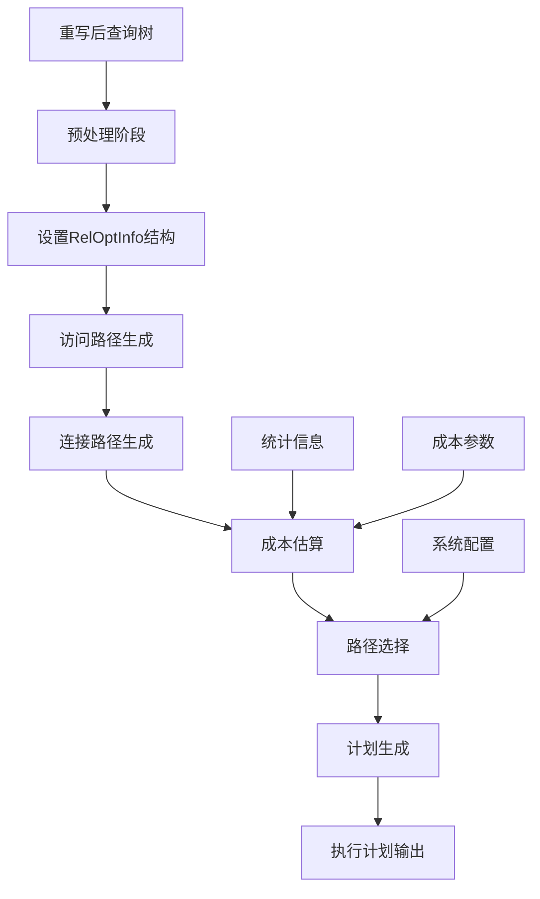
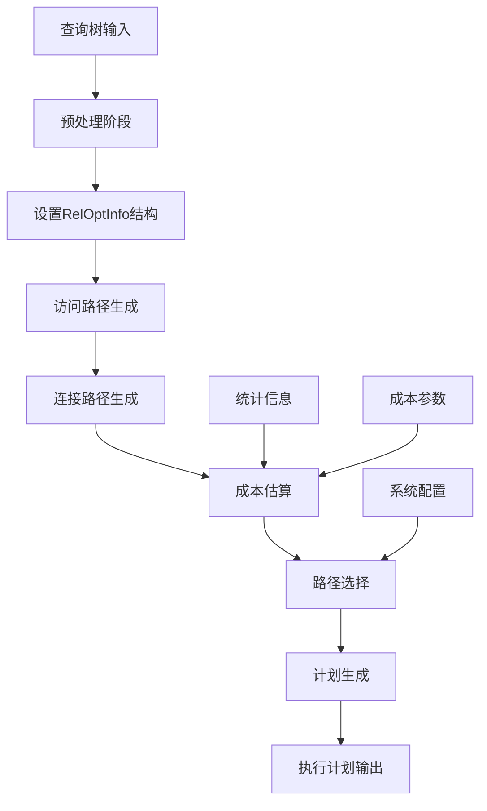

# 第10章 优化器——查询优化

## 10.1 查询优化概述

查询优化是数据库管理系统的核心组件，负责将经过重写的逻辑查询计划转换为高效的物理执行计划。PostgreSQL采用基于成本的优化方法，这是现代关系型数据库中最主流的优化技术。

**基于成本的优化核心思想**：
- **多策略评估**：对于同一个逻辑查询，生成多种可能的物理执行策略，包括不同的表访问方法、连接顺序和连接算法
- **成本量化**：通过精密的数学模型估算每个执行策略的资源消耗，包括磁盘I/O操作、CPU计算周期、内存使用量等系统资源
- **最优选择**：基于成本估算选择总成本最低的执行计划，确保查询执行效率最大化
- **统计驱动**：依赖准确的统计信息来保证成本估算的可靠性，包括表的大小、数据分布、索引选择性等关键指标

**优化器面临的主要技术挑战**：

- **组合爆炸问题**：对于涉及多个表的连接查询，可能的连接顺序数量呈阶乘级增长，必须设计高效的搜索算法来在合理时间内找到优质解
- **成本估算精度**：需要准确预测不同执行策略的磁盘I/O、CPU计算和内存使用开销，这需要对数据分布和硬件特性有深入理解
- **统计信息质量**：优化质量严重依赖于表大小、数据分布、索引选择度等统计信息的准确性和时效性，过时的统计信息会导致优化器做出错误决策
- **多目标权衡**：需要在查询响应时间、系统资源消耗、并发性能等多个目标间进行权衡，不同应用场景可能需要不同的优化策略

PostgreSQL的优化器通过精巧的架构设计和算法实现，在可接受的时间内为复杂查询找到接近最优的执行计划，这是其高性能的重要保证。

## 10.2 优化器架构

PostgreSQL优化器采用经典的多阶段架构，每个阶段都有明确的职责和清晰的接口。这种设计使得优化过程既系统化又易于理解和扩展。

优化器的整体架构和工作流程如下：



**优化器各阶段详细说明**：

1. **预处理阶段**：
   - 对查询树进行规范化处理，消除语法差异和冗余结构
   - 展开子查询和子链接，将嵌套查询转换为平面结构
   - 预处理表达式和条件，进行常量折叠和表达式简化
   - 为后续优化准备数据结构，构建优化器内部表示

2. **路径生成阶段**：
   - 为每个基表生成多种访问路径（顺序扫描、索引扫描等），探索所有可能的数据访问方式
   - 生成表间的连接路径，考虑不同的连接方法和顺序，构建完整的连接树空间
   - 构建完整的路径空间，为成本比较提供基础，确保不遗漏优质执行策略

3. **成本估算阶段**：
   - 基于统计信息和成本模型计算每条路径的执行成本，量化资源消耗
   - 考虑I/O操作、CPU计算、内存使用等资源消耗，建立多维成本模型
   - 为路径选择提供量化依据，将复杂的性能问题转化为数学优化问题

4. **路径选择阶段**：
   - 从众多候选路径中选择成本最低的路径，实现查询性能最优化
   - 应用启发式规则避免不必要的搜索，控制优化过程的时间开销
   - 确保在合理时间内找到优质执行计划，平衡优化质量和优化时间

5. **计划生成阶段**：
   - 将最优路径转换为可执行的计划树，构建查询执行框架
   - 添加必要的物料化、排序等操作，完善执行计划的细节
   - 生成最终的执行计划，交付给执行器进行实际的数据处理

**关键代码位置**：`src/backend/optimizer/plan/planner.c` 中的 `planner` 函数

```c
// 伪代码：优化器主入口
PlannedStmt *planner(Query *parse, const char *query_string, int cursorOptions, ParamListInfo boundParams) {
    // 1. 初始化优化器上下文
    PlannerInfo *root = makeNode(PlannerInfo);
    root->parse = parse;
    root->query_string = query_string;
    
    // 2. 执行标准优化流程
    PlannedStmt *result = standard_planner(root);
    
    return result;
}
```

**关键代码位置**：`src/backend/optimizer/plan/planner.c` 中的 `standard_planner` 函数

```c
// 伪代码：标准优化流程
PlannedStmt *standard_planner(PlannerInfo *root) {
    // 1. 预处理阶段：规范化查询树
    subquery_planner(root->glob, root->parse, NULL, false, 0.0);
    
    // 2. 设置关系大小和路径生成
    set_base_rel_sizes(root);
    set_base_rel_pathlists(root);
    
    // 3. 生成连接路径
    RelOptInfo *join_rel = make_one_rel(root, joinlist);
    
    // 4. 生成最终计划
    Plan *top_plan = create_plan(root, join_rel->cheapest_total_path);
    
    // 5. 后处理：添加上层操作（排序、聚合等）
    top_plan = apply_upper_expressions(root, top_plan);
    
    return make_planned_stmt(root, top_plan);
}
```

## 10.3 预处理阶段

预处理阶段是优化过程的起点，主要负责对重写后的查询树进行初步整理和转换，为后续的路径生成和成本估算做好准备。这个阶段的目标是消除查询树中的冗余和复杂性，使其更适合后续优化处理。

### 10.3.1 查询树规范化

查询树规范化旨在消除查询树中的冗余和复杂性，使其更适合后续优化处理：

**规范化主要工作**：

- **表达式预处理**：对目标列、WHERE条件、HAVING条件等处的表达式进行标准化处理，包括常量折叠、函数内联等
- **子查询处理**：将可以提升的子查询转换为连接操作，消除查询嵌套，减少执行时的递归调用
- **语义检查**：验证查询的语义正确性，检查表权限和约束条件，确保查询的合法性和安全性
- **数据结构准备**：初始化优化器需要的数据结构，如RelOptInfo、PlannerInfo等，为后续优化阶段建立基础设施

**关键代码位置**：`src/backend/optimizer/prep/prepjointree.c` 中的 `pull_up_subqueries` 函数

```c
// 伪代码：子查询提升处理流程
void pull_up_subqueries(PlannerInfo *root, Node *jtnode) {
    if (jtnode == NULL) return;
    
    if (IsA(jtnode, RangeTblRef)) {
        // 基础表引用，检查是否是子查询
        RangeTblEntry *rte = rt_fetch(((RangeTblRef *) jtnode)->rtindex, root->parse->rtable);
        if (rte->rtekind == RTE_SUBQUERY) {
            // 检查子查询是否可提升
            if (is_simple_subquery(rte->subquery)) {
                // 将子查询提升为连接
                convert_subquery_to_join(root, rte);
            }
        }
    } else if (IsA(jtnode, FromExpr)) {
        // 递归处理FROM表达式
        FromExpr *f = (FromExpr *) jtnode;
        foreach(l, f->fromlist) {
            lfirst(l) = pull_up_subqueries(root, lfirst(l));
        }
    } else if (IsA(jtnode, JoinExpr)) {
        // 递归处理连接表达式
        JoinExpr *j = (JoinExpr *) jtnode;
        j->larg = pull_up_subqueries(root, j->larg);
        j->rarg = pull_up_subqueries(root, j->rarg);
    }
}
```

**关键代码位置**：`src/backend/optimizer/util/clauses.c` 中的 `preprocess_expression` 函数

```c
// 伪代码：表达式预处理
Node *preprocess_expression(PlannerInfo *root, Node *expr, ExprKind exprkind) {
    if (expr == NULL) return NULL;
    
    // 1. 常量表达式求值：在编译时计算常量表达式，减少运行时开销
    expr = eval_const_expressions(root, expr);
    
    // 2. 规范化表达式形式：将表达式转换为标准形式，便于后续处理
    expr = (Node *) canonicalize_qual((Expr *) expr, true);
    
    // 3. 处理子链接：将子链接转换为更适合优化的形式
    expr = SS_process_sublinks(root, expr, (exprkind == EXPRKIND_QUAL));
    
    // 4. 外引用参数化：将外部引用转换为参数，便于执行时绑定
    if (root->query_level > 1)
        expr = SS_replace_correlation_vars(root, expr);
    
    return expr;
}
```

**关键数据结构初始化**：

预处理阶段需要初始化几个关键的数据结构：

- **PlannerInfo**：包含单次查询优化的所有上下文信息，如查询树、统计信息、成本参数等
- **RelOptInfo**：描述一个关系（表或子查询）的物理属性，如大小、分布、访问路径等
- **Path**：描述一种访问关系的数据路径，包含成本估算和执行方式信息

**关键代码位置**：`src/backend/optimizer/plan/planner.c` 中的 `make_planner_info` 函数

```c
// 伪代码：优化器上下文初始化
PlannerInfo *make_planner_info(Query *parse) {
    PlannerInfo *root = makeNode(PlannerInfo);
    
    root->parse = parse;
    root->query_level = 1;
    root->planner_cursor_options = 0;
    
    // 初始化关系信息数组：为每个范围表条目分配存储空间
    root->simple_rel_array = (RelOptInfo **) palloc0((list_length(parse->rtable) + 1) * sizeof(RelOptInfo *));
    root->simple_rel_array_size = list_length(parse->rtable) + 1;
    
    // 初始化其他列表：连接关系列表和哈希表用于快速查找
    root->join_rel_list = NIL;
    root->join_rel_hash = NULL;
    
    return root;
}
```

## 10.4 路径生成

路径生成是优化器的核心阶段，负责探索所有可能的物理执行策略。PostgreSQL采用自底向上的方法，首先生成基表的访问路径，然后逐步构建连接路径。这个阶段的目标是构建完整的路径空间，为后续的成本比较和选择提供基础。

### 10.4.1 访问路径生成

访问路径描述如何从单个表或索引中获取数据。优化器为每个基表生成多种访问路径，以便后续选择最优的数据访问方式。

**主要访问路径类型**：

- **顺序扫描（SeqScan）**：读取表中的所有数据页，适用于需要访问大部分数据或没有合适索引的情况，是最基本的访问方法
- **索引扫描（IndexScan）**：通过索引定位数据，适用于高选择性的查询条件，可以大幅减少需要扫描的数据量
- **仅索引扫描（IndexOnlyScan）**：当索引包含所有需要的数据时，避免访问堆表，减少I/O操作
- **位图堆扫描（BitmapHeapScan）**：使用位图汇总多个索引条件的结果，适用于多条件查询，平衡索引选择和堆访问的开销
- **TID扫描（TidScan）**：直接通过元组ID访问数据，用于某些特殊场景，如通过系统列ctid直接访问

**关键代码位置**：`src/backend/optimizer/path/allpaths.c` 中的 `set_base_rel_pathlists` 函数

```c
// 伪代码：基表访问路径生成
void generate_base_paths(PlannerInfo *root, RelOptInfo *rel) {
    List *pathlist = NIL;
    
    // 1. 总是生成顺序扫描路径：作为基准比较其他路径的成本
    add_path(rel, (Path *) create_seqscan_path(root, rel));
    
    // 2. 如果表有索引，生成索引扫描路径：探索所有可能的索引访问方式
    if (rel->indexlist != NIL) {
        generate_index_paths(root, rel);
    }
    
    // 3. 生成TID扫描路径（如果适用）：处理特殊的TID访问场景
    if (has_tid_scan_path(root, rel)) {
        add_path(rel, (Path *) create_tidscan_path(root, rel));
    }
    
    // 4. 设置最便宜的路径：标记成本最低的路径供后续使用
    set_cheapest(rel);
}
```

**关键代码位置**：`src/backend/optimizer/path/indxpath.c` 中的 `generate_index_paths` 函数

```c
// 伪代码：索引路径生成
void generate_index_paths(PlannerInfo *root, RelOptInfo *rel) {
    ListCell *ilist;
    
    foreach(ilist, rel->indexlist) {
        IndexOptInfo *index = (IndexOptInfo *) lfirst(ilist);
        
        // 1. 检查索引是否适用于查询条件：评估索引的相关性和选择性
        if (!index_is_usable_for_conditions(index, rel->baserestrictinfo)) {
            continue;
        }
        
        // 2. 生成普通索引扫描路径：考虑不同的扫描方向和排序需求
        List *index_paths = build_index_paths(root, rel, index, 
                                            rel->baserestrictinfo, 
                                            false, false, NULL);
        
        // 3. 生成仅索引扫描路径（如果可能）：当索引包含所有需要的列时
        if (index_can_return_all_columns(index, rel)) {
            List *indexonly_paths = build_index_paths(root, rel, index,
                                                     rel->baserestrictinfo,
                                                     true, false, NULL);
            index_paths = list_concat(index_paths, indexonly_paths);
        }
        
        // 4. 添加所有生成的索引路径：扩展路径选择空间
        add_pathlist(rel, index_paths);
    }
    
    // 5. 生成位图扫描路径：处理多索引条件的情况
    generate_bitmap_paths(root, rel);
}
```

**关键代码位置**：`src/backend/optimizer/path/costsize.c` 中的 `set_cheapest` 函数

```c
// 伪代码：路径成本比较和选择
void set_cheapest(RelOptInfo *rel) {
    Path *cheapest_startup = NULL;
    Path *cheapest_total = NULL;
    ListCell *l;
    
    foreach(l, rel->pathlist) {
        Path *path = (Path *) lfirst(l);
        
        // 寻找启动成本最低的路径：对于需要快速返回首行结果的查询很重要
        if (cheapest_startup == NULL ||
            path->startup_cost < cheapest_startup->startup_cost) {
            cheapest_startup = path;
        }
        
        // 寻找总成本最低的路径：对于需要处理所有数据的查询很重要
        if (cheapest_total == NULL ||
            path->total_cost < cheapest_total->total_cost) {
            cheapest_total = path;
        }
    }
    
    rel->cheapest_startup_path = cheapest_startup;
    rel->cheapest_total_path = cheapest_total;
    rel->cheapest_unique_path = NULL; // 需要时再计算
}
```

## 10.5 连接路径生成

连接路径生成是查询优化中最复杂和计算密集的部分。PostgreSQL使用动态规划算法来高效探索连接顺序空间，避免穷举所有可能的连接顺序。

### 10.5.1 动态规划算法

动态规划算法通过自底向上的方式构建连接树，将问题分解为更小的子问题，并保存中间结果以避免重复计算。

**关键代码位置**：`src/backend/optimizer/path/joinpath.c` 中的 `standard_join_search` 函数

```c
// 伪代码：动态规划连接搜索算法
RelOptInfo *standard_join_search(PlannerInfo *root, int levels_needed, List *initial_rels) {
    List **joinrels;
    int lev;
    
    // 1. 为每个连接级别分配空间：存储不同大小的连接关系
    joinrels = (List **) palloc0((levels_needed + 1) * sizeof(List *));
    
    // 2. 初始化第一级：包含所有基表关系
    joinrels[1] = initial_rels;
    
    // 3. 按连接级别逐步构建：从2表连接到n表连接
    for (lev = 2; lev <= levels_needed; lev++) {
        ListCell *l1, *l2;
        
        // 4. 考虑所有可能的大小划分：将lev分解为k和lev-k
        for (int k = 1; k < lev; k++) {
            int other_level = lev - k;
            
            // 5. 遍历所有可能的连接对组合
            forboth(l1, joinrels[k], l2, joinrels[other_level]) {
                RelOptInfo *rel1 = (RelOptInfo *) lfirst(l1);
                RelOptInfo *rel2 = (RelOptInfo *) lfirst(l2);
                
                // 6. 检查连接合法性并生成连接关系
                if (!bms_overlap(rel1->relids, rel2->relids)) {
                    make_join_rel(root, rel1, rel2);
                }
            }
        }
    }
    
    // 7. 返回最终的连接关系：包含所有表的连接结果
    Assert(list_length(joinrels[levels_needed]) == 1);
    return (RelOptInfo *) linitial(joinrels[levels_needed]);
}
```

### 10.5.2 连接方法实现

PostgreSQL支持三种主要的连接方法，每种方法适用于不同的数据分布和查询条件。

**嵌套循环连接（Nested Loop Join）**：
- 适用于外表较小、内表有索引的情况
- 对外表的每一行，在内表中查找匹配的行
- 启动成本低，但当外表很大时总成本可能很高

**关键代码位置**：`src/backend/optimizer/path/joinpath.c` 中的 `sort_inner_and_outer` 函数

```c
// 伪代码：归并连接路径生成
void sort_inner_and_outer(PlannerInfo *root, RelOptInfo *joinrel,
                         RelOptInfo *outerrel, RelOptInfo *innerrel,
                         JoinType jointype, SpecialJoinInfo *sjinfo,
                         List *restrictlist) {
    List *mergeclauses;
    List *all_pathkeys;
    ListCell *l;
    
    // 1. 查找可用于归并连接的子句：必须是等值比较且可排序
    mergeclauses = find_mergeclauses_for_join(root, restrictlist,
                                             outerrel, innerrel);
    if (mergeclauses == NIL)
        return;
    
    // 2. 生成可能的排序键组合：考虑不同的排序顺序
    all_pathkeys = make_pathkeys_for_mergeclauses(root, mergeclauses,
                                                 outerrel);
    
    // 3. 为每个排序键生成归并连接路径
    foreach(l, all_pathkeys) {
        List *pathkeys = (List *) lfirst(l);
        Path *outer_path, *inner_path;
        
        // 4. 找到匹配排序键的外表路径
        outer_path = get_cheapest_path_for_pathkeys(outerrel->pathlist,
                                                   pathkeys, NULL, TOTAL_COST);
        if (!outer_path) continue;
        
        // 5. 找到匹配排序键的内表路径
        inner_path = get_cheapest_path_for_pathkeys(innerrel->pathlist,
                                                   pathkeys, NULL, TOTAL_COST);
        if (!inner_path) continue;
        
        // 6. 创建归并连接路径
        add_path(joinrel, (Path *)
                 create_mergejoin_path(root, joinrel, jointype,
                                      outer_path, inner_path,
                                      restrictlist, pathkeys,
                                      mergeclauses, NULL, sjinfo));
    }
}
```

**哈希连接（Hash Join）**：
- 适用于没有排序需求且内表可以放入内存的情况
- 对内表构建哈希表，然后扫描外表进行哈希查找
- 需要足够的内存存放哈希表，否则性能会下降

**关键代码位置**：`src/backend/optimizer/path/joinpath.c` 中的 `hash_inner_and_outer` 函数

```c
// 伪代码：哈希连接路径生成
void hash_inner_and_outer(PlannerInfo *root, RelOptInfo *joinrel,
                         RelOptInfo *outerrel, RelOptInfo *innerrel,
                         JoinType jointype, SpecialJoinInfo *sjinfo,
                         List *restrictlist) {
    List *hashclauses;
    Path *outer_path, *inner_path;
    
    // 1. 查找可用于哈希连接的子句：必须是等值比较
    hashclauses = get_hashclauses_for_join(root, restrictlist);
    if (hashclauses == NIL)
        return;
    
    // 2. 选择外表路径：通常选择成本最低的路径
    outer_path = outerrel->cheapest_total_path;
    
    // 3. 选择内表路径：考虑哈希表构建的成本
    inner_path = get_cheapest_path_for_hashjoin(innerrel, hashclauses);
    
    // 4. 检查哈希表是否适合内存
    if (hash_table_fits_in_memory(inner_path, root)) {
        // 5. 创建哈希连接路径
        add_path(joinrel, (Path *)
                 create_hashjoin_path(root, joinrel, jointype,
                                    outer_path, inner_path,
                                    restrictlist, hashclauses,
                                    NULL, NULL, sjinfo));
    }
}
```

连接路径生成阶段的复杂性在于需要平衡搜索的完整性和计算的开销。PostgreSQL通过多种启发式方法和限制条件来控制搜索空间，确保在合理时间内找到优质的连接顺序和方法组合。

## 10.6 成本估算模型

成本估算模型是优化器的核心组件，负责量化不同执行路径的资源消耗。PostgreSQL使用基于磁盘页面和元组处理的开销模型，将复杂的性能问题转化为可计算的数学问题。

### 10.6.1 成本模型基础

PostgreSQL的成本模型基于几个关键的成本常量，这些常量可以通过系统参数调整以适应不同的硬件环境。

**关键代码位置**：`src/include/optimizer/cost.h`

```c
// 成本常量定义
typedef double Cost;

/* 默认成本常量 - 可以通过GUC参数调整 */
#define DEFAULT_SEQ_PAGE_COST    1.0     /* 顺序页面读取成本 */
#define DEFAULT_RANDOM_PAGE_COST 4.0     /* 随机页面读取成本 */
#define DEFAULT_CPU_TUPLE_COST   0.01    /* 处理一个元组的CPU成本 */
#define DEFAULT_CPU_INDEX_TUPLE_COST 0.005   /* 处理索引元组的CPU成本 */
#define DEFAULT_CPU_OPERATOR_COST 0.0025 /* 操作符执行的CPU成本 */

// 成本计算函数原型
extern void cost_seqscan(Path *path, PlannerInfo *root,
                        RelOptInfo *baserel, ParamPathInfo *param_info);
extern void cost_index(IndexPath *path, PlannerInfo *root,
                      double loop_count);
extern void cost_bitmap_heap_scan(Path *path, PlannerInfo *root,
                                 RelOptInfo *baserel, ParamPathInfo *param_info,
                                 Path *bitmapqual, double loop_count);
```

### 10.6.2 顺序扫描成本估算

顺序扫描是最基本的表访问方法，其成本估算相对直接，主要考虑磁盘I/O和CPU处理开销。

**关键代码位置**：`src/backend/optimizer/path/costsize.c` 中的 `cost_seqscan` 函数

```c
// 伪代码：顺序扫描成本估算
void cost_seqscan(Path *path, PlannerInfo *root,
                 RelOptInfo *baserel, ParamPathInfo *param_info) {
    Cost startup_cost = 0;
    Cost run_cost = 0;
    double spc_seq_page_cost;
    double cpu_per_tuple;
    
    // 1. 磁盘I/O成本计算：基于表的大小和顺序页面读取成本
    if (baserel->pages > 0) {
        // 获取表空间的顺序页面读取成本
        spc_seq_page_cost = get_tablespace_page_cost(baserel->reltablespace);
        run_cost += spc_seq_page_cost * baserel->pages;
    }
    
    // 2. CPU成本计算：基于元组数量和CPU处理成本
    startup_cost += baserel->baserestrictcost.startup;
    cpu_per_tuple = cpu_tuple_cost + baserel->baserestrictcost.per_tuple;
    run_cost += cpu_per_tuple * baserel->tuples;
    
    // 3. 并行处理调整：如果使用并行扫描，分摊部分成本
    if (path->parallel_workers > 0) {
        double parallel_divisor = get_parallel_divisor(path->parallel_workers);
        run_cost /= parallel_divisor;
    }
    
    // 4. 设置路径成本
    path->startup_cost = startup_cost;
    path->total_cost = startup_cost + run_cost;
}
```

### 10.6.3 索引扫描成本估算

索引扫描成本估算更加复杂，需要考虑索引访问成本和堆访问成本，以及选择性和数据分布的影响。

**关键代码位置**：`src/backend/optimizer/path/costsize.c` 中的 `cost_index` 函数

```c
// 伪代码：索引扫描成本估算
void cost_index(IndexPath *path, PlannerInfo *root, double loop_count) {
    IndexOptInfo *index = path->indexinfo;
    Cost startup_cost = 0;
    Cost run_cost = 0;
    double indexSelectivity;
    double indexCorrelation;
    double numIndexPages;
    double numIndexTuples;
    double numHeapTuples;
    
    // 1. 估算索引选择性和相关性：基于查询条件和统计信息
    indexSelectivity = clauselist_selectivity(root, path->indexclauses,
                                             index->rel->relid,
                                             JOIN_INNER, NULL);
    indexCorrelation = get_index_correlation(root, index);
    
    // 2. 计算需要访问的索引页面和元组数量
    numIndexTuples = index->tuples * indexSelectivity;
    numIndexPages = ceil(numIndexTuples / index->tuples_pages);
    
    // 3. 索引访问成本：随机页面读取和索引元组处理
    startup_cost += numIndexPages * random_page_cost;
    run_cost += numIndexTuples * (cpu_index_tuple_cost + cpu_operator_cost);
    
    // 4. 堆访问成本：基于索引选择性和相关性
    numHeapTuples = get_actual_heap_tuples(root, index, indexSelectivity, indexCorrelation);
    
    if (path->indexscandir == ForwardScanDirection) {
        // 前向扫描：考虑顺序页面访问
        run_cost += numHeapTuples * cpu_tuple_cost;
    } else {
        // 反向扫描：成本更高，需要额外处理
        run_cost += numHeapTuples * 2 * cpu_tuple_cost;
    }
    
    // 5. 设置路径成本
    path->path.startup_cost = startup_cost;
    path->path.total_cost = startup_cost + run_cost;
}
```

### 10.6.4 连接成本估算

连接成本估算需要考虑连接方法、输入大小和连接条件的选择性。

**关键代码位置**：`src/backend/optimizer/path/costsize.c` 中的 `cost_mergejoin` 函数

```c
// 伪代码：归并连接成本估算
void cost_mergejoin(MergePath *path, PlannerInfo *root) {
    Cost startup_cost = 0;
    Cost run_cost = 0;
    double outer_rows, inner_rows;
    Cost outer_startup_cost, outer_run_cost;
    Cost inner_startup_cost, inner_run_cost;
    
    // 1. 获取输入路径的成本和行数估计
    outer_rows = path->jpath.outerjoinpath->rows;
    inner_rows = path->jpath.innerjoinpath->rows;
    outer_startup_cost = path->jpath.outerjoinpath->startup_cost;
    outer_run_cost = path->jpath.outerjoinpath->total_cost - outer_startup_cost;
    inner_startup_cost = path->jpath.innerjoinpath->startup_cost;
    inner_run_cost = path->jpath.innerjoinpath->total_cost - inner_startup_cost;
    
    // 2. 排序成本（如果输入未排序）
    if (path->outersortkeys) {
        startup_cost += outer_startup_cost + cost_sort(path->outersortkeys,
                                                      outer_rows,
                                                      path->jpath.outerjoinpath->pathtarget->width);
    } else {
        startup_cost += outer_startup_cost;
    }
    
    if (path->innersortkeys) {
        startup_cost += inner_startup_cost + cost_sort(path->innersortkeys,
                                                      inner_rows,
                                                      path->jpath.innerjoinpath->pathtarget->width);
    } else {
        startup_cost += inner_startup_cost;
    }
    
    // 3. 连接执行成本：基于输入大小和连接条件
    run_cost += outer_run_cost + inner_run_cost;
    run_cost += cpu_operator_cost * (outer_rows + inner_rows);
    
    // 4. 设置连接路径成本
    path->jpath.path.startup_cost = startup_cost;
    path->jpath.path.total_cost = startup_cost + run_cost;
}
```

成本估算模型的准确性对优化器的决策质量至关重要。PostgreSQL通过丰富的统计信息和可调节的成本参数，使优化器能够适应不同的数据特性和硬件环境。

## 10.7 统计信息子系统

统计信息子系统为优化器提供关于数据分布和特征的详细信息，是成本估算的基础。准确的统计信息可以帮助优化器做出更好的决策，而质量差的统计信息则可能导致优化器选择低效的执行计划。

### 10.7.1 统计信息收集

PostgreSQL通过ANALYZE命令收集统计信息，这些信息存储在系统目录中供优化器使用。

**关键代码位置**：`src/backend/commands/analyze.c` 中的 `analyze_rel` 函数

```c
// 伪代码：统计信息收集
void analyze_rel(Oid relid, RangeVar *relation, int options, VacuumParams *params) {
    Relation onerel;
    VacuumStmt *vacstmt;
    
    // 1. 打开目标关系
    onerel = vacuum_open_relation(relid, relation, options);
    
    // 2. 准备统计信息收集语句
    vacstmt = makeNode(VacuumStmt);
    vacstmt->options = options;
    vacstmt->relation = relation;
    
    // 3. 执行统计信息收集
    vacuum(vacstmt, onerel, options, params);
    
    // 4. 收集基本表级统计信息
    collect_table_statistics(onerel);
    
    // 5. 收集列级统计信息
    collect_column_statistics(onerel);
    
    // 6. 收集表达式统计信息（如果存在生成列）
    if (onerel->rd_att->constr &&
        onerel->rd_att->constr->has_generated_stored) {
        analyze_expression_stats(onerel);
    }
}
```

**收集的统计信息类型**：

- **表级统计信息**：
  - 行数（reltuples）：表的估计行数
  - 页面数（relpages）：表占用的磁盘页面数
  - 可见性映射信息：用于仅索引扫描优化

- **列级统计信息**：
  - 空值比例（stanullfrac）：列中空值的比例
  - 唯一值数量（ndistinct）：列中不同值的估计数量
  - 最常见值（most_common_vals）：列中最常出现的值及其频率
  - 直方图边界（histogram_bounds）：数据分布的直方图边界

- **相关性统计**：
  - 物理行顺序与逻辑值的相关性（attstattarget）
  - 多列相关性统计（pg_statistic_correlation）

### 10.7.2 选择率估算

选择率估算基于统计信息预测查询条件过滤后的结果集大小，是成本估算的关键输入。

**关键代码位置**：`src/backend/utils/adt/selfuncs.c` 中的 `clause_selectivity` 函数

```c
// 伪代码：子句选择率估算
Selectivity clause_selectivity(PlannerInfo *root,
                              Node *clause,
                              int varRelid,
                              JoinType jointype,
                              SpecialJoinInfo *sjinfo) {
    Selectivity s1 = 1.0;
    
    if (clause == NULL)
        return s1;
    
    // 根据子句类型调用相应的选择率估算函数
    if (is_opclause(clause)) {
        // 操作符子句：基于操作符类型和操作数估算
        s1 = boolvarsel(root, clause, varRelid);
    } else if (is_funcclause(clause)) {
        // 函数子句：基于函数特性和参数估算
        s1 = function_selectivity(root, clause, varRelid, jointype, sjinfo);
    } else if (is_andclause(clause)) {
        // AND子句：使用乘积法则，考虑条件相关性
        s1 = and_selectivity(root, clause, varRelid, jointype, sjinfo);
    } else if (is_orclause(clause)) {
        // OR子句：使用包含-排除原理
        s1 = or_selectivity(root, clause, varRelid, jointype, sjinfo);
    } else {
        elog(ERROR, "unrecognized clause type: %d", (int) nodeTag(clause));
    }
    
    return s1;
}
```

**选择率估算技术**：

- **等值条件**：基于列的唯一值数量，选择率 ≈ 1 / ndistinct
- **范围条件**：基于数据分布直方图，计算落在范围内的比例
- **IN列表**：基于列表长度和唯一值数量，选择率 ≈ min(1.0, list_length / ndistinct)
- **多列条件**：基于相关性统计，避免低估或高估选择率

**关键代码位置**：`src/backend/utils/adt/selfuncs.c` 中的 `eqsel` 函数

```c
// 伪代码：等值条件选择率估算
Selectivity eqsel(PlannerInfo *root, Oid operator, List *args, int varRelid) {
    VariableStatData vardata;
    double selec;
    
    // 1. 获取变量统计信息
    examine_variable(root, (Node *) linitial(args), varRelid, &vardata);
    
    // 2. 基于统计信息计算选择率
    if (HeapTupleIsValid(vardata.statsTuple)) {
        Form_pg_statistic stats;
        double mcv_freq, sumcommon, otherfreq;
        
        stats = (Form_pg_statistic) GETSTRUCT(vardata.statsTuple);
        
        // 3. 检查是否在最常见值列表中
        mcv_freq = mcv_selectivity(&vardata, &opproc, &is_mcv, root);
        if (is_mcv) {
            // 在MCV列表中，使用MCV频率
            selec = mcv_freq;
        } else {
            // 不在MCV列表中，基于唯一值数量估算
            selec = 1.0 - stats->stanullfrac - sumcommon;
            selec /= (stats->stadistinct - stats->stanumbers1[0]);
        }
    } else {
        // 4. 没有统计信息，使用默认估算
        selec = 1.0 / 100.0; // 默认选择率1%
    }
    
    // 5. 应用限制条件，确保选择率在合理范围内
    selec = clamp_selectivity(selec);
    
    return selec;
}
```

统计信息子系统的质量直接决定了优化器的效果。PostgreSQL通过定期的统计信息收集和维护，确保优化器能够基于准确的数据特征做出决策。

## 10.8 计划生成

计划生成是优化器的最后阶段，负责将最优路径转换为可执行的计划树。这个阶段需要添加各种执行细节，如物料化点、排序操作等，并确保计划符合PostgreSQL执行器的要求。

### 10.8.1 从路径到计划

计划生成过程将抽象的路径转换为具体的执行计划节点，每个节点对应一个物理操作符。

**关键代码位置**：`src/backend/optimizer/plan/createplan.c` 中的 `create_plan` 函数

```c
// 伪代码：计划生成主函数
Plan *create_plan(PlannerInfo *root, Path *best_path) {
    Plan *plan;
    
    // 根据路径类型分发给相应的计划创建函数
    switch (best_path->pathtype) {
        case T_SeqScan:
        case T_IndexScan:
        case T_IndexOnlyScan:
        case T_BitmapHeapScan:
            // 扫描路径：转换为相应的扫描计划节点
            plan = create_scan_plan(root, best_path);
            break;
            
        case T_HashJoin:
        case T_MergeJoin:
        case T_NestLoop:
            // 连接路径：转换为连接计划节点
            plan = create_join_plan(root, (JoinPath *) best_path);
            break;
            
        case T_Material:
        case T_Sort:
        case T_Group:
        case T_Agg:
        case T_WindowAgg:
            // 上层操作路径：转换为相应的计划节点
            plan = create_projection_plan(root, best_path);
            break;
            
        default:
            elog(ERROR, "unrecognized node type: %d", best_path->pathtype);
            plan = NULL; // 保持编译器安静
    }
    
    return plan;
}
```

**扫描计划生成**：

**关键代码位置**：`src/backend/optimizer/plan/createplan.c` 中的 `create_seqscan_plan` 函数

```c
// 伪代码：顺序扫描计划生成
Plan *create_seqscan_plan(PlannerInfo *root, Path *best_path) {
    SeqScan *scan_plan;
    RelOptInfo *rel = best_path->parent;
    
    // 1. 创建顺序扫描计划节点
    scan_plan = makeNode(SeqScan);
    scan_plan->scan.relid = rel->relid;
    scan_plan->scan.scanrelid = rel->relid;
    
    // 2. 设置目标列表：需要返回的列
    scan_plan->scan.plan.targetlist = build_relation_tlist(rel);
    
    // 3. 设置查询条件：WHERE子句
    scan_plan->scan.plan.qual = extract_actual_clauses(rel->baserestrictinfo, false);
    
    // 4. 设置计划节点成本
    scan_plan->scan.plan.startup_cost = best_path->startup_cost;
    scan_plan->scan.plan.total_cost = best_path->total_cost;
    scan_plan->scan.plan.plan_rows = best_path->rows;
    scan_plan->scan.plan.plan_width = best_path->pathtarget->width;
    
    return (Plan *) scan_plan;
}
```

**连接计划生成**：

**关键代码位置**：`src/backend/optimizer/plan/createplan.c` 中的 `create_mergejoin_plan` 函数

```c
// 伪代码：归并连接计划生成
Plan *create_mergejoin_plan(PlannerInfo *root, MergePath *best_path) {
    MergeJoin *join_plan;
    Plan *outer_plan;
    Plan *inner_plan;
    
    // 1. 递归生成子计划
    outer_plan = create_plan(root, best_path->jpath.outerjoinpath);
    inner_plan = create_plan(root, best_path->jpath.innerjoinpath);
    
    // 2. 创建归并连接计划节点
    join_plan = makeNode(MergeJoin);
    join_plan->join.plan.lefttree = outer_plan;
    join_plan->join.plan.righttree = inner_plan;
    join_plan->join.jointype = best_path->jpath.jointype;
    
    // 3. 设置连接条件
    join_plan->join.joinqual = extract_actual_clauses(best_path->jpath.joinrestrictinfo, false);
    join_plan->mergeclauses = extract_actual_clauses(best_path->path_mergeclauses, false);
    
    // 4. 设置排序信息
    join_plan->skip_mark_restore = false;
    join_plan->mergefamilies = best_path->path_mergefamilies;
    join_plan->mergestrategies = best_path->path_mergestrategies;
    join_plan->mergenullsfirst = best_path->path_mergenullsfirst;
    
    // 5. 设置计划节点成本
    copy_plan_costsize(&join_plan->join.plan, &best_path->jpath.path);
    
    return (Plan *) join_plan;
}
```

### 10.8.2 计划树结构

执行计划采用树形结构，每个节点代表一个物理操作符。计划树的结构反映了查询执行的逻辑流程。

**典型的计划树结构**：

```
    Hash Join
    /      \
SeqScan  Hash
          |
       SeqScan
```

**计划树后处理**：

在生成基本计划树后，还需要进行一些后处理操作，如添加上层操作和处理并行执行。

**关键代码位置**：`src/backend/optimizer/plan/setrefs.c` 中的 `set_plan_references` 函数

```c
// 伪代码：计划树后处理
Plan *set_plan_references(PlannerInfo *root, Plan *plan) {
    // 1. 设置计划引用：修复Var节点的varno和varattno
    plan = set_plan_refs(root, plan);
    
    // 2. 处理并行执行：如果使用并行查询，添加并行相关信息
    if (root->glob->parallelModeNeeded) {
        plan = mark_parallel_safe(root, plan);
    }
    
    // 3. 提取参数：识别需要从外部传递的参数
    extract_actual_parameters(plan);
    
    return plan;
}
```

**计划树优化**：

在计划生成过程中，还会应用一些最后的优化：

- **谓词下推**：将过滤条件尽可能下推到扫描节点，减少中间结果大小
- **投影消除**：移除不必要的列投影，减少数据传输
- **常量传播**：将常量值传播到使用位置，减少运行时计算

计划生成阶段将优化器的决策转化为具体的执行指令，为查询执行做好准备。生成的计划树包含了执行查询所需的所有信息，包括操作类型、输入输出、成本估计等。

## 10.9 高级优化技术

除了基本的查询优化技术外，PostgreSQL还实现了一些高级优化技术，用于处理特定的查询模式和性能需求。

### 10.9.1 并行查询优化

并行查询允许单个查询使用多个CPU核心同时执行，大幅提高复杂查询的性能。

**并行优化决策**：

**关键代码位置**：`src/backend/optimizer/path/allpaths.c` 中的 `create_plain_partial_paths` 函数

```c
// 伪代码：并行路径生成
void create_plain_partial_paths(PlannerInfo *root, RelOptInfo *rel) {
    Path *path;
    double rows;
    int parallel_workers;
    
    // 1. 检查是否支持并行查询
    if (!relation_can_use_parallelism(rel)) {
        return;
    }
    
    // 2. 计算合适的并行工作进程数
    parallel_workers = compute_parallel_worker(rel);
    if (parallel_workers <= 0) {
        return;
    }
    
    // 3. 为每个基本路径生成并行版本
    foreach(l, rel->pathlist) {
        path = (Path *) lfirst(l);
        
        // 4. 检查路径是否适合并行化
        if (path_is_parallel_safe(root, path)) {
            // 5. 创建并行路径
            add_partial_path(rel, create_parallel_path(root, rel, path, parallel_workers));
        }
    }
}
```

**并行执行考虑因素**：

- **表大小**：只有足够大的表才值得使用并行扫描
- **查询复杂度**：复杂的连接和聚合操作更能从并行化中受益
- **系统资源**：考虑可用CPU核心数和内存容量
- **成本权衡**：并行执行有启动开销，需要权衡收益和成本

### 10.9.2 分区表优化

分区表优化针对分区表的特殊结构进行优化，提高大数据量查询的性能。

**分区裁剪**：

**关键代码位置**：`src/backend/partitioning/partprune.c` 中的 `prune_append_rel_partitions` 函数

```c
// 伪代码：分区裁剪
List *prune_append_rel_partitions(PlannerInfo *root, RelOptInfo *rel) {
    List *live_parts = NIL;
    ListCell *cell;
    
    // 1. 遍历所有分区
    foreach(cell, rel->part_rels) {
        RelOptInfo *partrel = (RelOptInfo *) lfirst(cell);
        
        // 2. 检查分区是否满足查询条件
        if (partition_matches_query(root, partrel, rel->baserestrictinfo)) {
            // 3. 保留满足条件的分区
            live_parts = lappend(live_parts, partrel);
        }
    }
    
    return live_parts;
}
```

**分区优化技术**：

- **分区消除**：基于查询条件排除不需要扫描的分区
- **分区连接**：优化分区表之间的连接操作
- **并行分区扫描**：同时扫描多个分区，提高I/O并行度
- **分区感知聚合**：在各个分区上并行执行聚合，然后合并结果

### 10.9.3 遗传查询优化器（GEQO）

对于包含大量表的连接查询，动态规划算法可能变得过于昂贵。PostgreSQL提供了遗传查询优化器作为替代方案。

**关键代码位置**：`src/backend/optimizer/geqo/geqo_main.c` 中的 `geqo` 函数

```c
// 伪代码：遗传查询优化
RelOptInfo *geqo(PlannerInfo *root, int number_of_rels, List *initial_rels) {
    Gene *pool;
    Pool *pool_data;
    int generation;
    RelOptInfo *best_join;
    
    // 1. 初始化遗传算法种群
    pool = alloc_pool(root, number_of_rels);
    pool_data = alloc_pool_data(root, pool, number_of_rels);
    
    // 2. 遗传算法迭代优化
    for (generation = 0; generation < geqo_generations; generation++) {
        // 3. 选择：基于适应度选择父代
        select_parents(root, pool_data);
        
        // 4. 交叉：组合父代生成子代
        crossover(root, pool_data);
        
        // 5. 变异：随机改变部分个体
        mutate(root, pool_data);
        
        // 6. 评估：计算新个体的适应度（成本）
        evaluate_fitness(root, pool_data);
    }
    
    // 7. 返回最佳个体对应的连接关系
    best_join = extract_best_join(root, pool_data);
    
    return best_join;
}
```

遗传算法通过模拟自然选择过程，在巨大的搜索空间中高效寻找优质解，特别适用于包含大量表的连接优化。

## 10.10 优化器执行流程

优化器的完整执行流程展示了从查询树到执行计划的详细转换过程。理解这个流程有助于深入掌握PostgreSQL的查询优化机制。



**详细执行步骤**：

1. **查询树输入**：
   - 接收经过重写和语义分析的查询树
   - 验证查询树的完整性和正确性
   - 初始化优化器上下文和数据结构

2. **预处理阶段**：
   - 规范化查询树结构，消除语法差异
   - 展开子查询和子链接，简化查询结构
   - 预处理表达式，进行常量折叠和简化
   - 构建优化器内部数据结构

3. **设置RelOptInfo结构**：
   - 为每个基表创建RelOptInfo结构
   - 收集表的统计信息和物理属性
   - 初始化路径列表和成本信息

4. **访问路径生成**：
   - 为每个基表生成多种访问路径
   - 包括顺序扫描、索引扫描、位图扫描等
   - 评估各种访问方式的成本和适用性

5. **连接路径生成**：
   - 使用动态规划算法探索连接顺序
   - 生成嵌套循环、归并、哈希等连接路径
   - 构建完整的连接路径空间

6. **成本估算**：
   - 基于统计信息和成本模型计算路径成本
   - 考虑I/O、CPU、内存等资源消耗
   - 为路径选择提供量化依据

7. **路径选择**：
   - 从候选路径中选择成本最低的路径
   - 应用启发式规则控制搜索空间
   - 确保在合理时间内找到优质解

8. **计划生成**：
   - 将最优路径转换为执行计划
   - 添加物料化、排序等上层操作
   - 完善计划树的执行细节

9. **执行计划输出**：
   - 输出完整的执行计划树
   - 包含所有执行指令和成本信息
   - 交付给查询执行器进行实际数据处理

## 10.11 本章小结

PostgreSQL查询优化器是一个复杂而精密的系统，通过多阶段协作将声明式的SQL查询转换为高效的执行计划。其主要技术特点和价值包括：

1. **基于成本的优化框架**：通过精密的成本模型和统计算法，在众多执行策略中智能选择最优方案，实现查询性能的最优化。

2. **动态规划连接优化**：使用高效的动态规划算法解决连接顺序的组合爆炸问题，在合理时间内为复杂多表查询找到优质的连接顺序。

3. **丰富的统计信息支持**：基于详细的数据分布统计进行选择性估算和成本预测，确保优化决策的数据驱动和准确性。

4. **多阶段优化架构**：通过预处理、路径生成、成本估算、路径选择和计划生成等阶段的清晰分工，实现关注点分离和系统可维护性。

5. **可扩展的优化框架**：支持多种访问方法、连接算法和优化技术，为系统演进和功能扩展提供了良好基础。

6. **自适应优化策略**：通过遗传算法、并行优化、分区优化等高级技术，适应不同的查询复杂度、数据规模和硬件环境。

PostgreSQL优化器的设计充分考虑了灵活性、可扩展性和性能的平衡，使其能够高效处理从简单查询到复杂分析的各种工作负载。持续的优化器改进是PostgreSQL保持其高性能和竞争力的关键因素。