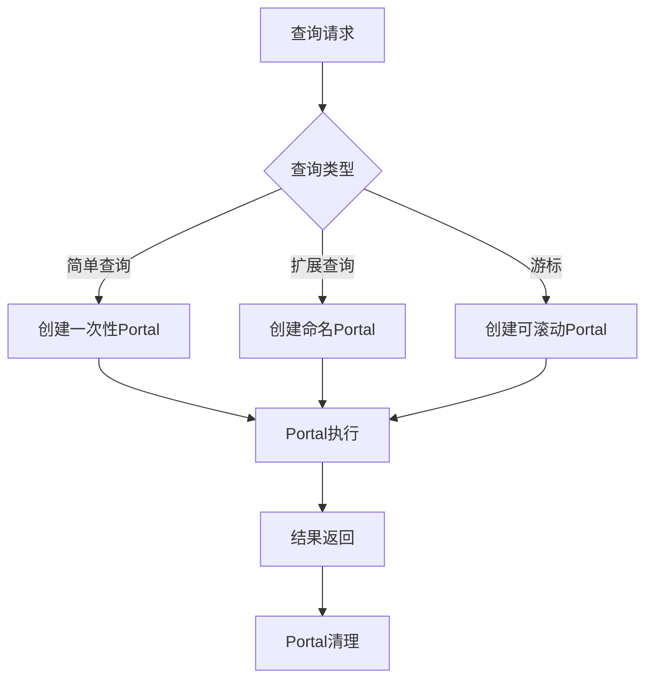
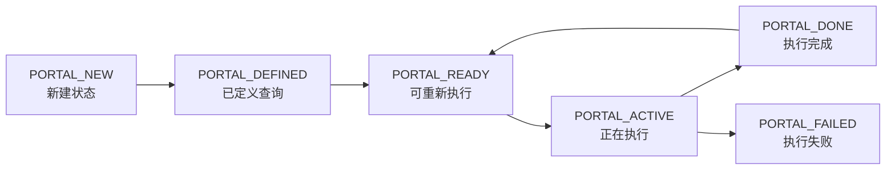
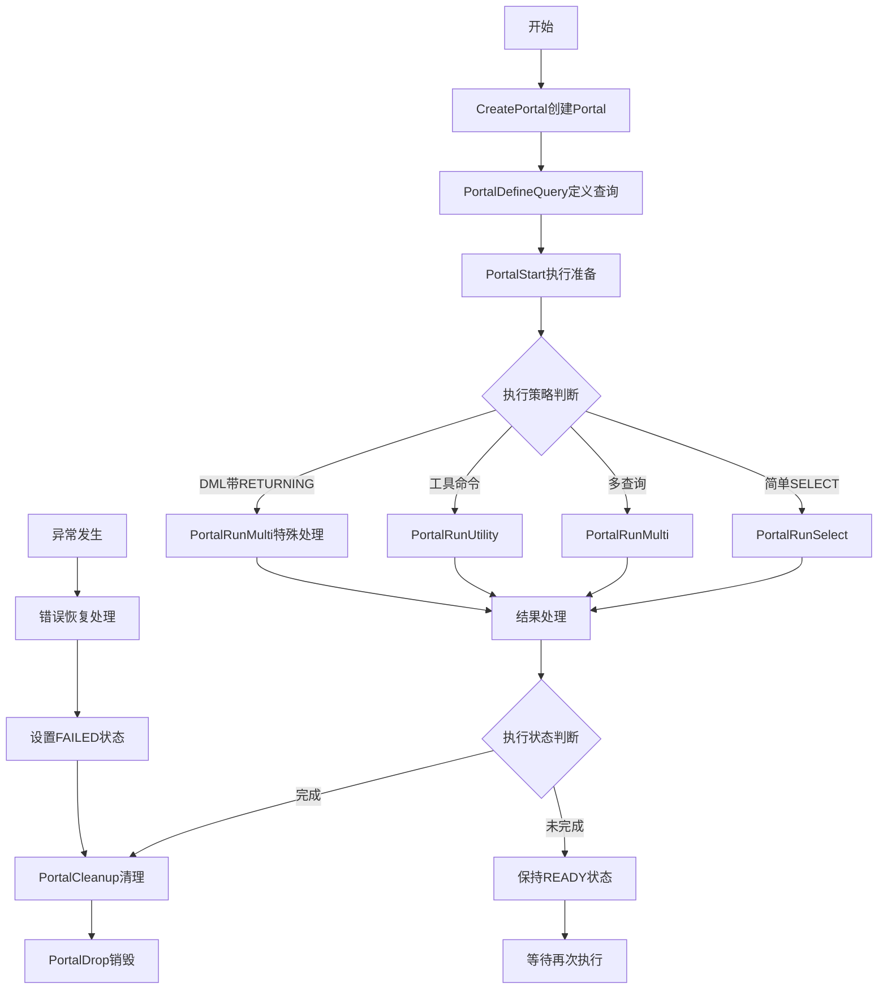

# 第11章 执行器——Portal管理

## 11.1 Portal管理概述

Portal是PostgreSQL执行器中的核心抽象概念，它代表了一个可执行的查询上下文。无论是简单查询、预备语句还是游标操作，最终都是通过Portal来执行的。Portal机制为不同类型的查询执行提供了统一的框架，实现了执行状态的封装和资源管理。

**Portal的核心作用**：
- **执行上下文管理**：封装查询执行所需的所有状态信息
- **资源生命周期管理**：统一管理查询执行过程中分配的内存、文件描述符等资源
- **多执行策略支持**：为不同查询类型提供定制化的执行策略
- **游标和预备语句实现**：为高级功能提供底层基础设施

**Portal在查询处理流程中的位置**：


## 11.2 Portal核心架构

### 11.2.1 Portal数据结构设计

PortalData是Portal的核心数据结构，它封装了查询执行的所有必要信息。主要包含以下关键字段：

- **标识信息**：Portal名称、关联的预备语句名称
- **查询定义**：原始SQL文本、查询树、执行计划
- **执行状态**：执行器状态、结果元组描述符、当前位置
- **资源管理**：私有内存上下文、资源所有者
- **执行控制**：执行策略、完成状态、游标选项

**关键代码位置**：`src/include/utils/portal.h` 中的 `PortalData` 结构

### 11.2.2 Portal状态机

Portal具有明确的状态转换机制，确保执行过程的有序性：



每个状态都有特定的含义和允许的操作：
- **PORTAL_NEW**：Portal刚创建，尚未定义查询
- **PORTAL_DEFINED**：查询已定义但未准备执行计划
- **PORTAL_READY**：执行计划已准备，可以开始执行
- **PORTAL_ACTIVE**：正在执行过程中
- **PORTAL_DONE**：执行成功完成
- **PORTAL_FAILED**：执行过程中发生错误

## 11.3 Portal生命周期管理

### 11.3.1 Portal创建过程

Portal的创建过程涉及多个步骤，确保执行环境的正确初始化：

1. **名称检查和冲突处理**：检查Portal名称是否已存在，根据策略处理冲突
2. **内存上下文创建**：为Portal分配专用的内存上下文，实现资源隔离
3. **数据结构初始化**：初始化PortalData的各个字段，设置初始状态
4. **全局注册**：将Portal注册到全局哈希表中，便于后续查找

**关键代码位置**：`src/backend/commands/portalcmds.c` 中的 `CreatePortal` 函数

**创建流程伪代码**：
```c
// src/backend/commands/portalcmds.c - CreatePortal
CreatePortal(名称, 允许重复, 静默处理):
    if 不允许重复 and 名称已存在:
        if 不静默: 报错
        else: 返回空
    
    创建专用内存上下文
    在上下文中分配PortalData结构
    初始化基本字段
    设置状态为PORTAL_NEW
    注册清理回调函数
    添加到全局哈希表
    返回Portal对象
```

### 11.3.2 查询定义与执行准备

在Portal创建后，需要为其定义具体的查询内容并做好执行准备：

**查询定义阶段**：
- 设置查询源文本和命令标签
- 关联查询树和执行计划树
- 更新状态为PORTAL_DEFINED

**执行准备阶段**：
- 创建执行器状态（EState）
- 设置查询快照和参数信息
- 初始化计划状态树
- 确定结果元组描述符
- 更新状态为PORTAL_READY

**关键代码位置**：`src/backend/tcop/pquery.c` 中的 `PortalStart` 函数

**准备流程伪代码**：
```c
// src/backend/tcop/pquery.c - PortalStart
PortalStart(Portal, 参数, 执行标志, 快照):
    切换到Portal内存上下文
    创建执行器状态(EState)
    设置查询快照
    for 每个执行计划:
        初始化计划状态树
    设置结果元组描述符
    更新状态为PORTAL_READY
```

## 11.4 Portal执行策略

PostgreSQL根据查询类型为Portal选择不同的执行策略，每种策略对应特定的执行逻辑：

### 11.4.1 执行策略类型

**PORTAL_ONE_SELECT**：
- 适用于简单SELECT查询
- 使用`PortalRunSelect`函数执行
- 支持结果集大小限制
- 执行完成后自动清理

**PORTAL_ONE_RETURNING**：
- 适用于带RETURNING子句的DML操作
- 结合数据修改和结果返回
- 需要特殊的事务处理

**PORTAL_UTIL_SELECT**：
- 适用于工具命令（如EXPLAIN、SHOW等）
- 通过`PortalRunUtility`函数执行
- 不涉及复杂的执行器逻辑

**PORTAL_MULTI_QUERY**：
- 适用于包含多个查询的情况
- 按顺序执行每个查询
- 支持匿名代码块和批量操作

### 11.4.2 核心执行流程

Portal的执行通过`PortalRun`函数协调，该函数根据Portal的策略选择适当的执行方法：

**关键代码位置**：`src/backend/tcop/pquery.c` 中的 `PortalRun` 函数

**执行流程伪代码**：
```c
// src/backend/tcop/pquery.c - PortalRun
PortalRun(Portal, 数量, 顶层标志, 单次执行, 结果接收器):
    保存当前执行上下文
    设置Portal状态为PORTAL_ACTIVE
    设置全局ActivePortal
    
    try:
        switch Portal策略:
            case PORTAL_ONE_SELECT:
                PortalRunSelect(...)
            case PORTAL_ONE_RETURNING:
                PortalRunMulti(...)
            case PORTAL_UTIL_SELECT:
                PortalRunUtility(...)
            case PORTAL_MULTI_QUERY:
                PortalRunMulti(...)
        
        设置完成标签
    catch 异常:
        恢复执行上下文
        设置Portal状态为PORTAL_FAILED
        重新抛出异常
    
    恢复执行上下文
    if 执行完成:
        设置状态为PORTAL_DONE
    else:
        设置状态为PORTAL_READY
```

## 11.5 游标与预备语句的实现

### 11.5.1 游标机制

游标在PostgreSQL中通过Portal机制实现，提供了对查询结果集的行级访问能力：

**游标创建过程**：
1. 解析游标声明语句
2. 创建具有游标选项的Portal
3. 设置可滚动或只进游标特性
4. 注册游标到全局管理结构

**游标操作**：
- **FETCH**：通过`PortalRun`获取指定数量的行
- **MOVE**：移动游标位置而不返回数据
- **CLOSE**：关闭游标并释放相关资源

**关键特性**：
- 支持绝对位置和相对位置访问
- 可滚动游标维护完整的位置信息
- 通过Portal状态跟踪当前位置

**关键代码位置**：`src/backend/commands/portalcmds.c` 中的 `PerformCursorOpen` 函数

### 11.5.2 预备语句支持

预备语句利用Portal实现查询的预编译和参数化执行：

**预备语句创建**：
```c
// src/backend/commands/prepare.c - CreatePreparedStatement
CreatePreparedStatement(语句名, 查询文本, 参数类型):
    解析查询文本生成查询树
    创建缓存计划源(CachedPlanSource)
    生成通用执行计划
    注册预备语句到全局字典
```

**预备语句执行**：
```c
// src/backend/commands/prepare.c - ExecutePreparedStatement
ExecutePreparedStatement(语句名, 参数值):
    从缓存中获取预备语句
    创建临时Portal
    使用缓存的查询树和计划树
    绑定参数值
    执行Portal
    清理临时Portal
```

**优势**：
- 避免重复的解析和计划生成开销
- 支持参数化查询，防止SQL注入
- 计划缓存提高重复查询性能

## 11.6 资源管理与错误处理

### 11.6.1 内存管理

Portal使用层次化内存管理策略：
- **私有内存上下文**：每个Portal拥有专用的内存上下文
- **执行器状态管理**：EState管理执行过程中的临时内存
- **元组内存**：结果元组在适当的上下文中分配
- **自动清理**：Portal销毁时自动释放所有关联内存

### 11.6.2 错误恢复机制

Portal执行过程中的错误通过PostgreSQL的异常处理机制管理：

**错误处理流程**：
1. 通过PG_TRY/PG_CATCH捕获执行异常
2. 保存错误状态和信息
3. 回滚Portal到安全状态
4. 释放已分配的临时资源
5. 设置Portal状态为PORTAL_FAILED
6. 向上层传播错误信息

**资源清理保证**：
- 无论执行成功还是失败，都会确保资源正确释放
- 通过内存上下文机制避免内存泄漏
- 使用资源所有者(ResourceOwner)跟踪需要清理的资源

**关键代码位置**：`src/backend/commands/portalcmds.c` 中的 `PortalCleanup` 函数

## 11.7 Portal管理完整流程图

以下图表展示了Portal从创建到销毁的完整生命周期：



## 11.8 本章小结

本章详细解析了PostgreSQL执行器中的Portal管理机制：

1. **统一执行框架**：Portal为所有类型的查询执行提供了统一的上下文管理框架，无论是简单查询、预备语句还是游标操作，都通过Portal机制执行。

2. **状态机设计**：明确的状态转换机制确保了执行过程的有序性，从创建、定义、准备、执行到清理，每个阶段都有清晰的状态标识。

3. **多执行策略**：根据查询类型采用不同的执行策略，优化简单SELECT、工具命令、多查询等不同场景的执行效率。

4. **高级功能基础**：游标和预备语句等高级功能都构建在Portal机制之上，体现了架构的扩展性和一致性。

5. **资源管理**：通过内存上下文和资源所有者机制，确保执行过程中资源的正确分配和释放，防止资源泄漏。

6. **错误恢复**：完善的异常处理机制保证在执行失败时能够正确清理状态，维护系统稳定性。

Portal管理机制是PostgreSQL执行器的核心组件，它的设计体现了关注点分离和资源管理的优秀实践。理解Portal的工作原理对于深入掌握PostgreSQL查询执行机制至关重要。在下一章中，我们将探讨执行器的另一个重要组件——各种执行算子的实现原理。