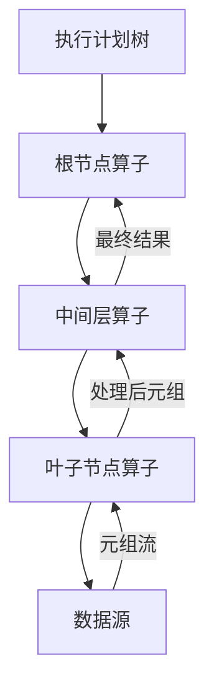
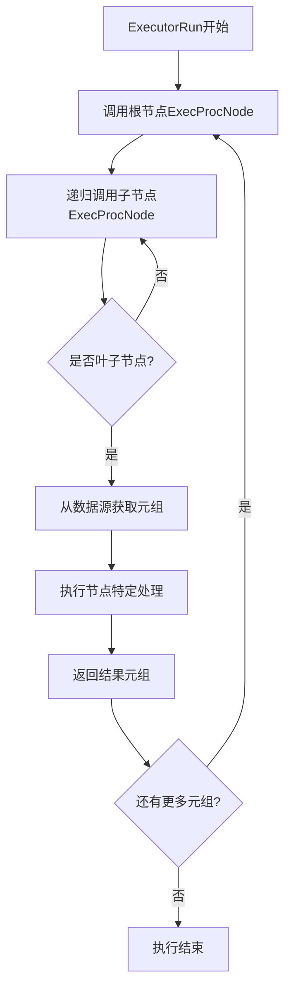
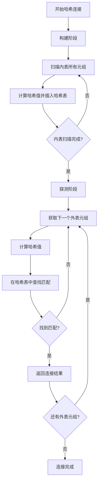
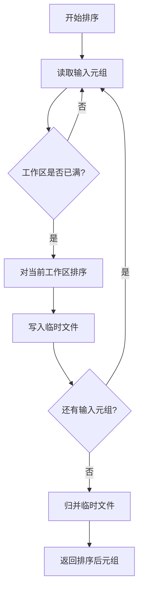
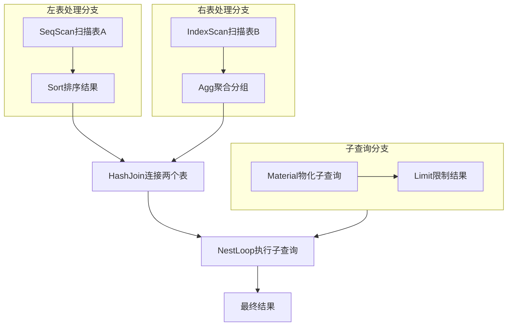

# 第12章 执行器——算子

## 12.1 算子概述

执行器算子是PostgreSQL查询执行的核心组件，负责具体的数据处理操作。每个算子对应执行计划树中的一个节点，按照树形结构组织起来，共同完成整个查询的执行。算子体系采用经典的火山模型（Volcano Model），通过统一的接口实现数据流的管道化处理。

**算子的核心作用**：
- **数据访问**：从存储层读取数据，包括表扫描和索引扫描
- **数据转换**：对数据进行过滤、投影、排序、聚合等操作
- **数据组合**：通过连接操作将多个数据源组合在一起
- **结果生成**：最终生成查询结果并返回给客户端

**算子在查询执行中的位置**：


## 12.2 算子架构设计

### 12.2.1 统一接口设计

PostgreSQL的所有算子都遵循统一的接口设计，确保执行引擎能够一致地处理各种操作：

**核心数据结构**：
- **PlanState**：所有算子状态的基础结构
- **TupleTableSlot**：元组传递的标准容器
- **ExprContext**：表达式求值的上下文环境

**关键代码位置**：`src/include/nodes/execnodes.h` 中的 `PlanState` 结构

**统一执行接口**：
```c
// 所有算子都必须实现的三个核心方法
typedef struct PlanState {
    NodeTag     type;
    Plan       *plan;                   // 对应的计划节点
    
    // 执行接口
    TupleTableSlot *(*ExecProcNode)(struct PlanState *pstate);
    void        (*ExecReScan)(struct PlanState *pstate);
    void        (*ExecEnd)(struct PlanState *pstate);
    
    // 状态信息
    List       *targetlist;             // 目标列表
    TupleTableSlot *ps_ResultTupleSlot; // 结果元组槽
    ExprContext *ps_ExprContext;        // 表达式上下文
} PlanState;
```

### 12.2.2 执行流程控制

执行器通过递归调用算子的`ExecProcNode`方法驱动整个查询执行：



## 12.3 扫描算子

扫描算子负责从底层数据源读取数据，是执行计划树的叶子节点。

### 12.3.1 顺序扫描（SeqScan）

顺序扫描是最基本的表访问方式，逐页读取堆表中的所有元组：

**执行原理**：
1. 打开表关系，获取表大小信息
2. 按物理顺序扫描所有数据页
3. 对每个元组应用过滤条件
4. 返回满足条件的元组

**关键代码位置**：`src/backend/executor/nodeSeqscan.c` 中的 `ExecSeqScan` 函数

**执行流程伪代码**：
```c
// src/backend/executor/nodeSeqscan.c - ExecSeqScan
ExecSeqScan(SeqScanState *node):
    while true:
        // 从表中获取下一个元组
        tuple = heap_getnext(scan_desc, direction)
        
        if tuple == NULL:
            return NULL  // 没有更多元组
        
        // 应用过滤条件
        if qual == NULL or ExecQual(qual, econtext):
            // 返回满足条件的元组
            return tuple_slot
```

### 12.3.2 索引扫描（IndexScan）

索引扫描利用索引结构快速定位满足条件的元组：

**执行原理**：
1. 根据查询条件在索引中查找符合条件的元组指针
2. 通过元组指针从堆表中获取完整元组
3. 验证元组可见性并返回

**关键代码位置**：`src/backend/executor/nodeIndexscan.c` 中的 `ExecIndexScan` 函数

**索引扫描类型**：
- **普通索引扫描**：通过索引键值查找元组
- **仅索引扫描**：当索引包含所有需要的列时，避免堆表访问
- **位图索引扫描**：多个索引条件的组合查询

### 12.3.3 位图堆扫描（BitmapHeapScan）

位图堆扫描结合了索引扫描的效率和顺序扫描的灵活性：

**执行原理**：
1. 为每个索引条件生成位图
2. 合并多个位图得到最终访问位图
3. 按物理顺序扫描位图标记的页面
4. 只读取包含目标元组的页面

**关键代码位置**：`src/backend/executor/nodeBitmapHeapscan.c` 中的 `ExecBitmapHeapScan` 函数

## 12.4 连接算子

连接算子负责将多个表的元组按照连接条件组合在一起。

### 12.4.1 嵌套循环连接（NestLoop）

嵌套循环连接是最简单的连接算法，适用于小表驱动大表的场景：

**执行原理**：
1. 遍历外表的所有元组
2. 对于每个外表元组，扫描内表的所有元组
3. 检查每对元组是否满足连接条件
4. 返回满足条件的元组组合

**关键代码位置**：`src/backend/executor/nodeNestloop.c` 中的 `ExecNestLoop` 函数

**执行流程伪代码**：
```c
// src/backend/executor/nodeNestloop.c - ExecNestLoop
ExecNestLoop(NestLoopState *node):
    while true:
        if 内表元组为NULL:
            // 获取下一个外表元组
            外表元组 = 执行外表子节点()
            if 外表元组 == NULL:
                return NULL  // 连接完成
            
            // 重置内表扫描
            重置内表扫描状态()
        
        // 获取下一个内表元组
        内表元组 = 执行内表子节点()
        if 内表元组 == NULL:
            continue  // 内表扫描完成，继续下一个外表元组
        
        // 检查连接条件
        if 连接条件为空 or 满足连接条件(外表元组, 内表元组):
            // 构建连接结果元组
            return 构建连接元组(外表元组, 内表元组)
```

### 12.4.2 哈希连接（HashJoin）

哈希连接适用于等值连接且内表可以放入内存的场景：

**执行原理**：
1. **构建阶段**：扫描内表，为每个元组计算哈希值并构建哈希表
2. **探测阶段**：扫描外表，为每个元组计算哈希值并在哈希表中查找匹配
3. 返回所有匹配的元组对

**关键代码位置**：`src/backend/executor/nodeHashjoin.c` 中的 `ExecHashJoin` 函数

**哈希连接流程**：


### 12.4.3 归并连接（MergeJoin）

归并连接要求输入数据已按连接键排序，适用于大数据集的等值连接：

**执行原理**：
1. 确保两个输入都已按连接键排序
2. 同时扫描两个已排序的输入
3. 比较当前元组的连接键，推进较小的那一侧
4. 当连接键相等时，输出所有匹配的元组对

**关键代码位置**：`src/backend/executor/nodeMergejoin.c` 中的 `ExecMergeJoin` 函数

## 12.5 聚合与排序算子

### 12.5.1 聚合算子（Agg）

聚合算子负责执行GROUP BY操作和聚合函数计算：

**执行模式**：
- **Plain模式**：无分组的全局聚合
- **Sorted模式**：输入已按分组键排序，流式处理
- **Hashed模式**：使用哈希表进行分组聚合

**关键代码位置**：`src/backend/executor/nodeAgg.c` 中的 `ExecAgg` 函数

**哈希聚合流程伪代码**：
```c
// src/backend/executor/nodeAgg.c - 哈希聚合流程
ExecAgg(AggState *node):
    while 有输入元组:
        // 计算分组键哈希值
        分组键 = 提取分组键(当前元组)
        哈希值 = 计算哈希值(分组键)
        
        // 查找或创建聚合状态
        聚合状态 = 哈希表查找(哈希值, 分组键)
        if 聚合状态不存在:
            聚合状态 = 创建新的聚合状态(分组键)
            插入哈希表(哈希值, 分组键, 聚合状态)
        
        // 更新聚合状态
        for 每个聚合函数:
            更新聚合状态(聚合状态, 当前元组)
    
    // 输出阶段
    while 哈希表中有更多分组:
        聚合状态 = 获取下一个聚合状态()
        if 满足HAVING条件:
            return 构建输出元组(聚合状态)
    
    return NULL
```

### 12.5.2 排序算子（Sort）

排序算子负责对输入元组进行排序，为其他算子（如归并连接、分组聚合）提供有序输入：

**执行原理**：
1. 读取所有输入元组到排序工作区
2. 使用快速排序或外部归并排序算法进行排序
3. 按排序顺序返回元组

**关键代码位置**：`src/backend/executor/nodeSort.c` 中的 `ExecSort` 函数

**外部排序流程**：


## 12.6 其他重要算子

### 12.6.1 物化算子（Materialize）

物化算子将输入数据具体化到临时存储中，避免重复计算：

**使用场景**：
- 子查询结果物化
- 排序中间结果存储
- 重复扫描的输入数据

**关键代码位置**：`src/backend/executor/nodeMaterial.c` 中的 `ExecMaterial` 函数

### 12.6.2 限制算子（Limit）

限制算子实现LIMIT和OFFSET功能，控制返回结果的数量：

**执行原理**：
1. 跳过前OFFSET个元组
2. 返回后续LIMIT个元组
3. 提前终止子节点的执行

**关键代码位置**：`src/backend/executor/nodeLimit.c` 中的 `ExecLimit` 函数

### 12.6.3 集合算子（SetOp）

集合算子实现UNION、INTERSECT、EXCEPT等集合操作：

**执行模式**：
- **Sorted模式**：输入已排序，通过一次扫描实现集合操作
- **Hashed模式**：使用哈希表去重和计算集合操作

**关键代码位置**：`src/backend/executor/nodeSetOp.c` 中的 `ExecSetOp` 函数

## 12.7 算子执行优化

### 12.7.1 向量化执行

PostgreSQL通过元组槽机制实现了一定程度的向量化执行：

**元组槽优化**：
- **固定格式槽**：元组以原生格式存储，减少格式转换
- **最小化拷贝**：在算子间传递元组指针而非数据拷贝
- **批量处理**：支持一次处理多个元组的优化路径

### 12.7.2 并行执行

多个算子支持并行执行，充分利用多核CPU：

**并行化策略**：
- **分区并行**：将数据分区，每个worker处理一个分区
- **流水线并行**：不同算子在不同worker上并行执行
- **同步并行**：多个worker协同完成同一个操作

**支持并行的算子**：
- 并行顺序扫描
- 并行哈希连接
- 并行聚合
- 并行排序

## 12.8 算子执行完整流程图

以下图表展示了典型查询中多个算子的协同执行过程：



## 12.9 本章小结

本章详细解析了PostgreSQL执行器的算子体系：

1. **统一接口设计**：所有算子都遵循相同的执行接口，通过`ExecProcNode`方法驱动执行，实现了执行引擎的模块化和可扩展性。

2. **多样化扫描策略**：提供顺序扫描、索引扫描、位图扫描等多种数据访问方式，根据数据分布和查询条件智能选择最优访问路径。

3. **多算法连接实现**：嵌套循环连接、哈希连接、归并连接分别适用于不同的数据规模和分布特征，确保连接操作的高效执行。

4. **复杂计算支持**：聚合算子支持多种分组模式，排序算子处理大规模数据排序，满足复杂分析查询的需求。

5. **执行优化技术**：通过物化、向量化、并行化等技术提升执行效率，充分利用现代硬件特性。

6. **管道化数据处理**：基于火山模型的管道化执行减少了中间结果的物化开销，实现了高效的数据流处理。

执行器算子的设计体现了数据库查询处理的核心原理，理解各个算子的工作机制对于查询性能调优和系统深度定制具有重要意义。在下一章中，我们将探讨执行器的另一个关键组件——元组槽处理机制。