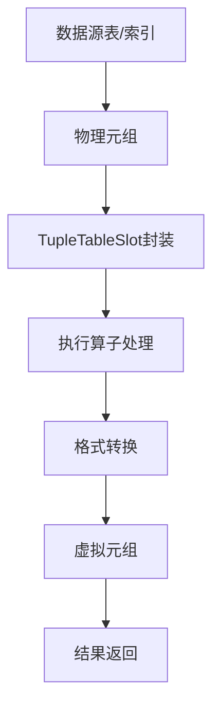
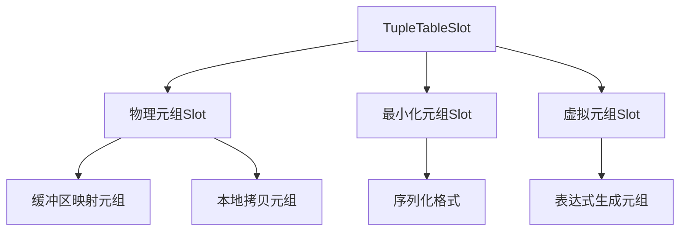
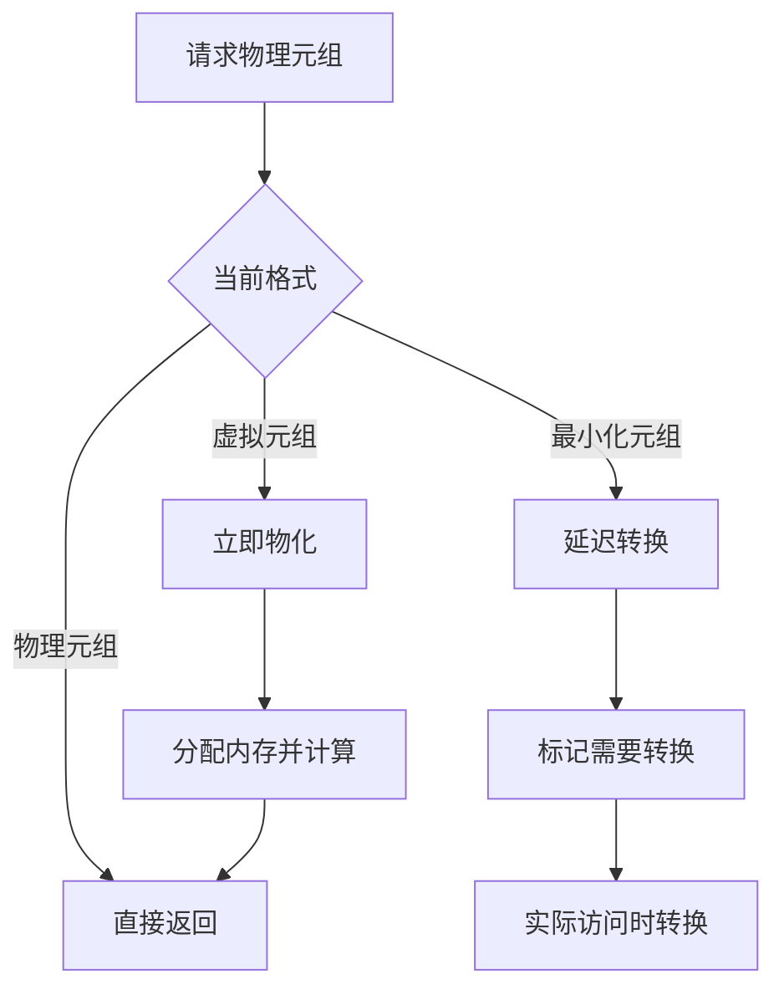
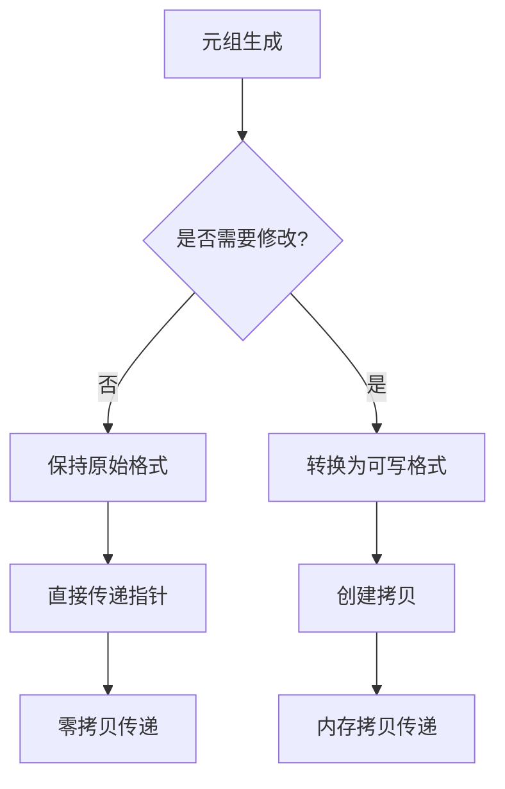
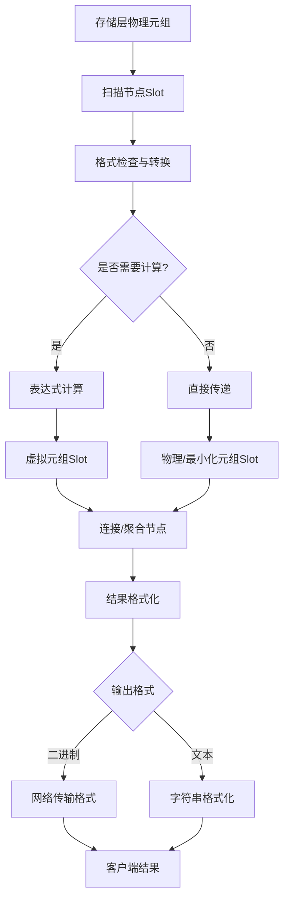

# 第13章 执行器——Slot处理

## 13.1 Slot处理概述

TupleTableSlot（元组槽）是PostgreSQL执行器中元组传递和处理的核心理念。作为执行器内部数据流动的基本载体，Slot机制实现了元组在不同执行节点间的高效传递，同时提供了统一的元组格式抽象和内存管理。

**Slot的核心作用**：
- **元组封装**：统一封装不同来源的元组数据
- **格式抽象**：屏蔽底层存储格式差异，提供统一访问接口
- **内存管理**：优化元组内存分配和生命周期管理
- **数据传递**：在算子间高效传递元组数据

**Slot在执行器数据流中的位置**：


## 13.2 Slot架构设计

### 13.2.1 核心数据结构

TupleTableSlot是元组管理的核心数据结构，提供了统一的元组访问接口：

**关键代码位置**：`src/include/executor/tuptable.h` 中的 `TupleTableSlot` 结构

**主要组成**：
- **元组数据**：物理元组指针、最小化元组、虚拟元组
- **元组描述**：TupleDesc描述元组结构
- **状态标志**：元组有效性、数据来源、格式类型
- **内存管理**：缓冲区引用计数、内存上下文

**Slot类型体系**：


### 13.2.2 元组格式

PostgreSQL支持多种元组格式，以适应不同的执行场景：

**物理元组（HeapTuple）**：
- 直接从磁盘读取的原始格式
- 通过缓冲区管理器管理
- 包含系统列和用户数据

**最小化元组（MinimalTuple）**：
- 去除系统列的简化格式
- 更适合内存中的数据处理
- 减少内存拷贝开销

**虚拟元组（VirtualTuple）**：
- 不存储实际数据，按需计算
- 适用于投影和表达式计算
- 零拷贝开销

## 13.3 Slot生命周期管理

### 13.3.1 Slot创建与初始化

Slot的创建过程根据使用场景采用不同的策略：

**关键代码位置**：`src/backend/executor/execTuples.c` 中的 `MakeTupleTableSlot` 函数

**创建流程伪代码**：
```c
// src/backend/executor/execTuples.c - Slot创建流程
MakeTupleTableSlot(TupleDesc desc, 槽类型):
    // 分配Slot结构内存
    slot = palloc(sizeof(TupleTableSlot))
    
    // 初始化基本字段
    slot->type = T_TupleTableSlot
    slot->tts_tupleDescriptor = desc
    slot->tts_flags = 0
    slot->tts_nvalid = 0
    
    // 根据类型初始化特定字段
    switch 槽类型:
        case 物理元组槽:
            初始化物理元组相关字段()
        case 最小化元组槽:
            初始化最小化元组相关字段()
        case 虚拟元组槽:
            初始化虚拟元组相关字段()
    
    // 注册清理回调
    slot->tts_callback = 默认清理函数
    
    return slot
```

### 13.3.2 元组填充与提取

Slot的核心功能是元组的存储和检索：

**元组存储流程**：
1. 根据元组来源确定合适的存储格式
2. 将元组数据填充到Slot中
3. 设置相应的状态标志
4. 更新引用计数和有效性信息

**元组提取流程**：
1. 检查Slot中元组的有效性
2. 根据请求格式进行必要的转换
3. 返回请求格式的元组数据
4. 维护数据一致性

**关键代码位置**：`src/backend/executor/execTuples.c` 中的 `ExecStoreTuple` 函数

## 13.4 格式转换机制

### 13.4.1 自动格式转换

Slot系统支持多种格式间的自动转换，确保数据访问的灵活性：

**转换路径**：
- 物理元组 → 最小化元组
- 物理元组 → 虚拟元组
- 最小化元组 → 物理元组
- 虚拟元组 → 物理元组

**转换触发条件**：
- 请求的格式与当前存储格式不一致
- 元组需要被修改但当前格式为只读
- 内存优化需求（如物化虚拟元组）

**关键代码位置**：`src/backend/executor/execTuples.c` 中的 `ExecMaterializeSlot` 函数

### 13.4.2 转换优化策略

为了平衡性能和内存使用，Slot系统采用智能的转换策略：

**延迟转换**：


**内存使用优化**：
- **引用计数**：共享元组数据，减少拷贝
- **内存池**：重用Slot结构，减少分配开销
- **懒惰物化**：推迟虚拟元组的实际计算

## 13.5 Slot在执行器中的应用

### 13.5.1 扫描节点的Slot使用

扫描节点从存储层读取数据并填充到Slot中：

**顺序扫描的Slot处理**：
```c
// src/backend/executor/nodeSeqscan.c - 元组获取
ExecSeqScan(SeqScanState *node):
    // 从堆表获取元组
    heapTuple = heap_getnext(scanDesc, direction)
    
    if heapTuple != NULL:
        // 将物理元组存储到Slot
        slot = node->ss_ScanTupleSlot
        ExecStoreHeapTuple(heapTuple, slot, scanDesc->rs_cbuf)
        
        // 应用过滤条件
        if qual == NULL or ExecQual(qual, econtext):
            return slot
    
    return NULL
```

**索引扫描的Slot优化**：
- 仅索引扫描时使用最小化元组格式
- 位图扫描时批量填充Slot
- 可见性检查与Slot状态结合

### 13.5.2 连接节点的Slot管理

连接节点需要管理多个输入源的Slot并进行组合：

**嵌套循环连接的Slot处理**：
```c
// src/backend/executor/nodeNestloop.c - 元组组合
ExecNestLoop(NestLoopState *node):
    outerSlot = ExecProcNode(outerPlan)
    if outerSlot == NULL:
        return NULL
    
    innerSlot = ExecProcNode(innerPlan)
    if innerSlot == NULL:
        重置内表扫描()
        return ExecNestLoop(node)  // 递归调用
    
    // 组合内外表元组
    resultSlot = node->js_JoinTupleSlot
    ExecCopySlot(resultSlot, outerSlot)
    ExecCopySlotPartial(resultSlot, innerSlot, 连接条件)
    
    return resultSlot
```

### 13.5.3 聚合节点的Slot优化

聚合节点利用Slot机制实现高效的分组计算：

**哈希聚合的Slot使用**：
1. 使用最小化元组格式存储分组键
2. 聚合状态与输出结果共享Slot内存
3. 批量输出时重用Slot结构

**关键代码位置**：`src/backend/executor/nodeAgg.c` 中的 `agg_retrieve_direct` 函数

## 13.6 内存管理与性能优化

### 13.6.1 内存上下文集成

Slot系统深度集成PostgreSQL的内存上下文机制：

**内存分配策略**：
- **Slot结构**：在查询内存上下文中分配
- **元组数据**：根据格式在相应上下文中分配
- **临时缓冲**：在表达式计算上下文中分配

**生命周期管理**：
- **查询级别**：Slot结构在查询结束时释放
- **元组级别**：元组数据通过引用计数管理
- **缓冲区级别**：缓冲区元组通过pin/unpin管理

### 13.6.2 性能优化技术

Slot系统采用多种技术优化执行性能：

**零拷贝优化**：


**批量处理优化**：
- **Slot重用**：在算子内部重用Slot避免重复分配
- **预分配**：为常见操作路径预分配Slot结构
- **内存池**：维护空闲Slot列表，快速分配

## 13.7 高级特性与扩展

### 13.7.1 JIT编译集成

现代PostgreSQL将Slot机制与JIT编译深度集成：

**JIT优化点**：
- 元组格式检查的编译时优化
- 属性访问的直接内存访问
- 表达式求值的内联展开

**关键代码位置**：`src/include/jit/jit.h` 中的JIT元组访问接口

### 13.7.2 并行查询支持

Slot机制为并行查询提供必要的基础设施：

**并行安全保证**：
- Slot状态的线程安全访问
- 元组数据的并行共享
- 内存上下文的并行隔离

**数据交换优化**：
- 共享队列中的Slot传递
- 并行worker间的元组格式统一
- 批量元组交换的Slot重用

## 13.8 Slot处理完整数据流

以下图表展示了元组从数据源到最终结果的完整Slot处理流程：



## 13.9 本章小结

本章详细解析了PostgreSQL执行器中的Slot处理机制：

1. **统一数据抽象**：TupleTableSlot为不同来源和格式的元组数据提供了统一的访问接口，屏蔽了底层存储差异。

2. **灵活格式支持**：支持物理元组、最小化元组、虚拟元组等多种格式，根据执行场景智能选择最优格式。

3. **高效内存管理**：通过引用计数、内存上下文集成、延迟物化等技术，实现了内存使用和性能的最佳平衡。

4. **智能格式转换**：自动在多种元组格式间进行转换，确保数据访问的灵活性和效率。

5. **执行器深度集成**：所有执行算子都基于Slot机制进行元组处理，形成了统一的执行流水线。

6. **高级特性支持**：为JIT编译、并行查询等高级特性提供了必要的基础设施。

Slot处理机制是PostgreSQL执行器高效执行的关键基础，它的设计体现了数据库系统在数据表示和传递方面的核心优化思想。理解Slot的工作原理对于深入掌握查询执行机制和进行性能优化至关重要。在下一章中，我们将探讨存储过程和函数的实现机制。