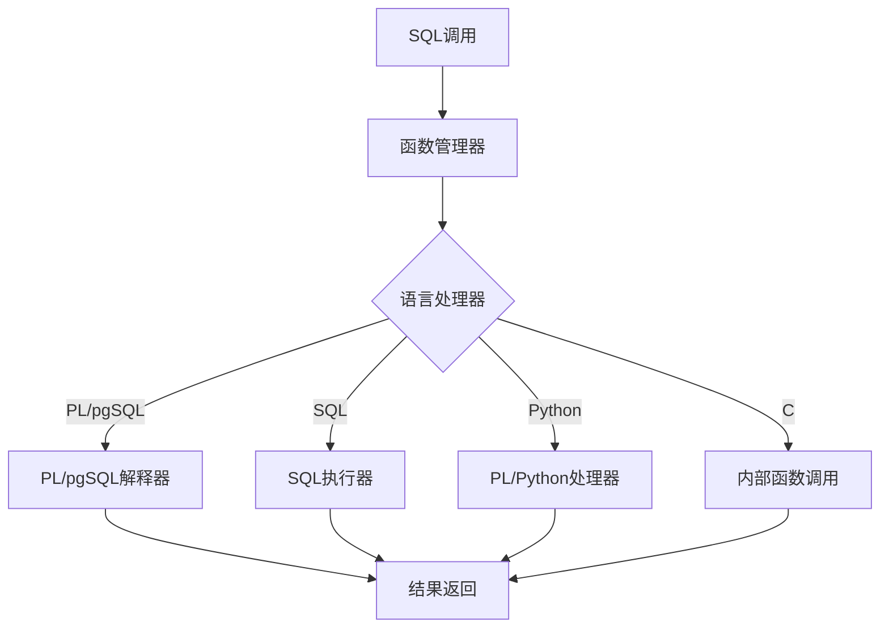
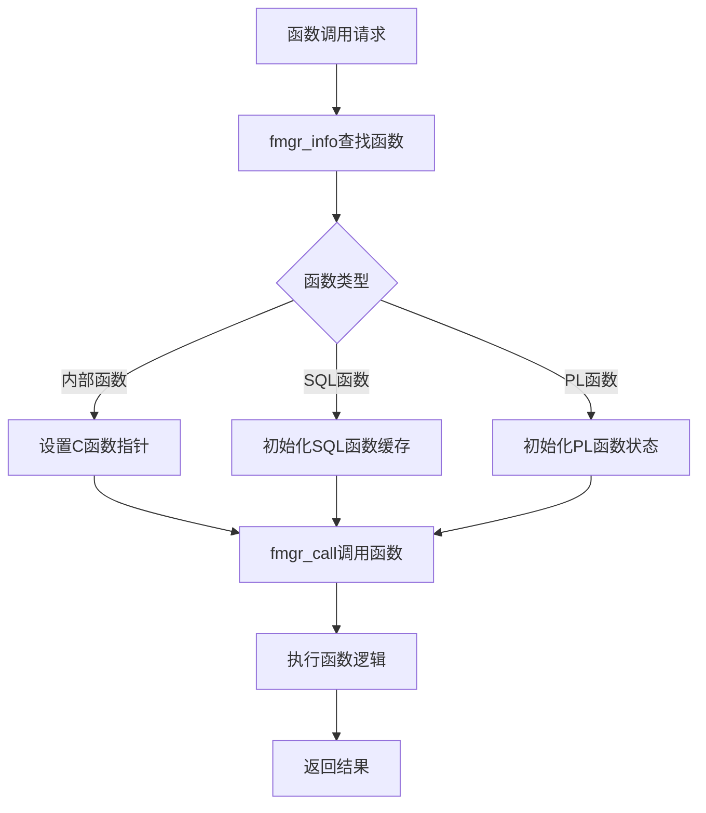
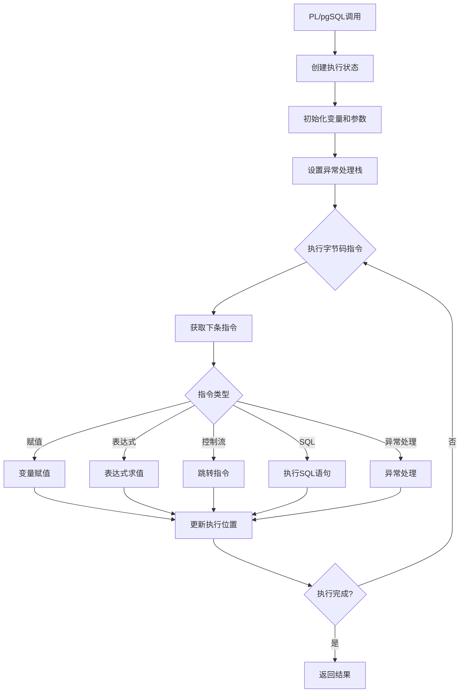
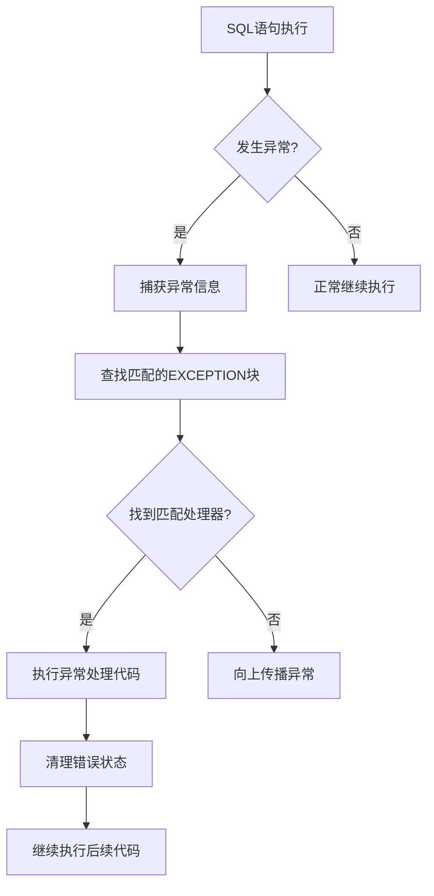
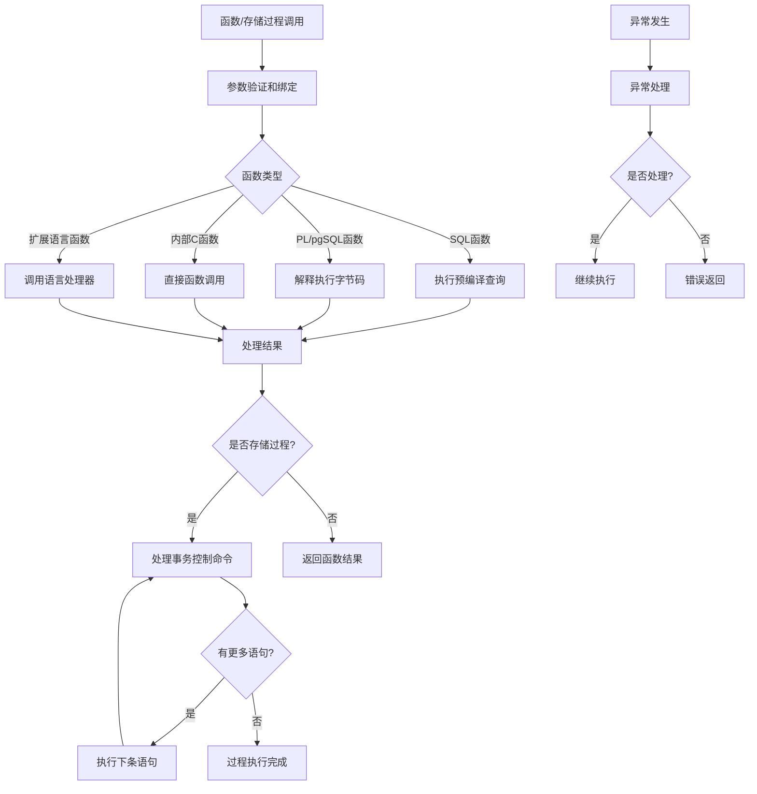

# 第14章 存储过程和函数

## 14.1 存储过程和函数概述

存储过程和函数是PostgreSQL中重要的程序化数据处理组件，它们封装了复杂的业务逻辑，提供了代码复用、事务控制和性能优化的能力。PostgreSQL支持多种语言编写的存储过程和函数，包括内置的PL/pgSQL、PL/Python、PL/Perl等。

**存储过程与函数的区别**：
- **函数（FUNCTION）**：返回单个值，可在SQL表达式中使用，通常用于计算
- **存储过程（PROCEDURE）**：执行一系列操作，支持事务控制，不直接返回值但可通过OUT参数返回结果

**关键特性**：
- **参数支持**：输入参数、输出参数、输入输出参数
- **事务控制**：存储过程支持内部事务管理（COMMIT/ROLLBACK）
- **异常处理**：完善的异常捕获和处理机制
- **多种语言**：支持SQL、PL/pgSQL、Python等多种编程语言

**执行环境架构**：


## 14.2 函数管理架构

### 14.2.1 系统目录管理

PostgreSQL在系统目录中维护函数和存储过程的元数据信息：

**关键系统表**：
- **pg_proc**：存储所有函数和存储过程的基本信息
- **pg_language**：注册支持的过程语言
- **pg_aggregate**：聚合函数特定信息
- **pg_depend**：函数依赖关系

**关键代码位置**：`src/include/catalog/pg_proc.h` 中的函数定义结构

**pg_proc关键字段**：
- **proname**：函数名称
- **prolang**：实现语言OID
- **prorettype**：返回类型OID
- **proargtypes**：参数类型数组
- **prosrc**：函数源代码或引用
- **probin**：二进制实现路径（C函数）

### 14.2.2 函数分类与处理

根据实现方式，PostgreSQL函数分为几种类型：

**SQL函数**：
- 纯SQL语句组成的函数
- 在创建时解析和重写
- 执行时直接运行预处理的查询树

**PL/pgSQL函数**：
- PostgreSQL自带的过程语言
- 编译为字节码后解释执行
- 支持变量、控制流、异常处理

**内部C函数**：
- 直接编译到PostgreSQL中的C函数
- 最高性能，用于系统函数和操作符
- 通过函数管理器直接调用

**扩展语言函数**：
- 通过扩展机制支持的语言（Python、Perl等）
- 通过语言处理器调用外部解释器

## 14.3 函数调用机制

### 14.3.1 函数调用上下文

函数调用通过FunctionCallInfo结构传递参数和执行上下文：

**关键代码位置**：`src/include/fmgr.h` 中的 `FunctionCallInfoBaseData` 结构

**调用上下文组成**：
- **函数OID和基本信息**
- **参数值和null标志**
- **结果返回槽**
- **内存上下文和事务信息**
- **错误状态和消息**

**函数调用流程伪代码**：
```c
// src/backend/executor/execExpr.c - 函数表达式求值
ExecMakeFunctionResult(函数状态, 表达式上下文, 是否为null标志):
    // 准备函数调用信息
    fcinfo = &函数状态->fcinfo_data
    设置函数OID和参数个数
    
    // 计算参数值
    for i = 0 to 参数个数-1:
        fcinfo->arg[i] = ExecEvalExpr(参数表达式, 表达式上下文, &isNull)
        fcinfo->argnull[i] = isNull
    
    // 调用函数
    result = FunctionCallInvoke(fcinfo)
    
    // 检查错误并返回结果
    if fcinfo->isnull:
        *是否为null标志 = true
        return (Datum)0
    else:
        *是否为null标志 = false
        return result
```

### 14.3.2 函数管理器

函数管理器是函数调用的核心分发器：

**关键代码位置**：`src/backend/utils/fmgr/fmgr.c` 中的 `fmgr_info` 和 `fmgr_call` 函数

**函数查找与调用流程**：


## 14.4 PL/pgSQL实现机制

### 14.4.1 编译过程

PL/pgSQL函数在第一次调用时被编译为内部字节码：

**关键代码位置**：`src/pl/plpgsql/src/pl_comp.c` 中的 `plpgsql_compile` 函数

**编译流程**：
1. **词法分析和语法分析**：将源代码解析为抽象语法树
2. **语义分析**：验证变量、类型和表达式的正确性
3. **字节码生成**：将语法树转换为可执行的字节码指令
4. **函数缓存**：将编译结果缓存以供后续调用

**编译过程伪代码**：
```c
// src/pl/plpgsql/src/pl_comp.c - PL/pgSQL编译
plpgsql_compile(函数OID, 是否验证):
    // 从系统目录获取函数定义
    函数记录 = 从pg_proc查找(函数OID)
    源代码 = 函数记录->prosrc
    
    // 创建编译上下文
    编译上下文 = plpgsql_alloc_compiler_context()
    
    // 解析函数源代码
    解析树 = plpgsql_parser(源代码)
    
    // 语义分析和字节码生成
    plpgsql_analyze(解析树, 编译上下文)
    plpgsql_generate_bytecode(解析树, 编译上下文)
    
    // 创建函数缓存
    函数缓存 = 分配函数缓存结构()
    函数缓存->字节码 = 编译上下文->字节码
    函数缓存->变量表 = 编译上下文->变量表
    
    return 函数缓存
```

### 14.4.2 解释执行

PL/pgSQL字节码由专用解释器执行：

**关键代码位置**：`src/pl/plpgsql/src/pl_exec.c` 中的 `plpgsql_exec_function` 函数

**解释执行架构**：


## 14.5 参数处理与变量管理

### 14.5.1 参数传递机制

PostgreSQL支持多种参数传递方式：

**参数模式**：
- **IN**：输入参数（默认）
- **OUT**：输出参数
- **INOUT**：输入输出参数
- **VARIADIC**：可变参数数组

**参数处理伪代码**：
```c
// src/pl/plpgsql/src/pl_exec.c - 参数处理
plpgsql_setup_param_list(函数状态, 调用参数):
    // 创建参数列表
    param_list = 创建参数列表()
    
    // 处理每个参数
    for i = 0 to 参数个数-1:
        // 获取参数定义
        参数定义 = 函数状态->参数定义[i]
        
        // 根据参数模式处理
        switch 参数定义->参数模式:
            case IN:
                从调用参数复制值到局部变量
            case OUT:
                初始化输出变量
            case INOUT:
                从调用参数复制值，并设置可修改标志
            case VARIADIC:
                处理可变参数数组
    
    return param_list
```

### 14.5.2 变量作用域管理

PL/pgSQL支持多层次的变量作用域：

**作用域层次**：
- **函数全局作用域**：整个函数可见
- **块局部作用域**：BEGIN...END块内可见
- **子块作用域**：嵌套块内的局部变量

**变量查找机制**：
1. 在当前块中查找变量
2. 逐级向上在外部块中查找
3. 在函数参数中查找
4. 在全局变量中查找（如FOUND、SQLSTATE）

## 14.6 异常处理机制

### 14.6.1 异常处理架构

PL/pgSQL提供完善的异常处理机制：

**关键代码位置**：`src/pl/plpgsql/src/pl_exec.c` 中的异常处理函数

**异常处理流程**：


### 14.6.2 异常状态管理

异常处理通过异常栈实现：

**异常栈操作**：
- **push_exception_handler**：注册异常处理器
- **pop_exception_handler**：注销异常处理器
- **plpgsql_estate_setup**：设置异常执行状态

**异常处理伪代码**：
```c
// src/pl/plpgsql/src/pl_exec.c - 异常处理
plpgsql_exec_exception_block(执行状态, 异常块):
    // 保存当前异常状态
    旧异常状态 = 执行状态->cur_exception
    
    // 设置新的异常处理器
    执行状态->cur_exception = 创建异常状态()
    执行状态->cur_exception->handler = 异常块->异常处理器
    
    try:
        // 执行受保护的代码块
        for 指令 in 异常块->受保护代码:
            执行指令(指令, 执行状态)
        
        // 没有异常，恢复旧状态
        执行状态->cur_exception = 旧异常状态
        
    catch 异常:
        // 检查异常是否匹配处理器条件
        if 异常匹配处理器条件(异常, 异常块->异常处理器):
            // 执行异常处理代码
            执行异常处理代码(异常块->处理代码, 执行状态)
            
            // 清理异常状态
            执行状态->cur_exception = 旧异常状态
        else:
            // 不匹配，重新抛出
            执行状态->cur_exception = 旧异常状态
            重新抛出异常(异常)
```

## 14.7 事务控制与存储过程

### 14.7.1 存储过程事务管理

存储过程支持内部事务控制，这是与函数的主要区别：

**事务控制命令**：
- **COMMIT**：提交当前事务
- **ROLLBACK**：回滚当前事务
- **SAVEPOINT**：创建保存点
- **ROLLBACK TO SAVEPOINT**：回滚到保存点

**关键代码位置**：`src/backend/commands/transaction.c` 中的事务命令处理

**存储过程事务流程**：
```c
// src/backend/commands/functioncmds.c - 存储过程事务处理
执行存储过程事务命令(命令类型, 参数):
    if 不在存储过程中:
        报错("事务命令只能在存储过程中使用")
    
    switch 命令类型:
        case COMMIT:
            // 提交当前事务并启动新事务
            提交当前事务()
            启动新事务()
            break
            
        case ROLLBACK:
            // 回滚当前事务并启动新事务
            回滚当前事务()
            启动新事务()
            break
            
        case SAVEPOINT:
            // 在当前事务中创建保存点
            定义保存点(参数->保存点名称)
            break
            
        case ROLLBACK_TO_SAVEPOINT:
            // 回滚到指定保存点
            回滚到保存点(参数->保存点名称)
            break
```

### 14.7.2 子事务管理

存储过程通过子事务实现复杂的事务控制：

**子事务栈管理**：
- **BeginInternalSubtransaction**：开始子事务
- **ReleaseCurrentSubTransaction**：提交子事务
- **RollbackAndReleaseCurrentSubTransaction**：回滚子事务

## 14.8 性能优化技术

### 14.8.1 函数内联

对于简单的SQL函数，PostgreSQL可以将其内联到调用查询中：

**内联条件**：
- 函数是IMMUTABLE或STABLE
- 函数体是单个SELECT语句
- 没有复杂的控制流或异常处理
- 调用上下文允许内联

**关键代码位置**：`src/backend/optimizer/plan/planner.c` 中的函数内联逻辑

### 14.8.2 计划缓存与重用

函数执行计划可以被缓存和重用：

**计划缓存策略**：
- **SQL函数**：缓存查询计划和执行状态
- **PL/pgSQL函数**：缓存编译后的字节码
- **参数化计划**：对相同参数模式重用执行计划

## 14.9 存储过程和函数执行完整流程

以下图表展示了存储过程和函数从调用到返回的完整执行流程：



## 14.10 本章小结

本章详细解析了PostgreSQL中存储过程和函数的实现机制：

1. **统一管理架构**：通过系统目录统一管理所有函数和存储过程，支持多种编程语言实现。

2. **分层执行模型**：根据函数类型采用不同的执行策略，SQL函数直接执行查询，PL/pgSQL函数解释执行字节码，C函数直接调用。

3. **PL/pgSQL深度优化**：编译为字节码后解释执行，支持变量、控制流、异常处理等高级语言特性。

4. **完善参数处理**：支持IN、OUT、INOUT、VARIADIC等多种参数模式，灵活处理输入输出。

5. **强大异常处理**：基于异常栈的异常处理机制，支持精确的异常捕获和处理。

6. **存储过程事务控制**：存储过程支持内部事务管理，实现复杂业务逻辑的事务控制。

7. **性能优化技术**：通过函数内联、计划缓存、字节码编译等技术提升执行效率。

存储过程和函数是PostgreSQL实现复杂业务逻辑的核心组件，它们将数据库从单纯的数据存储提升为完整的数据处理平台。理解其实现机制对于开发高性能数据库应用和进行深度定制开发具有重要意义。在下一章中，我们将探讨系统内置函数的实现机制。