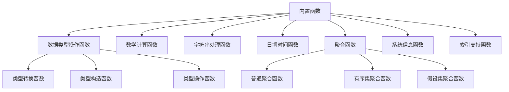
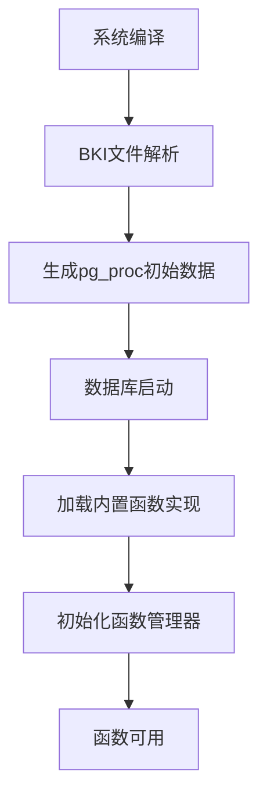
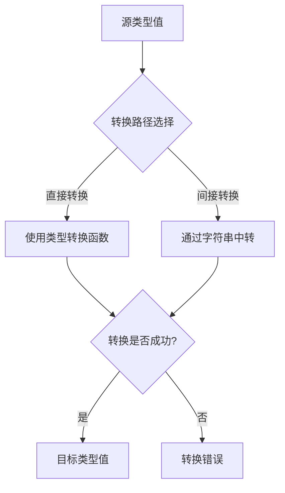
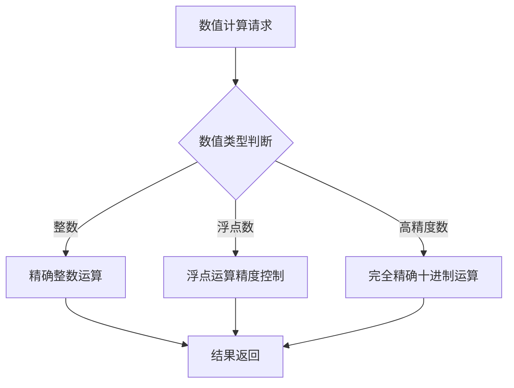
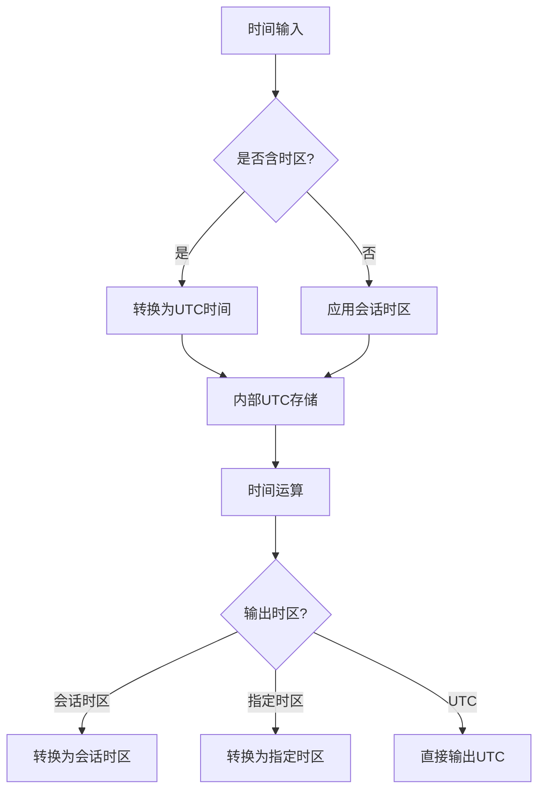
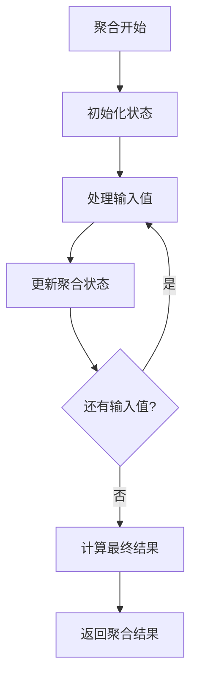
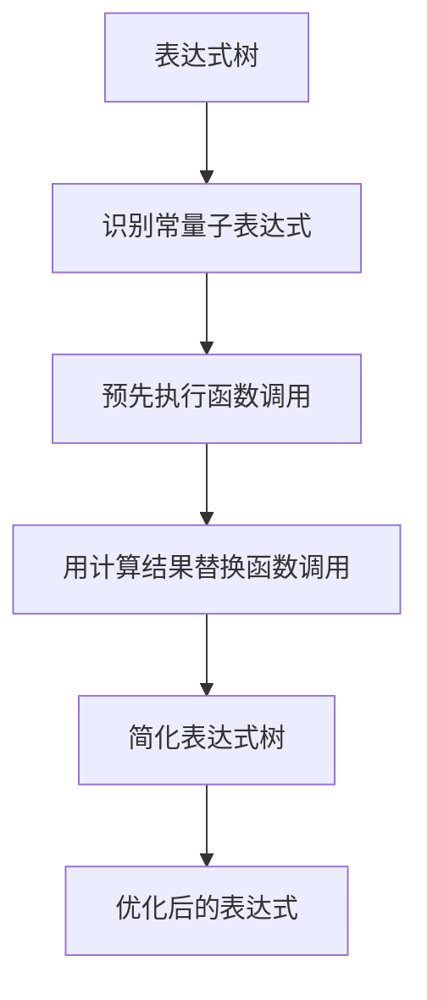
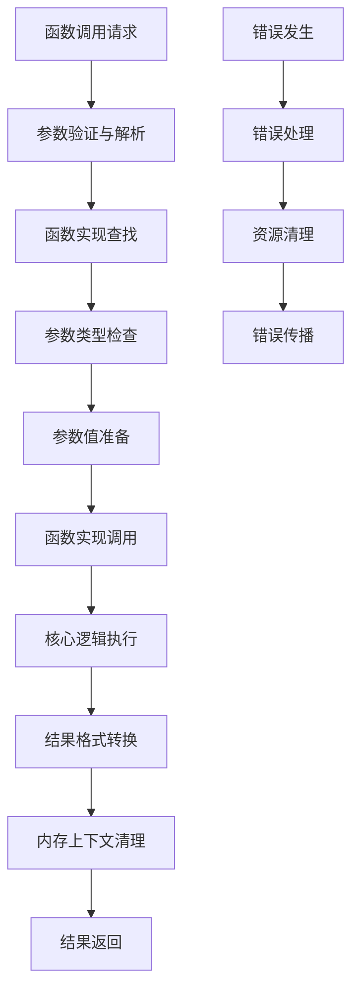

# 第15章 内置函数

## 15.1 内置函数概述

内置函数是PostgreSQL核心功能的重要组成部分，它们直接编译到数据库系统中，为各种数据操作提供基础能力。与用户定义的函数不同，内置函数具有最高的执行效率和最深的系统集成度，是数据库系统稳定性和性能的基石。

**内置函数的核心特点**：
- **系统级集成**：直接访问数据库内部数据结构，无调用开销
- **类型系统深度集成**：与PostgreSQL类型系统紧密耦合
- **性能优化**：针对特定数据类型和操作场景高度优化
- **稳定性保证**：经过严格测试，确保系统核心功能的可靠性

**内置函数分类体系**：


## 15.2 内置函数架构设计

### 15.2.1 函数注册与管理

内置函数在系统初始化时注册到全局函数表中，通过系统目录pg_proc提供元数据信息。

**关键代码位置**：`src/include/catalog/pg_proc.h` 包含所有内置函数的声明

**注册机制原理**：
1. **编译时注册**：在系统编译时通过BKI（Bootstrap Key Interface）文件定义函数元数据
2. **运行时初始化**：在数据库启动时加载函数实现到函数管理器中
3. **目录同步**：确保pg_proc系统表与实际的函数实现保持一致

**函数注册流程**：


### 15.2.2 函数调用接口

所有内置函数都遵循统一的调用接口，确保执行引擎能够一致地处理各种函数调用。

**关键代码位置**：`src/include/fmgr.h` 中的函数管理接口

**调用接口设计原理**：
- **统一签名**：所有内置函数使用相同的C函数签名
- **参数传递**：通过FunctionCallInfo结构统一传递参数和返回结果
- **错误处理**：统一的错误检测和报告机制
- **内存管理**：集成的内存上下文管理，防止内存泄漏

**函数调用上下文结构**：
```c
typedef struct FunctionCallInfoBaseData
{
    FmgrInfo   *flinfo;         // 函数信息
    Node       *context;        // 调用上下文
    Node       *resultinfo;     // 结果信息
    Oid         fncollation;    // 排序规则
    bool        isnull;         // 结果是否为NULL
    short       nargs;          // 参数个数
    Datum       arg[FUNC_MAX_ARGS]; // 参数值
    bool        argnull[FUNC_MAX_ARGS]; // 参数NULL标志
} FunctionCallInfoBaseData;
```

## 15.3 类型系统集成机制

### 15.3.1 类型转换函数

类型转换函数负责在不同数据类型间进行安全、高效的转换。

**关键代码位置**：`src/backend/utils/adt/` 目录下的各种类型转换函数

**转换函数分类**：
- **隐式转换**：自动执行的类型转换，确保类型安全
- **显式转换**：通过CAST操作符或::语法显式调用的转换
- **二进制转换**：底层二进制格式的直接转换

**类型转换原理**：


**转换函数实现示例**：
```c
// 整数到文本转换的核心逻辑
Datum int4_text(PG_FUNCTION_ARGS)
{
    int32 arg = PG_GETARG_INT32(0);
    char *str;
    text *result;
    
    // 将整数转换为字符串
    str = DatumGetCString(DirectFunctionCall1(int4out, 
                                             Int32GetDatum(arg)));
    
    // 创建文本结果
    result = cstring_to_text(str);
    pfree(str);
    
    PG_RETURN_TEXT_P(result);
}
```

### 15.3.2 类型构造函数

类型构造函数负责从组件值构建复杂数据类型的实例。

**构造机制原理**：
- **记录类型构造**：从字段值构建行类型实例
- **数组类型构造**：从元素值构建数组
- **范围类型构造**：从边界值构建范围
- **域类型构造**：基于基础类型构造域类型实例

## 15.4 数学计算函数实现

### 15.4.1 数值计算函数

数值计算函数处理各种数值类型的数学运算。

**关键代码位置**：`src/backend/utils/adt/float.c`、`src/backend/utils/adt/numeric.c`

**数值处理策略**：
- **整数运算**：直接使用CPU整数指令，最高性能
- **浮点运算**：使用IEEE 754标准，平衡精度和性能
- **高精度数值**：使用numeric类型，完全精确的十进制运算

**精度控制机制**：


### 15.4.2 三角函数与超越函数

超越函数实现复杂的数学计算，需要特殊的算法优化。

**实现原理**：
- **级数展开**：使用泰勒级数计算复杂函数
- **查表法**：预计算关键点的函数值，通过插值提高性能
- **迭代算法**：使用牛顿法等迭代方法求解方程
- **硬件加速**：利用现代CPU的数学协处理器

## 15.5 字符串处理函数机制

### 15.5.1 字符串编码处理

PostgreSQL支持多种字符编码，字符串函数需要正确处理编码转换。

**关键代码位置**：`src/backend/utils/adt/varlena.c`、`src/backend/utils/mb/`

**编码处理原理**：
- **编码感知**：所有字符串操作都考虑字符编码
- **自动转换**：在不同编码间自动转换字符串
- **长度计算**：基于字符而非字节计算字符串长度

**多字节字符串处理**：
```c
// 多字节安全的子字符串提取
Datum text_substr(PG_FUNCTION_ARGS)
{
    text *str = PG_GETARG_TEXT_PP(0);
    int32 start = PG_GETARG_INT32(1);
    int32 length = PG_GETARG_INT32(2);
    text *result;
    
    // 多字节安全的子字符串计算
    int32 maxmblen = pg_database_encoding_max_length();
    if (maxmblen > 1)
    {
        // 多字节编码处理
        result = text_substring_mb(str, start, length, false);
    }
    else
    {
        // 单字节编码处理（优化路径）
        result = text_substring_sb(str, start, length, false);
    }
    
    PG_RETURN_TEXT_P(result);
}
```

### 15.5.2 模式匹配函数

模式匹配函数支持LIKE、正则表达式等复杂字符串匹配。

**实现机制**：
- **简单模式匹配**：LIKE操作符的优化实现
- **正则表达式**：集成PCRE库提供完整正则支持
- **相似度计算**：trigram相似度算法支持模糊匹配

## 15.6 日期时间函数实现

### 15.6.1 时间处理基础

日期时间函数基于PostgreSQL的复杂时间类型系统。

**关键代码位置**：`src/backend/utils/adt/timestamp.c`、`src/backend/utils/adt/date.c`

**时间类型层次**：
- **DATE**：纯日期类型
- **TIME**：纯时间类型
- **TIMESTAMP**：日期时间类型
- **TIMESTAMPTZ**：带时区的日期时间类型
- **INTERVAL**：时间间隔类型

**时区处理机制**：


### 15.6.2 时间运算函数

时间运算函数处理时间的加减、比较和提取操作。

**运算原理**：
- **时间加减**：基于时间间隔的精确计算
- **时间比较**：考虑时区和精度的比较运算
- **时间提取**：提取时间的特定组成部分
- **时间生成**：从组件值构造时间值

## 15.7 聚合函数架构

### 15.7.1 聚合函数执行模型

聚合函数采用多阶段执行模型，支持并行和分布式聚合。

**关键代码位置**：`src/backend/executor/nodeAgg.c` 中的聚合执行逻辑

**聚合执行阶段**：
1. **初始状态**：初始化聚合状态数据结构
2. **状态累积**：对每个输入值更新聚合状态
3. **最终计算**：基于聚合状态计算最终结果
4. **状态序列化**：为并行聚合序列化状态

**聚合状态机**：


### 15.7.2 高级聚合函数

PostgreSQL支持多种高级聚合函数，满足复杂分析需求。

**有序集聚合函数**：
- 支持WITHIN GROUP (ORDER BY ...)语法
- 用于计算中位数、百分位数等统计量
- 需要维护输入数据的排序信息

**假设集聚合函数**：
- 支持假设分析场景
- 用于排名相关的分析函数
- 维护额外的假设数据状态

## 15.8 系统信息函数机制

### 15.8.1 系统状态查询

系统信息函数提供数据库运行时的状态信息。

**关键代码位置**：`src/backend/utils/adt/misc.c` 中的系统信息函数

**信息分类**：
- **会话信息**：当前连接的相关信息
- **系统配置**：数据库配置参数信息
- **统计信息**：数据库运行统计信息
- **对象信息**：数据库对象元数据信息

### 15.8.2 性能监控函数

性能监控函数帮助诊断数据库性能问题。

**实现原理**：
- **统计信息收集**：从共享内存统计计数器读取数据
- **快照机制**：提供一致性的统计信息视图
- **性能数据聚合**：按不同维度聚合性能指标

## 15.9 内置函数优化技术

### 15.9.1 内联优化

对于简单的内置函数，PostgreSQL可以将其内联到调用表达式中。

**内联条件**：
- 函数是IMMUTABLE的
- 函数体简单，内联不会显著增加代码大小
- 内联能够带来明显的性能提升

**关键代码位置**：`src/backend/optimizer/plan/planner.c` 中的函数内联逻辑

### 15.9.2 常量表达式求值

在查询优化阶段，常量表达式中的函数调用会被预先计算。

**常量折叠流程**：


### 15.9.3 向量化执行优化

现代PostgreSQL支持一定程度的向量化执行，提高内置函数的处理吞吐量。

**优化技术**：
- **批处理**：一次处理多个值，减少函数调用开销
- **SIMD指令**：利用CPU的SIMD指令并行处理数据
- **内存预取**：优化数据访问模式，提高缓存命中率

## 15.10 内置函数执行完整流程

以下图表展示了内置函数从调用到返回的完整执行流程：



## 15.11 本章小结

本章详细解析了PostgreSQL内置函数的实现机制：

1. **系统级集成架构**：内置函数深度集成到数据库核心，通过统一的函数管理器提供高效、一致的调用接口。

2. **类型系统深度集成**：内置函数与PostgreSQL丰富的类型系统紧密耦合，提供类型安全的数据操作能力。

3. **多层次优化策略**：从算法优化到硬件加速，内置函数采用多种技术确保最佳性能。

4. **复杂函数类别**：支持数学计算、字符串处理、日期时间、聚合分析等多种函数类别，满足各种数据处理需求。

5. **高级聚合支持**：提供普通聚合、有序集聚合、假设集聚合等高级聚合功能，支持复杂分析场景。

6. **智能优化技术**：通过函数内联、常量折叠、向量化执行等技术，在多个层次优化函数执行性能。

内置函数是PostgreSQL功能丰富性和执行效率的重要保证，它们的设计和实现体现了数据库系统在数据操作方面的深度优化。理解内置函数的实现机制对于开发高性能数据库应用、进行查询优化和系统调优具有重要意义。在下一章中，我们将探讨数据类型系统的实现机制。