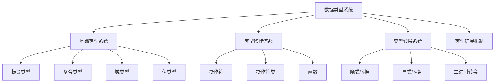
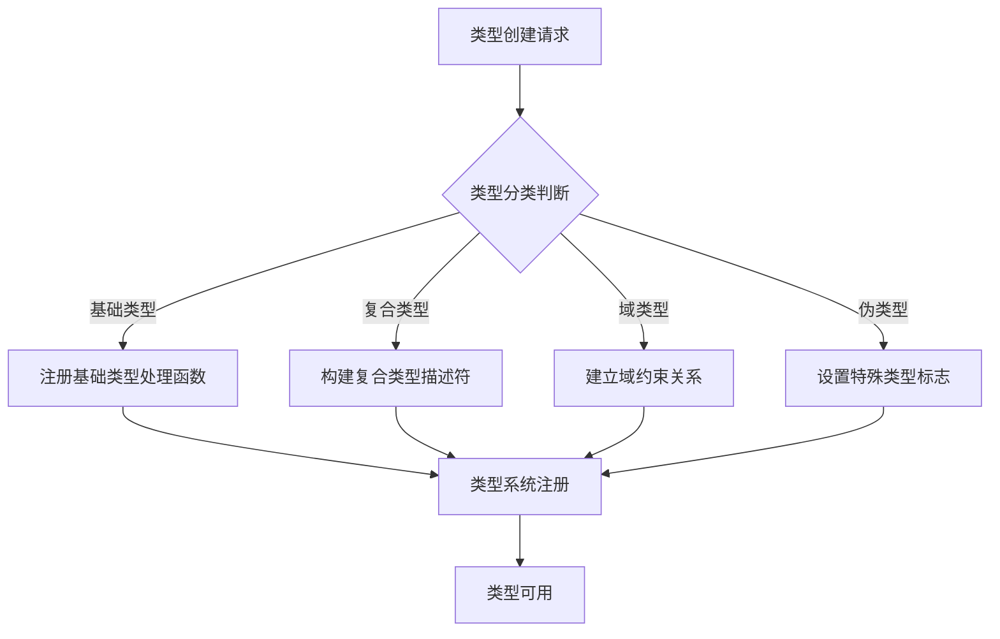
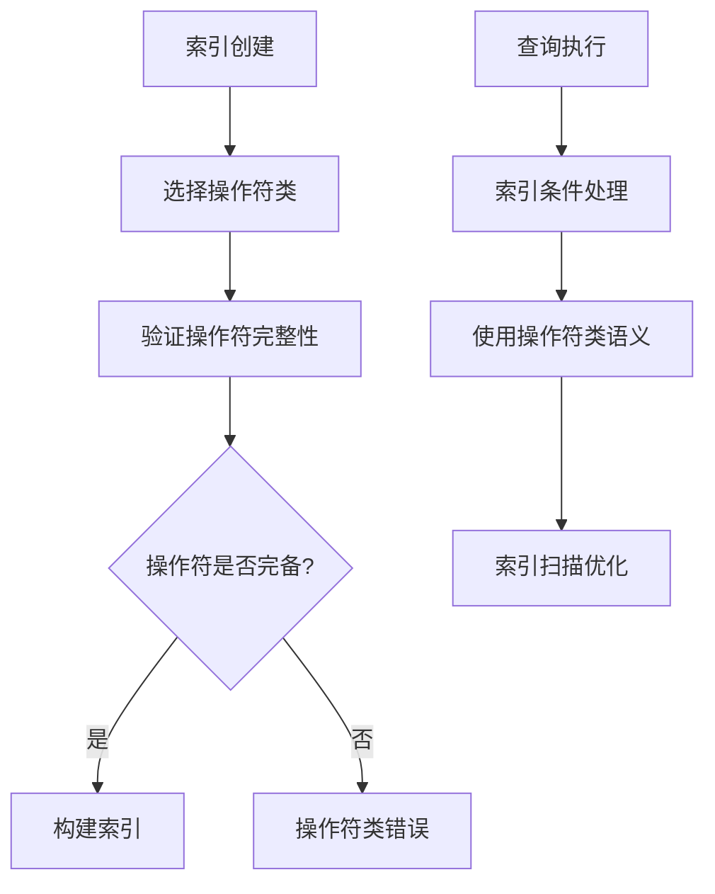
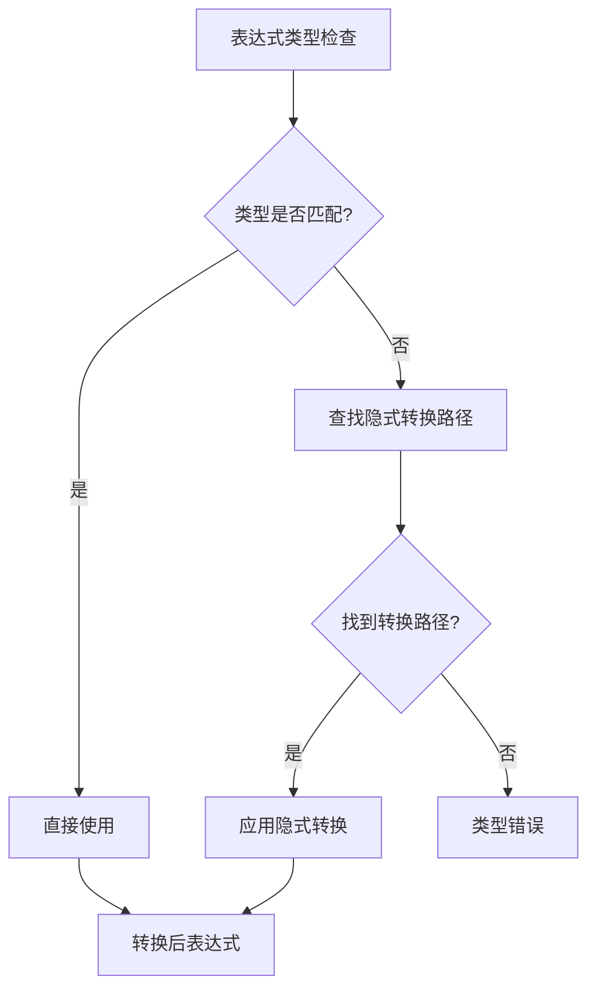
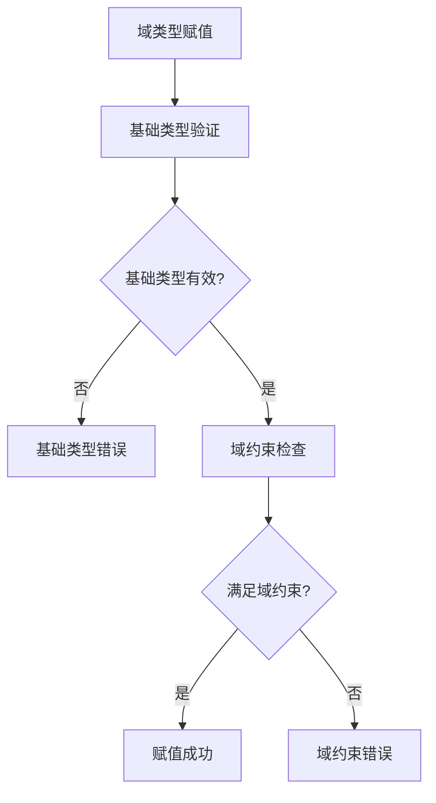
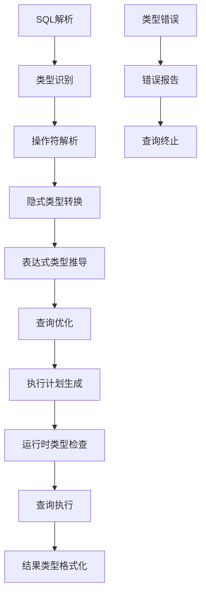

# 第16章 数据类型系统

## 16.1 数据类型系统概述

数据类型系统是PostgreSQL的核心基础设施，它定义了数据的存储格式、操作语义和转换规则。PostgreSQL拥有极其丰富和可扩展的类型系统，支持从简单的标量类型到复杂的用户定义类型，为各种数据建模场景提供了强大的基础。

**类型系统的核心作用**：
- **数据表示**：定义数据在内存和磁盘上的存储格式
- **操作语义**：为数据类型定义有效的操作和运算规则
- **类型安全**：在编译时和运行时确保类型操作的正确性
- **扩展性**：支持用户自定义类型的灵活扩展

**类型系统架构层次**：


## 16.2 类型系统架构设计

### 16.2.1 类型元数据管理

PostgreSQL在系统目录中维护完整的类型元数据信息，为类型系统提供运行时支持。

**关键系统表**：
- **pg_type**：存储所有数据类型的定义信息
- **pg_opclass**：定义操作符类信息
- **pg_opfamily**：定义操作符族信息
- **pg_cast**：存储类型转换路径
- **pg_operator**：存储操作符定义

**关键代码位置**：`src/include/catalog/pg_type.h` 中的类型定义结构

**类型描述符（TypeDesc）核心字段**：
- **类型标识**：类型OID、类型名称、类型分类
- **存储特性**：类型长度、对齐方式、存储策略
- **行为特性**：传递性、比较语义、输入输出函数
- **关系信息**：数组类型、元素类型、域基类型

### 16.2.2 类型分类体系

PostgreSQL将数据类型划分为多个类别，每个类别具有特定的行为特征：

**基础类型分类**：
- **基础类型**：整数、浮点数、字符串等标量类型
- **复合类型**：表行类型、记录类型等结构化类型
- **域类型**：基于现有类型添加约束的派生类型
- **伪类型**：用于特殊目的的虚拟类型
- **多态类型**：anyelement、anyarray等通用类型

**类型分类的实现原理**：


## 16.3 操作符系统实现

### 16.3.1 操作符解析与查找

操作符系统负责将语法操作符映射到具体的实现函数。

**关键代码位置**：`src/backend/parser/parse_oper.c` 中的操作符解析函数

**操作符解析流程**：
1. **操作符识别**：在语法分析阶段识别操作符记号
2. **参数类型推导**：根据操作数类型推导操作符类型
3. **操作符查找**：在系统目录中查找匹配的操作符
4. **函数绑定**：将操作符绑定到具体的实现函数

**操作符查找算法**：
```c
// 操作符查找的简化逻辑
Operator lookup_operator(操作符名称, 左参数类型, 右参数类型, 是否错误):
    // 构建操作符签名
    操作符签名 = 构建签名(操作符名称, 左参数类型, 右参数类型)
    
    // 在pg_operator中查找精确匹配
    operator = 查找精确匹配操作符(操作符签名)
    if operator != NULL:
        return operator
    
    // 查找可应用的操作符族
    opfamily = 查找操作符族(左参数类型, 右参数类型)
    if opfamily != NULL:
        operator = 在操作符族中查找兼容操作符(操作符名称, opfamily)
        if operator != NULL:
            return operator
    
    // 尝试类型转换路径
    operator = 通过类型转换查找操作符(操作符名称, 左参数类型, 右参数类型)
    if operator != NULL:
        return operator
    
    if 是否错误:
        报错("未找到操作符")
    return NULL
```

### 16.3.2 操作符类与操作符族

操作符类和操作符族为索引访问方法提供类型特定的操作语义。

**关键概念**：
- **操作符类**：为特定索引访问方法和数据类型定义必需的操作符集合
- **操作符族**：相关操作符类的分组，支持跨类型操作

**操作符类实现原理**：


## 16.4 类型转换机制

### 16.4.1 隐式类型转换

隐式转换在表达式求值时自动执行，确保类型兼容性。

**关键代码位置**：`src/backend/parser/parse_coerce.c` 中的类型强制函数

**隐式转换规则**：
1. **类型分类匹配**：只有相同分类的类型间允许隐式转换
2. **转换路径存在**：必须在pg_cast中存在隐式转换路径
3. **转换代价最低**：选择转换代价最小的路径

**隐式转换决策过程**：


### 16.4.2 显式类型转换

显式转换通过CAST操作符或::语法显式调用。

**显式转换类型**：
- **二进制强制转换**：底层表示的重新解释
- **函数调用转换**：通过类型转换函数实现
- **IO转换**：通过文本输入输出函数实现

**转换函数解析机制**：
```c
// 类型转换函数查找逻辑
Oid find_conversion_function(源类型, 目标类型, 转换上下文):
    // 在pg_cast中查找转换函数
    cast_entry = 查找转换条目(源类型, 目标类型)
    if cast_entry != NULL:
        return cast_entry->转换函数
    
    // 尝试通过IO函数转换
    if 可以通过IO转换(源类型, 目标类型):
        return 构建IO转换路径(源类型, 目标类型)
    
    // 尝试通过二进制强制转换
    if 可以二进制强制转换(源类型, 目标类型):
        return 构建二进制转换路径(源类型, 目标类型)
    
    return InvalidOid
```

## 16.5 类型扩展机制

### 16.5.1 用户定义类型

PostgreSQL支持用户通过SQL命令创建新的数据类型。

**关键代码位置**：`src/backend/commands/typecmds.c` 中的类型创建命令

**类型创建流程**：
1. **权限检查**：验证用户有创建类型的权限
2. **名称冲突检查**：确保类型名称在命名空间中唯一
3. **函数验证**：验证输入输出函数的有效性
4. **系统目录更新**：在pg_type中插入新类型记录
5. **依赖关系建立**：记录类型与函数的依赖关系

**类型创建伪代码**：
```c
// 用户定义类型创建流程
create_type(类型定义):
    // 验证权限和名称
    if !有创建类型权限(当前用户):
        报错("权限不足")
    
    if 类型名称已存在(类型定义.类型名):
        报错("类型已存在")
    
    // 验证输入输出函数
    if !函数存在且签名正确(类型定义.输入函数):
        报错("输入函数无效")
    
    if !函数存在且签名正确(类型定义.输出函数):
        报错("输出函数无效")
    
    // 创建类型记录
    type_oid = 分配新OID()
    插入pg_type记录(type_oid, 类型定义)
    
    // 建立依赖关系
    记录依赖关系(type_oid, 类型定义.输入函数)
    记录依赖关系(type_oid, 类型定义.输出函数)
    
    return type_oid
```

### 16.5.2 域类型实现

域类型基于现有类型添加额外的约束条件。

**域类型特性**：
- **继承基础类型**：域类型继承基础类型的所有操作
- **添加约束**：通过CHECK约束限制值的有效范围
- **类型标识**：域类型具有独立的类型OID和标识

**域类型约束检查**：


## 16.6 多态类型系统

### 16.6.1 多态类型解析

多态类型（anyelement、anyarray等）在函数调用时根据实际参数类型解析。

**关键代码位置**：`src/backend/parser/parse_func.c` 中的多态类型解析

**多态类型解析过程**：
1. **收集实际类型**：从函数调用的实际参数中收集具体类型
2. **推导多态类型**：根据多态类型规则推导具体类型
3. **类型一致性检查**：确保所有多态类型推导一致
4. **函数签名特化**：根据推导的类型特化函数签名

**多态类型推导算法**：
```c
// 多态类型解析逻辑
resolve_polymorphic_types(函数签名, 实际参数类型):
    // 初始化多态类型映射
    类型映射表 = 创建空映射()
    
    // 处理每个参数
    for i = 0 to 参数个数-1:
        形参类型 = 函数签名.参数类型[i]
        实参类型 = 实际参数类型[i]
        
        if 形参类型是多态类型:
            if 形参类型在映射表中已存在:
                // 检查类型一致性
                if 映射表[形参类型] != 实参类型:
                    报错("多态类型不一致")
            else:
                // 添加类型映射
                映射表[形参类型] = 实参类型
        else:
            // 检查类型兼容性
            if !类型兼容(形参类型, 实参类型):
                报错("类型不兼容")
    
    // 验证多态类型推导完整性
    if !所有多态类型都已推导(映射表):
        报错("无法推导多态类型")
    
    return 映射表
```

### 16.6.2 多态函数实现

多态函数根据实际类型选择不同的实现路径。

**实现策略**：
- **函数内联**：在调用处根据具体类型生成特化代码
- **动态分发**：在运行时根据实际类型选择实现函数
- **模板实例化**：为常见类型组合预生成实现

## 16.7 类型系统性能优化

### 16.7.1 类型缓存机制

类型系统维护多个缓存层，加速类型相关操作。

**缓存层次**：
- **类型OID缓存**：加速类型OID查找
- **类型信息缓存**：缓存类型描述符信息
- **操作符缓存**：缓存常用操作符查找结果
- **转换路径缓存**：缓存类型转换路径

**关键代码位置**：`src/backend/utils/cache/typcache.c` 中的类型缓存实现

### 16.7.2 快速路径优化

对于常见类型操作，提供快速路径实现。

**优化场景**：
- **简单类型比较**：整数、浮点数等标量类型的快速比较
- **内联函数调用**：简单函数的直接内联实现
- **二进制操作**：避免不必要的格式转换

## 16.8 类型安全与验证

### 16.8.1 编译时类型检查

在查询解析和优化阶段进行类型正确性验证。

**检查内容**：
- **函数签名匹配**：实际参数类型与函数声明匹配
- **操作符可用性**：操作符对操作数类型可用
- **类型转换安全性**：隐式转换路径存在且安全

### 16.8.2 运行时类型验证

在执行阶段验证类型操作的正确性。

**验证机制**：
- **参数类型验证**：函数调用时验证参数类型
- **结果类型断言**：验证函数返回类型符合声明
- **域约束检查**：域类型赋值时检查约束条件

## 16.9 类型系统完整工作流

以下图表展示了类型系统在查询处理全流程中的参与：



## 16.10 本章小结

本章详细解析了PostgreSQL数据类型系统的实现机制：

1. **统一类型元数据管理**：通过系统目录统一管理所有数据类型的定义和关系，为类型操作提供完整的元数据支持。

2. **丰富的类型分类体系**：支持基础类型、复合类型、域类型、伪类型和多态类型，满足各种数据建模需求。

3. **完整的操作符系统**：通过操作符类和操作符族为索引和查询优化提供类型特定的操作语义。

4. **灵活的类型转换机制**：支持隐式和显式类型转换，在类型安全和操作灵活性间取得平衡。

5. **强大的类型扩展能力**：支持用户定义类型和域类型，允许根据应用需求定制数据类型。

6. **智能的多态类型系统**：支持多态函数和操作符，实现通用算法的类型安全重用。

7. **多层次性能优化**：通过缓存机制、快速路径、内联优化等技术确保类型系统的高效运行。

数据类型系统是PostgreSQL强大功能和灵活性的基础，它的设计体现了数据库系统在数据建模和操作方面的深度思考。理解类型系统的实现机制对于设计高效的数据模型、开发类型扩展和进行深度性能优化具有重要意义。在下一章中，我们将探讨分区表的实现原理和机制。