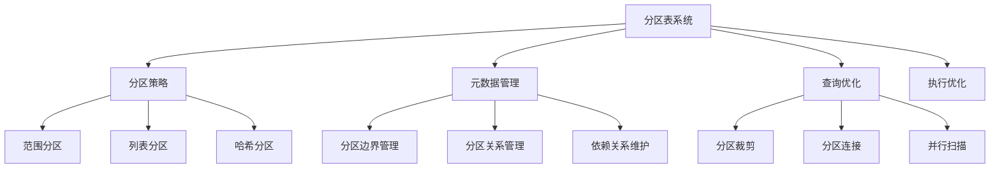
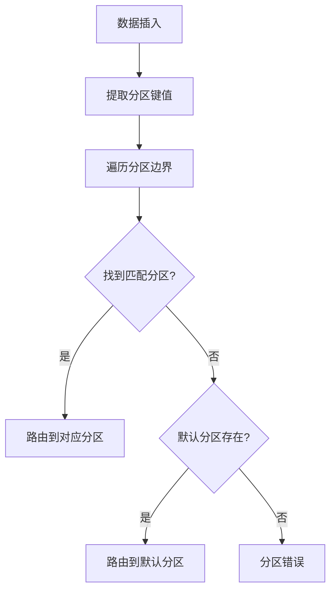
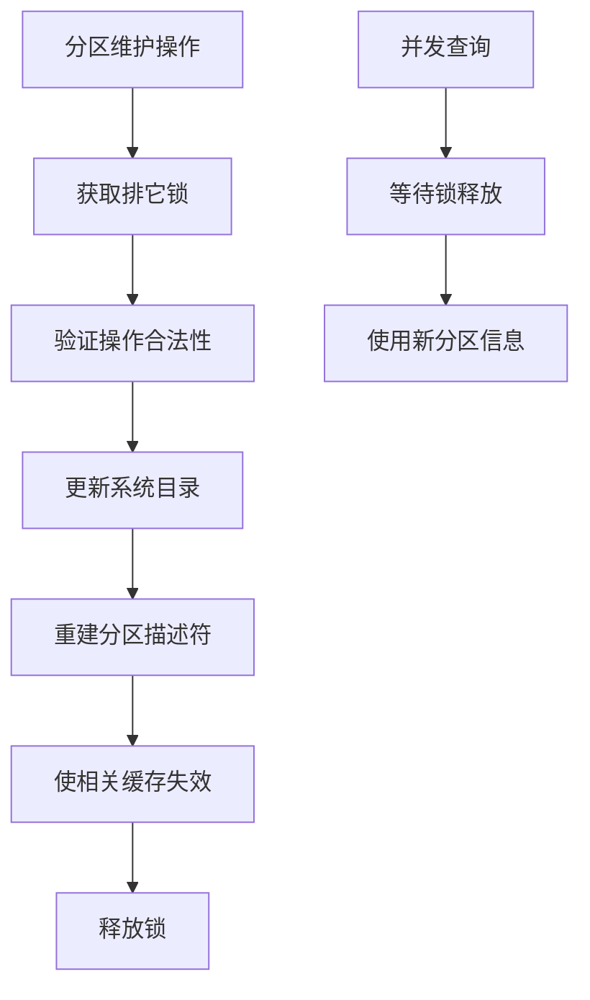
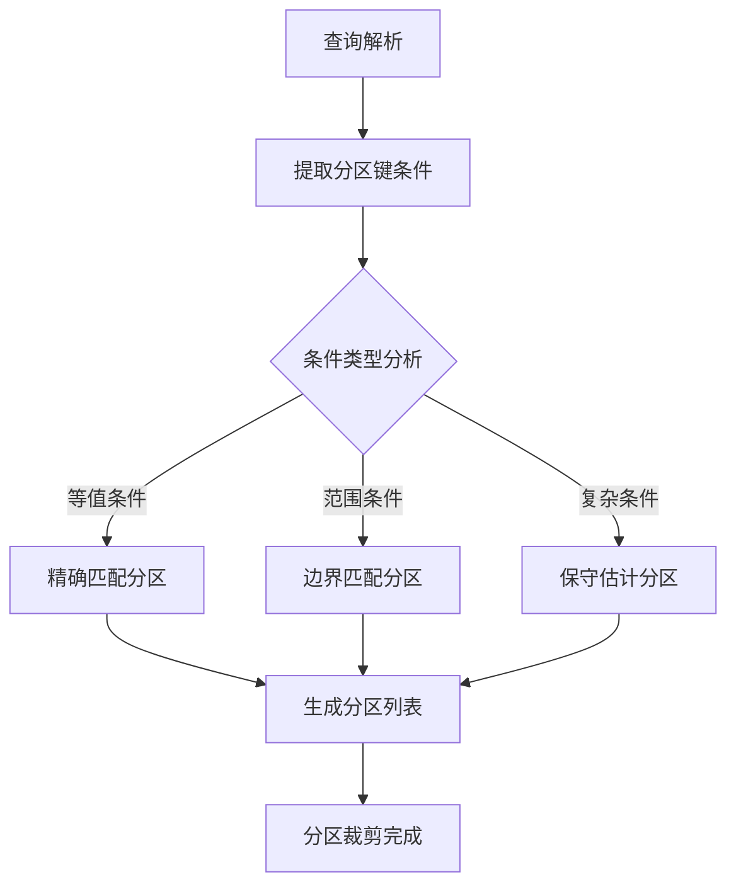
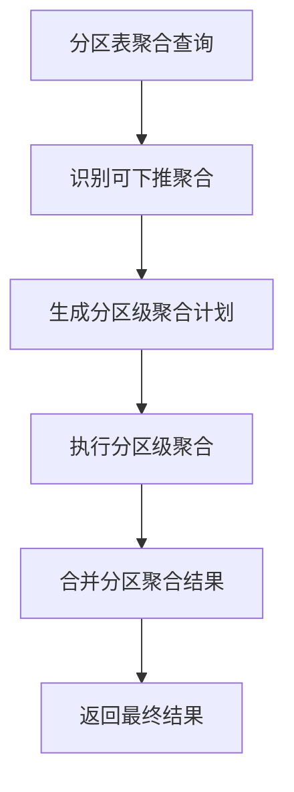
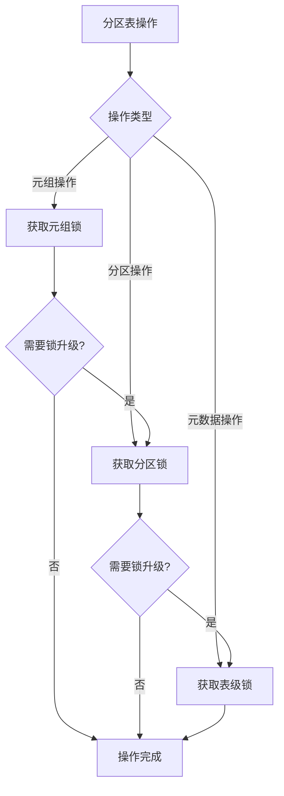
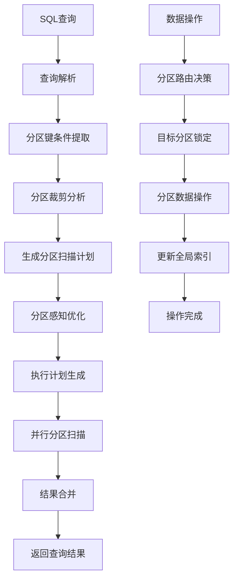

# 第17章 分区表

## 17.1 分区表概述

分区表是PostgreSQL中处理超大规模数据的关键技术，它通过将大表物理分割为多个小表，同时保持逻辑上的统一视图，实现了数据管理的可扩展性和性能优化。分区表机制使得数据库能够高效地管理TB甚至PB级别的数据，同时为查询优化和执行提供了重要的优化机会。

**分区表的核心价值**：
- **性能提升**：通过分区裁剪减少需要扫描的数据量
- **管理便利**：可以单独管理各个分区的存储、备份和维护
- **可用性增强**：分区级别的操作不影响整个表的可用性
- **数据生命周期管理**：支持按时间或其他维度自动管理数据

**分区表架构层次**：


## 17.2 分区表架构设计

### 17.2.1 分区表元数据管理

分区表的元数据在系统目录中维护，记录了分区策略、边界定义和分区关系。

**关键系统表**：
- **pg_partitioned_table**：存储分区策略和键信息
- **pg_inherits**：记录分区表与子表的继承关系
- **pg_partition_bound**：存储分区边界定义

**关键代码位置**：`src/include/catalog/pg_partitioned_table.h` 中的分区表定义

**分区表描述结构**：
```c
typedef struct PartitionDescData
{
    int         nparts;              // 分区数量
    Oid         oids[FLEXIBLE_ARRAY_MEMBER]; // 分区OID数组
    PartitionBoundInfo boundinfo;    // 分区边界信息
    bool        is_leaf[FLEXIBLE_ARRAY_MEMBER]; // 是否为叶子分区
} PartitionDescData;
```

### 17.2.2 分区策略实现

PostgreSQL支持多种分区策略，每种策略适用于不同的数据分布场景。

**范围分区实现原理**：


**列表分区实现机制**：
- 为每个分区定义明确的值列表
- 使用哈希或线性搜索匹配值
- 支持默认分区处理未列出的值

**哈希分区分布算法**：
- 对分区键计算哈希值
- 通过模运算确定目标分区
- 确保数据的均匀分布

## 17.3 分区表创建与维护

### 17.3.1 分区表创建流程

分区表的创建涉及多个步骤，确保元数据和物理结构的正确建立。

**关键代码位置**：`src/backend/commands/tablecmds.c` 中的分区表创建函数

**创建流程伪代码**：
```c
// 分区表创建的核心逻辑
create_partitioned_table(表定义, 分区策略, 分区键):
    // 创建主表（逻辑表）
    主表OID = 创建普通表(表定义)
    
    // 设置分区策略
    StorePartitionKey(主表OID, 分区策略, 分区键)
    
    // 初始化分区描述符
    分区描述符 = BuildPartitionDesc(主表OID)
    
    // 注册分区表到系统目录
    RegisterPartitionedTable(主表OID, 分区描述符)
    
    return 主表OID
```

### 17.3.2 分区维护操作

分区表支持动态的分区添加、删除和合并操作。

**分区添加流程**：
1. **边界验证**：确保新分区边界不与现有分区重叠
2. **子表创建**：创建物理存储的子表
3. **继承关系建立**：在pg_inherits中注册继承关系
4. **约束创建**：为分区添加CHECK约束
5. **元数据更新**：更新分区描述符和边界信息

**关键代码位置**：`src/backend/commands/tablecmds.c` 中的 `DefinePartition` 函数

**分区维护操作的影响**：


## 17.4 分区裁剪优化

### 17.4.1 裁剪原理与算法

分区裁剪是分区表最重要的性能优化技术，它在查询编译阶段排除不需要扫描的分区。

**关键代码位置**：`src/backend/partitioning/partprune.c` 中的分区裁剪函数

**裁剪算法原理**：
1. **条件提取**：从查询条件中提取与分区键相关的条件
2. **边界匹配**：将条件与分区边界进行匹配
3. **分区选择**：确定需要扫描的分区集合
4. **计划生成**：只为选中的分区生成扫描计划

**裁剪决策过程**：


### 17.4.2 运行时分区裁剪

对于参数化查询，PostgreSQL支持运行时的分区裁剪。

**运行时裁剪机制**：
- **参数化计划**：生成适用于不同参数值的通用计划
- **执行时绑定**：在查询执行时根据实际参数值确定扫描分区
- **动态分区选择**：避免为每个参数值生成不同的执行计划

**关键代码位置**：`src/backend/partitioning/partprune.c` 中的 `get_matching_partitions` 函数

## 17.5 分区表查询优化

### 17.5.1 分区感知的连接优化

当多个分区表进行连接时，优化器可以识别分区对齐关系。

**分区连接优化**：
- **分区键对齐检测**：识别连接条件中的分区键匹配
- **分区对连接**：将连接分解为分区对之间的连接
- **并行连接执行**：不同分区对可以并行执行连接

**分区连接算法**：
```c
// 分区连接优化的简化逻辑
partition_aware_join(左表, 右表, 连接条件):
    // 检测分区键对齐
    if 分区键对齐(左表, 右表, 连接条件):
        // 生成分区对连接计划
        分区对列表 = 生成分区对列表(左表, 右表)
        
        for 每个分区对 in 分区对列表:
            分区连接计划 = 生成分区连接计划(分区对, 连接条件)
            添加到总计划(分区连接计划)
        
        return 并行执行计划(所有分区连接计划)
    else:
        // 回退到普通连接算法
        return 普通连接计划(左表, 右表, 连接条件)
```

### 17.5.2 聚合下推优化

对于分区表的聚合查询，可以将聚合操作下推到各个分区。

**聚合下推条件**：
- 聚合函数可下推（如SUM、COUNT、AVG等）
- GROUP BY键包含分区键或与分区键兼容
- 没有分区间的依赖关系

**下推执行流程**：


## 17.6 分区表执行优化

### 17.6.1 并行分区扫描

分区表天然支持并行扫描，每个分区可以由不同的工作进程扫描。

**并行扫描架构**：
- **动态工作分配**：根据分区大小动态分配扫描任务
- **负载均衡**：确保工作进程间的负载均衡
- **结果合并**：并行扫描结果的正确合并

**关键代码位置**：`src/backend/access/table/tableam.c` 中的并行扫描接口

### 17.6.2 分区锁优化

分区表采用细粒度的锁机制，提高并发性能。

**锁层次结构**：
- **表级锁**：保护分区表元数据操作
- **分区级锁**：保护单个分区的数据操作
- **元组级锁**：保护具体的数据行

**锁升级机制**：


## 17.7 分区表维护与监控

### 17.7.1 自动分区管理

PostgreSQL支持通过扩展实现自动分区管理。

**自动管理功能**：
- **按时间自动分区**：根据时间范围自动创建新分区
- **分区归档**：自动将旧分区数据归档到廉价存储
- **分区合并**：自动合并小分区以提高性能

**关键代码位置**：`contrib/partition_manager/` 中的分区管理扩展

### 17.7.2 分区表统计信息

分区表维护特殊的统计信息，支持更好的查询优化。

**统计信息类型**：
- **分区级统计**：每个分区的独立统计信息
- **全局统计**：整个分区表的汇总统计信息
- **边界统计**：分区边界附近的数据分布统计

## 17.8 分区表与其它特性集成

### 17.8.1 分区表与复制

分区表与逻辑复制、流复制等特性深度集成。

**复制集成策略**：
- **选择性复制**：只复制特定的分区
- **并行复制**：不同分区可以并行复制
- **冲突解决**：分区级别的冲突检测和解决

### 17.8.2 分区表与外部表

分区表可以与外部表结合，实现分层存储。

**混合分区架构**：
- **热数据**：存储在本地分区的频繁访问数据
- **温数据**：存储在外部表的较少访问数据
- **冷数据**：归档到对象存储的历史数据

## 17.9 分区表完整工作流

以下图表展示了分区表从查询到执行的完整处理流程：



## 17.10 分区表性能考量

### 17.10.1 分区数量优化

分区数量需要在管理和性能间取得平衡。

**分区数量建议**：
- **太少分区**：无法充分发挥分区优势
- **太多分区**：增加元数据管理和规划开销
- **适度分区**：根据数据量和访问模式确定合理数量

### 17.10.2 分区键选择策略

分区键的选择对性能有决定性影响。

**分区键选择原则**：
- **高选择性**：分区键应具有良好的数据分布特性
- **查询相关性**：与常用查询条件相关联
- **数据局部性**：支持相关数据的物理聚集

## 17.11 本章小结

本章详细解析了PostgreSQL分区表的实现机制：

1. **灵活的分区策略**：支持范围分区、列表分区、哈希分区等多种分区方式，适应不同的数据分布和访问模式。

2. **智能的分区裁剪**：在查询编译和执行阶段自动排除不需要扫描的分区，大幅减少I/O操作和计算开销。

3. **分区感知的查询优化**：优化器能够识别分区特性，生成分区对连接、聚合下推等高效执行计划。

4. **高效的并行执行**：天然支持并行分区扫描，充分利用多核架构提升查询性能。

5. **细粒度的并发控制**：分区级别的锁机制提高并发性能，同时确保数据一致性。

6. **完善的维护工具**：支持动态分区管理、统计信息收集、监控诊断等维护操作。

7. **深度的系统集成**：与复制、外部表、索引等特性深度集成，形成完整的数据管理解决方案。

分区表是PostgreSQL处理超大规模数据的核心技术，它的设计和实现体现了现代数据库系统在可扩展性方面的深度思考。理解分区表的实现机制对于设计高效的数据架构、优化大数据量查询性能具有重要意义。在下一章中，我们将探讨行存储的页结构与元组结构。