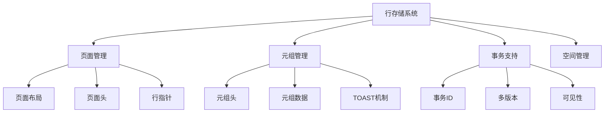
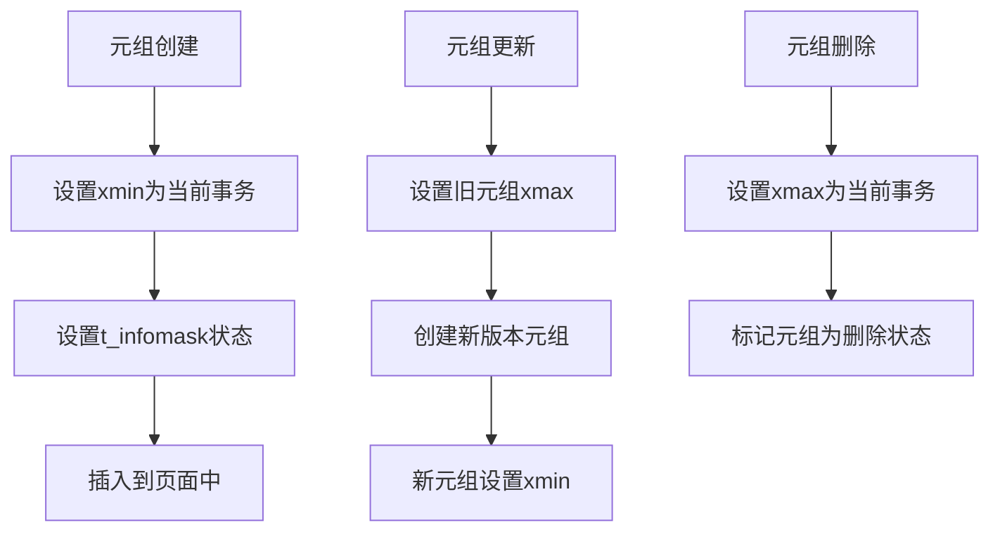
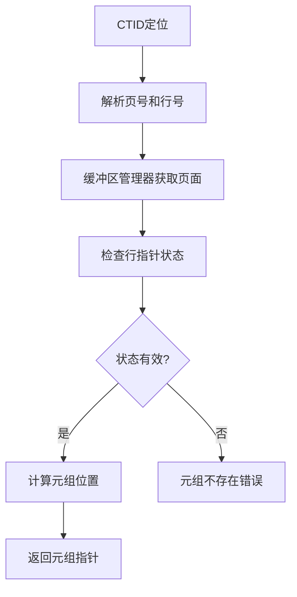
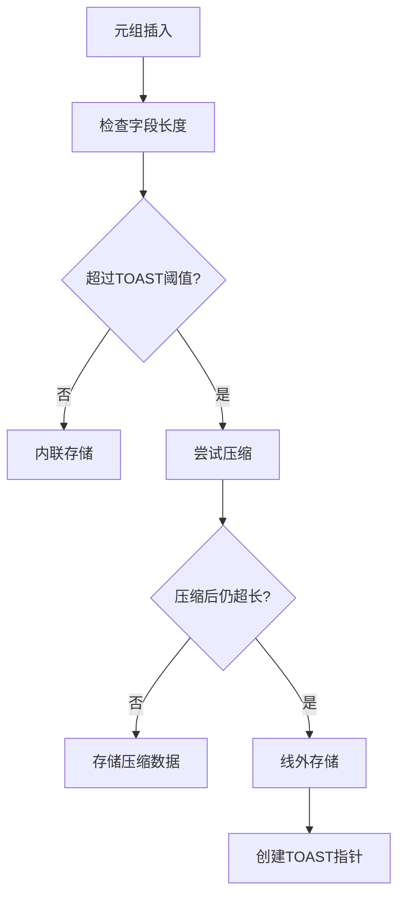
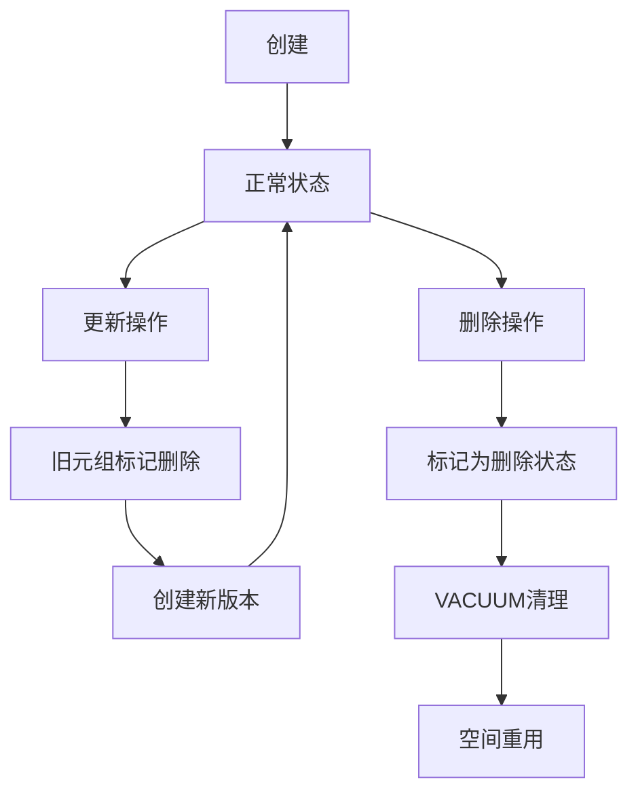
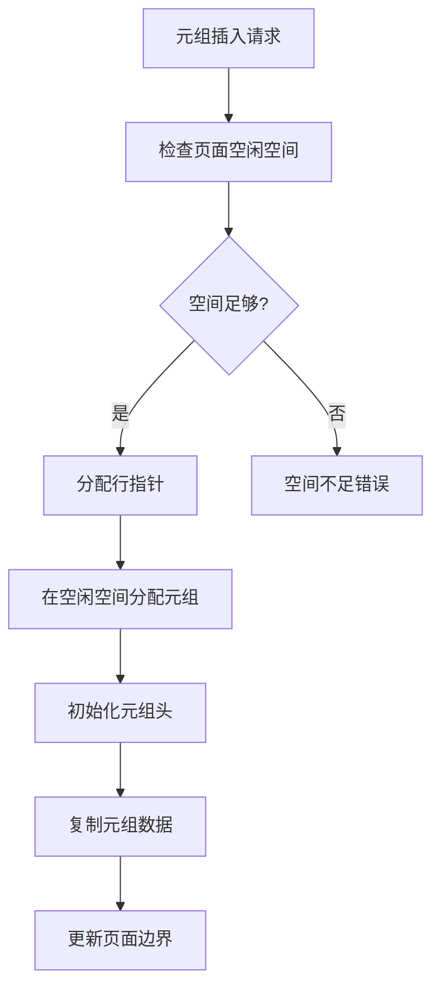
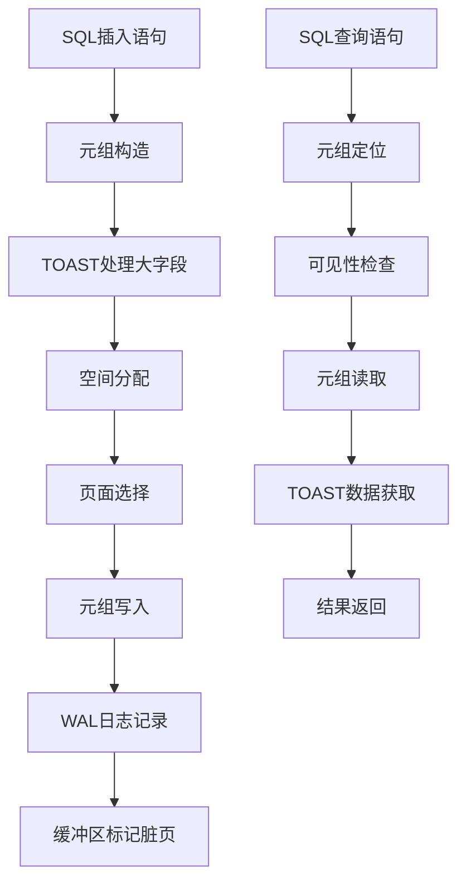

# 第四部分 存储引擎
# 第18章 行存（页结构与元组结构）

## 18.1 行存储概述

行存储是PostgreSQL最基础也是最重要的存储格式，它基于经典的堆表（Heap Table）结构组织数据。理解行存储的页结构和元组结构是深入掌握PostgreSQL存储引擎的基础，这些结构设计直接影响了数据库的存储效率、访问性能和事务特性。

**行存储的核心特性**：
- **堆表组织**：数据以堆的形式组织，元组插入到空闲位置
- **MVCC支持**：通过多版本机制实现并发控制
- **事务安全**：确保ACID特性的存储层支持
- **空间效率**：优化的存储格式减少空间开销

**行存储在存储层次中的位置**：


## 18.2 页面结构设计

### 18.2.1 页面整体布局

PostgreSQL的页面采用固定大小（通常为8KB），包含页头、行指针数组、空闲空间和元组数据区域。

**关键代码位置**：`src/include/storage/bufpage.h` 中的页面结构定义

**页面布局结构**：
```
+-------------------+ <-- Page start
|    PageHeader     | 24 bytes
+-------------------+
|   LinePointer 1   | 4 bytes
|   LinePointer 2   | 4 bytes
|       ...         |
|   LinePointer N   | 4 bytes
+-------------------+
|    Free Space     |
|                   |
+-------------------+
|    Tuple Data     |
|      Area         |
|                   |
+-------------------+ <-- Page end
```

**页面布局特性**：
- **双向增长**：行指针从页头向下增长，元组数据从页尾向上增长
- **空间管理**：通过页头信息管理空闲空间
- **快速访问**：行指针数组支持元组的快速定位

### 18.2.2 页面头结构

页面头包含页面的元数据信息，支持空间管理和事务处理。

**PageHeaderData关键字段**：
```c
typedef struct PageHeaderData
{
    PageXLogRecPtr pd_lsn;           // 最后修改的LSN
    uint16        pd_checksum;       // 页面校验和
    uint16        pd_flags;          // 标志位
    LocationIndex pd_lower;          // 行指针数组结束位置
    LocationIndex pd_upper;          // 空闲空间开始位置
    LocationIndex pd_special;        // 特殊空间开始位置
    uint16        pd_pagesize_version; // 页面大小和版本
    TransactionId pd_prune_xid;      // 可修剪的最老XID
} PageHeaderData;
```

**页面标志位含义**：
- **PD_ALL_VISIBLE**：页面所有元组对所有事务可见
- **PD_HAS_FREE_LINES**：页面有空闲行指针
- **PD_PAGE_FULL**：页面空间不足

## 18.3 元组结构设计

### 18.3.1 元组头结构

元组头包含元组的元数据信息，是MVCC和事务支持的基础。

**关键代码位置**：`src/include/access/htup_details.h` 中的元组头定义

**HeapTupleHeaderData关键字段**：
```c
typedef struct HeapTupleHeaderData
{
    union
    {
        HeapTupleFields t_heap;      // 堆元组字段
        DatumTupleFields t_datum;    // 数据类型字段
    } t_choice;

    ItemPointerData t_ctid;          // 当前元组ID

    uint16        t_infomask2;       // 属性数量和标志
    uint16        t_infomask;        // 事务和元组状态标志
    uint8         t_hoff;            // 头长度和位图偏移

    bits8         t_bits[FLEXIBLE_ARRAY_MEMBER]; // NULL位图
} HeapTupleHeaderData;
```

**MVCC相关信息**：


### 18.3.2 事务字段详解

HeapTupleFields结构包含与事务相关的关键信息：

```c
typedef struct HeapTupleFields
{
    TransactionId t_xmin;           // 插入事务ID
    TransactionId t_xmax;           // 删除/锁定事务ID
    union
    {
        CommandId t_cid;           // 插入/删除命令ID
        TransactionId t_xvac;      // VACUUM操作移动的XID
    } t_field3;
} HeapTupleFields;
```

**事务状态标志**：
- **HEAP_XMIN_COMMITTED**：插入事务已提交
- **HEAP_XMIN_INVALID**：插入事务无效
- **HEAP_XMAX_COMMITTED**：删除事务已提交
- **HEAP_XMAX_INVALID**：删除事务无效

## 18.4 行指针与元组定位

### 18.4.1 行指针结构

行指针（Line Pointer）是页面内元组的索引，支持元组的快速定位。

**ItemIdData结构**：
```c
typedef struct ItemIdData
{
    unsigned lp_off:15,     // 元组偏移量
             lp_flags:2,    // 行指针状态
             lp_len:15;     // 元组长度
} ItemIdData;
```

**行指针状态**：
- **LP_UNUSED**：未使用的行指针
- **LP_NORMAL**：指向正常元组
- **LP_REDIRECT**：重定向到其他行指针（用于HOT更新）
- **LP_DEAD**：已删除的元组

### 18.4.2 元组定位机制

通过页号和行指针索引可以唯一标识一个元组。

**元组定位流程**：


**关键代码位置**：`src/backend/access/heap/heapam.c` 中的元组访问函数

## 18.5 TOAST存储机制

### 18.5.1 TOAST原理

TOAST（The Oversized-Attribute Storage Technique）处理超长字段的存储，将大字段压缩或线外存储。

**TOAST策略**：
- **PLAIN**：禁止压缩和线外存储
- **EXTENDED**：允许压缩和线外存储（默认）
- **EXTERNAL**：允许线外存储但不压缩
- **MAIN**：允许压缩，但尽量不行外存储

**TOAST决策流程**：


### 18.5.2 TOAST指针结构

线外存储的字段使用TOAST指针代替实际数据。

**TOAST指针格式**：
```c
typedef struct varatt_external
{
    int32 va_rawsize;          // 原始数据大小
    int32 va_extsize;          // 外部存储大小
    Oid va_valueid;           // TOAST值ID
    Oid va_toastrelid;        // TOAST表OID
} varatt_external;
```

**关键代码位置**：`src/include/access/tuptoaster.h` 中的TOAST相关定义

## 18.6 空间管理与空闲空间映射

### 18.6.1 空闲空间管理

PostgreSQL使用FSM（Free Space Map）跟踪关系的空闲空间。

**FSM结构层次**：
- **叶子节点**：直接记录页面的空闲空间大小
- **中间节点**：记录子树的最大空闲空间
- **根节点**：整个关系的最大空闲空间信息

**FSM搜索算法**：
```c
// 空闲空间搜索的简化逻辑
find_free_space(关系, 所需空间):
    current_node = FSM根节点
    
    while current_node不是叶子节点:
        // 选择有足够空间的子节点
        for 每个子节点 in current_node:
            if 子节点.最大空闲空间 >= 所需空间:
                current_node = 子节点
                break
        
        if 没有找到合适子节点:
            return 没有足够空间
    
    // 在叶子节点中查找具体页面
    for 每个页面 in current_node:
        if 页面.空闲空间 >= 所需空间:
            return 页面号
    
    return 没有足够空间
```

### 18.6.2 可见性映射

VM（Visibility Map）跟踪哪些页面只包含对所有事务可见的元组。

**VM位图含义**：
- **位设置为1**：页面所有元组对所有事务可见
- **位设置为0**：页面可能包含不可见元组

**VM优化作用**：
- **加速VACUUM**：只需要处理没有ALL_VISIBLE标志的页面
- **仅索引扫描**：当索引和VM都标记为ALL_VISIBLE时，可以避免堆表访问

## 18.7 元组生命周期与版本管理

### 18.7.1 元组状态转换

元组在生命周期中经历多种状态变化，支持MVCC并发控制。

**元组状态机**：


### 18.7.2 HOT更新机制

HOT（Heap-Only Tuple）更新在相同页面内创建新版本，避免更新索引。

**HOT更新条件**：
- 更新的列不包含索引键
- 页面有足够的空闲空间
- 更新不改变元组的物理位置

**HOT更新优势**：
- 减少索引维护开销
- 减少堆表的碎片化
- 提高更新性能

**HOT更新流程**：
```c
// HOT更新的核心逻辑
heap_hot_update(旧元组, 新数据):
    // 检查HOT更新条件
    if !heap_tuple_satisfies_hot(旧元组, 新数据):
        return false  // 回退到普通更新
    
    // 在同一页面内分配新元组空间
    新元组 = heap_prepare_hot_update(旧元组, 新数据)
    
    // 设置HOT更新链
    heap_set_hot_chain(旧元组, 新元组)
    
    // 更新行指针指向新元组
    heap_redirect_line_pointer(旧元组项号, 新元组)
    
    return true
```

## 18.8 存储格式优化

### 18.8.1 数据对齐与填充

PostgreSQL对元组数据进行对齐处理，提高访问性能。

**对齐规则**：
- 元组头按MAXALIGN对齐
- 属性数据按数据类型对齐要求对齐
- 通过填充字节确保正确对齐

**对齐计算**：
```c
// 元组大小计算的简化逻辑
计算元组大小(元组描述符):
    头大小 = MAXALIGN(sizeof(HeapTupleHeaderData))
    数据大小 = 0
    
    for 每个属性 in 元组描述符:
        // 添加对齐填充
        数据大小 = MAXALIGN(数据大小)
        // 添加属性大小
        数据大小 += 计算属性大小(属性)
    
    总大小 = 头大小 + 数据大小
    return 总大小
```

### 18.8.2 压缩存储

对于某些数据类型，PostgreSQL使用压缩存储减少空间占用。

**压缩技术**：
- **前缀压缩**：对于重复前缀的字符串数据
- **数值压缩**：对于小整数的变长编码
- **字典压缩**：对于低基数字段的字典编码

## 18.9 页面操作与缓冲区管理

### 18.9.1 页面初始化

新页面分配时的初始化过程。

**页面初始化步骤**：
1. 清空页面内容
2. 初始化页面头字段
3. 设置初始的空闲空间边界
4. 初始化特殊空间（如果存在）

**关键代码位置**：`src/backend/storage/page/bufpage.c` 中的页面初始化函数

### 18.9.2 元组插入与空间分配

在页面中插入新元组的空间分配过程。

**空间分配流程**：


## 18.10 存储系统完整工作流

以下图表展示了元组从插入到查询的完整存储处理流程：



## 18.11 本章小结

本章详细解析了PostgreSQL行存储的页结构和元组结构：

1. **优化的页面布局**：采用双向增长的页面布局，高效管理行指针和元组数据，平衡空间利用和访问性能。

2. **丰富的元组头信息**：元组头包含完整的事务信息和状态标志，为MVCC并发控制提供基础设施。

3. **高效的行指针机制**：通过行指针数组实现元组的快速定位，支持多种状态管理和空间重用。

4. **智能的TOAST机制**：自动处理超长字段的压缩和线外存储，平衡存储效率和访问性能。

5. **精细的空间管理**：通过FSM和VM等辅助结构，优化空间分配和查询性能。

6. **先进的版本管理**：HOT更新机制减少索引维护开销，提高更新操作的性能。

7. **完整的事务支持**：存储层深度集成事务语义，确保ACID特性的实现。

行存储是PostgreSQL存储引擎的基石，它的设计体现了数据库系统在数据存储方面的深度优化。理解行存储的实现机制对于数据库性能调优、存储参数配置和深度定制开发具有重要意义。在下一章中，我们将探讨表的建立过程，包括临时表的特殊处理。