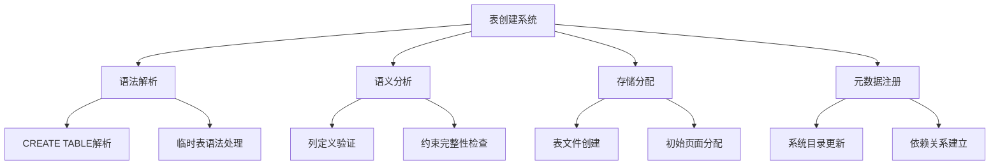
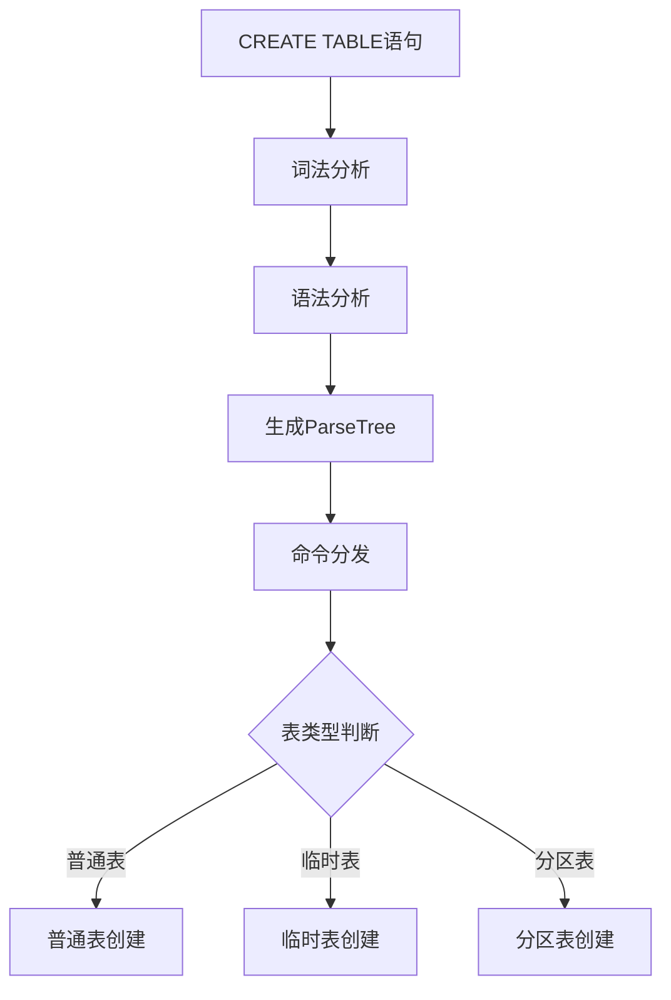
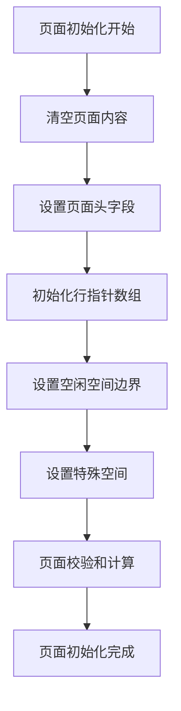
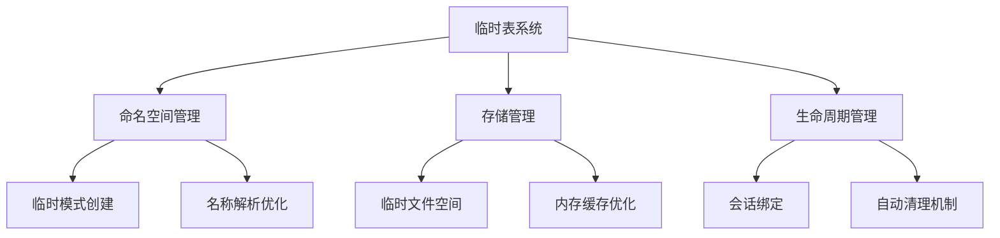
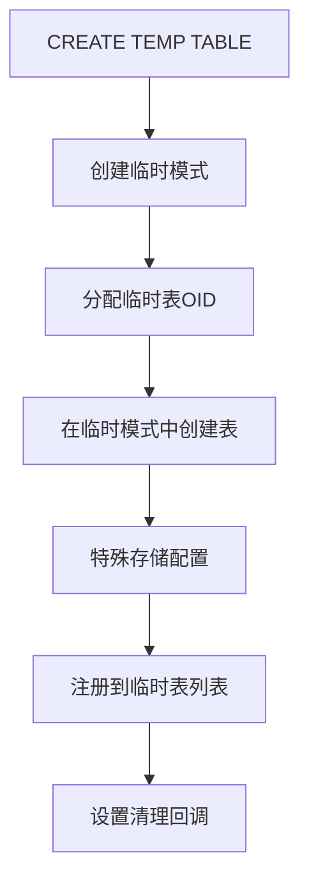
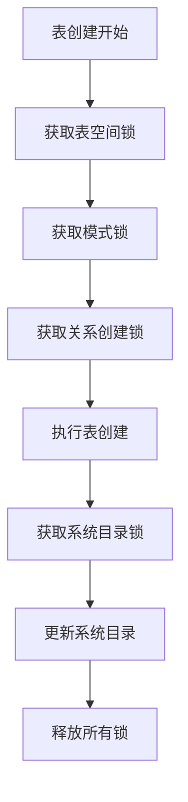
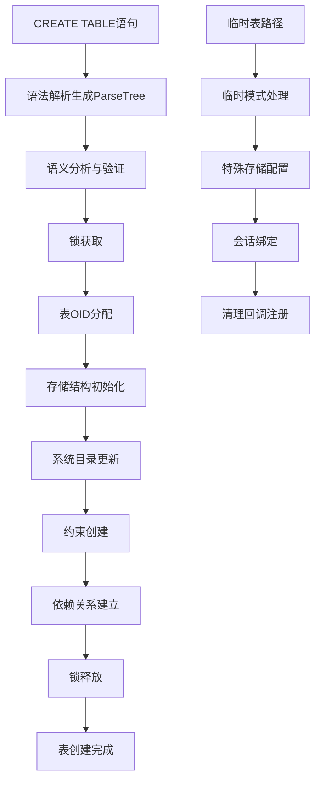

# 第19章 表的建立（包含临时表）

## 19.1 表创建概述

表的建立是数据库系统中最基础也是最核心的操作之一，它定义了数据的逻辑结构和物理存储方式。PostgreSQL提供了丰富的表创建选项，支持从简单的堆表到复杂的临时表、分区表等多种表类型，满足不同场景下的数据存储需求。

**表创建的核心功能**：
- **逻辑结构定义**：定义表的列结构、数据类型和约束
- **物理存储分配**：为表分配磁盘存储空间
- **元数据注册**：在系统目录中注册表定义信息
- **访问方法绑定**：为表绑定特定的存储和访问方法

**表创建系统架构**：


## 19.2 表创建流程解析

### 19.2.1 语法解析与命令分发

表创建命令首先经过语法解析，生成抽象语法树（AST）。

**关键代码位置**：`src/backend/parser/gram.y` 中的CREATE TABLE语法规则

**语法解析流程**：


**ParseTree关键结构**：
```c
typedef struct CreateStmt
{
    NodeTag     type;
    RangeVar   *relation;        // 表名信息
    List       *tableElts;       // 列定义列表
    List       *inhRelations;    // 继承关系
    List       *constraints;     // 约束列表
    List       *options;         // WITH选项
    OnCommitAction oncommit;     // 临时表提交行为
    char       *tablespacename;  // 表空间名
    bool        if_not_exists;   // IF NOT EXISTS标志
} CreateStmt;
```

### 19.2.2 语义分析与表定义验证

在语义分析阶段，系统验证表定义的完整性和正确性。

**关键代码位置**：`src/backend/commands/tablecmds.c` 中的 `DefineRelation` 函数

**语义验证内容**：
- **列定义验证**：数据类型存在性、长度限制检查
- **约束验证**：主键、外键、CHECK约束的语法正确性
- **继承关系验证**：父表存在性、列兼容性检查
- **权限验证**：当前用户有创建表的权限

**表定义验证流程**：
```c
// 表定义验证的简化逻辑
validate_table_definition(create_stmt):
    // 验证表名唯一性
    if 表名已存在 and !create_stmt->if_not_exists:
        报错("关系已存在")
    
    // 验证列定义
    for 每个列定义 in create_stmt->tableElts:
        if 列定义->数据类型不存在:
            报错("数据类型不存在")
        
        if 列定义->约束冲突:
            报错("约束定义冲突")
    
    // 验证约束
    for 每个约束 in create_stmt->constraints:
        if !约束可满足(约束):
            报错("约束无法满足")
    
    // 验证表空间权限
    if create_stmt->tablespacename != NULL:
        if !有表空间权限(当前用户, create_stmt->tablespacename):
            报错("表空间权限不足")
```

## 19.3 存储结构初始化

### 19.3.1 表文件创建

表创建过程中，系统为表分配物理存储文件。

**关键代码位置**：`src/backend/storage/smgr/smgr.c` 中的存储管理器接口

**表文件创建过程**：
1. **表OID分配**：为新建表分配唯一的OID
2. **文件路径计算**：根据表OID计算物理文件路径
3. **文件创建**：在存储系统中创建表的主文件
4. **初始页面初始化**：初始化表的第一个页面

**文件创建伪代码**：
```c
// 表文件创建的核心逻辑
create_relation_storage(表OID, 表空间OID):
    // 计算文件路径
    文件路径 = relpath(表空间OID, 表OID, 0)  // 主叉号0
    
    // 创建文件
    fd = 打开文件(文件路径, O_CREAT | O_EXCL | O_RDWR)
    if fd < 0:
        报错("无法创建表文件")
    
    // 初始化第一个页面
    页面 = 分配缓冲区()
    初始化页面(页面)
    写入页面到文件(fd, 页面)
    
    // 更新文件大小
    文件截断(fd, BLOCKSIZE)
    
    关闭文件(fd)
    
    // 注册到SMGR关系缓存
    smgropen(表OID)
```

### 19.3.2 初始页面初始化

新创建的表文件包含一个初始化的页面，包含基本的页面头信息。

**页面初始化过程**：


**关键代码位置**：`src/backend/storage/page/bufpage.c` 中的 `PageInit` 函数

**页面初始化代码**：
```c
void PageInit(Page page, Size pageSize, Size specialSize)
{
    PageHeader p = (PageHeader) page;
    
    // 清空页面
    memset(page, 0, pageSize);
    
    // 设置页面头
    p->pd_lsn = (XLogRecPtr) 0;
    p->pd_checksum = 0;
    p->pd_flags = 0;
    p->pd_lower = sizeof(PageHeaderData);
    p->pd_upper = pageSize - specialSize;
    p->pd_special = pageSize - specialSize;
    p->pd_pagesize_version = pageSize | PG_PAGE_LAYOUT_VERSION;
    
    // 如果有特殊空间，初始化之
    if (specialSize > 0)
        memset(page + p->pd_special, 0, specialSize);
}
```

## 19.4 系统目录更新

### 19.4.1 表元数据注册

表创建过程中，需要在多个系统目录中注册表的元数据信息。

**关键系统表更新**：
- **pg_class**：注册表的基本信息
- **pg_attribute**：注册表的列定义
- **pg_type**：为表的复合类型注册类型信息
- **pg_constraint**：注册表的约束信息

**关键代码位置**：`src/backend/catalog/heap.c` 中的 `AddNewRelationType` 和 `AddNewRelationTuple` 函数

**元数据注册流程**：
```c
// 表元数据注册的核心逻辑
register_relation_metadata(表OID, 表定义):
    // 在pg_class中插入记录
    pg_class_tuple = 构建pg_class元组(表OID, 表定义)
    CatalogTupleInsert(pg_class, pg_class_tuple)
    
    // 在pg_attribute中插入列定义
    for 每个列定义 in 表定义->列列表:
        pg_attribute_tuple = 构建pg_attribute元组(表OID, 列定义)
        CatalogTupleInsert(pg_attribute, pg_attribute_tuple)
    
    // 为表创建复合类型
    类型OID = AddNewRelationType(表名, 表OID)
    
    // 注册约束
    for 每个约束 in 表定义->约束列表:
        约束OID = 注册约束(表OID, 约束)
    
    // 建立依赖关系
    记录依赖关系(表OID, 使用的数据类型)
    记录依赖关系(表OID, 表空间)
```

### 19.4.2 依赖关系管理

表创建过程中建立完整的依赖关系，确保对象的正确管理和清理。

**依赖关系类型**：
- **数据类型依赖**：表列依赖的数据类型
- **表空间依赖**：表依赖的表空间
- **函数依赖**：CHECK约束和默认值使用的函数
- **操作符依赖**：表达式约束使用的操作符

**关键代码位置**：`src/backend/catalog/dependency.c` 中的依赖关系管理函数

## 19.5 临时表特殊处理

### 19.5.1 临时表架构设计

临时表具有特殊的生命周期和可见性规则，在实现上与普通表有显著差异。

**临时表特性**：
- **会话私有**：只在创建会话中可见
- **自动清理**：会话结束时自动删除
- **特殊命名空间**：使用特殊的临时表命名空间
- **优化存储**：可能使用内存或临时表空间

**临时表架构层次**：


### 19.5.2 临时表创建流程

临时表的创建过程包含特殊的初始化和配置步骤。

**关键代码位置**：`src/backend/commands/tablecmds.c` 中的 `create_temp_table` 函数

**临时表创建流程**：


**临时表创建伪代码**：
```c
// 临时表创建的核心逻辑
create_temp_table(create_stmt):
    // 确保临时模式存在
    temp_namespace = 获取或创建临时模式()
    
    // 在临时模式中创建表
    create_stmt->relation->schemaname = temp_namespace->名称
    表OID = DefineRelation(create_stmt)
    
    // 标记为临时表
    pg_class_tuple = 搜索pg_class(表OID)
    设置pg_class_tuple->relpersistence = RELPERSISTENCE_TEMP
    CatalogTupleUpdate(pg_class, &pg_class_tuple->t_self, pg_class_tuple)
    
    // 注册到会话临时表列表
    register_temp_relation(表OID)
    
    // 设置会话结束时的清理回调
    register_on_exit_cleanup(清理临时表, 表OID)
    
    return 表OID
```

### 19.5.3 临时表存储优化

临时表采用特殊的存储策略，优化性能和资源使用。

**存储优化策略**：
- **内存优先**：小临时表优先使用内存存储
- **本地临时文件**：使用会话私有临时文件空间
- **缓冲优化**：减少WAL日志和持久化开销

**关键代码位置**：`src/backend/access/heap/heapam.c` 中的临时表存储处理

## 19.6 表创建并发控制

### 19.6.1 锁机制

表创建过程中使用多级锁机制，确保并发安全性。

**锁层次结构**：
- **表空间锁**：保护表空间级别的操作
- **模式锁**：保护模式级别的并发访问
- **关系创建锁**：保护表创建过程的原子性
- **系统目录锁**：保护系统目录的并发更新

**锁获取顺序**：


### 19.6.2 并发创建处理

处理多个会话同时创建同名表的情况。

**并发处理策略**：
- **IF NOT EXISTS语义**：使用条件创建避免冲突
- **锁超时机制**：避免长时间等待锁
- **错误恢复**：在冲突时提供清晰的错误信息

**关键代码位置**：`src/backend/commands/tablecmds.c` 中的并发创建处理逻辑

## 19.7 表参数与选项处理

### 19.7.1 存储参数解析

表创建支持多种存储参数，影响表的物理存储行为。

**常用存储参数**：
- **fillfactor**：页面填充因子
- **parallel_workers**：并行工作进程数
- **toast_tuple_target**：TOAST阈值
- **autovacuum_enabled**：自动清理开关

**参数解析流程**：
```c
// 存储参数解析的简化逻辑
parse_reloptions(选项列表):
    选项表 = 初始化选项表()
    
    for 每个选项 in 选项列表:
        选项名 = 选项->defname
        选项值 = 选项->arg
        
        if 选项名 == "fillfactor":
            if 选项值 < 10 or 选项值 > 100:
                报错("fillfactor必须在10-100之间")
            选项表->fillfactor = 选项值
        
        else if 选项名 == "parallel_workers":
            if 选项值 < 0:
                报错("parallel_workers不能为负")
            选项表->parallel_workers = 选项值
        
        // 处理其他参数...
    
    return 选项表
```

### 19.7.2 表空间与存储配置

表创建时指定表空间和存储配置选项。

**表空间选择逻辑**：
- **显式指定**：使用TABLESPACE子句指定表空间
- **默认表空间**：使用数据库的默认表空间
- **临时表空间**：临时表使用临时表空间

**关键代码位置**：`src/backend/commands/tablespace.c` 中的表空间管理函数

## 19.8 表创建完整工作流

以下图表展示了表从SQL语句到完全创建的完整处理流程：



## 19.9 错误处理与回滚

### 19.9.1 创建失败处理

表创建过程中发生错误时的清理和回滚机制。

**错误处理策略**：
- **原子性保证**：创建过程要么完全成功，要么完全回滚
- **资源清理**：释放已分配的文件、内存资源
- **目录清理**：回滚已更新的系统目录项

**关键代码位置**：`src/backend/commands/tablecmds.c` 中的错误处理逻辑

### 19.9.2 事务安全创建

表创建操作在事务中执行，支持事务回滚。

**事务集成**：
- **DDL事务性**：表创建操作支持事务提交和回滚
- **子事务处理**：在子事务中创建表的错误处理
- **保存点支持**：支持在保存点后创建表

## 19.10 性能优化考量

### 19.10.1 批量表创建优化

处理大量表创建操作时的性能优化策略。

**优化技术**：
- **缓存预热**：预加载系统目录缓存
- **批量目录更新**：优化系统目录的批量插入
- **锁优化**：减少锁竞争和持有时间

### 19.10.2 模板表与快速克隆

基于模板表快速创建新表的优化机制。

**快速克隆条件**：
- 表结构完全相同
- 不需要数据复制
- 存储参数一致

**关键代码位置**：`src/backend/access/common/reloptions.c` 中的表克隆优化

## 19.11 本章小结

本章详细解析了PostgreSQL表建立的实现机制：

1. **完整的创建流程**：从语法解析到物理存储分配，表创建涉及多个子系统协同工作，确保表的逻辑和物理结构正确建立。

2. **丰富的表类型支持**：支持普通表、临时表、分区表等多种表类型，每种类型有特定的创建逻辑和优化策略。

3. **精细的存储管理**：表创建过程中涉及表空间选择、文件分配、页面初始化等存储层操作，为数据存储奠定基础。

4. **完善的元数据管理**：在系统目录中完整注册表定义、列信息、约束和依赖关系，支持系统的运行时管理。

5. **临时表的特殊处理**：临时表具有特殊的生命周期、命名空间和存储策略，在实现上与普通表有显著差异。

6. **强大的并发控制**：通过多级锁机制确保表创建过程的并发安全性，支持高并发环境下的表管理。

7. **灵活的参数配置**：支持多种存储参数和选项，允许根据具体需求优化表的存储和行为特性。

8. **可靠的事务支持**：表创建操作完全事务化，支持错误回滚和资源清理，确保系统一致性。

表的建立是数据库系统的基础操作，其实现质量直接影响到数据的存储效率和管理便利性。理解表创建的实现机制对于数据库设计、性能调优和系统运维具有重要意义。在下一章中，我们将探讨Vacuum与autovacuum机制的实现原理。