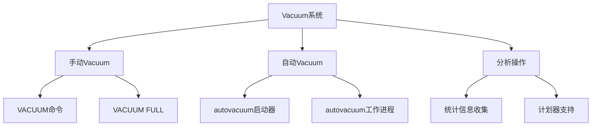
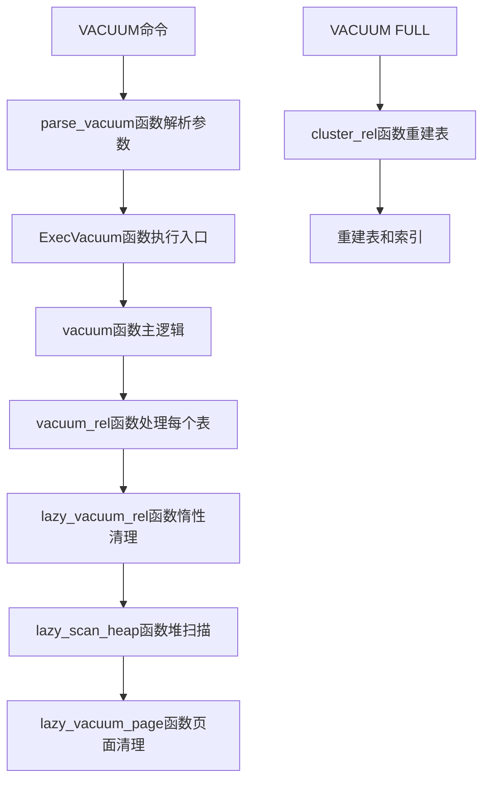
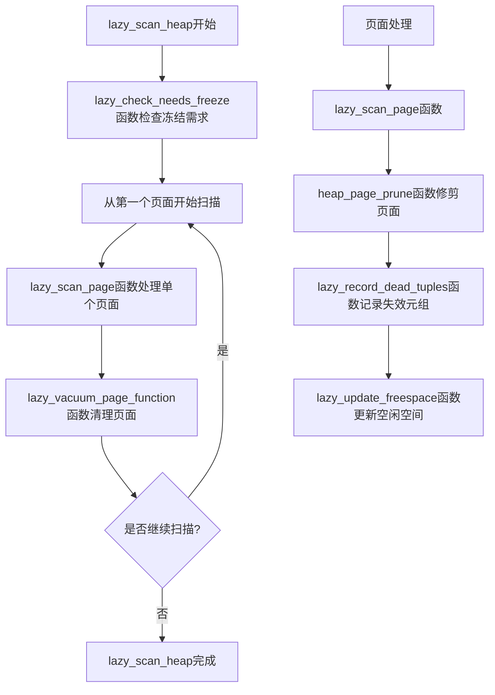
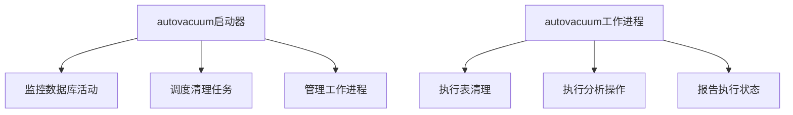
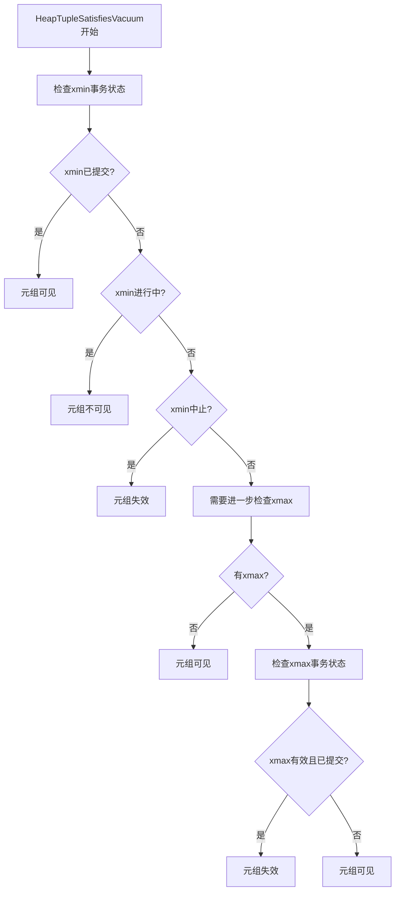
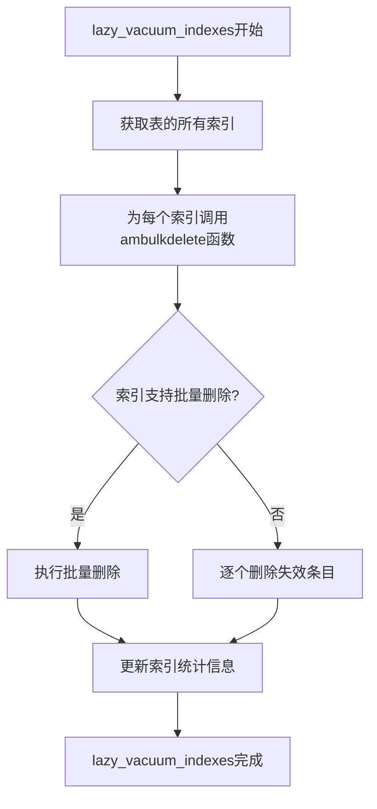
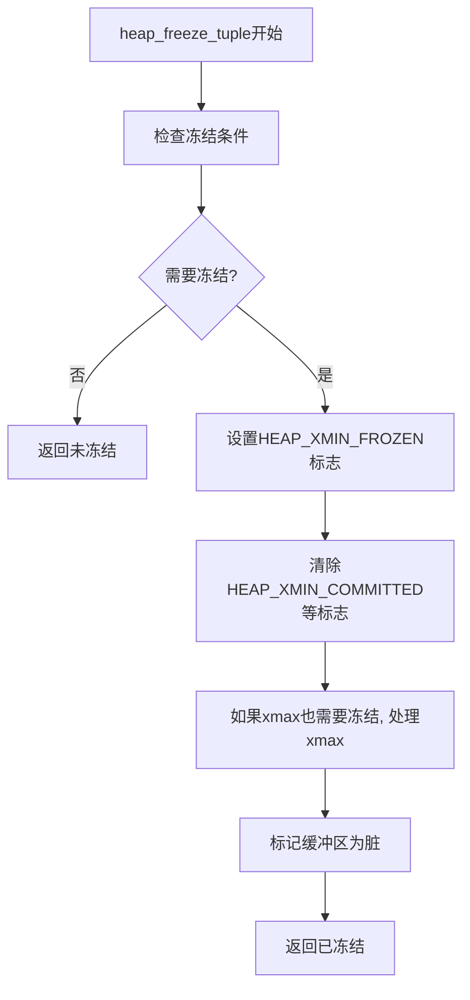
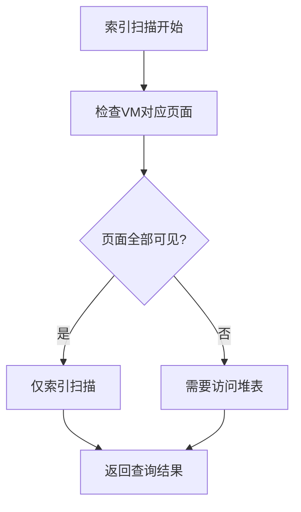
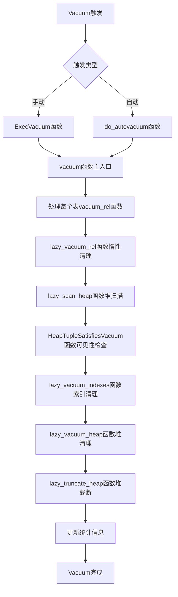

# 第20章 Vacuum与autovacuum

## 20.1 Vacuum机制概述

Vacuum是PostgreSQL中维护数据库性能和稳定性的核心机制，它负责清理失效的元组、更新统计信息、冻结事务ID等重要任务。autovacuum作为自动化版本，通过后台进程自动执行这些维护操作，确保数据库长期运行的效率和数据完整性。

**Vacuum的核心功能**：
- **空间回收**：清理MVCC产生的失效元组，回收可用空间
- **事务ID冻结**：防止事务ID回卷导致的数据库宕机
- **统计信息更新**：更新pg_statistic系统表，为优化器提供准确信息
- **可见性映射维护**：更新VM文件，加速仅索引扫描

**Vacuum系统架构**：


## 20.2 手动Vacuum实现

### 20.2.1 Vacuum命令处理流程

手动Vacuum命令经过完整的SQL处理流程，最终调用底层清理函数。

**关键代码位置**：`src/backend/commands/vacuum.c` 中的 `ExecVacuum` 函数

**Vacuum命令处理流程**：


**Vacuum参数解析**：
```c
// parse_vacuum函数简化逻辑
VacuumStmt *parse_vacuum(原始参数):
    vacuum_stmt = 分配VacuumStmt内存()
    
    // 解析选项
    for 每个选项 in 原始参数:
        if 选项 == "FULL":
            vacuum_stmt->options |= VACOPT_FULL
        else if 选项 == "FREEZE":
            vacuum_stmt->options |= VACOPT_FREEZE
        else if 选项 == "VERBOSE":
            vacuum_stmt->options |= VACOPT_VERBOSE
        else if 选项 == "ANALYZE":
            vacuum_stmt->options |= VACOPT_ANALYZE
        // 其他选项处理...
    
    return vacuum_stmt
```

### 20.2.2 堆关系Vacuum核心逻辑

堆表的Vacuum过程通过多阶段扫描和清理实现空间回收。

**关键代码位置**：`src/backend/access/heap/vacuumlazy.c` 中的 `lazy_vacuum_rel` 函数

**堆Vacuum工作流程**：
```c
// lazy_vacuum_rel函数核心逻辑
lazy_vacuum_rel(关系, 参数, 缓冲区策略):
    // 初始化vacuum状态
    vacrel = lazy_vacuum_init(关系, 参数)
    
    // 第一阶段：扫描堆，收集失效元组
    lazy_scan_heap(vacrel)
    
    // 第二阶段：清理索引
    lazy_vacuum_indexes(vacrel)
    
    // 第三阶段：清理堆
    lazy_vacuum_heap(vacrel)
    
    // 第四阶段：截断末端空页面
    lazy_truncate_heap(vacrel)
    
    // 更新统计信息
    lazy_update_stats(vacrel)
    
    // 清理资源
    lazy_vacuum_cleanup(vacrel)
```

### 20.2.3 堆扫描与失效元组收集

扫描堆页面，识别并记录失效的元组。

**关键代码位置**：`src/backend/access/heap/vacuumlazy.c` 中的 `lazy_scan_heap` 函数

**堆扫描流程**：


**页面处理核心逻辑**：
```c
// lazy_scan_page函数简化实现
static void lazy_scan_page(LVRelState *vacrel, BlockNumber blkno, Buffer buffer)
{
    Page page = BufferGetPage(buffer);
    
    // 修剪页面，移除HOT链失效部分
    heap_page_prune(关系, buffer, vacrel->oldest_xmin, false);
    
    // 扫描页面中的每个元组
    for 每个行指针 in 页面:
        if 行指针状态 == LP_NORMAL:
            元组 = 获取元组指针(页面, 行指针)
            
            // 检查元组可见性
            if !HeapTupleSatisfiesVacuum(元组, vacrel->oldest_xmin, buffer):
                // 记录失效元组
                lazy_record_dead_tuple(vacrel, 元组->t_ctid)
    
    // 更新页面空闲空间信息
    lazy_update_freespace(vacrel, blkno, 页面空闲空间)
}
```

## 20.3 autovacuum自动维护

### 20.3.1 autovacuum架构设计

autovacuum由启动器进程和工作进程组成，实现自动化的数据库维护。

**关键代码位置**：
- `src/backend/postmaster/autovacuum.c` - autovacuum启动器
- `src/backend/commands/autovacuum.c` - autovacuum工作逻辑

**autovacuum进程架构**：


### 20.3.2 autovacuum启动器

启动器进程负责监控数据库状态并决定何时启动清理操作。

**关键代码位置**：`src/backend/postmaster/autovacuum.c` 中的 `AutoVacLauncherMain` 函数

**启动器主循环**：
```c
// AutoVacLauncherMain函数主循环
AutoVacLauncherMain():
    // 初始化
    AutoVacLauncherInit()
    
    while true:
        // 计算下一次唤醒时间
        sleep_time = autovac_launcher_calculate_sleep()
        
        // 等待信号或超时
        WaitLatch(MyLatch, WL_LATCH_SET | WL_TIMEOUT, sleep_time)
        
        // 检查是否需要处理
        if 有挂起的autovacuum请求 or 达到调度时间:
            // 分析数据库状态
            tables = autovac_launcher_analyze_database()
            
            // 为需要清理的表创建工作进程
            for 每个需要清理的表 in tables:
                if 工作进程数 < autovac_max_workers:
                    autovac_launcher_start_worker(表信息)
```

### 20.3.3 autovacuum决策逻辑

autovacuum基于表的活动统计信息决定是否需要进行清理。

**关键代码位置**：`src/backend/postmaster/autovacuum.c` 中的 `table_recheck_autovac` 函数

**清理决策算法**：
```c
// table_recheck_autovac函数决策逻辑
bool table_recheck_autovac(表OID):
    // 获取表统计信息
    stats = pgstat_fetch_stat_tabentry(表OID)
    
    if stats == NULL:
        return false
    
    // 计算失效元组数量
    dead_tuples = stats->n_dead_tuples
    total_tuples = stats->n_live_tuples + dead_tuples
    
    if total_tuples == 0:
        return false
    
    // 计算失效元组比例
    dead_tuple_ratio = (float)dead_tuples / total_tuples
    
    // 获取autovacuum配置参数
    threshold = 获取autovacuum_vacuum_threshold(表OID)
    scale_factor = 获取autovacuum_vacuum_scale_factor(表OID)
    
    // 应用决策公式
    vacuum_needed = (dead_tuples > threshold + scale_factor * total_tuples)
    
    // 检查事务年龄，决定是否需要冻结
    freeze_needed = 检查事务年龄是否需要冻结(表OID)
    
    return vacuum_needed OR freeze_needed
```

## 20.4 Vacuum核心操作详解

### 20.4.1 元组可见性检查

Vacuum通过事务ID比较确定元组是否对当前事务可见。

**关键代码位置**：`src/backend/access/heap/heapam_visibility.c` 中的 `HeapTupleSatisfiesVacuum` 函数

**可见性检查状态机**：


### 20.4.2 页面修剪与空间回收

修剪页面中的失效行指针，回收可用空间。

**关键代码位置**：`src/backend/access/heap/pruneheap.c` 中的 `heap_page_prune` 函数

**页面修剪流程**：
```c
// heap_page_prune函数核心逻辑
heap_page_prune(关系, 缓冲区, oldest_xmin, 报告统计):
    page = BufferGetPage(缓冲区)
    
    // 检查页面是否需要修剪
    if !page_needs_pruning(page, oldest_xmin):
        return 0
    
    // 初始化修剪状态
    prstate = heap_page_prune_init(关系, 缓冲区, oldest_xmin)
    
    // 收集可修剪的元组
    heap_page_prune_collect(prstate)
    
    // 执行实际修剪
    ndeleted = heap_page_prune_execute(prstate)
    
    // 更新页面头信息
    if ndeleted > 0:
        PageRepairFragmentation(page)
        MarkBufferDirty(缓冲区)
    
    // 报告统计信息
    if 报告统计:
        pgstat_report_prune(关系, ndeleted)
    
    return ndeleted
```

### 20.4.3 索引清理与维护

清理索引中指向失效元组的条目。

**关键代码位置**：`src/backend/access/heap/vacuumlazy.c` 中的 `lazy_vacuum_indexes` 函数

**索引清理策略**：


## 20.5 事务ID冻结机制

### 20.5.1 冻结原理与必要性

防止事务ID回卷导致数据库不可用，是Vacuum的关键安全功能。

**关键代码位置**：`src/backend/access/heap/vacuumlazy.c` 中的 `lazy_scan_heap` 冻结相关部分

**冻结决策逻辑**：
```c
// 冻结决策的简化逻辑
freeze_tuple_decision(元组, 关系, 冻结参数):
    // 获取元组的事务年龄
    xmin_age = 当前事务ID - 元组->t_xmin
    xmax_age = 当前事务ID - 元组->t_xmax
    
    // 检查是否需要冻结
    need_freeze = false
    if xmin_age > freeze_max_age OR xmax_age > freeze_max_age:
        need_freeze = true
    else if 元组->t_infomask & HEAP_XMIN_FROZEN:
        // 已经冻结，无需处理
        need_freeze = false
    else:
        // 基于其他启发式规则决定
        need_freeze = 其他冻结启发式规则(元组, 冻结参数)
    
    return need_freeze
```

### 20.5.2 冻结操作实现

实际执行元组冻结，标记事务ID为永久可见。

**关键代码位置**：`src/backend/access/heap/freeze.c` 中的 `heap_freeze_tuple` 函数

**冻结操作流程**：


## 20.6 可见性映射维护

### 20.6.1 VM文件作用与结构

可见性映射记录哪些页面只包含对所有事务可见的元组。

**关键代码位置**：`src/backend/access/heap/visibilitymap.c` 中的VM相关函数

**VM位图含义**：
- **位0（全部可见）**：页面所有元组对所有事务可见
- **位1（全部冻结）**：页面所有元组已冻结

**VM设置逻辑**：
```c
// visibilitymap_set函数简化逻辑
visibilitymap_set(关系, 块号, 缓冲区, 事务ID, 标志):
    // 获取VM页面
    vm_page = visibilitymap_get_page(关系, 块号)
    
    // 计算位图位置
    map_byte = 块号 / MAPSIZE
    map_bit = 块号 % MAPSIZE
    
    // 设置相应标志位
    if 标志 & VISIBILITYMAP_ALL_VISIBLE:
        vm_page[map_byte] |= (1 << map_bit)
    
    if 标志 & VISIBILITYMAP_ALL_FROZEN:
        vm_page[map_byte] |= (2 << map_bit)  // 第二个位
    
    // 标记VM页面为脏
    MarkBufferDirty(vm_buffer)
```

### 20.6.2 VM在查询优化中的应用

VM加速仅索引扫描和Vacuum操作。

**VM优化查询流程**：


## 20.7 autovacuum配置与调优

### 20.7.1 关键配置参数

autovacuum行为由多个配置参数控制。

**主要配置参数**：
- **autovacuum_vacuum_threshold**：触发Vacuum的最小失效元组数
- **autovacuum_vacuum_scale_factor**：触发Vacuum的失效元组比例
- **autovacuum_vacuum_cost_delay**：Vacuum成本延迟
- **autovacuum_vacuum_cost_limit**：Vacuum成本限制
- **autovacuum_freeze_max_age**：触发冻结的最大事务年龄

### 20.7.2 成本限制机制

防止Vacuum对正常业务操作造成过多影响。

**关键代码位置**：`src/backend/storage/ipc/shm_mq.c` 中的成本延迟逻辑

**成本计算与延迟**：
```c
// 成本限制的简化逻辑
vacuum_cost_delay_loop(成本计数):
    // 检查是否达到成本限制
    if 成本计数 >= vacuum_cost_limit:
        // 计算延迟时间
        delay_ms = vacuum_cost_delay
        
        // 应用延迟
        pg_usleep(delay_ms * 1000L)
        
        // 重置成本计数
        成本计数 = 0
    
    return 成本计数
```

## 20.8 Vacuum完整工作流

以下图表展示了Vacuum从触发到完成的完整处理流程：



## 20.9 特殊场景处理

### 20.9.1 系统目录Vacuum

系统目录表需要特殊的Vacuum处理策略。

**系统目录特殊性**：
- 频繁更新但数据量相对较小
- 需要更激进的冻结策略
- 对数据库正常运行至关重要

**关键代码位置**：`src/backend/commands/vacuum.c` 中的系统目录特殊处理

### 20.9.2 大表分阶段Vacuum

对于超大表，Vacuum可能分阶段执行以避免长时间锁表。

**分阶段策略**：
- 按页面范围分批处理
- 定期释放锁让其他操作进行
- 维护进度状态支持恢复

## 20.10 监控与诊断

### 20.10.1 Vacuum进度监控

PostgreSQL提供Vacuum进度报告功能。

**关键代码位置**：`src/backend/commands/progress.c` 中的进度报告

**进度信息包含**：
- 已扫描页面数
- 已清理失效元组数
- 剩余预计时间
- 当前处理阶段

### 20.10.2 常见问题诊断

Vacuum可能遇到的各种问题及诊断方法。

**常见问题**：
- **Vacuum停滞**：检查锁冲突和成本限制
- **冻结失败**：检查事务年龄和冻结配置
- **空间不回收**：检查HOT链和索引状态

## 20.11 本章小结

本章详细解析了PostgreSQL Vacuum与autovacuum机制的实现：

1. **完整的清理流程**：Vacuum通过多阶段处理，包括堆扫描、索引清理、空间回收等步骤，确保数据库空间的有效利用。

2. **智能的自动化机制**：autovacuum基于表的活动统计自动决策清理时机，平衡维护开销和性能需求。

3. **关键的安全功能**：事务ID冻结机制防止事务回卷，确保数据库长期运行的稳定性。

4. **性能优化基础设施**：可见性映射等机制加速查询执行，减少不必要的堆表访问。

5. **资源控制机制**：成本限制和延迟机制防止Vacuum对正常业务操作造成过大影响。

6. **完善的监控支持**：进度报告和统计信息为管理员提供充分的监控和诊断能力。

Vacuum机制是PostgreSQL保持高性能和稳定性的基石，其设计体现了数据库系统在资源管理、并发控制和自动化运维方面的深度思考。理解Vacuum的实现机制对于数据库性能调优、容量规划和故障诊断具有重要意义。在下一章中，我们将探讨PostgreSQL的段页式存储架构。