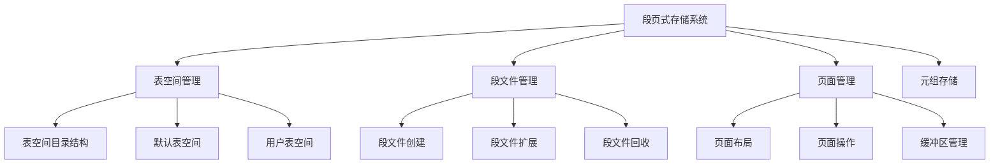
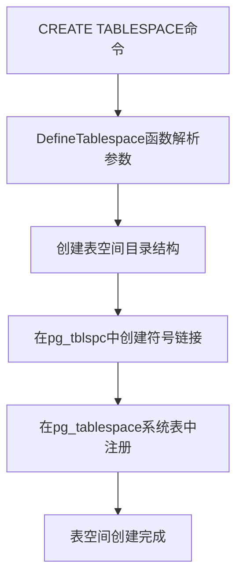
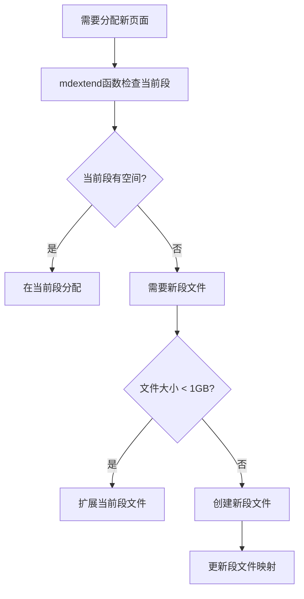
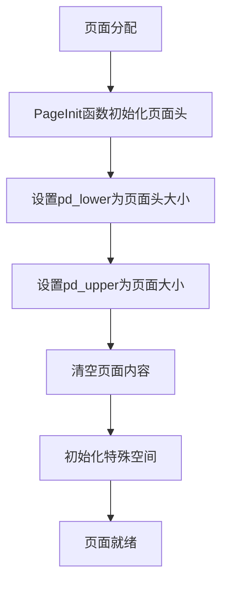
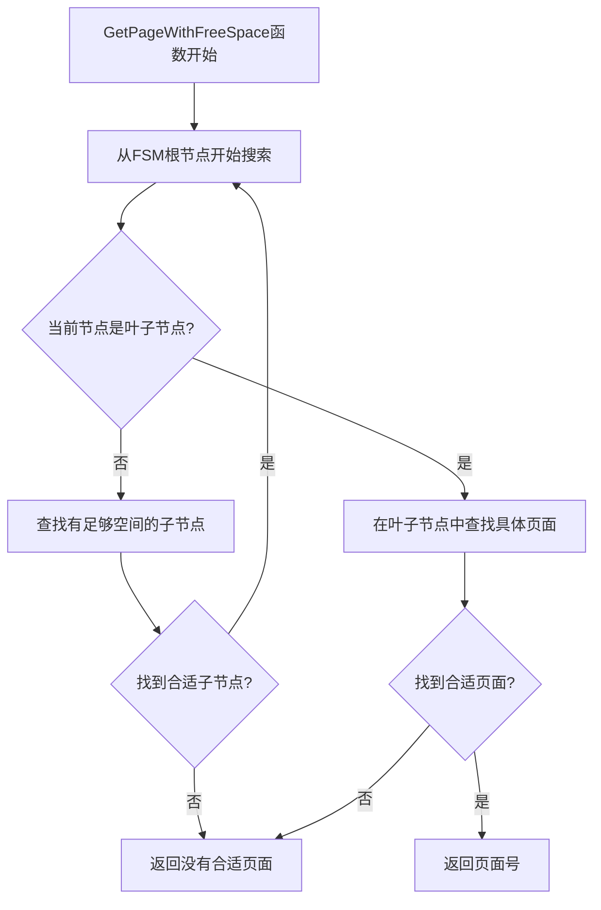
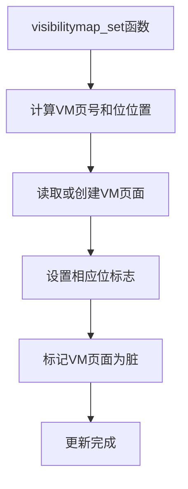
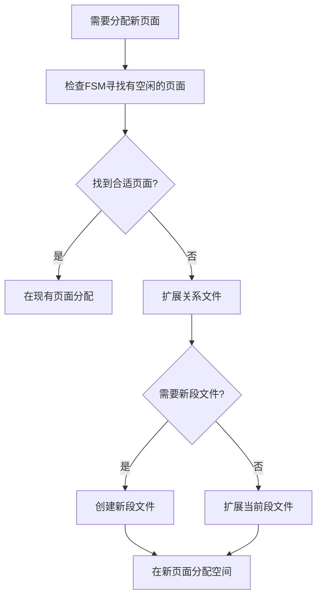
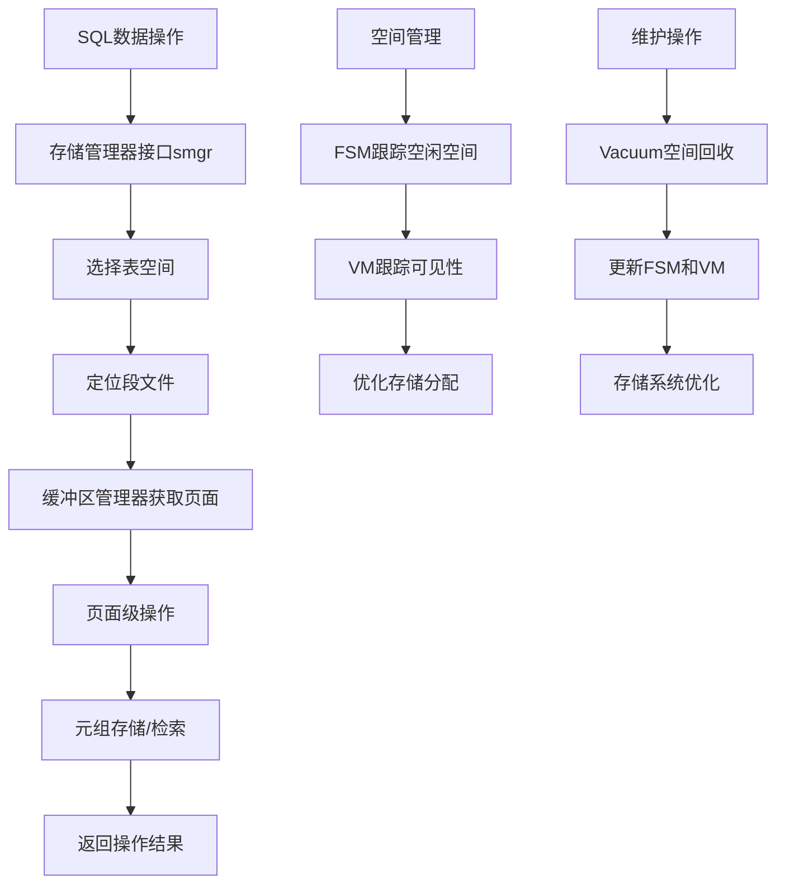
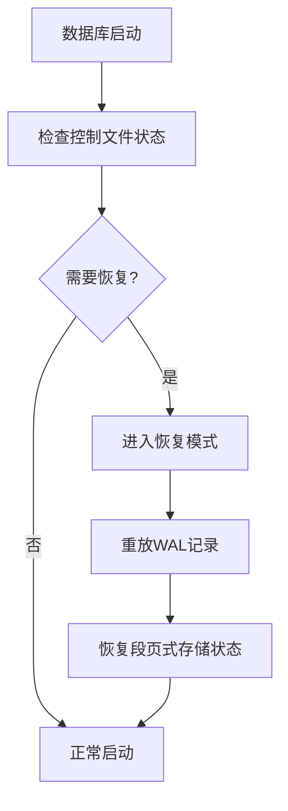

# 第21章 PG段页式存储

## 21.1 段页式存储概述

PostgreSQL采用经典的段页式存储架构，将物理存储组织为多个层次，实现高效的空间管理和数据访问。这种架构平衡了存储效率、性能和管理复杂度，为数据库的稳定运行提供坚实的基础存储设施。

**段页式存储的核心层次**：
- **表空间**：逻辑存储容器，映射到物理目录
- **段**：对应单个物理文件，存储特定关系的数据
- **页**：固定大小的存储单元，PostgreSQL的基本I/O单位
- **元组**：页内的实际数据记录

**段页式存储架构**：


## 21.2 表空间管理

### 21.2.1 表空间架构设计

表空间是PostgreSQL中最高层次的存储抽象，将逻辑数据库对象映射到物理文件系统。

**关键代码位置**：`src/backend/commands/tablespace.c` 中的表空间管理函数

**表空间目录结构**：
```
pg_tblspc/
├── 12345/                    # 表空间OID链接
│   └── PG_14_201909291/      # 数据库版本目录
│       └── 16384/           # 数据库OID
│           ├── 12346        # 关系文件
│           └── 12347_fsm    # 空闲空间映射文件
└── 12348/
    └── ...
```

**表空间创建流程**：


### 21.2.2 表空间操作实现

表空间支持创建、删除、修改等多种管理操作。

**关键代码位置**：`src/backend/commands/tablespace.c` 中的 `CreateTableSpace` 函数

**表空间创建核心逻辑**：
```c
// CreateTableSpace函数简化实现
Oid CreateTableSpace(表空间名, 所有者OID, 位置, 选项):
    // 权限检查
    if !超级用户权限(当前用户):
        ereport(ERROR, (errcode(ERRCODE_INSUFFICIENT_PRIVILEGE),
                        errmsg("只有超级用户可以创建表空间")));
    
    // 验证位置参数
    if !验证目录可访问(位置):
        ereport(ERROR, (errcode(ERRCODE_OBJECT_NOT_IN_PREREQUISITE_STATE),
                        errmsg("表空间位置不可访问")));
    
    // 分配表空间OID
    表空间OID = GetNewOidWithIndex(...);
    
    // 创建表空间目录结构
    创建表空间目录(表空间OID, 位置);
    
    // 在系统目录中注册
    InsertTablespaceTuple(表空间OID, 表空间名, 所有者OID, 位置);
    
    // 创建默认表空间设置
    CreateTableSpaceOptions(表空间OID, 选项);
    
    return 表空间OID;
```

## 21.3 段文件管理

### 21.3.1 段文件组织策略

PostgreSQL将大表分割为多个段文件，每个文件最大1GB，避免文件系统对单个文件大小的限制。

**关键代码位置**：`src/backend/storage/smgr/md.c` 中的段文件管理

**段文件命名规则**：
- **主段文件**：`${relfilenode}`
- **扩展段文件**：`${relfilenode}.1`、`${relfilenode}.2`、...
- **特殊文件**：`${relfilenode}_fsm`（空闲空间映射）、`${relfilenode}_vm`（可见性映射）

**段文件扩展决策**：


### 21.3.2 段文件操作

段文件的创建、扩展和删除操作。

**关键代码位置**：`src/backend/storage/smgr/md.c` 中的 `mdcreate`、`mdextend` 函数

**段文件创建逻辑**：
```c
// mdcreate函数简化实现
void mdcreate(SMgrRelation reln, ForkNumber forknum, bool isRedo)
{
    // 构建文件路径
    FilePath = relpath(reln->smgr_rnode, forknum);
    
    // 创建文件
    fd = PathNameOpenFile(FilePath, O_RDWR | O_CREAT | O_EXCL | PG_BINARY);
    
    if (fd < 0)
        ereport(ERROR, (errcode_for_file_access(),
                        errmsg("无法创建文件 \"%s\": %m", FilePath)));
    
    // 如果是主数据叉，初始化第一个页面
    if (forknum == MAIN_FORKNUM)
    {
        Page page = (Page) palloc(BLCKSZ);
        PageInit(page, BLCKSZ, 0);
        write(fd, page, BLCKSZ);
        pfree(page);
    }
    
    // 关闭文件
    FileClose(fd);
}
```

## 21.4 页面管理机制

### 21.4.1 页面布局与结构

页面是PostgreSQL中最基本的I/O单位，采用固定的8KB大小。

**关键代码位置**：`src/include/storage/bufpage.h` 中的页面结构定义

**页面内存布局**：
```c
typedef struct PageHeaderData
{
    PageXLogRecPtr pd_lsn;        /* LSN: 最后修改的日志序列号 */
    uint16        pd_checksum;    /* 页面校验和 */
    uint16        pd_flags;       /* 标志位 */
    LocationIndex pd_lower;       /* 行指针数组结束位置 */
    LocationIndex pd_upper;       /* 空闲空间开始位置 */
    LocationIndex pd_special;     /* 特殊空间开始位置 */
    uint16        pd_pagesize_version;  /* 页面大小和版本 */
    TransactionId pd_prune_xid;   /* 可修剪的最老XID */
} PageHeaderData;
```

**页面初始化流程**：


### 21.4.2 页面操作接口

页面支持各种操作，包括空间分配、元组插入、页面压缩等。

**关键代码位置**：`src/backend/storage/page/bufpage.c` 中的页面操作函数

**页面空间分配逻辑**：
```c
// PageGetFreeSpace函数空间计算
Size PageGetFreeSpace(Page page)
{
    Size lower = ((PageHeader) page)->pd_lower;
    Size upper = ((PageHeader) page)->pd_upper;
    
    // 可用空间 = 上下边界之间的空间
    if (lower > upper)
        return 0;
    
    return (upper - lower);
}

// PageAddItem函数元组插入
OffsetNumber PageAddItem(Page page, Item item, Size size,
                        OffsetNumber offsetNumber, bool overwrite)
{
    // 检查空间是否足够
    if (PageGetFreeSpace(page) < size)
        return InvalidOffsetNumber;
    
    // 分配行指针
    if (offsetNumber == InvalidOffsetNumber)
        offsetNumber = PageGetMaxOffsetNumber(page) + 1;
    
    // 在空闲空间分配元组存储
    tupleLocation = page + ((PageHeader) page)->pd_upper - size;
    memcpy(tupleLocation, item, size);
    
    // 更新行指针
    linePointer = PageGetItemId(page, offsetNumber);
    ItemIdSetNormal(linePointer, tupleLocation - page, size);
    
    // 更新页面边界
    ((PageHeader) page)->pd_lower += sizeof(ItemIdData);
    ((PageHeader) page)->pd_upper -= size;
    
    return offsetNumber;
}
```

## 21.5 空闲空间映射

### 21.5.1 FSM架构设计

空闲空间映射跟踪关系中每个页面的空闲空间情况，优化空间分配。

**关键代码位置**：`src/backend/storage/freespace/freespace.c` 中的FSM管理

**FSM树形结构**：
```
FSM页面层次:
- 叶子节点: 直接记录每个页面的空闲空间
- 中间节点: 记录子树的最大空闲空间  
- 根节点: 整个关系的最大空闲空间
```

**FSM搜索算法**：


### 21.5.2 FSM页面结构

FSM使用特殊的页面结构高效存储空间信息。

**关键代码位置**：`src/include/storage/fsm_internals.h` 中的FSM内部结构

**FSM页面格式**：
```c
typedef struct FSMPageData
{
    uint32 fp_next_slot;     /* 下一次搜索开始的槽位 */
    uint8 fp_nodes[1];       /* 节点数组 */
} FSMPageData;

// FSM节点计算宏
#define FSM_TREE_DEPTH (SlotsPerFSMPage >= 162 ? 3 : 2)
#define FSM_ROOT_LEVEL (FSM_TREE_DEPTH - 1)
#define FSM_BOTTOM_LEVEL 0
```

**FSM空间记录函数**：
```c
// RecordPageWithFreeSpace函数更新FSM
void RecordPageWithFreeSpace(关系, 页号, 空闲空间)
{
    // 计算FSM页号和槽位
    fsm_page = 页号 / SlotsPerFSMPage;
    slot = 页号 % SlotsPerFSMPage;
    
    // 读取或创建FSM页面
    fsm_buffer = ReadBuffer(关系, FSM_FORKNUM, fsm_page);
    
    // 更新槽位值
    fsm_page_data = (FSMPageData *) PageGetContents(BufferGetPage(fsm_buffer));
    fsm_page_data->fp_nodes[slot] = 空闲空间 > 255 ? 255 : 空闲空间;
    
    // 向上传播更新
    fsm_page_data = 更新FSM树父节点(fsm_page_data, slot);
    
    MarkBufferDirty(fsm_buffer);
    UnlockReleaseBuffer(fsm_buffer);
}
```

## 21.6 可见性映射

### 21.6.1 VM架构与作用

可见性映射记录哪些页面只包含对所有事务可见的元组，优化Vacuum和仅索引扫描。

**关键代码位置**：`src/backend/access/heap/visibilitymap.c` 中的VM管理

**VM位图含义**：
- **位0**：页面所有元组对所有事务可见（ALL_VISIBLE）
- **位1**：页面所有元组已冻结（ALL_FROZEN）

**VM设置流程**：


### 21.6.2 VM优化查询

VM在查询执行中提供重要的优化机会。

**关键代码位置**：`src/backend/access/index/indexam.c` 中的索引扫描优化

**仅索引扫描决策**：
```c
// 仅索引扫描检查逻辑
bool check_index_only(关系, 索引, 位图):
    // 检查索引是否包含所有需要的列
    if !index_covering_query(索引, 查询列):
        return false;
    
    // 检查VM中对应页面是否全部可见
    for 每个索引元组 in 位图:
        堆页面 = 索引元组->堆页面;
        if !VM_ALL_VISIBLE(关系, 堆页面):
            return false;  // 需要访问堆表
    
    return true;  // 可以执行仅索引扫描
```

## 21.7 存储管理器

### 21.7.1 存储管理器架构

存储管理器是段页式存储的核心组件，负责所有底层存储操作。

**关键代码位置**：`src/backend/storage/smgr/smgr.c` 中的存储管理器接口

**存储管理器接口**：
```c
typedef struct f_smgr
{
    void (*smgr_init) (void);                    /* 初始化 */
    void (*smgr_shutdown) (void);               /* 关闭 */
    void (*smgr_create) (SMgrRelation reln,     /* 创建关系 */
                        ForkNumber forknum,
                        bool isRedo);
    bool (*smgr_exists) (SMgrRelation reln,     /* 检查存在 */
                        ForkNumber forknum);
    void (*smgr_unlink) (RelFileNodeBackend rnode, /* 删除关系 */
                        ForkNumber forknum,
                        bool isRedo);
    void (*smgr_extend) (SMgrRelation reln,     /* 扩展关系 */
                        ForkNumber forknum,
                        BlockNumber blocknum,
                        char *buffer,
                        bool skipFsync);
    // ... 其他操作
} f_smgr;
```

### 21.7.2 多版本存储支持

存储管理器支持表的多版本存储，包括主数据、空闲空间映射、可见性映射等。

**存储叉类型**：
```c
typedef enum ForkNumber
{
    MAIN_FORKNUM = 0,        /* 主数据叉 */
    FSM_FORKNUM,            /* 空闲空间映射 */
    VISIBILITYMAP_FORKNUM,  /* 可见性映射 */
    INIT_FORKNUM            /* 初始化叉 */
} ForkNumber;
```

## 21.8 空间分配与回收

### 21.8.1 空间分配策略

PostgreSQL采用多种策略优化空间分配性能。

**空间分配算法**：


### 21.8.2 空间回收机制

Vacuum过程中回收的空间通过FSM重新可用。

**空间回收流程**：
```c
// 空间回收的简化逻辑
vacuum_space_reclaim(关系, 页号, 回收空间):
    // 更新FSM记录
    RecordPageWithFreeSpace(关系, 页号, 回收空间);
    
    // 如果页面完全空闲，考虑截断
    if 页面完全空闲(关系, 页号):
        // 检查是否在关系末尾
        if 页号 == 关系最后页面:
            // 可以截断关系文件
            RelationTruncate(关系, 页号);
```

## 21.9 存储系统完整工作流

以下图表展示了从SQL操作到底层存储的完整处理流程：



## 21.10 性能优化策略

### 21.10.1 预分配与批量扩展

减少文件扩展操作的开销。

**关键代码位置**：`src/backend/storage/smgr/md.c` 中的 `mdextend` 函数

**批量扩展优化**：
```c
// 批量扩展的简化逻辑
bulk_extend_relation(关系, 需要页面数):
    // 计算需要扩展的大小
    当前大小 = RelationGetNumberOfBlocks(关系);
    目标大小 = 当前大小 + 需要页面数;
    
    // 一次性扩展多个页面
    while 当前大小 < 目标大小:
        // 每次扩展多个页面，减少系统调用
        扩展数量 = min(目标大小 - 当前大小, 批量扩展大小);
        mdextend(关系, MAIN_FORKNUM, 当前大小, 扩展数量);
        当前大小 += 扩展数量;
```

### 21.10.2 存储参数优化

通过表级存储参数优化存储行为。

**重要存储参数**：
- **fillfactor**：控制页面填充率
- **autovacuum_vacuum_scale_factor**：Vacuum触发阈值
- **toast_tuple_target**：TOAST线外存储阈值

## 21.11 故障恢复与持久化

### 21.11.1 写前日志集成

段页式存储与WAL紧密集成，确保数据持久性。

**关键代码位置**：`src/backend/access/transam/xlog.c` 中的WAL记录

**页面写入的WAL集成**：
```c
// 页面写入的WAL保护
Buffer buffer = ReadBuffer(关系, 页号);
START_CRIT_SECTION();
// 修改页面内容
MarkBufferDirty(buffer);
// 记录WAL
XLogBeginInsert();
XLogRegisterBuffer(0, buffer, REGBUF_STANDARD);
XLogInsert(RM_HEAP_ID, XLOG_HEAP_INSERT);
END_CRIT_SECTION();
```

### 21.11.2 崩溃恢复

系统崩溃后通过WAL重做恢复存储一致性。

**恢复流程**：


## 21.12 本章小结

本章详细解析了PostgreSQL段页式存储架构的实现机制：

1. **层次化存储管理**：通过表空间、段、页、元组的多层次抽象，实现灵活高效的存储管理。

2. **智能的空间分配**：FSM机制跟踪页面空闲空间，优化数据插入和更新的存储分配性能。

3. **先进的可见性管理**：VM机制支持仅索引扫描等高级优化，显著提升查询性能。

4. **可扩展的文件组织**：段文件机制突破文件系统大小限制，支持超大规模数据存储。

5. **完整的持久化保障**：与WAL深度集成，确保数据修改的原子性和持久性。

6. **灵活的表空间支持**：支持多表空间配置，实现存储资源的逻辑隔离和物理优化。

7. **高效的维护操作**：Vacuum与存储管理紧密配合，实现空间回收和性能维护。

段页式存储是PostgreSQL存储引擎的基础架构，其设计体现了数据库系统在存储管理方面的经典理论和工程实践。理解段页式存储的实现机制对于数据库性能调优、容量规划和存储设计具有重要意义。在下一章中，我们将探讨各种索引类型的实现原理。