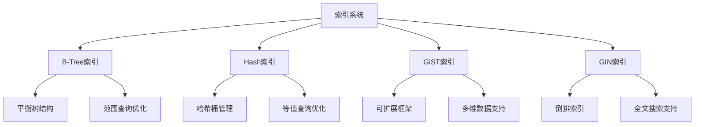
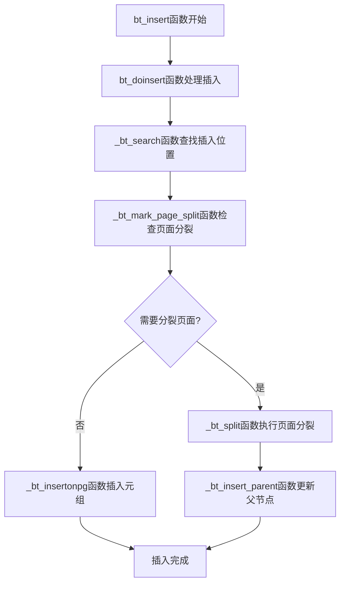
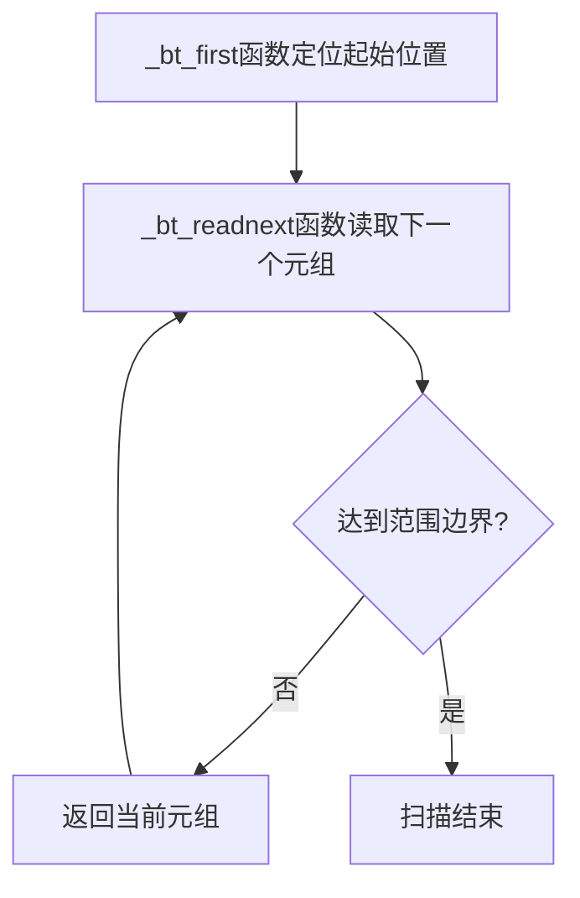
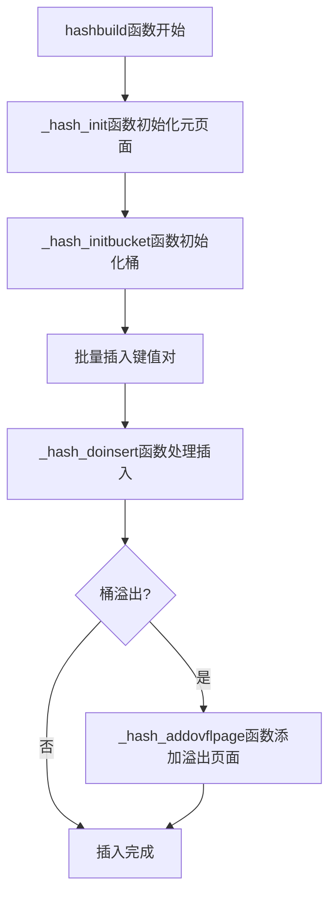
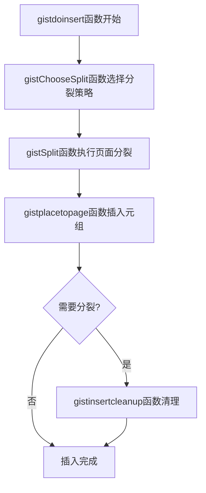
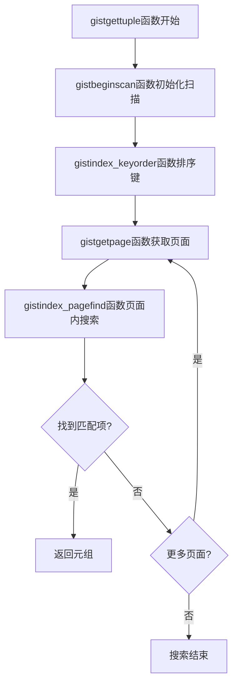
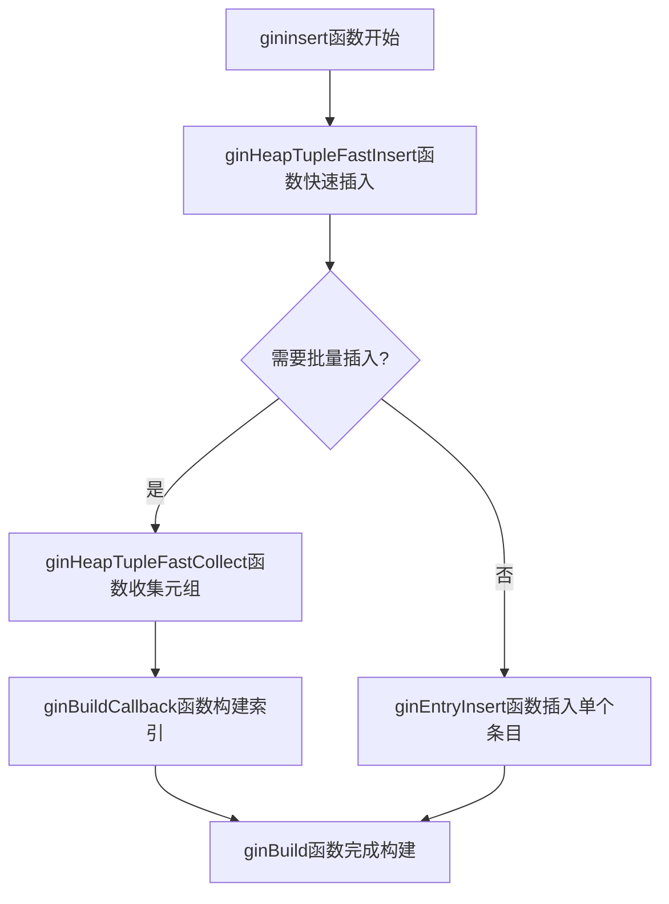
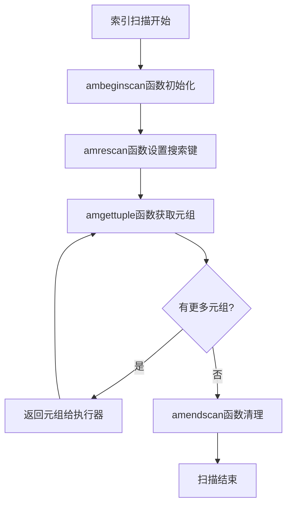
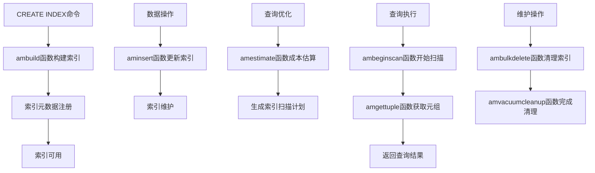

# 第五部分 索引
# 第22章 B-Tree、Hash、GiST、GIN索引

## 22.1 索引系统概述

索引是数据库系统性能的核心组件，PostgreSQL提供了丰富多样的索引类型，每种索引针对不同的数据特征和查询模式进行优化。本章将深入探讨四种核心索引类型的实现原理：B-Tree、Hash、GiST和GIN。

**索引系统的核心组件**：
- **访问方法接口**：统一的索引操作API
- **索引类型实现**：各种索引的具体算法实现
- **操作符类系统**：类型特定的索引语义
- **并发控制**：索引操作的并发安全

**索引系统架构**：


## 22.2 B-Tree索引

### 22.2.1 B-Tree数据结构

B-Tree是PostgreSQL中最常用的索引类型，适合范围查询和等值查询。

**关键代码位置**：`src/backend/access/nbtree/` 中的B-Tree实现

**B-Tree页面布局**：
```c
typedef struct BTPageOpaqueData
{
    BlockNumber btpo_prev;      /* 左兄弟页面 */
    BlockNumber btpo_next;      /* 右兄弟页面 */
    uint16      btpo_flags;     /* 标志位 */
    BTCycleId   btpo_cycleid;   /* 页面周期ID */
    uint16      btpo_level;     /* 树层级，0为叶子 */
} BTPageOpaqueData;
```

**B-Tree页面类型**：
- **叶子页面**：存储实际键值和TID指针
- **内部页面**：存储子树的分隔键
- **元页面**：存储B-Tree的元数据

**B-Tree插入流程**：


### 22.2.2 B-Tree搜索算法

B-Tree支持精确匹配、范围扫描等多种搜索模式。

**关键代码位置**：`src/backend/access/nbtree/nbtsearch.c` 中的搜索函数

**B-Tree搜索逻辑**：
```c
// _bt_search函数简化实现
BTStack _bt_search(Relation rel, BTScanDesc key, bool *nextkey)
{
    Buffer buf;
    Page page;
    BlockNumber blkno;
    int level;
    
    // 从根页面开始搜索
    blkno = BTREE_METAPAGE;
    buf = _bt_getbuf(rel, blkno, BT_READ);
    page = BufferGetPage(buf);
    
    // 获取树高度
    level = ((BTPageOpaque) PageGetSpecialPointer(page))->btpo_level;
    
    // 向下遍历到叶子页面
    while (level > 0)
    {
        // 在内部页面查找下一层页面
        blkno = _bt_get_endpoint(rel, key, page, level);
        _bt_relbuf(rel, buf);
        buf = _bt_getbuf(rel, blkno, BT_READ);
        page = BufferGetPage(buf);
        level--;
    }
    
    // 在叶子页面进行最终搜索
    return _bt_search_leaf(rel, key, buf, nextkey);
}
```

**B-Tree范围扫描**：


### 22.2.3 B-Tree并发控制

B-Tree采用复杂的锁机制确保并发操作的 correctness。

**关键代码位置**：`src/backend/access/nbtree/nbtpage.c` 中的锁管理

**B-Tree锁策略**：
- **叶子页面**：读写锁保护页面内容
- **内部页面**：意向锁保护子树
- **元页面**：排它锁保护B-Tree结构

## 22.3 Hash索引

### 22.3.1 Hash索引架构

Hash索引基于经典哈希表实现，适合等值查询。

**关键代码位置**：`src/backend/access/hash/` 中的Hash索引实现

**Hash桶结构**：
```c
typedef struct HashPageOpaqueData
{
    BlockNumber hasho_prevblkno;    /* 前一个桶页面 */
    BlockNumber hasho_nextblkno;    /* 后一个桶页面 */
    uint16      hasho_flag;         /* 页面标志 */
    uint16      hasho_bucket;       /* 桶号 */
    uint16      hasho_filler;       /* 填充字段 */
} HashPageOpaqueData;
```

**Hash索引创建流程**：


### 22.3.2 Hash函数与分布

Hash索引使用类型特定的哈希函数确保数据均匀分布。

**关键代码位置**：`src/backend/access/hash/hashfunc.c` 中的哈希函数

**哈希计算逻辑**：
```c
// hash_index_tuple函数计算哈希值
uint32 hash_index_tuple(IndexTuple itup, Relation rel)
{
    Datum *values = (Datum *) palloc(索引键数量 * sizeof(Datum));
    bool *isnull = (bool *) palloc(索引键数量 * sizeof(bool));
    
    // 提取索引键值
    index_deform_tuple(itup, RelationGetDescr(rel), values, isnull);
    
    // 计算组合哈希值
    uint32 hashkey = 0;
    for (int i = 0; i < 索引键数量; i++)
    {
        if (!isnull[i])
        {
            // 使用类型特定的哈希函数
            uint32 h = DatumGetUInt32(FunctionCall1Coll(
                哈希函数, 排序规则, values[i]));
            hashkey ^= h;
        }
    }
    
    pfree(values);
    pfree(isnull);
    return hashkey;
}
```

### 22.3.3 Hash索引操作

Hash索引支持插入、查找、删除等基本操作。

**Hash查找流程**：
```c
// _hash_search函数简化实现
IndexScanDesc _hash_search(Relation rel, int keysz, ScanKey scankey)
{
    // 计算哈希值确定桶号
    uint32 hashkey = _hash_datum2hashkey(rel, scankey);
    Bucket bucket = _hash_hashkey2bucket(hashkey);
    
    // 读取桶页面
    Buffer buf = _hash_getbucketbuf_from_hashkey(rel, hashkey, HASH_READ);
    Page page = BufferGetPage(buf);
    
    // 在桶链中搜索
    while (true)
    {
        // 扫描当前页面
        OffsetNumber offnum = _hash_binsearch(page, hashkey);
        if (OffsetNumberIsValid(offnum))
        {
            // 找到匹配项
            return 构建扫描描述符(bucket, offnum);
        }
        
        // 检查是否有溢出页面
        BlockNumber nextblk = HashPageGetOpaque(page)->hasho_nextblkno;
        if (!BlockNumberIsValid(nextblk))
            break;
            
        // 继续在溢出页面搜索
        _hash_relbuf(rel, buf);
        buf = _hash_getbuf(rel, nextblk, HASH_READ);
        page = BufferGetPage(buf);
    }
    
    _hash_relbuf(rel, buf);
    return NULL;  // 未找到
}
```

## 22.4 GiST索引

### 22.4.1 GiST架构设计

GiST（Generalized Search Tree）提供可扩展的索引框架，支持自定义数据类型和搜索策略。

**关键代码位置**：`src/backend/access/gist/` 中的GiST实现

**GiST核心概念**：
- **谓词**：描述子树中数据的逻辑条件
- **一致性函数**：判断查询条件是否与谓词一致
- **联合函数**：计算多个谓词的联合
- **惩罚函数**：评估插入位置的成本

**GiST页面结构**：
```c
typedef struct GISTPageOpaqueData
{
    uint32 flags;           /* 页面标志 */
    uint16 rightlink;       /* 右兄弟页面 */
    uint16 nsns;            /* 序列号 */
} GISTPageOpaqueData;
```

**GiST插入流程**：


### 22.4.2 GiST策略函数

GiST通过策略函数支持不同的数据类型和查询语义。

**关键策略函数**：
- **consistent**：检查查询是否与谓词一致
- **union**：计算多个谓词的联合
- **compress**和**decompress**：数据压缩和解压
- **penalty**：评估插入成本
- **picksplit**：选择分裂策略

**一致性函数示例**：
```c
// 几何类型的GiST一致性函数
PG_FUNCTION_INFO_V1(gist_box_consistent);

Datum gist_box_consistent(PG_FUNCTION_ARGS)
{
    GISTENTRY *entry = (GISTENTRY *) PG_GETARG_POINTER(0);
    BOX *query = PG_GETARG_BOX_P(1);
    StrategyNumber strategy = (StrategyNumber) PG_GETARG_UINT16(2);
    
    // 根据策略检查一致性
    bool result;
    switch (strategy)
    {
        case RTOverlapStrategyNumber:
            result = box_overlap((BOX *) DatumGetPointer(entry->key), query);
            break;
        case RTContainsStrategyNumber:
            result = box_contain((BOX *) DatumGetPointer(entry->key), query);
            break;
        case RTContainedByStrategyNumber:
            result = box_contained((BOX *) DatumGetPointer(entry->key), query);
            break;
        default:
            result = false;
    }
    
    PG_RETURN_BOOL(result);
}
```

### 22.4.3 GiST搜索算法

GiST支持多种复杂查询，包括最近邻搜索。

**GiST搜索流程**：


## 22.5 GIN索引

### 22.5.1 GIN架构设计

GIN（Generalized Inverted Index）是倒排索引，适合多值类型和全文搜索。

**关键代码位置**：`src/backend/access/gin/` 中的GIN实现

**GIN核心组件**：
- **倒排列表**：键值到TID列表的映射
- **B-Tree over keys**：键的B-Tree索引
- ** posting tree**：大倒排列表的树形存储
- ** posting list**：小倒排列表的紧凑存储

**GIN元组结构**：
```c
typedef struct GinTuple
{
    uint16 tupHead;     /* 头信息 */
    Datum key;          /* 键值 */
    ItemPointerData ptrs[FLEXIBLE_ARRAY_MEMBER]; /* TID列表 */
} GinTuple;
```

**GIN插入流程**：


### 22.5.2 GIN倒排列表

GIN使用两种格式存储倒排列表，平衡空间和性能。

**倒排列表格式选择**：
```c
// 选择倒排列表格式的逻辑
static bool
should_use_posting_list(GinState *ginstate, int nitems)
{
    // 小列表使用紧凑格式，大列表使用树形格式
    if (nitems < GinMaxItemSize)
        return true;  // 使用posting list
    else
        return false; // 使用posting tree
}
```

**倒排列表合并**：
```c
// 合并倒排列表的函数
GinPostingList *
ginMergeItemPointers(GinPostingList *existing, ItemPointer newItems, int nNewItems)
{
    // 合并两个TID列表
    int totalItems = existing->nitems + nNewItems;
    GinPostingList *merged = palloc(GinPostingListSize(totalItems));
    
    // 执行归并排序
    int i = 0, j = 0, k = 0;
    while (i < existing->nitems && j < nNewItems)
    {
        if (ItemPointerCompare(&existing->items[i], &newItems[j]) < 0)
            merged->items[k++] = existing->items[i++];
        else
            merged->items[k++] = newItems[j++];
    }
    
    // 处理剩余项
    while (i < existing->nitems)
        merged->items[k++] = existing->items[i++];
    while (j < nNewItems)
        merged->items[k++] = newItems[j++];
    
    merged->nitems = totalItems;
    return merged;
}
```

### 22.5.3 GIN搜索优化

GIN支持多种搜索模式，包括全文搜索和数组操作。

**GIN搜索策略**：
- **精确匹配**：查找包含特定键值的文档
- **部分匹配**：查找包含任意给定键值的文档
- **全文搜索**：支持TSVector的复杂搜索

**GIN一致性函数**：
```c
// 数组类型的GIN一致性函数
Datum ginarrayconsistent(PG_FUNCTION_ARGS)
{
    GinScanKey key = (GinScanKey) PG_GETARG_POINTER(0);
    StrategyNumber strategy = PG_GETARG_UINT16(1);
    ArrayType *query = PG_GETARG_ARRAYTYPE_P(2);
    
    // 检查数组查询条件
    switch (strategy)
    {
        case GinOverlapStrategy:
            // 检查是否有重叠元素
            return ginarray_overlap(key, query);
        case GinContainsStrategy:
            // 检查是否包含所有查询元素
            return ginarray_contains(key, query);
        case GinContainedStrategy:
            // 检查是否被查询数组包含
            return ginarray_contained(key, query);
        default:
            PG_RETURN_BOOL(false);
    }
}
```

## 22.6 索引访问方法接口

### 22.6.1 AM接口设计

所有索引类型实现统一的访问方法接口。

**关键代码位置**：`src/include/access/amapi.h` 中的AM接口定义

**核心AM操作**：
```c
typedef struct IndexAmRoutine
{
    // 索引构建
    IndexBuildResult *(*ambuild) (Relation heap, Relation index, 
                                  IndexInfo *indexInfo);
    
    // 索引构建空索引
    void (*ambuildempty) (Relation index);
    
    // 索引插入
    bool (*aminsert) (Relation index, Datum *values, bool *isnull,
                      ItemPointer ht_ctid, Relation heapRel,
                      IndexUniqueCheck checkUnique);
    
    // 索引批量删除
    IndexBulkDeleteResult *(*ambulkdelete) (IndexVacuumInfo *info,
                                            IndexBulkDeleteResult *stats,
                                            IndexBulkDeleteCallback callback,
                                            void *callback_state);
    
    // 索引清理
    IndexBulkDeleteResult *(*amvacuumcleanup) (IndexVacuumInfo *info,
                                               IndexBulkDeleteResult *stats);
    
    // 索引扫描
    IndexScanDesc (*ambeginscan) (Relation index, int nkeys, int norderbys);
    
    // 重新开始扫描
    void (*amrescan) (IndexScanDesc scan, ScanKey keys, int nkeys,
                      ScanKey orderbys, int norderbys);
    
    // 获取下一个元组
    bool (*amgettuple) (IndexScanDesc scan, ScanDirection direction);
    
    // 索引结束扫描
    void (*amendscan) (IndexScanDesc scan);
    
    // 估算索引大小
    void (*amestimate) (PlannerInfo *root, IndexPath *path,
                        double loop_count, Cost *indexStartupCost,
                        Cost *indexTotalCost, Selectivity *indexSelectivity,
                        double *indexCorrelation);
} IndexAmRoutine;
```

### 22.6.2 索引扫描执行

索引扫描与执行器紧密集成，支持各种查询计划。

**索引扫描生命周期**：


## 22.7 索引并发控制

### 22.7.1 索引级锁机制

不同索引类型采用不同的并发控制策略。

**索引锁层次**：
- **索引级锁**：保护整个索引结构
- **页面级锁**：保护单个索引页面
- **元组级锁**：保护单个索引元组

**B-Tree并发控制**：
```c
// B-Tree页面锁管理
Buffer _bt_getbuf(Relation rel, BlockNumber blkno, int access)
{
    Buffer buf = ReadBuffer(rel, blkno);
    
    if (access == BT_WRITE)
    {
        // 获取排它锁
        LockBuffer(buf, BUFFER_LOCK_EXCLUSIVE);
    }
    else
    {
        // 获取共享锁
        LockBuffer(buf, BUFFER_LOCK_SHARE);
    }
    
    return buf;
}
```

### 22.7.2 索引Vacuum支持

索引需要特殊的Vacuum处理来清理失效条目。

**索引Vacuum接口**：
```c
// 索引Vacuum的AM接口
IndexBulkDeleteResult *
ambulkdelete(IndexVacuumInfo *info, IndexBulkDeleteResult *stats,
             IndexBulkDeleteCallback callback, void *callback_state)
{
    // 遍历索引，调用回调函数处理每个元组
    IndexScanDesc scan = ambeginscan(...);
    
    while (amgettuple(scan, ForwardScanDirection))
    {
        if (callback(&scan->xs_ctid, callback_state))
        {
            // 删除失效的索引元组
            amdelete(scan->indexRelation, &scan->xs_ctid);
        }
    }
    
    amendscan(scan);
    return stats;
}
```

## 22.8 索引统计信息

### 22.8.1 统计信息收集

索引维护统计信息支持查询优化器。

**关键代码位置**：`src/backend/commands/analyze.c` 中的索引统计收集

**索引统计收集**：
```c
// 收集索引统计信息
void compute_index_stats(Relation indrel, double totalrows,
                         AnlIndexData *indexData)
{
    // 扫描索引收集统计
    IndexScanDesc scan = index_beginscan(...);
    
    while (index_getnext(scan, ForwardScanDirection))
    {
        // 分析索引键的分布
        analyze_index_collect_data(indexData, scan);
    }
    
    index_endscan(scan);
    
    // 计算统计指标
    calculate_index_statistics(indexData, totalrows);
}
```

### 22.8.2 选择度估算

索引为优化器提供选择度估算支持。

**选择度估算接口**：
```c
// 索引选择度估算
void amestimate(PlannerInfo *root, IndexPath *path, double loop_count,
                Cost *indexStartupCost, Cost *indexTotalCost,
                Selectivity *indexSelectivity, double *indexCorrelation)
{
    // 基于索引统计估算选择度
    *indexSelectivity = clauselist_selectivity(root, path->indexclauses,
                                               path->indexinfo->rel->relid,
                                               JOIN_INNER, NULL);
    
    // 估算索引扫描成本
    genericcostestimate(root, path, loop_count, indexStartupCost,
                        indexTotalCost, indexSelectivity, indexCorrelation);
}
```

## 22.9 索引完整工作流

以下图表展示了索引从创建到查询的完整生命周期：



## 22.10 索引选择策略

### 22.10.1 索引类型比较

不同索引类型适合不同的应用场景。

**索引类型特性对比**：

| 索引类型 | 适用场景 | 优势 | 限制 |
|---------|----------|------|------|
| B-Tree | 范围查询，排序 | 通用性强，支持多种查询 | 空间开销较大 |
| Hash | 等值查询 | 查询性能高 | 不支持范围查询 |
| GiST | 多维数据，自定义类型 | 可扩展性强 | 实现复杂度高 |
| GIN | 多值类型，全文搜索 | 倒排索引效率高 | 更新成本较高 |

### 22.10.2 索引设计最佳实践

基于数据特性和查询模式选择合适索引。

**索引设计原则**：
- **选择性原则**：高选择性的列适合创建索引
- **查询驱动**：基于实际查询模式设计索引
- **复合索引**：多列索引支持复合查询条件
- **部分索引**：对数据子集创建索引减少开销

## 22.11 本章小结

本章详细解析了PostgreSQL四种核心索引类型的实现机制：

1. **B-Tree索引**：经典的平衡树结构，支持高效的范围查询和排序操作，是PostgreSQL中最通用和稳定的索引类型。

2. **Hash索引**：基于哈希表的等值查询索引，适合精确匹配场景，具有极高的查询性能。

3. **GiST索引**：通用搜索树框架，支持多维数据和自定义数据类型的索引，提供了强大的可扩展性。

4. **GIN索引**：通用倒排索引，专为多值类型和全文搜索设计，支持高效的集合操作和文本搜索。

5. **统一的访问方法接口**：所有索引类型实现相同的AM接口，为查询优化器和执行器提供一致的访问方式。

6. **完整的并发控制**：各种索引采用适当的锁机制，确保高并发环境下的数据一致性。

7. **深度系统集成**：索引与Vacuum、统计信息收集、查询优化等子系统深度集成，形成完整的数据库生态系统。

索引系统是PostgreSQL查询性能的基石，其多样化的索引类型和灵活的扩展机制体现了数据库系统在数据访问优化方面的深度思考。理解各种索引的实现机制对于数据库性能调优、索引设计和应用开发具有重要意义。在下一章中，我们将探讨索引访问方法接口的统一设计。