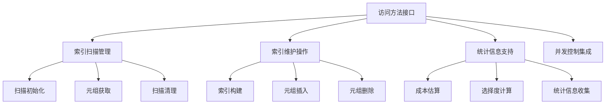
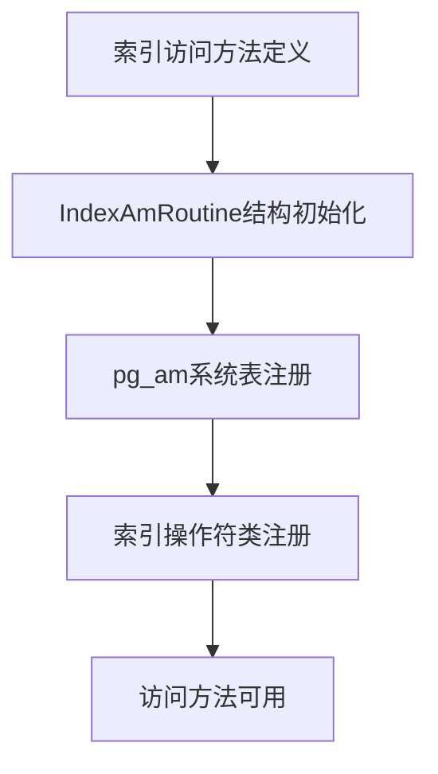
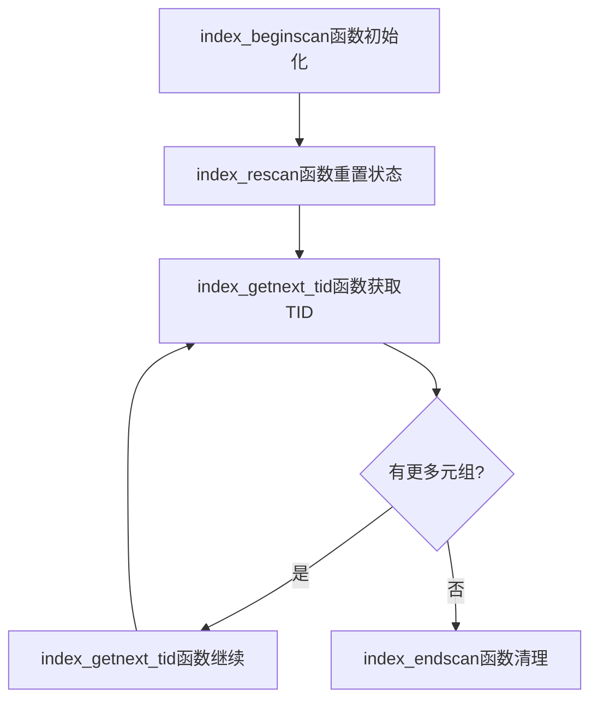
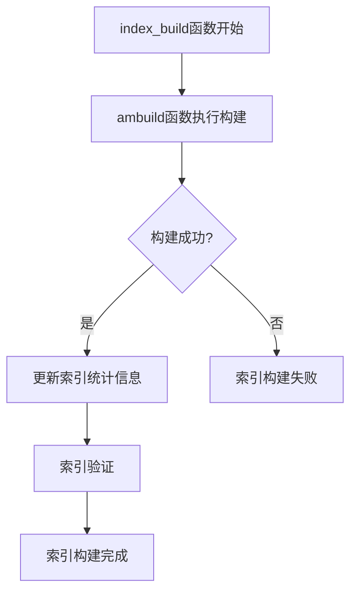
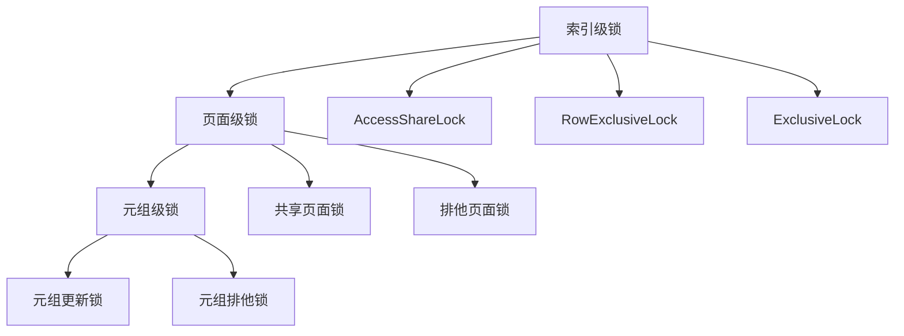
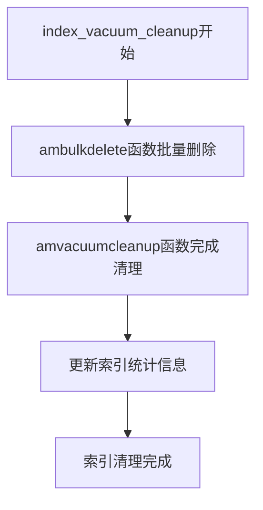
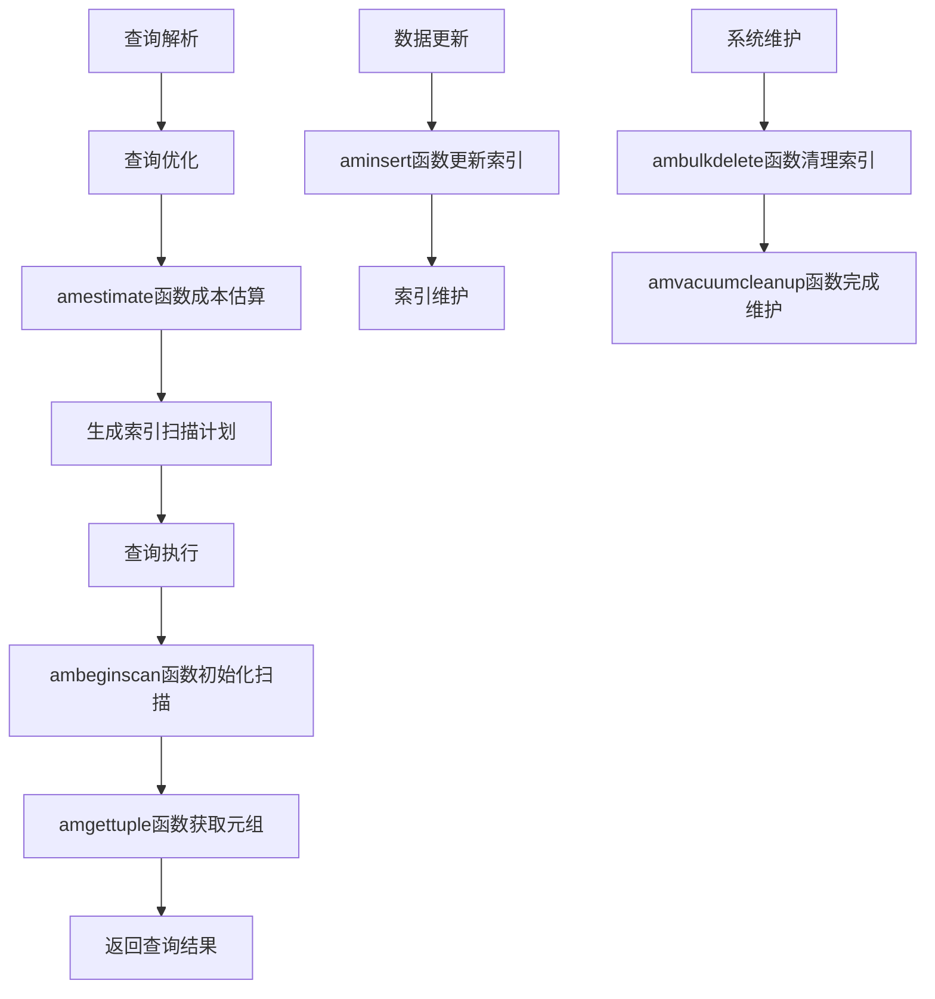

# 第23章 索引访问方法接口

## 23.1 访问方法接口概述

索引访问方法接口是PostgreSQL索引系统的核心抽象层，它定义了索引类型必须实现的标准操作集合。通过这一统一的接口，PostgreSQL能够支持多种索引类型，同时保持查询优化器和执行器代码的简洁性和通用性。

**访问方法接口的核心目标**：
- **统一性**：为所有索引类型提供一致的API
- **扩展性**：支持新索引类型的无缝集成
- **性能**：优化索引操作的执行效率
- **可维护性**：隔离索引实现与核心系统代码

**访问方法系统架构**：


## 23.2 访问方法接口设计

### 23.2.1 接口数据结构

访问方法接口通过一组精心设计的数据结构实现类型安全的操作分发。

**关键代码位置**：`src/include/access/amapi.h` 中的接口定义

**IndexAmRoutine结构**：
```c
typedef struct IndexAmRoutine
{
    NodeTag type;
    
    // 索引属性
    char amstrategies;      /* 策略操作符数量 */
    char amsupport;         /* 支持过程数量 */
    Oid amcanorder;         /* 是否支持排序扫描 */
    Oid amcanorderbyop;     /* 是否支持按操作符排序 */
    Oid amcanbackward;      /* 是否支持反向扫描 */
    Oid amcanunique;        /* 是否支持唯一索引 */
    Oid amcanmulticol;      /* 是否支持多列索引 */
    Oid amoptionalkey;      /* 是否支持第一个索引键可选 */
    Oid amsearcharray;      /* 是否支持ScalarArrayOpExpr */
    Oid amsearchnulls;      /* 是否支持IS NULL/NOT NULL */
    Oid amstorage;          /* 存储类型与索引类型是否可不同 */
    Oid amclusterable;      /* 是否支持CLUSTER命令 */
    Oid ampredlocks;        /* 是否支持谓词锁 */
    Oid amcanparallel;      /* 是否支持并行扫描 */
    Oid amcaninclude;       /* 是否支持INCLUDE列 */
    Oid amkeytype;          /* 索引键数据类型 */
    
    // 接口函数指针
    IndexBuildResult *(*ambuild) (Relation heap, Relation index, 
                                  IndexInfo *indexInfo);
    void (*ambuildempty) (Relation index);
    bool (*aminsert) (Relation index, Datum *values, bool *isnull,
                      ItemPointer ht_ctid, Relation heapRel,
                      IndexUniqueCheck checkUnique);
    // ... 更多函数指针
} IndexAmRoutine;
```

**索引扫描描述符**：
```c
typedef struct IndexScanDescData
{
    // 扫描状态
    Relation indexRelation;  /* 索引关系 */
    IndexInfo *indexInfo;    /* 索引信息 */
    int numberOfKeys;        /* 扫描键数量 */
    ScanKey keyData;         /* 扫描键数组 */
    
    // 扫描控制
    bool kill_prior_tuple;   /* 是否杀死前一个元组 */
    bool ignore_killed_tuples; /* 是否忽略已杀死元组 */
    bool keys_are_unique;    /* 扫描键是否唯一 */
    ScanDirection orderDir;  /* 扫描方向 */
    
    // 实现私有数据
    void *opaque;           /* 访问方法私有状态 */
} IndexScanDescData;
```

### 23.2.2 接口注册机制

索引访问方法在系统启动时注册到全局访问方法表中。

**关键代码位置**：`src/backend/access/index/indexam.c` 中的访问方法管理

**访问方法注册流程**：


**访问方法注册函数**：
```c
// 注册索引访问方法的简化逻辑
void register_index_am(Oid amoid, IndexAmRoutine *amroutine)
{
    // 验证访问方法结构
    if (amroutine->ambuild == NULL ||
        amroutine->aminsert == NULL ||
        amroutine->ambeginscan == NULL)
    {
        elog(ERROR, "索引访问方法缺少必需的函数");
    }
    
    // 在pg_am系统表中插入记录
    Relation pg_am_rel = heap_open(AccessMethodRelationId, RowExclusiveLock);
    
    HeapTuple tuple = BuildAmTuple(amoid, amroutine);
    CatalogTupleInsert(pg_am_rel, tuple);
    
    heap_close(pg_am_rel, RowExclusiveLock);
    
    // 注册到内存中的访问方法表
    IndexAmRoutine **amcache = get_index_am_cache();
    amcache[amoid] = amroutine;
}
```

## 23.3 索引扫描接口

### 23.3.1 扫描生命周期管理

索引扫描遵循严格的生命周期，确保资源的正确分配和释放。

**关键代码位置**：`src/backend/access/index/indexam.c` 中的扫描管理函数

**索引扫描生命周期**：


**扫描初始化实现**：
```c
// index_beginscan函数核心逻辑
IndexScanDesc index_beginscan(Relation heapRelation,
                              Relation indexRelation,
                              Snapshot snapshot,
                              int nkeys, int norderbys)
{
    // 分配扫描描述符
    IndexScanDesc scan = (IndexScanDesc) palloc(sizeof(IndexScanDescData));
    
    // 初始化基本字段
    scan->heapRelation = heapRelation;
    scan->indexRelation = indexRelation;
    scan->xs_snapshot = snapshot;
    scan->numberOfKeys = nkeys;
    scan->numberOfOrderBys = norderbys;
    
    // 调用访问方法特定的beginscan函数
    scan->opaque = scan->indexRelation->rd_amroutine->ambeginscan(
        indexRelation, nkeys, norderbys);
    
    return scan;
}
```

### 23.3.2 元组获取接口

索引扫描通过统一的接口返回匹配的元组TID。

**关键代码位置**：`src/backend/access/index/indexam.c` 中的 `index_getnext_tid` 函数

**元组获取流程**：
```c
// index_getnext_tid函数实现
bool index_getnext_tid(IndexScanDesc scan, ScanDirection direction)
{
    // 调用访问方法特定的gettuple函数
    bool found = scan->indexRelation->rd_amroutine->amgettuple(scan, direction);
    
    if (found)
    {
        // 更新扫描统计
        pgstat_count_index_tuples(scan->indexRelation, 1);
    }
    
    return found;
}
```

**并行扫描支持**：
```c
// 并行索引扫描初始化
IndexScanDesc index_beginscan_parallel(Relation heapRelation,
                                       Relation indexRelation,
                                       int nkeys, int norderbys,
                                       ParallelIndexScanDesc parallel_scan)
{
    IndexScanDesc scan;
    
    // 分配扫描描述符
    scan = (IndexScanDesc) palloc(sizeof(IndexScanDescData));
    
    // 初始化并行扫描特定字段
    scan->parallel_scan = parallel_scan;
    scan->opaque = NULL;  // 由访问方法初始化
    
    // 调用访问方法的并行beginscan函数
    if (scan->indexRelation->rd_amroutine->ambeginscan_parallel)
    {
        scan->opaque = scan->indexRelation->rd_amroutine->ambeginscan_parallel(
            indexRelation, nkeys, norderbys, parallel_scan);
    }
    else
    {
        // 回退到串行扫描
        scan->opaque = scan->indexRelation->rd_amroutine->ambeginscan(
            indexRelation, nkeys, norderbys);
    }
    
    return scan;
}
```

## 23.4 索引维护接口

### 23.4.1 索引构建接口

索引构建支持多种策略，包括批量构建和增量构建。

**关键代码位置**：`src/backend/access/index/indexam.c` 中的 `index_build` 函数

**索引构建流程**：


**索引构建核心逻辑**：
```c
// index_build函数实现
void index_build(Relation heapRelation,
                 Relation indexRelation,
                 IndexInfo *indexInfo,
                 bool isreindex,
                 bool parallel)
{
    IndexBuildResult *stats;
    
    // 调用访问方法特定的构建函数
    stats = indexRelation->rd_amroutine->ambuild(heapRelation, indexRelation,
                                                 indexInfo);
    
    if (stats == NULL)
        elog(ERROR, "索引构建失败");
    
    // 更新索引统计信息
    if (OidIsValid(indexRelation->rd_rel->relam))
    {
        // 更新pg_class中的统计信息
        vac_update_relstats(heapRelation,
                            stats->heap_tuples,
                            stats->index_tuples,
                            stats->heap_tuples);
    }
    
    // 记录构建统计
    if (IsAutoVacuumWorkerProcess())
    {
        // 在自动清理进程中记录详细统计
        AutoVacuumUpdateIndexStats(indexRelation->rd_id,
                                   stats->heap_tuples,
                                   stats->index_tuples);
    }
}
```

### 23.4.2 元组操作接口

索引支持插入、删除和更新操作，保持与堆表的同步。

**索引插入接口**：
```c
// index_insert函数实现
bool index_insert(Relation indexRelation,
                  Datum *values,
                  bool *isnull,
                  ItemPointer heap_t_ctid,
                  Relation heapRelation,
                  IndexUniqueCheck checkUnique)
{
    bool result;
    
    // 调用访问方法特定的插入函数
    result = indexRelation->rd_amroutine->aminsert(indexRelation, values, isnull,
                                                   heap_t_ctid, heapRelation,
                                                   checkUnique);
    
    // 更新插入统计
    if (result)
        pgstat_count_index_insert(indexRelation, 1);
    
    return result;
}
```

**唯一性检查机制**：
```c
// 唯一性检查的三种模式
typedef enum IndexUniqueCheck
{
    UNIQUE_CHECK_NO,            /* 不检查唯一性 */
    UNIQUE_CHECK_YES,           /* 正常唯一性检查 */
    UNIQUE_CHECK_EXISTING       /* 检查现有索引的唯一性 */
} IndexUniqueCheck;
```

## 23.5 成本估算接口

### 23.5.1 查询优化集成

索引访问方法为查询优化器提供成本估算支持，帮助选择最优执行计划。

**关键代码位置**：`src/backend/optimizer/path/costsize.c` 中的成本估算函数

**成本估算接口**：
```c
// 索引路径成本估算
void cost_index(IndexPath *path, PlannerInfo *root, double loop_count)
{
    IndexOptInfo *index = path->indexinfo;
    IndexAmRoutine *amroutine = index->amroutine;
    
    // 调用访问方法特定的成本估算函数
    amroutine->amestimate(root, path, loop_count,
                          &path->path.startup_cost,
                          &path->path.total_cost,
                          &path->indexselectivity,
                          &path->indexcorrelation);
    
    // 添加CPU和I/O成本
    path->path.startup_cost += index->indextotalcost;
    path->path.total_cost += index->indextotalcost;
    
    // 考虑并行扫描成本
    if (path->path.parallel_workers > 0)
    {
        // 并行执行有额外的协调成本
        path->path.total_cost += parallel_setup_cost;
    }
}
```

### 23.5.2 选择度计算

索引访问方法提供精确的选择度估算，支持复杂的查询条件。

**选择度计算接口**：
```c
// 索引条件选择度估算
Selectivity index_selectivity(PlannerInfo *root,
                              IndexOptInfo *index,
                              List *indexQuals)
{
    Selectivity selectivity;
    IndexAmRoutine *amroutine = index->amroutine;
    
    // 如果访问方法提供特定的选择度计算函数，使用它
    if (amroutine->amselectivity != NULL)
    {
        selectivity = amroutine->amselectivity(root, index, indexQuals);
    }
    else
    {
        // 否则使用通用的选择度计算
        selectivity = clauselist_selectivity(root, indexQuals,
                                             index->rel->relid,
                                             JOIN_INNER, NULL);
    }
    
    return selectivity;
}
```

## 23.6 并发控制接口

### 23.6.1 索引级锁管理

索引访问方法集成到PostgreSQL的多层次锁系统中。

**关键代码位置**：`src/backend/storage/lmgr/lock.c` 中的索引锁管理

**索引锁层次结构**：


**索引锁获取逻辑**：
```c
// 索引操作中的锁管理
void index_lock_acquire(Relation indexRelation, LOCKMODE lockmode)
{
    // 获取索引级锁
    LockRelation(indexRelation, lockmode);
    
    // 某些访问方法可能需要额外的锁
    if (indexRelation->rd_amroutine->amextralock != NULL)
    {
        indexRelation->rd_amroutine->amextralock(indexRelation, lockmode);
    }
}
```

### 23.6.2 谓词锁支持

某些索引类型支持谓词锁，用于可序列化隔离级别。

**谓词锁接口**：
```c
// 索引谓词锁检查
bool index_supports_predicate_locking(Relation indexRelation)
{
    IndexAmRoutine *amroutine = indexRelation->rd_amroutine;
    
    // 检查访问方法是否支持谓词锁
    return (amroutine->ampredlocks && 
            GetTopTransactionIdIfAny() != InvalidTransactionId);
}
```

## 23.7 Vacuum集成接口

### 23.7.1 索引清理操作

索引访问方法提供专门的接口支持Vacuum操作。

**关键代码位置**：`src/backend/access/index/indexam.c` 中的 `index_vacuum_cleanup` 函数

**索引Vacuum流程**：


**索引清理实现**：
```c
// index_vacuum_cleanup函数实现
IndexBulkDeleteResult *index_vacuum_cleanup(IndexVacuumInfo *info,
                                            IndexBulkDeleteResult *stats)
{
    Relation indexRelation = info->index;
    IndexAmRoutine *amroutine = indexRelation->rd_amroutine;
    IndexBulkDeleteResult *result;
    
    // 调用批量删除函数
    if (amroutine->ambulkdelete != NULL)
    {
        result = amroutine->ambulkdelete(info, stats,
                                         vacuum_callback, (void *) info);
    }
    else
    {
        result = stats;
    }
    
    // 调用清理完成函数
    if (amroutine->amvacuumcleanup != NULL)
    {
        result = amroutine->amvacuumcleanup(info, result);
    }
    
    return result;
}
```

### 23.7.2 索引统计更新

Vacuum过程中更新索引统计信息，支持查询优化。

**统计更新接口**：
```c
// 索引统计信息更新
void index_update_stats(Relation rel,
                        bool hasindex,
                        double reltuples)
{
    // 更新pg_class中的索引统计
    Form_pg_class rd_rel = rel->rd_rel;
    
    rd_rel->relhasindex = hasindex;
    if (hasindex)
    {
        rd_rel->reltuples = reltuples;
    }
    
    // 标记关系需要更新
    RelationMarkDirty(rel);
}
```

## 23.8 扩展索引支持

### 23.8.1 操作符类集成

索引访问方法与操作符类系统紧密集成，支持类型特定的索引语义。

**关键代码位置**：`src/backend/access/index/indexam.c` 中的操作符类支持

**操作符类查找**：
```c
// 查找索引操作符类
Oid index_get_opclass(IndexInfo *indexInfo, int attnum)
{
    // 从索引信息中获取操作符类OID
    if (attnum < 1 || attnum > indexInfo->ii_NumIndexAttrs)
        elog(ERROR, "无效的属性编号");
    
    return indexInfo->ii_OpClassOids[attnum - 1];
}
```

### 23.8.2 支持函数管理

索引访问方法使用支持函数实现类型特定的操作。

**支持函数接口**：
```c
// 获取索引支持函数
FmgrInfo *index_get_support_function(IndexInfo *indexInfo,
                                     int attnum,
                                     int procnum)
{
    Oid opclass = index_get_opclass(indexInfo, attnum);
    Oid funcid;
    
    // 从pg_amproc系统表查找支持函数
    funcid = get_opclass_proc(opclass, indexInfo->ii_KeyTypeNumbers[attnum - 1],
                              procnum);
    
    if (!OidIsValid(funcid))
        elop(ERROR, "缺少索引支持函数");
    
    // 查找并返回函数信息
    return get_fmgr_info(funcid);
}
```

## 23.9 错误处理与恢复

### 23.9.1 索引损坏检测

索引访问方法提供损坏检测接口，支持数据完整性验证。

**损坏检测接口**：
```c
// 索引损坏检查
bool index_corrupted(Relation indexRelation)
{
    IndexAmRoutine *amroutine = indexRelation->rd_amroutine;
    
    // 如果访问方法提供损坏检查函数，使用它
    if (amroutine->amcorrupted != NULL)
    {
        return amroutine->amcorrupted(indexRelation);
    }
    
    // 否则使用通用的损坏检查
    return check_index_corruption(indexRelation);
}
```

### 23.9.2 索引重建支持

当索引损坏时，支持安全地重建索引。

**重建接口**：
```c
// 索引重建
void index_rebuild(Relation heapRelation, Relation indexRelation)
{
    IndexInfo *indexInfo;
    
    // 构建索引信息
    indexInfo = BuildIndexInfo(indexRelation);
    
    // 删除旧索引
    index_drop(indexRelation);
    
    // 重建新索引
    index_build(heapRelation, indexRelation, indexInfo, false, false);
}
```

## 23.10 访问方法完整工作流

以下图表展示了索引访问方法在查询处理全流程中的参与：



## 23.11 性能优化策略

### 23.11.1 批量操作优化

索引访问方法支持批量操作，减少重复开销。

**批量插入接口**：
```c
// 批量索引插入
void index_batch_insert(Relation indexRelation,
                        TupleTableSlot **slots,
                        int nslots)
{
    IndexAmRoutine *amroutine = indexRelation->rd_amroutine;
    
    // 如果访问方法支持批量插入，使用它
    if (amroutine->ambatchinsert != NULL)
    {
        amroutine->ambatchinsert(indexRelation, slots, nslots);
    }
    else
    {
        // 否则回退到逐个插入
        for (int i = 0; i < nslots; i++)
        {
            index_insert(indexRelation, ...);
        }
    }
}
```

### 23.11.2 预取优化

索引访问方法支持数据预取，提高扫描性能。

**预取接口**：
```c
// 索引预取
void index_prefetch(IndexScanDesc scan, ScanDirection direction)
{
    IndexAmRoutine *amroutine = scan->indexRelation->rd_amroutine;
    
    // 如果访问方法支持预取，使用它
    if (amroutine->amprefetch != NULL)
    {
        amroutine->amprefetch(scan, direction);
    }
}
```

## 23.12 本章小结

本章详细解析了PostgreSQL索引访问方法接口的设计与实现：

1. **统一的接口抽象**：通过IndexAmRoutine结构定义了所有索引类型必须实现的标准化接口，确保了系统核心代码与具体索引实现的解耦。

2. **完整的生命周期管理**：从索引构建、元组操作到扫描执行和Vacuum维护，访问方法接口覆盖了索引的完整生命周期。

3. **深度优化器集成**：通过成本估算和选择度计算接口，索引访问方法为查询优化器提供决策支持，帮助生成最优执行计划。

4. **强大的并发控制**：索引访问方法集成到PostgreSQL的多层次锁系统中，支持高并发环境下的数据一致性。

5. **灵活的扩展机制**：通过操作符类和支持函数系统，索引访问方法支持类型特定的索引语义，为自定义数据类型提供索引支持。

6. **完善的维护支持**：索引Vacuum和损坏检测接口确保索引长期运行的性能和可靠性。

7. **性能优化接口**：批量操作、预取等优化接口支持高性能索引操作，满足各种工作负载需求。

索引访问方法接口是PostgreSQL索引系统的基石，其设计体现了数据库系统在抽象性、扩展性和性能方面的深度思考。理解访问方法接口的实现机制对于开发新的索引类型、优化现有索引性能以及进行深度数据库调优具有重要意义。在下一章中，我们将通过实践指导如何添加新的索引类型。