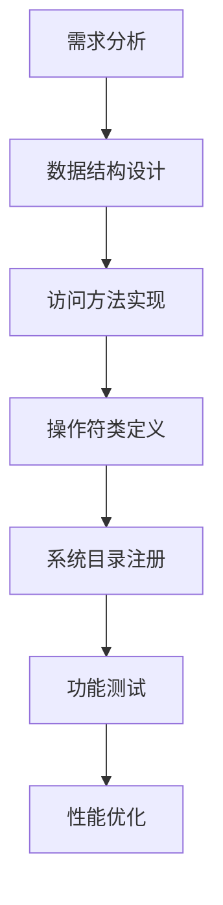
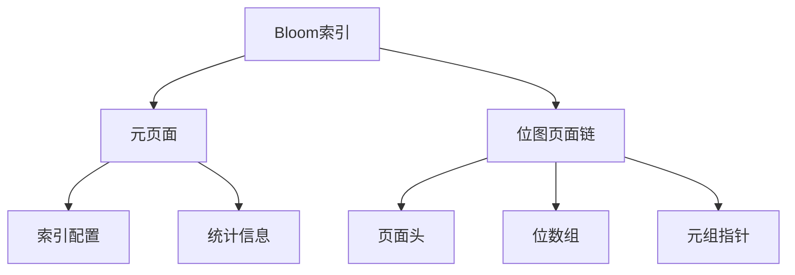
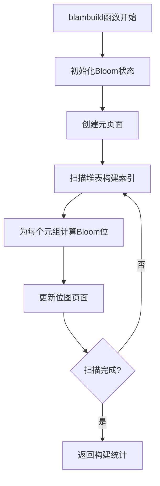
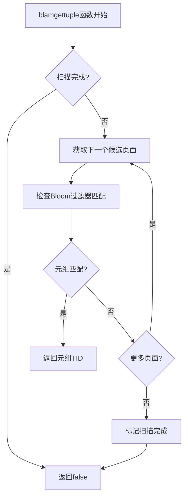
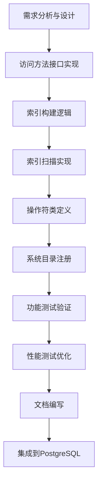

# 第24章 实践：添加新的索引类型

## 24.1 新索引类型开发概述

本章将通过实践指导，详细演示如何在PostgreSQL中添加一个全新的索引类型。我们将以"Bloom Filter索引"为例，展示从概念设计到完整实现的完整流程。Bloom Filter索引适合多列等值查询场景，能够快速排除不匹配的元组。

**新索引开发的关键步骤**：
- **需求分析与设计**：确定索引的应用场景和数据结构
- **访问方法实现**：实现IndexAmRoutine接口的所有必需函数
- **操作符类支持**：定义索引支持的操作符和策略
- **系统集成**：注册索引类型到PostgreSQL系统目录
- **测试验证**：确保新索引的正确性和性能

**新索引开发流程**：


## 24.2 Bloom Filter索引设计

### 24.2.1 数据结构设计

Bloom Filter索引基于概率数据结构，使用多个哈希函数和位数组实现快速成员检测。

**Bloom Filter索引结构**：
```c
// Bloom索引元页面结构
typedef struct BloomMetaPageData
{
    uint32 magicNumber;           /* 魔数标识 */
    uint32 version;               /* 版本号 */
    uint64 nbits;                 /* 位数组大小 */
    uint16 nhashes;               /* 哈希函数数量 */
    uint16 keysize;               /* 键值大小 */
    double falsePositiveRate;     /* 期望误判率 */
} BloomMetaPageData;

// Bloom索引页面结构
typedef struct BloomPageOpaqueData
{
    BlockNumber prevblkno;        /* 前一个页面 */
    BlockNumber nextblkno;        /* 后一个页面 */
    uint16 flags;                 /* 页面标志 */
    uint16 ntuples;               /* 页面中元组数量 */
} BloomPageOpaqueData;
```

**Bloom Filter索引布局**：


### 24.2.2 哈希函数设计

Bloom Filter索引需要多个独立的哈希函数来减少冲突概率。

**关键代码位置**：`src/backend/access/bloom/bloomfuncs.c`

**哈希函数实现**：
```c
// Bloom Filter哈希函数集合
static uint32
bloom_hash(const void *key, Size size, uint32 seed)
{
    return DatumGetUInt32(hash_any_extended((const unsigned char *)key, 
                                           size, seed));
}

// 生成多个哈希值
void
bloom_calc_hashes(BloomState *state, Datum value, bool isnull, 
                  uint32 *hashes)
{
    if (isnull)
    {
        // 对NULL值使用固定哈希值
        for (int i = 0; i < state->nhashes; i++)
            hashes[i] = 0;
        return;
    }
    
    // 计算多个哈希值
    for (int i = 0; i < state->nhashes; i++)
    {
        hashes[i] = bloom_hash(DatumGetPointer(value), 
                              state->keysize, i) % state->nbits;
    }
}
```

## 24.3 访问方法实现

### 24.3.1 IndexAmRoutine结构初始化

实现Bloom Filter索引的访问方法接口。

**关键代码位置**：`src/backend/access/bloom/blam.c`

**访问方法初始化**：
```c
// Bloom索引访问方法结构
IndexAmRoutine *
blam_methods(void)
{
    IndexAmRoutine *amroutine = makeNode(IndexAmRoutine);
    
    // 索引属性
    amroutine->amstrategies = BLOOM_NSTRATEGIES;
    amroutine->amsupport = BLOOM_NPROC;
    amroutine->amcanorder = false;
    amroutine->amcanorderbyop = false;
    amroutine->amcanbackward = false;
    amroutine->amcanunique = false;
    amroutine->amcanmulticol = true;
    amroutine->amoptionalkey = true;
    amroutine->amsearcharray = false;
    amroutine->amsearchnulls = true;
    amroutine->amstorage = false;
    amroutine->amclusterable = false;
    amroutine->ampredlocks = false;
    amroutine->amcanparallel = false;
    amroutine->amkeytype = InvalidOid;
    
    // 接口函数
    amroutine->ambuild = blambuild;
    amroutine->ambuildempty = blambuildempty;
    amroutine->aminsert = blaminsert;
    amroutine->ambulkdelete = blambulkdelete;
    amroutine->amvacuumcleanup = blamvacuumcleanup;
    amroutine->amcostestimate = blamcostestimate;
    amroutine->amoptions = blamoptions;
    amroutine->amproperty = NULL;
    amroutine->amvalidate = blamvalidate;
    amroutine->ambeginscan = blambeginscan;
    amroutine->amrescan = blamrescan;
    amroutine->amgettuple = blamgettuple;
    amroutine->amgetbitmap = blamgetbitmap;
    amroutine->amendscan = blamendscan;
    amroutine->ammarkpos = NULL;
    amroutine->amrestrpos = NULL;
    amroutine->amestimateparallelscan = NULL;
    amroutine->aminitparallelscan = NULL;
    amroutine->amparallelrescan = NULL;
    
    return amroutine;
}
```

### 24.3.2 索引构建实现

实现Bloom Filter索引的构建逻辑。

**关键代码位置**：`src/backend/access/bloom/blbuild.c`

**索引构建流程**：


**索引构建核心逻辑**：
```c
// blambuild函数实现
IndexBuildResult *
blambuild(Relation heap, Relation index, IndexInfo *indexInfo)
{
    BloomBuildState buildstate;
    HeapScanDesc scan;
    HeapTuple heapTuple;
    BloomStats stats;
    
    // 初始化构建状态
    blinitstate(&buildstate, heap, index, indexInfo);
    
    // 创建索引元页面
    blmetapageinit(&buildstate);
    
    // 扫描堆表
    scan = heap_beginscan(heap, GetActiveSnapshot(), 0, NULL);
    stats.heap_tuples = 0;
    stats.index_tuples = 0;
    
    while ((heapTuple = heap_getnext(scan, ForwardScanDirection)) != NULL)
    {
        // 处理每个堆元组
        blprocessheapTuple(&buildstate, heapTuple);
        stats.heap_tuples++;
        stats.index_tuples++;
    }
    
    heap_endscan(scan);
    
    // 完成构建
    blbuildcomplete(&buildstate);
    
    // 返回构建统计
    IndexBuildResult *result = (IndexBuildResult *) palloc(sizeof(IndexBuildResult));
    result->heap_tuples = stats.heap_tuples;
    result->index_tuples = stats.index_tuples;
    
    return result;
}
```

**元组处理逻辑**：
```c
// 处理堆元组的函数
static void
blprocessheapTuple(BloomBuildState *state, HeapTuple heapTuple)
{
    Datum values[INDEX_MAX_KEYS];
    bool isnull[INDEX_MAX_KEYS];
    uint32 hashes[BLOOM_MAX_HASHES];
    
    // 提取索引键值
    heap_deform_tuple(heapTuple, RelationGetDescr(state->heapRelation),
                     values, isnull);
    
    // 为每个索引列计算Bloom位
    for (int i = 0; i < state->indexInfo->ii_NumIndexAttrs; i++)
    {
        if (!isnull[i])
        {
            // 计算哈希值
            bloom_calc_hashes(&state->blstate, values[i], false, hashes);
            
            // 设置Bloom位
            for (int j = 0; j < state->blstate.nhashes; j++)
            {
                blsetbit(state, hashes[j], heapTuple->t_self);
            }
        }
    }
}
```

## 24.4 索引扫描实现

### 24.4.1 扫描状态管理

实现Bloom Filter索引的扫描接口。

**关键代码位置**：`src/backend/access/bloom/blscan.c`

**扫描描述符结构**：
```c
// Bloom索引扫描状态
typedef struct BloomScanOpaqueData
{
    BloomState blstate;           /* Bloom状态 */
    BloomScanKey scanKeys;        /* 扫描键 */
    int numberOfKeys;             /* 扫描键数量 */
    Buffer currentBuffer;         /* 当前缓冲区 */
    BlockNumber currentPage;      /* 当前页面号 */
    ItemPointerData nextItem;     /* 下一个元组指针 */
    bool scanComplete;            /* 扫描是否完成 */
} BloomScanOpaqueData;
```

**扫描初始化**：
```c
// blambeginscan函数实现
IndexScanDesc
blambeginscan(Relation index, int nkeys, int norderbys)
{
    IndexScanDesc scan;
    BloomScanOpaqueData *so;
    
    // 分配扫描描述符
    scan = RelationGetIndexScan(index, nkeys, norderbys);
    
    // 分配私有状态
    so = (BloomScanOpaqueData *) palloc(sizeof(BloomScanOpaqueData));
    so->numberOfKeys = 0;
    so->scanKeys = NULL;
    so->currentBuffer = InvalidBuffer;
    so->currentPage = InvalidBlockNumber;
    so->scanComplete = false;
    
    // 初始化Bloom状态
    blinitstatefromindex(&so->blstate, index);
    
    scan->opaque = so;
    
    return scan;
}
```

### 24.4.2 元组获取实现

实现Bloom Filter索引的元组获取逻辑。

**关键代码位置**：`src/backend/access/bloom/blscan.c`

**元组获取流程**：


**元组获取逻辑**：
```c
// blamgettuple函数实现
bool
blamgettuple(IndexScanDesc scan, ScanDirection dir)
{
    BloomScanOpaqueData *so = (BloomScanOpaqueData *) scan->opaque;
    
    if (so->scanComplete)
        return false;
    
    // 只支持前向扫描
    if (dir != ForwardScanDirection)
        elog(ERROR, "Bloom索引只支持前向扫描");
    
    // 搜索匹配的元组
    while (true)
    {
        // 获取下一个候选元组
        if (!ItemPointerIsValid(&so->nextItem))
        {
            if (!blgetnextpage(scan))
            {
                so->scanComplete = true;
                return false;
            }
        }
        
        // 检查当前元组是否匹配所有扫描键
        if (blchecktuple(scan, &so->nextItem))
        {
            // 返回匹配的元组
            scan->xs_ctid = so->nextItem;
            bladvanceitem(so);
            return true;
        }
        
        // 移动到下一个元组
        bladvanceitem(so);
    }
}
```

**Bloom匹配检查**：
```c
// 检查元组是否匹配Bloom过滤器
static bool
blchecktuple(IndexScanDesc scan, ItemPointer tid)
{
    BloomScanOpaqueData *so = (BloomScanOpaqueData *) scan->opaque;
    Buffer buffer;
    Page page;
    BloomTuple *btuple;
    bool result = true;
    
    // 读取包含元组的页面
    buffer = ReadBuffer(scan->indexRelation, ItemPointerGetBlockNumber(tid));
    LockBuffer(buffer, BUFFER_LOCK_SHARE);
    page = BufferGetPage(buffer);
    
    // 获取Bloom元组
    btuple = (BloomTuple *) PageGetItem(page, 
                PageGetItemId(page, ItemPointerGetOffsetNumber(tid)));
    
    // 检查每个扫描键
    for (int i = 0; i < so->numberOfKeys && result; i++)
    {
        BloomScanKey key = &so->scanKeys[i];
        uint32 hashes[BLOOM_MAX_HASHES];
        
        // 计算扫描键的哈希值
        bloom_calc_hashes(&so->blstate, key->sk_argument, 
                         key->sk_flags & SK_ISNULL, hashes);
        
        // 检查所有位是否都已设置
        for (int j = 0; j < so->blstate.nhashes && result; j++)
        {
            if (!bltestbit(btuple->bits, hashes[j]))
            {
                result = false;  // 有一个位未设置，肯定不匹配
            }
        }
    }
    
    UnlockReleaseBuffer(buffer);
    return result;
}
```

## 24.5 操作符类支持

### 24.5.1 策略和操作符定义

定义Bloom Filter索引支持的策略和操作符。

**关键代码位置**：`src/include/access/bloom.h`

**策略编号定义**：
```c
/* Bloom索引策略编号 */
#define BLOOM_EQUAL_STRATEGY        1    /* 等值查询 */
#define BLOOM_NSTRATEGIES           1    /* 策略总数 */
```

**支持函数编号定义**：
```c
/* Bloom索引支持函数编号 */
#define BLOOM_OPTIONS_PROC          1    /* 选项处理函数 */
#define BLOOM_HASH_PROC             2    /* 哈希函数 */
#define BLOOM_NPROC                 2    /* 支持函数总数 */
```

### 24.5.2 操作符类SQL定义

创建Bloom Filter索引的操作符类。

**SQL定义示例**：
```sql
-- 创建Bloom索引操作符族
CREATE OPERATOR FAMILY bloom_ops USING bloom;

-- 为整数类型添加操作符
CREATE OPERATOR CLASS int4_ops
DEFAULT FOR TYPE int4 USING bloom AS
    OPERATOR 1 =(int4, int4),
    FUNCTION 1 bloom_options(internal),
    FUNCTION 2 bloom_hash(int4);

-- 为文本类型添加操作符  
CREATE OPERATOR CLASS text_ops
DEFAULT FOR TYPE text USING bloom AS
    OPERATOR 1 =(text, text),
    FUNCTION 1 bloom_options(internal),
    FUNCTION 2 bloom_hash(text);
```

## 24.6 系统目录注册

### 24.6.1 访问方法注册

将Bloom Filter索引注册到PostgreSQL系统目录。

**关键代码位置**：`src/backend/access/bloom/blutils.c`

**访问方法注册**：
```c
// Bloom索引安装函数
void
_bloom_install(void)
{
    Relation pg_am;
    HeapTuple tuple;
    FormData_pg_am amform;
    
    // 打开pg_am系统表
    pg_am = heap_open(AccessMethodRelationId, RowExclusiveLock);
    
    // 准备插入数据
    memset(&amform, 0, sizeof(amform));
    snprintf(amform.amname, NAMEDATALEN, "bloom");
    amform.amhandler = BLOOM_AM_HANDLER_OID;
    amform.amtype = 'i';  // 索引访问方法
    
    // 插入记录
    tuple = heap_form_tuple(RelationGetDescr(pg_am), 
                           (Datum *)&amform, NULL);
    CatalogTupleInsert(pg_am, tuple);
    
    heap_freetuple(tuple);
    heap_close(pg_am, RowExclusiveLock);
}
```

### 24.6.2 扩展安装脚本

创建Bloom Filter索引的SQL安装脚本。

**安装脚本**：`src/backend/access/bloom/bloom.sql`
```sql
/* Bloom索引安装脚本 */

-- 创建访问方法
CREATE ACCESS METHOD bloom TYPE INDEX HANDLER blhandler;

-- 创建操作符族
CREATE OPERATOR FAMILY bloom_ops USING bloom;

-- 注册支持函数
CREATE FUNCTION bloom_options(internal)
RETURNS void
AS 'MODULE_PATHNAME', 'bloom_options'
LANGUAGE C STRICT;

CREATE FUNCTION bloom_hash(int4)
RETURNS int4
AS 'MODULE_PATHNAME', 'bloom_hash_int4'
LANGUAGE C STRICT;

-- 创建默认操作符类
CREATE OPERATOR CLASS int4_ops
DEFAULT FOR TYPE int4 USING bloom AS
    OPERATOR 1 =(int4, int4),
    FUNCTION 1 bloom_options(internal),
    FUNCTION 2 bloom_hash(int4);
```

## 24.7 配置参数优化

### 24.7.1 索引参数设计

为Bloom Filter索引设计可配置的参数。

**关键代码位置**：`src/backend/access/bloom/blutils.c`

**参数处理函数**：
```c
// Bloom索引选项处理
Datum
bloom_options(PG_FUNCTION_ARGS)
{
    List *options = (List *) PG_GETARG_POINTER(0);
    BloomOptions *rdopts;
    ListCell *lc;
    
    // 分配选项结构
    rdopts = (BloomOptions *) palloc0(sizeof(BloomOptions));
    
    // 设置默认值
    rdopts->nbits = 1024;        /* 默认位数组大小 */
    rdopts->nhashes = 5;         /* 默认哈希函数数量 */
    rdopts->falsePositiveRate = 0.01;  /* 默认误判率 */
    
    // 解析用户选项
    foreach(lc, options)
    {
        DefElem *defel = (DefElem *) lfirst(lc);
        
        if (strcmp(defel->defname, "nbits") == 0)
        {
            rdopts->nbits = atoi(defGetString(defel));
        }
        else if (strcmp(defel->defname, "nhashes") == 0)
        {
            rdopts->nhashes = atoi(defGetString(defel));
        }
        else if (strcmp(defel->defname, "false_positive_rate") == 0)
        {
            rdopts->falsePositiveRate = atof(defGetString(defel));
        }
        else
        {
            ereport(ERROR,
                    (errcode(ERRCODE_SYNTAX_ERROR),
                     errmsg("未知的Bloom索引选项: %s", defel->defname)));
        }
    }
    
    // 验证参数合理性
    if (rdopts->nbits < 64 || rdopts->nbits > 1048576)
        ereport(ERROR,
                (errcode(ERRCODE_INVALID_PARAMETER_VALUE),
                 errmsg("nbits必须在64到1048576之间")));
    
    if (rdopts->nhashes < 1 || rdopts->nhashes > 10)
        ereport(ERROR,
                (errcode(ERRCODE_INVALID_PARAMETER_VALUE),
                 errmsg("nhashes必须在1到10之间")));
    
    PG_RETURN_POINTER(rdopts);
}
```

## 24.8 成本估算实现

### 24.8.1 选择度计算

实现Bloom Filter索引的选择度估算。

**关键代码位置**：`src/backend/access/bloom/blcost.c`

**成本估算函数**：
```c
// Bloom索引成本估算
void
blamcostestimate(PlannerInfo *root, IndexPath *path, double loop_count,
                 Cost *indexStartupCost, Cost *indexTotalCost,
                 Selectivity *indexSelectivity, double *indexCorrelation)
{
    IndexOptInfo *index = path->indexinfo;
    List *qinfos;
    double numIndexTuples;
    double numIndexPages;
    
    // 估算索引元组数量
    numIndexTuples = index->rel->tuples;
    
    // 估算索引页面数量
    numIndexPages = ceil(numIndexTuples / BLOOM_TUPLES_PER_PAGE);
    
    // 计算选择度
    qinfos = path->indexclauses;
    *indexSelectivity = clauselist_selectivity(root, qinfos,
                                               index->rel->relid,
                                               JOIN_INNER, NULL);
    
    // 调整Bloom过滤器的误判率
    *indexSelectivity *= (1.0 + bloom_false_positive_rate(index));
    
    // 计算索引扫描成本
    genericcostestimate(root, path, loop_count, numIndexTuples,
                        numIndexPages, indexStartupCost, indexTotalCost,
                        indexSelectivity, indexCorrelation);
}
```

### 24.8.2 误判率计算

计算Bloom Filter的预期误判率。

**误判率计算**：
```c
// 计算Bloom过滤器的误判率
static double
bloom_false_positive_rate(IndexOptInfo *index)
{
    BloomOptions *opts = (BloomOptions *) index->rd_options;
    double p;
    
    if (opts == NULL)
    {
        // 使用默认参数
        p = pow(1 - exp(-(double)5 / 1024), 5);  // 默认配置的误判率
    }
    else
    {
        // 使用实际参数计算误判率
        p = pow(1 - exp(-(double)opts->nhashes / opts->nbits), opts->nhashes);
    }
    
    return p;
}
```

## 24.9 测试与验证

### 24.9.1 功能测试

创建测试用例验证Bloom Filter索引的正确性。

**测试SQL脚本**：
```sql
-- 创建测试表
CREATE TABLE bloom_test (
    id serial PRIMARY KEY,
    col1 integer,
    col2 text,
    col3 timestamp
);

-- 插入测试数据
INSERT INTO bloom_test (col1, col2, col3)
SELECT 
    (random() * 1000)::integer,
    md5(random()::text),
    now() - (random() * 365)::integer * '1 day'::interval
FROM generate_series(1, 100000);

-- 创建Bloom索引
CREATE INDEX bloom_test_idx ON bloom_test 
USING bloom (col1, col2, col3)
WITH (nbits=2048, nhashes=7);

-- 测试等值查询
EXPLAIN (ANALYZE, BUFFERS)
SELECT * FROM bloom_test 
WHERE col1 = 42 AND col2 = 'test' AND col3 = '2023-01-01';

-- 验证索引使用
SELECT indexname, indexdef 
FROM pg_indexes 
WHERE tablename = 'bloom_test';
```

### 24.9.2 性能测试

比较Bloom Filter索引与其他索引类型的性能。

**性能测试脚本**：
```sql
-- 创建对比索引
CREATE INDEX btree_test_idx ON bloom_test USING btree (col1, col2, col3);
CREATE INDEX hash_test_idx ON bloom_test USING hash (col1);

-- 测试查询性能
\timing on

-- Bloom索引查询
SELECT count(*) FROM bloom_test WHERE col1 = 42 AND col2 = 'abc';
SELECT count(*) FROM bloom_test WHERE col1 = 123 AND col3 = '2023-06-01';

-- B-Tree索引查询  
SELECT count(*) FROM bloom_test WHERE col1 = 42 AND col2 = 'abc';
SELECT count(*) FROM bloom_test WHERE col1 = 123 AND col3 = '2023-06-01';

-- 索引大小比较
SELECT 
    indexname, 
    pg_size_pretty(pg_relation_size(indexname::regclass)) as size
FROM pg_indexes 
WHERE tablename = 'bloom_test';
```

## 24.10 调试与问题排查

### 24.10.1 常见问题解决

在开发新索引类型时可能遇到的典型问题。

**调试技巧**：
```c
// 添加调试输出
#define BLOOM_DEBUG

#ifdef BLOOM_DEBUG
#define BLOOM_DEBUG_LOG(msg) \
    elog(DEBUG1, "Bloom索引调试: %s, 文件: %s, 行: %d", \
         (msg), __FILE__, __LINE__)
#else
#define BLOOM_DEBUG_LOG(msg) ((void)0)
#endif

// 在关键函数中添加调试点
static void
blprocessheapTuple(BloomBuildState *state, HeapTuple heapTuple)
{
    BLOOM_DEBUG_LOG("开始处理堆元组");
    
    // ... 处理逻辑
    
    BLOOM_DEBUG_LOG("堆元组处理完成");
}
```

### 24.10.2 内存泄漏检测

确保索引操作正确管理内存资源。

**内存检查**：
```c
// 在扫描结束时清理资源
static void
blamendscan(IndexScanDesc scan)
{
    BloomScanOpaqueData *so = (BloomScanOpaqueData *) scan->opaque;
    
    // 释放扫描键内存
    if (so->scanKeys)
        pfree(so->scanKeys);
    
    // 释放Bloom状态
    blfreestate(&so->blstate);
    
    // 释放扫描状态
    pfree(so);
    scan->opaque = NULL;
    
    BLOOM_DEBUG_LOG("Bloom索引扫描清理完成");
}
```

## 24.11 新索引类型完整工作流

以下图表展示了新索引类型从开发到集成的完整流程：



## 24.12 最佳实践总结

### 24.12.1 开发指导原则

开发新索引类型时应遵循的最佳实践。

**开发原则**：
1. **渐进开发**：先实现基本功能，再逐步添加高级特性
2. **充分测试**：为所有边界情况编写测试用例
3. **性能分析**：使用EXPLAIN ANALYZE分析索引性能
4. **内存安全**：确保所有内存分配都有对应的释放
5. **错误处理**：提供清晰的错误信息和恢复路径

### 24.12.2 性能优化建议

优化新索引类型性能的关键技巧。

**优化策略**：
- **批量操作**：实现批量插入和删除接口
- **预取优化**：对顺序扫描实现数据预取
- **缓存友好**：优化数据布局提高缓存命中率
- **锁优化**：减少锁竞争，使用适当的锁粒度

## 24.13 本章小结

本章通过完整的Bloom Filter索引实现示例，详细演示了在PostgreSQL中添加新索引类型的全过程：

1. **完整的设计流程**：从需求分析、数据结构设计到接口定义，展示了新索引类型的完整设计方法论。

2. **标准的实现模式**：通过实现IndexAmRoutine接口的所有必需函数，确保新索引类型与PostgreSQL核心系统的无缝集成。

3. **操作符类集成**：定义了索引支持的操作符和策略，使新索引能够支持标准的SQL查询语法。

4. **系统目录注册**：通过系统表注册和SQL安装脚本，使新索引类型对用户可用。

5. **成本估算集成**：实现了精确的成本估算函数，帮助查询优化器做出正确的索引选择决策。

6. **全面的测试验证**：通过功能测试和性能测试，确保新索引类型的正确性和效率。

7. **调试和优化技巧**：提供了实用的调试方法和性能优化建议，帮助解决开发过程中的实际问题。

通过本章的实践指导，读者可以掌握在PostgreSQL中开发新索引类型的完整技能，为数据库系统的扩展和定制化开发奠定坚实基础。这种扩展能力体现了PostgreSQL作为开源数据库系统的强大灵活性和可扩展性。