# 第25章 CLog

## 25.1 CLog概述

CLog（Commit Log，提交日志）是PostgreSQL事务管理系统的核心组件，负责持久化记录所有事务的最终状态。在数据库系统中，事务的提交或中止状态是决定数据可见性的关键因素，CLog正是这一关键信息的权威存储源。

**CLog的核心作用**：
- **事务状态持久化**：在事务提交或中止时，立即记录其最终状态，确保系统重启后仍能正确判断事务结果。这是实现事务持久性（Durability）的基础。
- **MVCC可见性支持**：为多版本并发控制提供事务状态查询服务，是元组可见性判断的基础。每个元组的可见性都依赖于其创建事务和删除事务的状态。
- **崩溃恢复保障**：在系统故障后，通过CLog重建事务一致性状态，确保数据完整性。CLog的重放是数据库恢复过程中的关键步骤。
- **性能优化基础**：通过高效的位图存储和缓存机制，支持高并发场景下的快速状态查询。CLog的设计目标是在保证一致性的前提下最大化性能。

**CLog在PostgreSQL事务系统中的位置**：
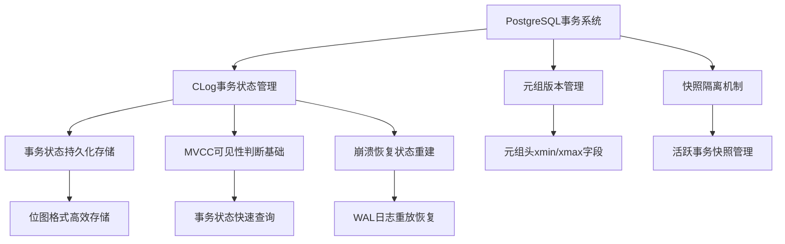

CLog的设计哲学是在保证数据一致性的前提下，最大化事务状态查询的性能。每个事务仅占用2位存储空间，通过精心设计的缓存机制，使得在OLTP工作负载下，绝大多数事务状态查询都能在内存中完成。这种设计体现了PostgreSQL在系统架构上的深度思考：将最频繁的操作路径优化到极致。

## 25.2 CLog架构设计

### 25.2.1 存储结构设计

CLog采用分层存储结构，将事务状态信息组织成段文件、页面和位图的多级层次，既保证了存储效率，又优化了访问性能。

**物理存储组织**：
CLog文件存储在`pg_xact`目录下，采用分段存储策略。每个段文件包含固定数量的事务状态，文件命名采用十六进制递增（0000, 0001, 0002...）。这种设计既支持高效的顺序访问，又便于空间回收管理。

```
pg_xact/                    # CLog专用存储目录
├── 0000                    # 段文件0，包含事务0-32767的状态
├── 0001                    # 段文件1，包含事务32768-65535的状态  
├── 0002                    # 段文件2，包含后续事务状态
└── ...                     # 更多段文件，按需创建
```

**页面内部结构**：
每个CLog页面大小为8KB，采用紧凑的位图格式存储事务状态。页面头部包含管理信息，主体部分按位存储事务状态。

```
+----------------+----------------+-----+----------------+
| 事务0状态(2位) | 事务1状态(2位) | ... | 事务32767状态  |
+----------------+----------------+-----+----------------+
|               页面头信息(24字节)      |   位图数据区域   |
+-------------------------------------+-----------------+
```

**状态编码详细定义**：
CLog使用2位编码表示4种事务状态，这种设计在存储密度和状态表达能力间取得了良好平衡：
- `00` - **事务进行中（IN_PROGRESS）**：事务尚未完成，可能正在执行或处于未决状态。这是事务的初始状态。
- `01` - **事务已提交（COMMITTED）**：事务成功完成，其修改对其他事务可见。这是最常见的事务终态。
- `10` - **事务已中止（ABORTED）**：事务失败回滚，其修改被完全撤销。需要Vacuum清理相关的元组版本。
- `11` - **子事务已提交（SUB_COMMITTED）**：嵌套事务中的子事务提交状态。这种状态需要结合父事务状态判断最终可见性。

**关键数据结构定义**（位于`src/include/access/clog.h`）：

```c
// CLog事务状态枚举定义
typedef enum CLogXidStatus
{
    CLOG_XID_STATUS_IN_PROGRESS = 0x00,   // 事务进行中
    CLOG_XID_STATUS_COMMITTED   = 0x01,   // 事务已提交
    CLOG_XID_STATUS_ABORTED     = 0x02,   // 事务已中止
    CLOG_XID_STATUS_SUB_COMMITTED = 0x03  // 子事务已提交
} CLogXidStatus;
```

### 25.2.2 内存管理架构

CLog采用固定大小的LRU（最近最少使用）缓存来管理内存中的事务状态页面，这种设计在内存使用和访问性能之间取得了良好平衡。

**内存缓存架构详解**：
CLog的缓存系统由三个主要组件构成：LRU链表管理访问顺序，固定大小的页面数组存储实际数据，细粒度锁机制保证并发安全。

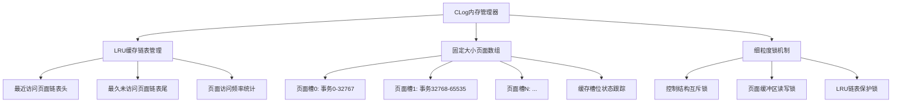

**缓存管理策略**：
- **LRU替换算法**：当缓存空间不足时，优先淘汰最久未被访问的页面。这种策略基于事务访问的时间局部性原理。
- **预取优化**：检测顺序访问模式，提前加载后续可能访问的页面。这对于连续事务ID的访问模式特别有效。
- **批量操作**：对连续的事务状态更新进行批量处理，减少锁竞争。这在事务提交高峰期能显著提升吞吐量。

**缓存命中率优化**：
PostgreSQL默认配置了8个CLog缓存槽，每个槽缓存一个8KB页面。在典型OLTP工作负载中，由于事务ID的分配通常具有局部性（新事务倾向于访问最近的CLog页面），CLog的缓存命中率往往能达到95%以上。这种高命中率确保了事务状态查询的极低延迟，为高并发事务处理提供了基础保障。

## 25.3 CLog核心操作

### 25.3.1 事务状态记录

当事务完成时（提交或中止），系统必须立即在CLog中记录其最终状态。这个过程是事务完成的最后一步，也是确保ACID特性中持久性的关键环节。

**状态记录详细流程**：
事务状态记录是一个多阶段的原子操作，需要确保即使在系统崩溃的情况下也能保持一致性。

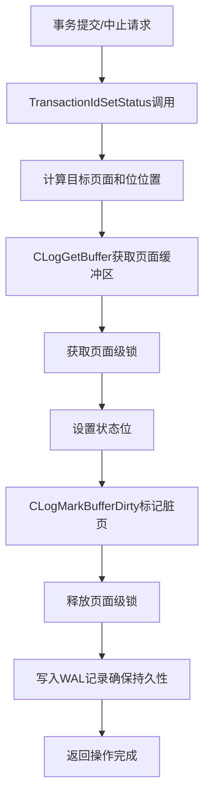

**代码位置：`src/backend/access/transam/clog.c` - TransactionIdSetStatus函数**

```c
void TransactionIdSetStatus(TransactionId xid, CLogXidStatus status) {
    // 计算事务ID对应的物理位置
    int pageno = TransactionIdToPage(xid);
    int byteno = TransactionIdToByte(xid);
    int bshift = TransactionIdToBIndex(xid) * CLOG_BITS_PER_XACT;
    
    // 获取页面缓冲区
    char *byteptr = CLogGetBuffer(xid);
    
    // 原子性地更新状态位
    char old_byte = *byteptr;
    char new_byte = (old_byte & ~(CLOG_XID_STATUS_MASK << bshift)) | 
                    (status << bshift);
    *byteptr = new_byte;
    
    // 标记脏页并确保持久性
    CLogMarkBufferDirty(pageno);
    
    // 写入WAL记录
    if (RelationNeedsWAL(MyDatabaseId)) {
        XLogBeginInsert();
        XLogRegisterBuffer(0, buffer, REGBUF_STANDARD);
        xl_clog_set xlrec;
        xlrec.xid = xid;
        xlrec.status = status;
        XLogRegisterData((char *) &xlrec, sizeof(xlrec));
        XLogInsert(RM_CLOG_ID, XLOG_CLOG_SET_STATUS);
    }
}
```

**关键函数详解**：
- `TransactionIdSetStatus()`：事务状态设置的主入口函数，处理状态位的原子更新。该函数必须保证在并发环境下的正确性。
- `CLogGetBuffer()`：页面缓冲区获取函数，实现LRU缓存管理和页面加载。这是性能关键路径，需要高效处理缓存命中与未命中情况。
- `CLogMarkBufferDirty()`：脏页标记函数，确保修改最终被写回磁盘。该函数与检查点机制紧密配合。

### 25.3.2 事务状态查询

MVCC可见性检查是PostgreSQL中最频繁的操作之一，而事务状态查询是其中的关键步骤。CLog的设计目标就是为此类查询提供亚微秒级的响应时间。

**状态查询详细流程**：
事务状态查询需要高效且线程安全，支持高并发场景下的频繁访问。

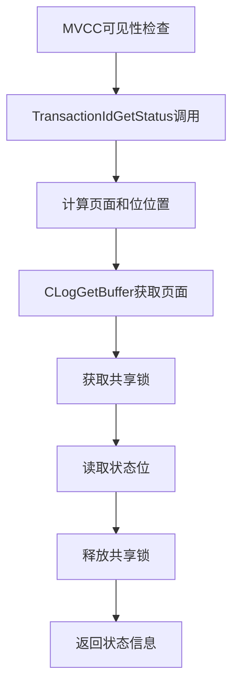

**代码位置：`src/backend/access/transam/clog.c` - TransactionIdGetStatus函数**

```c
CLogXidStatus TransactionIdGetStatus(TransactionId xid) {
    // 计算事务ID对应的物理位置
    int pageno = TransactionIdToPage(xid);
    int byteno = TransactionIdToByte(xid);
    int bshift = TransactionIdToBIndex(xid) * CLOG_BITS_PER_XACT;
    
    // 获取页面缓冲区
    char *byteptr = CLogGetBuffer(xid);
    
    // 读取并返回状态位
    CLogXidStatus status = (*byteptr >> bshift) & CLOG_XID_STATUS_MASK;
    return status;
}
```

**查询优化技术**：
- **内存优先**：通过LRU缓存确保热点页面常驻内存，减少磁盘I/O。
- **锁优化**：使用共享锁支持并发读取，提升吞吐量。读锁之间不互斥，只有写锁才需要排他。
- **局部性利用**：利用事务ID分配的时序局部性，优化缓存行为。新创建的事务倾向于集中在某些CLog页面。

**关键查询函数**：
- `TransactionIdGetStatus()`：基础状态查询函数，返回事务的精确状态。这是最常用的查询接口。
- `TransactionIdDidCommit()`：提交状态判断函数，优化了常见路径。对于已提交事务的检查有特殊优化。
- `TransactionIdIsInProgress()`：进行中状态判断，用于活跃事务检测。在构建事务快照时使用。

**性能特征**：
在内存命中的情况下，事务状态查询通常能在100纳秒内完成。即使在缓存未命中的情况下，通过优化的I/O路径，查询延迟也能控制在微秒级别。这种极低的查询延迟是PostgreSQL能够支持高并发OLTP工作负载的重要基础。

## 25.4 CLog与MVCC集成

### 25.4.1 可见性判断基础

CLog与PostgreSQL的MVCC机制深度集成，为每一行的可见性判断提供权威的事务状态信息。这种集成是数据库保持严格可序列化隔离级别的基石。

**详细的可见性判断流程**：
MVCC可见性判断是一个复杂的过程，需要综合考虑多个因素，而CLog提供的事务状态是其中最关键的判断依据。

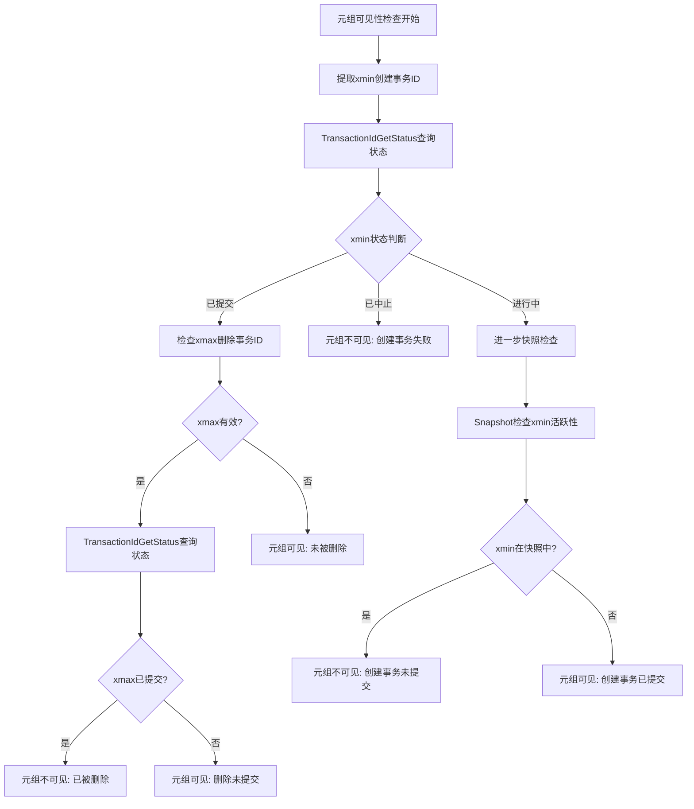

**代码位置：`src/backend/access/heap/heapam_visibility.c` - HeapTupleSatisfiesMVCC函数**

```c
bool HeapTupleSatisfiesMVCC(HeapTuple htup, Snapshot snapshot, Buffer buffer) {
    HeapTupleHeader header = htup->t_data;
    TransactionId xmin = HeapTupleHeaderGetXmin(header);
    TransactionId xmax = HeapTupleHeaderGetXmax(header);
    
    if (TransactionIdIsNormal(xmin)) {
        CLogXidStatus xmin_status = TransactionIdGetStatus(xmin);
        
        switch (xmin_status) {
            case CLOG_XID_STATUS_COMMITTED:
                if (TransactionIdIsNormal(xmax)) {
                    CLogXidStatus xmax_status = TransactionIdGetStatus(xmax);
                    if (xmax_status == CLOG_XID_STATUS_COMMITTED) {
                        return false;
                    }
                }
                return true;
                
            case CLOG_XID_STATUS_ABORTED:
                return false;
                
            case CLOG_XID_STATUS_IN_PROGRESS:
                if (TransactionIdIsCurrentTransactionId(xmin)) {
                    return ...; // 当前事务的特殊处理
                } else if (XidInSnapshot(xmin, snapshot)) {
                    return false;
                } else {
                    return true;
                }
        }
    }
    return false;
}
```

**集成关键点**：
- **状态权威性**：CLog提供的事务状态是可见性判断的最终依据，所有可见性规则都基于CLog的状态信息。
- **性能关键路径**：CLog查询位于性能最敏感的代码路径中，任何优化都能显著提升整体性能。
- **一致性保证**：通过WAL确保CLog状态与数据修改的原子性，防止状态与数据不一致。

### 25.4.2 子事务处理机制

PostgreSQL支持保存点（SAVEPOINT）和嵌套事务，这要求CLog能够正确处理子事务的特殊状态。子事务处理是CLog设计中较为复杂的部分，需要维护父子事务之间的状态依赖关系。

**子事务状态语义**：
子事务的状态语义比普通事务更加复杂，需要特殊的处理逻辑：
- **SUB_COMMITTED状态**：表示子事务在其父事务的上下文中已提交，但对其他事务仍不可见。这是一种中间状态。
- **状态传播**：当父事务提交时，所有SUB_COMMITTED状态的子事务自动变为COMMITTED状态。这是原子性提交的关键。
- **状态回滚**：当父事务回滚时，所有子事务（无论状态如何）都变为ABORTED状态。确保事务的原子性。

**子事务状态转换图**：
子事务的状态转换比普通事务更加复杂，涉及父子事务之间的状态依赖。

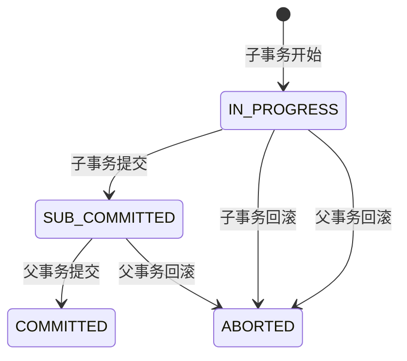

**代码位置：`src/backend/access/transam/clog.c` - TransactionIdDidCommit函数**

```c
bool TransactionIdDidCommit(TransactionId transactionId) {
    CLogXidStatus status = TransactionIdGetStatus(transactionId);
    
    switch (status) {
        case CLOG_XID_STATUS_COMMITTED:
            return true;
            
        case CLOG_XID_STATUS_SUB_COMMITTED:
            TransactionId parentXid = GetParentTransactionId(transactionId);
            if (TransactionIdIsValid(parentXid)) {
                return TransactionIdDidCommit(parentXid);
            }
            return false;
            
        default:
            return false;
    }
}
```

**子事务处理的挑战与解决方案**：
- **状态依赖**：子事务状态依赖于父事务状态，需要级联状态查询。这增加了查询的复杂度。
- **性能影响**：额外的状态查询可能影响性能，通过缓存优化缓解。父子事务关系被缓存以减少查询开销。
- **恢复复杂性**：崩溃恢复时需要正确处理子事务状态链。WAL记录需要包含足够的父子关系信息。

**子事务提交处理**：

**代码位置：`src/backend/access/transam/clog.c` - 子事务提交处理**

```c
void SetSubTransactionStatus(TransactionId xid, TransactionId parentXid) {
    // 设置子事务状态为SUB_COMMITTED
    TransactionIdSetStatus(xid, CLOG_XID_STATUS_SUB_COMMITTED);
    
    // 记录父子关系
    RecordSubTransactionParent(xid, parentXid);
}
```

## 25.5 CLog维护机制

### 25.5.1 空间回收策略

随着数据库运行时间的增长，CLog会不断积累事务状态记录。为了防止存储空间无限增长，PostgreSQL实现了智能的空间回收机制。

**空间回收决策逻辑**：
空间回收需要谨慎进行，确保不会删除仍然需要的事务状态信息。

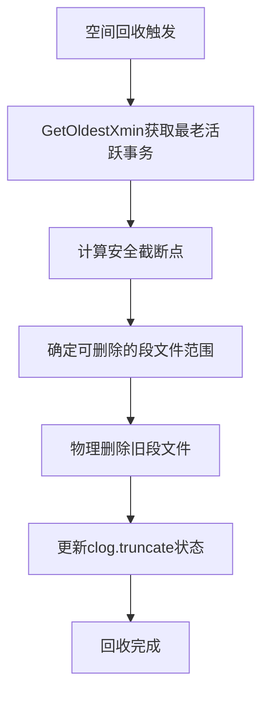

**回收安全条件**：
- **最老活跃事务**：所有比最老活跃事务更早的事务状态都可以安全清理。这是最基本的回收条件。
- **复制槽限制**：逻辑复制槽可能要求保留更久的事务状态，以支持逻辑解码。
- **备机回放**：在流复制备机上，需要主备协调确定安全截断点，防止复制中断。

**代码位置：`src/backend/access/transam/clog.c` - CLogTruncate函数**

```c
void CLogTruncate(TransactionId oldestXact) {
    int cutoffPage = TransactionIdToPage(oldestXact);
    int cutoffSegment = cutoffPage / CLOG_PAGES_PER_SEGMENT;
    
    LWLockAcquire(CLogControlLock, LW_EXCLUSIVE);
    
    for (int segno = 0; segno < cutoffSegment; segno++) {
        char path[MAXPGPATH];
        CLogFileName(path, segno);
        
        if (unlink(path) < 0 && errno != ENOENT) {
            ereport(LOG,
                    (errcode_for_file_access(),
                     errmsg("无法删除CLog段文件 %s: %m", path)));
        }
    }
    
    WriteCLogTruncationInfo(cutoffPage);
    LWLockRelease(CLogControlLock);
    CLogDropPageBuffers(cutoffPage);
}
```

**回收性能优化**：
- **异步执行**：空间回收在后台自动执行，不影响前台业务。通常由autovacuum进程触发。
- **增量清理**：每次只清理可安全删除的最老文件，避免长时间阻塞。分段进行减少对系统的影响。
- **协调机制**：与检查点协调，避免I/O峰值。在检查点期间集中处理磁盘写入。

### 25.5.2 检查点集成

CLog与PostgreSQL的检查点机制深度集成，确保事务状态信息能够及时持久化，同时优化系统整体性能。

**检查点期间的CLog处理**：
检查点是确保数据持久性的重要机制，CLog需要在此过程中正确处理脏页写回。

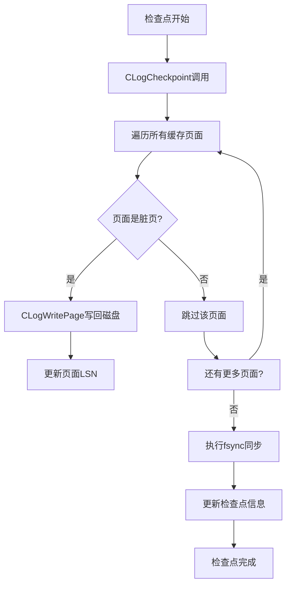

**代码位置：`src/backend/access/transam/clog.c` - CLogCheckpoint函数**

```c
void CLogCheckpoint(void) {
    int slotno;
    
    LWLockAcquire(CLogControlLock, LW_EXCLUSIVE);
    
    for (slotno = 0; slotno < NUM_CLOG_BUFFERS; slotno++) {
        if (ClogCtl->shared->page_dirty[slotno]) {
            CLogWritePage(slotno);
        }
    }
    
    if (ClogCtl->shared->latest_page >= 0) {
        int pageno = ClogCtl->shared->page_number[ClogCtl->shared->latest_page];
        CLogSync(pageno);
    }
    
    LWLockRelease(CLogControlLock);
    TRACE_POSTGRESQL_CLOG_CHECKPOINT_DONE();
}
```

**检查点优化策略**：
- **批量写入**：将多个脏页批量写入磁盘，减少I/O次数。利用操作系统的写缓冲优化。
- **顺序写入**：利用CLog文件的顺序访问特性，优化写入性能。减少磁盘寻道时间。
- **异步持久化**：在确保WAL持久化的前提下，CLog可以采用更灵活的持久化策略。平衡性能与持久性要求。

## 25.6 CLog恢复机制

### 25.6.1 崩溃恢复流程

系统崩溃后，CLog可能处于不一致状态。PostgreSQL的恢复机制通过重放WAL日志来重建CLog的一致性状态。

**崩溃恢复详细流程**：
崩溃恢复是数据库系统可靠性的关键保障，CLog的恢复是其中的重要环节。

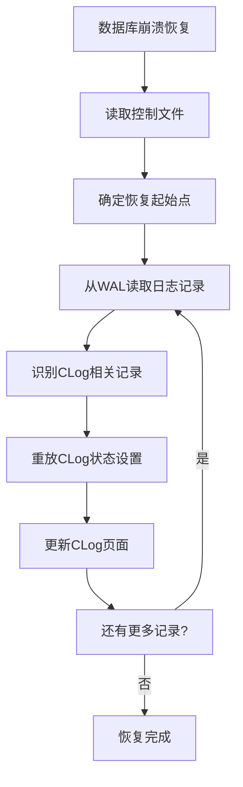

**代码位置：`src/backend/access/transam/clog.c` - clog_redo函数**

```c
void clog_redo(XLogReaderState *record) {
    uint8 info = XLogRecGetInfo(record) & ~XLR_INFO_MASK;
    
    if (info == XLOG_CLOG_ZEROPAGE) {
        xl_clog_zeropage *xlrec = (xl_clog_zeropage *) XLogRecGetData(record);
        CLogZeroPage(xlrec->pageno);
        
    } else if (info == XLOG_CLOG_TRUNCATE) {
        xl_clog_truncate *xlrec = (xl_clog_truncate *) XLogRecGetData(record);
        CLogTruncate(xlrec->pageno);
        
    } else if (info == XLOG_CLOG_SET_STATUS) {
        xl_clog_set *xlrec = (xl_clog_set *) XLogRecGetData(record);
        TransactionIdSetStatus(xlrec->xid, xlrec->status);
    }
}
```

**恢复一致性保证**：
- **重放幂等性**：CLog的WAL记录设计为可重放多次而不影响结果。这是崩溃恢复的基本要求。
- **状态完整性**：通过重放确保所有已提交事务的状态正确记录。防止事务状态丢失或错误。
- **进度持久化**：恢复进度定期记录，避免重复恢复。通过检查点记录恢复位置。

### 25.6.2 容错处理机制

CLog设计了多层次的容错机制，确保在各种异常情况下都能保持数据一致性或提供明确的错误信息。

**错误检测与处理**：
CLog需要能够检测和处理各种类型的错误，从存储层错误到逻辑状态不一致。

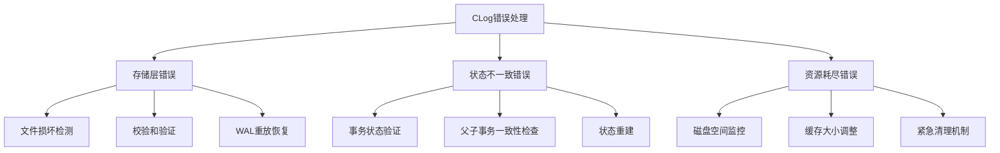

**代码位置：`src/backend/access/transam/clog.c` - CLogHealthCheck函数**

```c
bool CLogHealthCheck(void) {
    if (!CLogFilesystemCheck()) {
        ereport(ERROR, (errmsg("CLog文件系统访问异常")));
        return false;
    }
    
    if (!CLogConsistencyCheck()) {
        ereport(WARNING, (errmsg("CLog状态一致性检查失败，尝试修复")));
        return CLogRepair();
    }
    
    if (!CLogStorageCheck()) {
        ereport(ERROR, (errmsg("CLog存储空间不足")));
        return false;
    }
    
    return true;
}
```

**健康检查与自动修复**：

**代码位置：`src/backend/access/transam/clog.c` - CLogConsistencyCheck函数**

```c
bool CLogConsistencyCheck(void) {
    TransactionId nextXid = ReadNewTransactionId();
    TransactionId oldestXid = GetOldestTransactionId();
    
    for (TransactionId xid = oldestXid; xid < nextXid; xid++) {
        CLogXidStatus status = TransactionIdGetStatus(xid);
        
        if (status == CLOG_XID_STATUS_IN_PROGRESS) {
            if (TransactionIdPrecedes(xid, oldestXid)) {
                ereport(WARNING, (errmsg("发现异常进行中事务 %u", xid)));
                return false;
            }
        }
        
        if (status == CLOG_XID_STATUS_SUB_COMMITTED) {
            TransactionId parentXid = GetParentTransactionId(xid);
            if (TransactionIdIsValid(parentXid)) {
                CLogXidStatus parentStatus = TransactionIdGetStatus(parentXid);
                if (parentStatus == CLOG_XID_STATUS_ABORTED) {
                    ereport(WARNING, 
                           (errmsg("子事务 %u 状态不一致，父事务 %u 已中止", 
                                   xid, parentXid)));
                    return false;
                }
            }
        }
    }
    return true;
}
```

## 25.7 性能优化策略

### 25.7.1 缓存优化技术

CLog的缓存性能直接影响到整个数据库的事务处理能力。PostgreSQL实现了多种缓存优化技术来最大化CLog的访问效率。

**多级缓存优化策略**：
- **LRU主缓存**：固定大小的内存缓存，存储最活跃的事务状态页面。这是性能优化的核心。
- **预取从缓存**：检测顺序访问模式，预加载后续页面。利用访问的局部性原理。
- **操作系统页面缓存**：利用文件系统缓存作为第二级缓存。减少实际磁盘I/O。

**代码位置：`src/backend/access/transam/clog.c` - CLogGetBuffer函数**

```c
char *CLogGetBuffer(TransactionId xid) {
    int pageno = TransactionIdToPage(xid);
    int slotno;
    
    LWLockAcquire(CLogControlLock, LW_EXCLUSIVE);
    
    slotno = CLogFindBuffer(pageno);
    if (slotno >= 0) {
        CLogMoveToFront(slotno);
        LWLockRelease(CLogControlLock);
        return &ClogCtl->page_buffer[slotno];
    }
    
    slotno = CLogSelectLRUVictim(pageno);
    
    if (ClogCtl->shared->page_dirty[slotno]) {
        CLogWritePage(slotno);
    }
    
    CLogReadPage(pageno, slotno);
    CLogMoveToFront(slotno);
    
    LWLockRelease(CLogControlLock);
    return &ClogCtl->page_buffer[slotno];
}
```

### 25.7.2 I/O优化方法

CLog的I/O性能优化主要集中在减少磁盘访问次数和优化访问模式上。

**I/O优化技术详解**：

**代码位置：`src/backend/access/transam/clog.c` - CLogWritePage函数**

```c
void CLogWritePage(int slotno) {
    if (ClogCtl->shared->page_dirty[slotno + 1] &&
        ClogCtl->shared->page_number[slotno + 1] == 
        ClogCtl->shared->page_number[slotno] + 1) {
        CLogWriteMultiplePages(slotno, 2);
    } else {
        CLogWriteSinglePage(slotno);
    }
}
```

## 25.8 监控与诊断

### 25.8.1 运行状态监控

有效的监控是保证CLog稳定运行的关键。PostgreSQL提供了多层次的监控手段来跟踪CLog的运行状态。

**关键监控指标**：

1. **性能指标**：
   - **缓存命中率**：反映内存缓存效率，目标值>95%
   - **查询延迟**：事务状态查询的P50、P95、P99延迟
   - **写入吞吐量**：事务状态更新的每秒操作数

2. **资源指标**：
   - **内存使用**：CLog缓存占用的内存大小
   - **磁盘空间**：CLog文件占用的磁盘空间
   - **I/O统计**：读写操作的次数和延迟

### 25.8.2 健康检查机制

定期的健康检查可以及时发现潜在问题，防止小问题演变成严重故障。

**健康检查项目**：

**代码位置：`src/backend/access/transam/clog.c` - CLogFilesystemCheck函数**

```c
bool CLogFilesystemCheck(void) {
    if (access("pg_xact", F_OK) != 0) {
        ereport(LOG, (errcode_for_file_access(),
                     errmsg("CLog目录 pg_xact 不可访问")));
        return false;
    }
    
    if (access("pg_xact/0000", R_OK | W_OK) != 0) {
        ereport(LOG, (errcode_for_file_access(),
                     errmsg("CLog文件权限异常")));
        return false;
    }
    
    struct statvfs svfs;
    if (statvfs("pg_xact", &svfs) == 0) {
        double free_ratio = (double)svfs.f_bavail / svfs.f_blocks;
        if (free_ratio < 0.05) {
            ereport(WARNING, 
                   (errmsg("CLog磁盘空间不足，剩余: %.1f%%", free_ratio * 100)));
            return false;
        }
    }
    
    return true;
}
```

## 25.9 CLog完整工作流

为了全面理解CLog在PostgreSQL中的作用，我们需要从系统整体的视角来看待它的工作流程。

**CLog在数据库系统中的完整工作流程**：
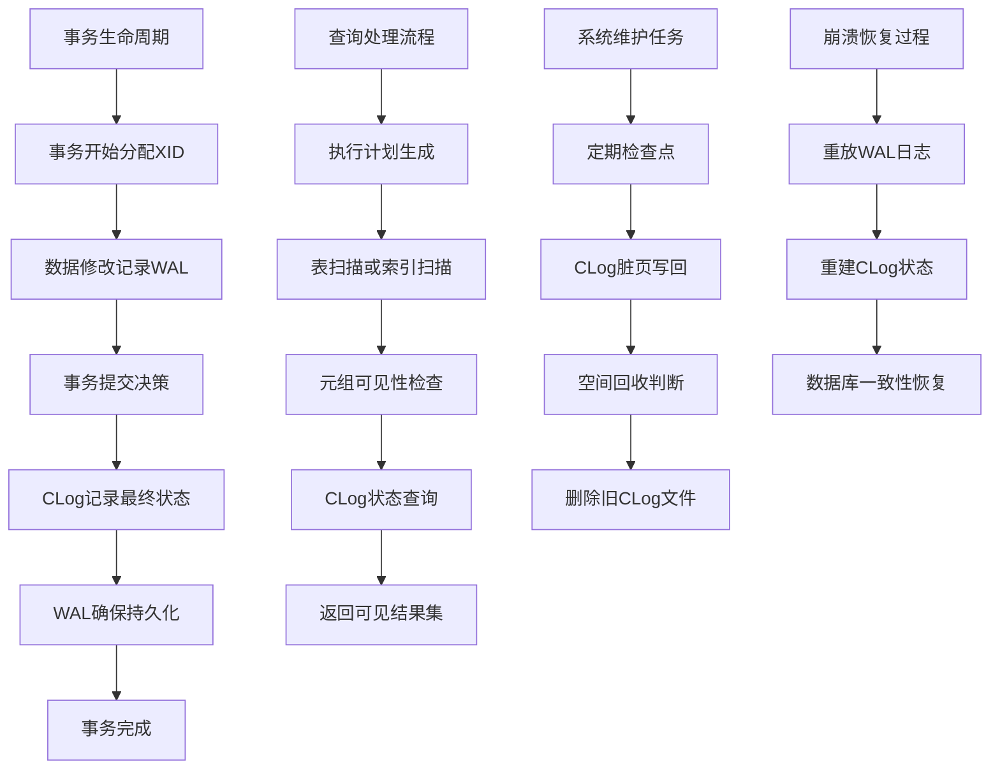

## 25.10 错误处理与恢复

### 25.10.1 错误检测机制

CLog实现了全面的错误检测机制，能够在问题发生的早期发现并处理异常情况。

**分层错误检测体系**：

**代码位置：`src/backend/access/transam/clog.c` - CLogStorageCheck函数**

```c
bool CLogStorageCheck(void) {
    struct statvfs svfs;
    if (statvfs("pg_xact", &svfs) == 0) {
        double free_ratio = (double)svfs.f_bavail / svfs.f_blocks;
        if (free_ratio < 0.05) {
            ereport(ERROR, (errcode(ERRCODE_DISK_FULL),
                     errmsg("CLog磁盘空间不足，剩余: %.1f%%", free_ratio * 100)));
            return false;
        }
    }
    return true;
}
```

## 25.11 本章小结

本章深入探讨了PostgreSQL CLog组件的设计原理、实现机制和优化策略。通过对CLog的全面分析，我们可以得出以下重要结论：

1. **基础架构的核心地位**：CLog虽然不是用户直接接触的组件，但它是PostgreSQL事务系统的基石。其稳定性和性能直接决定了整个数据库系统的事务处理能力和数据一致性保障水平。

2. **精巧的设计哲学**：CLog采用位图存储事务状态，每个事务仅占用2位空间，这种极致的数据压缩体现了PostgreSQL在存储效率方面的深度优化。同时，通过LRU缓存、批量操作、预取优化等技术，在有限的资源下实现了极高的性能。

3. **深度系统集成**：CLog不是孤立存在的，它与WAL日志、MVCC可见性、检查点机制、崩溃恢复等核心模块紧密集成。这种深度集成使得PostgreSQL能够提供严格的ACID事务保证，同时保持良好的性能表现。

4. **完善的运维支持**：通过空间回收、健康检查、监控指标、自动恢复等机制，CLog具备了生产环境所需的可维护性和可靠性。数据库管理员可以通过丰富的监控手段及时发现问题，并通过多种恢复策略应对各种异常情况。

5. **持续的性能优化**：从缓存优化到I/O模式识别，从锁竞争减少到批量操作支持，CLog在各个环节都进行了精细的性能优化。这些优化确保了在高并发OLTP场景下，事务状态查询不会成为系统瓶颈。

6. **强大的容错能力**：通过WAL日志重放、状态一致性检查、多级恢复策略等手段，CLog具备了应对各种硬件故障和软件异常的能力。这种强大的容错能力是PostgreSQL作为企业级数据库的重要特征。

CLog的设计和实现充分体现了PostgreSQL在数据库内核开发方面的技术积淀。理解CLog的工作原理不仅有助于数据库内核开发者深入掌握事务处理机制，也对数据库管理员进行性能调优和故障诊断具有重要指导意义。随着新硬件技术的发展和新工作负载模式的出现，CLog的架构也在不断演进，但其核心设计理念将继续指导着PostgreSQL事务系统的发展方向。