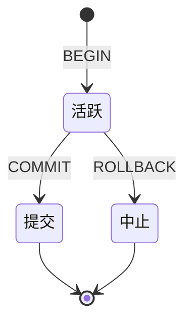
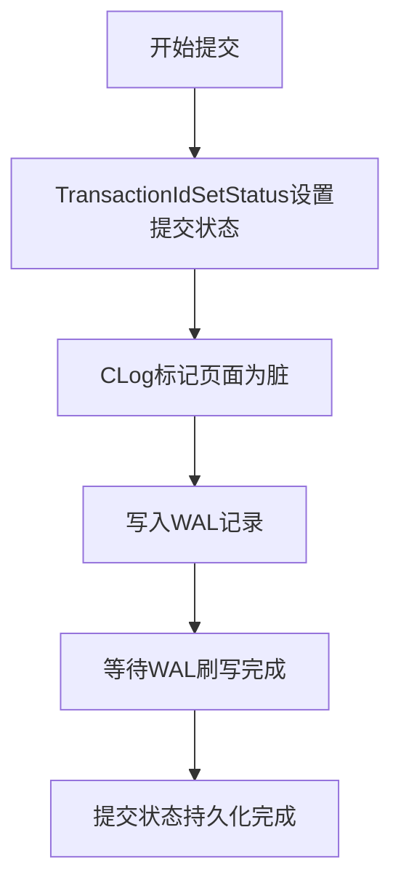
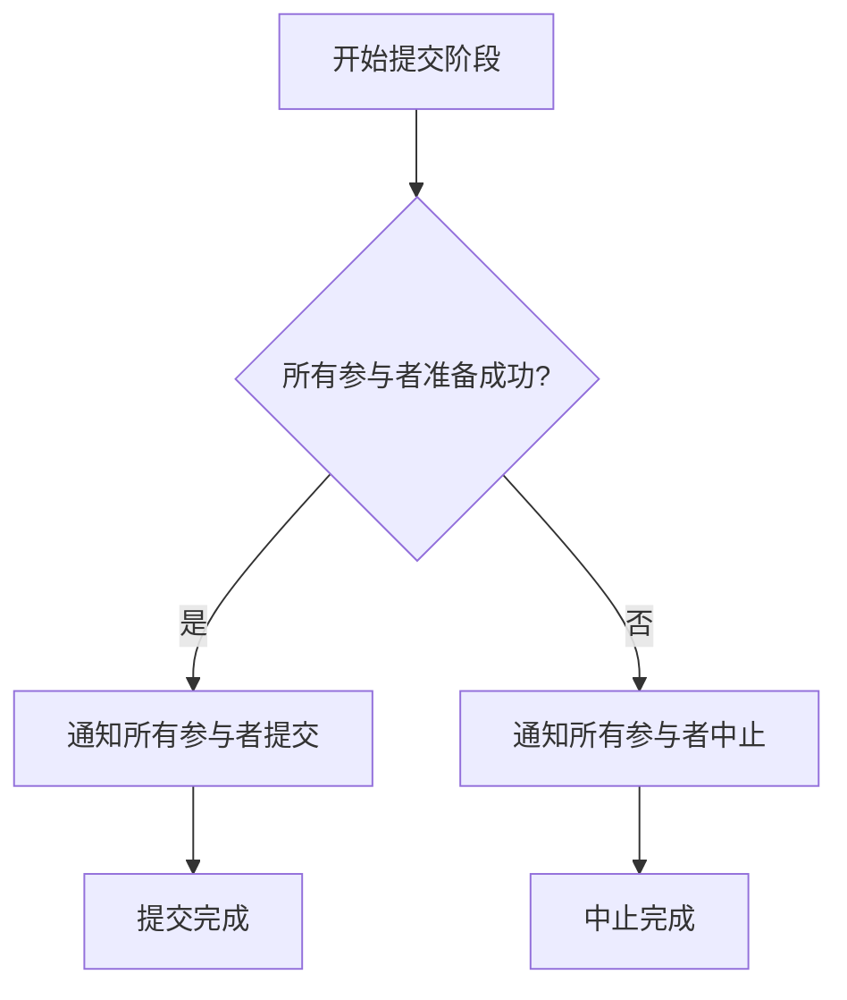
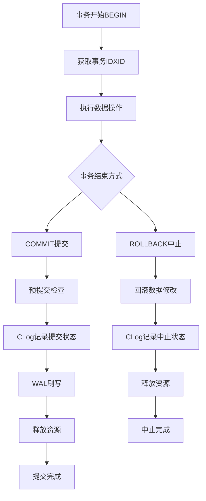

# 第26章 事务提交与终止过程

## 26.1 事务生命周期概述

事务是数据库管理系统的基本工作单元，PostgreSQL使用事务来保证数据库的一致性和隔离性。每个事务从开始到结束经历多个阶段，其中提交和终止是两个关键的终结状态。

**事务生命周期的关键阶段**：
- **开始**：事务获得唯一的事务ID（XID）并初始化状态
- **活跃**：事务执行数据修改操作，但修改尚未持久化
- **提交**：事务成功完成，所有修改永久生效
- **中止**：事务失败回滚，所有修改被撤销

**事务状态转换图**：


## 26.2 事务提交过程

### 26.2.1 提交流程概述

事务提交是将事务的所有修改永久保存到数据库的过程，这是确保ACID特性中持久性的关键环节。

**提交过程的主要步骤**：
1. **预提交检查**：验证事务是否可以安全提交
2. **CLog状态设置**：在提交日志中记录事务状态
3. **WAL刷写**：确保事务日志持久化
4. **资源释放**：释放事务持有的锁和内存资源

**代码位置**：`src/backend/access/transam/xact.c` - `CommitTransaction`函数

### 26.2.2 预提交阶段

在正式提交之前，系统需要执行一系列检查确保事务可以安全提交。

**预提交检查内容**：
- **约束验证**：检查所有约束条件是否满足
- **触发器执行**：执行BEFORE触发器
- **并发控制**：检查序列化冲突（可序列化隔离级别）

**代码位置**：`src/backend/access/transam/xact.c` - `PreCommit_CheckForSerializationFailure`函数

```c
static void PreCommit_CheckForSerializationFailure(void) {
    if (IsolationIsSerializable()) {
        // 检查可序列化隔离级别下的冲突
        CheckSerializableConflictIn();
    }
}
```

### 26.2.3 CLog状态记录

在事务提交过程中，最关键的一步是在CLog中记录事务的提交状态。

**CLog记录流程**：


**代码位置**：`src/backend/access/transam/clog.c` - `TransactionIdSetStatus`函数

```c
void TransactionIdSetStatus(TransactionId xid, CLogXidStatus status) {
    // 计算CLog页面和位置
    pageno = TransactionIdToPage(xid);
    byteno = TransactionIdToByte(xid);
    bshift = TransactionIdToBIndex(xid) * CLOG_BITS_PER_XACT;
    
    // 获取CLog页面缓冲区
    byteptr = CLogGetBuffer(xid);
    
    // 设置状态位
    *byteptr = (*byteptr & ~(CLOG_XID_STATUS_MASK << bshift)) | (status << bshift);
    
    // 标记页面为脏
    CLogMarkBufferDirty(pageno);
    
    // 写入WAL记录
    if (RelationNeedsWAL(MyDatabaseId)) {
        XLogBeginInsert();
        XLogRegisterBuffer(0, buffer, REGBUF_STANDARD);
        xlrec.xid = xid;
        xlrec.status = status;
        XLogRegisterData((char *) &xlrec, sizeof(xlrec));
        XLogInsert(RM_CLOG_ID, XLOG_CLOG_SET_STATUS);
    }
}
```

### 26.2.4 WAL刷写机制

WAL（Write-Ahead Logging）是PostgreSQL确保数据持久性的核心技术，事务提交必须等待相关WAL记录被持久化。

**WAL刷写策略**：
- **同步提交**：等待WAL记录写入持久存储后才返回
- **异步提交**：不等待WAL持久化，提高性能但可能丢失数据
- **组提交**：合并多个事务的WAL刷写请求，提高吞吐量

**代码位置**：`src/backend/access/transam/xlog.c` - `XLogFlush`函数

```c
void XLogFlush(XLogRecPtr record) {
    XLogRecPtr WriteRqstPtr = record;
    XLogRecPtr FlushPtr;
    
    // 获取需要刷写的位置
    LWLockAcquire(WALWriteLock, LW_EXCLUSIVE);
    
    // 执行WAL刷写
    if (openLogFile >= 0 && !XLByteInSeg(WriteRqstPtr, openLogSegNo)) {
        XLogFileClose();
    }
    if (openLogFile < 0) {
        XLByteToSeg(WriteRqstPtr, openLogSegNo);
        openLogFile = XLogFileInit(openLogSegNo);
    }
    
    // 写入WAL数据
    XLogWrite(WriteRqstPtr, openLogSegNo);
    
    LWLockRelease(WALWriteLock);
    
    // 等待刷写完成（同步提交）
    if (SyncCommit) {
        XLogWaitFlush(WriteRqstPtr);
    }
}
```

### 26.2.5 资源清理

事务提交后需要释放其占用的所有资源，包括锁、内存上下文和快照。

**资源清理步骤**：
1. **释放锁**：释放事务持有的所有表锁和行锁
2. **清理内存**：销毁事务内存上下文
3. **移除快照**：从事务管理器注销快照
4. **通知等待者**：唤醒等待该事务的其他进程

**代码位置**：`src/backend/storage/lmgr/lock.c` - `LockReleaseAll`函数

```c
void LockReleaseAll(LOCKMETHODID lockmethodid, bool allLocks) {
    HASH_SEQ_STATUS status;
    LOCALLOCK *locallock;
    
    // 遍历所有本地锁
    hash_seq_init(&status, LockMethodLocalHash);
    while ((locallock = (LOCALLOCK *) hash_seq_search(&status)) != NULL) {
        // 释放单个锁
        LockRefindAndRelease(lockmethodid, GetCurrentTransactionId(),
                            locallock->tag.lock, locallock->tag.mode, allLocks);
    }
}
```

## 26.3 事务中止过程

### 26.3.1 中止流程概述

事务中止是事务因各种原因失败时的回滚过程，需要撤销所有已执行的修改，恢复数据库到事务开始前的状态。

**中止过程的主要步骤**：
1. **撤销修改**：回滚所有数据修改操作
2. **CLog状态设置**：在提交日志中记录中止状态
3. **资源释放**：释放事务持有的锁和内存资源
4. **错误处理**：报告错误信息给客户端

**代码位置**：`src/backend/access/transam/xact.c` - `AbortTransaction`函数

### 26.3.2 回滚操作

回滚操作需要撤销事务执行的所有数据修改，包括表数据、索引更新等。

**回滚机制**：
- **元组回滚**：通过HOT（Heap Only Tuple）机制清理无效元组
- **索引回滚**：删除事务添加的索引条目
- **TOAST回滚**：清理大对象存储的修改

**代码位置**：`src/backend/access/heap/rewriteheap.c` - `rewrite_heap_tuple`函数

```c
static void rewrite_heap_tuple(RewriteState state,
                              HeapTuple old_tuple, HeapTuple new_tuple) {
    // 如果是回滚操作，需要恢复旧版本元组
    if (state->rs_abort) {
        // 将元组标记为已删除
        ItemPointerData delete_ctid;
        TransactionId delete_xid = GetCurrentTransactionId();
        
        // 设置元组头信息，标记为删除
        new_tuple->t_data->t_infomask |= HEAP_XMAX_INVALID;
        new_tuple->t_data->t_infomask2 &= ~HEAP_KEYS_UPDATED;
        ItemPointerSet(&delete_ctid, state->rs_blockno, state->rs_offnum);
        new_tuple->t_data->t_ctid = delete_ctid;
    }
    
    // 写入回滚后的元组
    heap_insert(state->rs_new_rel, new_tuple, state->rs_cid, 0, NULL);
}
```

### 26.3.3 子事务回滚

PostgreSQL支持保存点（SAVEPOINT），允许事务部分回滚到之前的保存点。

**子事务回滚处理**：
- **保存点管理**：维护保存点堆栈
- **部分回滚**：只回滚到特定保存点，保留后续修改
- **状态恢复**：恢复保存点时的数据库状态

**代码位置**：`src/backend/access/transam/xact.c` - `RollbackToSavepoint`函数

```c
void RollbackToSavepoint(const char *name) {
    TransactionState s = CurrentTransactionState;
    Savepoint savepoint;
    
    // 查找指定保存点
    savepoint = FindSavepoint(name);
    if (savepoint == NULL) {
        ereport(ERROR, (errcode(ERRCODE_S_E_INVALID_SPECIFICATION),
                        errmsg("no such savepoint")));
    }
    
    // 回滚到保存点
    while (s != savepoint->transactionState) {
        if (s->parent == NULL) {
            break;
        }
        AbortSubTransaction(s);
        s = s->parent;
    }
    
    // 恢复保存点状态
    CurrentTransactionState = s;
    s->state = TRANS_INPROGRESS;
}
```

## 26.4 两阶段提交

### 26.4.1 分布式事务支持

PostgreSQL支持两阶段提交（2PC），用于在分布式环境中协调多个数据库节点的事务。

**两阶段提交阶段**：
1. **准备阶段**：所有参与者准备提交，记录准备状态
2. **提交阶段**：协调者通知所有参与者正式提交

**代码位置**：`src/backend/access/transam/twophase.c` - `PrepareTransaction`函数

```c
void PrepareTransaction(const char *gid) {
    GlobalTransaction gxact;
    
    // 检查事务状态
    if (MyXactDidWrite) {
        // 记录准备记录到WAL
        XlogAssignedLock();
        XLogInsert(RM_XACT_ID, XLOG_XACT_PREPARE);
        
        // 在TwoPhaseState中注册准备事务
        gxact = MarkAsPreparing(GetCurrentTransactionId(), gid);
        RegisterTwoPhaseRecord(gxact);
    }
    
    // 设置事务状态为准备完成
    CurrentTransactionState->state = TRANS_PREPARE;
}
```

### 26.4.2 准备阶段

在准备阶段，事务将其状态持久化，确保即使在系统崩溃后也能正确恢复。

**准备阶段操作**：
- **状态持久化**：将事务状态写入持久存储
- **资源保留**：保持事务持有的锁
- **WAL记录**：写入准备记录到WAL日志

### 26.4.3 提交阶段

在提交阶段，协调者根据所有参与者的准备状态决定提交或中止事务。

**提交决策流程**：


**代码位置**：`src/backend/access/transam/twophase.c` - `FinishPreparedTransaction`函数

```c
void FinishPreparedTransaction(const char *gid, bool isCommit) {
    GlobalTransaction gxact;
    
    // 查找准备事务
    gxact = FindPreparedTransaction(gid, false);
    if (gxact == NULL) {
        ereport(ERROR, (errcode(ERRCODE_INVALID_TRANSACTION_STATE),
                        errmsg("transaction identifier \"%s\" is not prepared", gid)));
    }
    
    // 执行提交或中止
    if (isCommit) {
        CommitPreparedTransaction(gxact);
    } else {
        AbortPreparedTransaction(gxact);
    }
}
```

## 26.5 事务状态管理

### 26.5.1 事务状态跟踪

PostgreSQL需要跟踪所有活动事务的状态，用于MVCC可见性判断和并发控制。

**事务状态信息**：
- **活跃事务列表**：当前正在进行的事务
- **提交状态**：已提交事务的状态
- **子事务关系**：父子事务的层次关系

**代码位置**：`src/backend/access/transam/xact.c` - `TransactionIdIsInProgress`函数

```c
bool TransactionIdIsInProgress(TransactionId xid) {
    // 检查当前事务
    if (TransactionIdIsCurrentTransactionId(xid)) {
        return true;
    }
    
    // 检查活跃事务列表
    LWLockAcquire(ProcArrayLock, LW_SHARED);
    for (int index = 0; index < arrayP->numProcs; index++) {
        PGPROC *proc = arrayP->procs[index];
        if (proc->xid == xid) {
            LWLockRelease(ProcArrayLock);
            return true;
        }
    }
    LWLockRelease(ProcArrayLock);
    
    return false;
}
```

### 26.5.2 快照管理

快照（Snapshot）是事务在某个时间点看到的数据库一致性视图，用于实现MVCC隔离级别。

**快照组成**：
- **xmin**：最早仍活跃的事务ID
- **xmax**：下一个将要分配的事务ID
- **xip_list**：当前活跃的事务ID列表

**代码位置**：`src/backend/utils/time/snapmgr.c` - `GetTransactionSnapshot`函数

```c
Snapshot GetTransactionSnapshot(void) {
    // 获取当前事务快照
    if (FirstSnapshotSet) {
        return CurrentSnapshot;
    }
    
    // 构建新快照
    CurrentSnapshot = GetSnapshotData(&CurrentSnapshotData);
    FirstSnapshotSet = true;
    
    return CurrentSnapshot;
}
```

## 26.6 错误处理与恢复

### 26.6.1 事务失败处理

当事务执行过程中发生错误时，需要妥善处理以确保数据库一致性。

**常见错误类型**：
- **约束违反**：唯一约束、外键约束等
- **死锁**：多个事务相互等待资源
- **系统错误**：硬件故障、存储空间不足等

**代码位置**：`src/backend/access/transam/xact.c` - `AbortCurrentTransaction`函数

```c
void AbortCurrentTransaction(void) {
    TransactionState s = CurrentTransactionState;
    
    // 回滚所有子事务
    while (s->parent != NULL) {
        AbortSubTransaction(s);
        s = s->parent;
    }
    
    // 回滚主事务
    AbortTransaction(s);
    
    // 清理资源
    CleanupTransaction();
}
```

### 26.6.2 崩溃恢复

系统崩溃后，PostgreSQL通过WAL日志恢复事务一致性状态。

**恢复过程**：
1. **重放WAL**：重新执行已提交事务的修改
2. **回滚未提交事务**：撤销未提交事务的修改
3. **重建CLog**：恢复事务提交状态

**代码位置**：`src/backend/access/transam/xlog.c` - `StartupXLOG`函数

```c
void StartupXLOG(void) {
    // 读取检查点记录
    checkPoint = ReadCheckpointRecord(NULL);
    
    // 重放WAL记录
    do {
        record = ReadRecord(NULL, LOG);
        if (record != NULL) {
            // 重放单个记录
            xlog_redo(record);
        }
    } while (record != NULL);
    
    // 恢复完成
    CreateEndOfRecoveryRecord();
}
```

## 26.7 性能优化策略

### 26.7.1 组提交优化

组提交（Group Commit）通过合并多个事务的WAL刷写请求来提高系统吞吐量。

**组提交机制**：
- **请求合并**：将多个事务的WAL刷写合并为一次操作
- **领导选举**：选择一个事务作为组提交领导
- **批量刷写**：一次性刷写多个事务的WAL记录

**代码位置**：`src/backend/access/transam/xlog.c` - `XLogFlush`函数中的组提交逻辑

### 26.7.2 异步提交优化

异步提交通过减少事务提交的等待时间来提高性能，但可能牺牲一定的持久性保证。

**异步提交权衡**：
- **性能提升**：不需要等待WAL持久化
- **数据风险**：系统崩溃可能导致最近提交的事务丢失
- **适用场景**：对性能要求高、可容忍少量数据丢失的应用

**配置参数**：`synchronous_commit`

## 26.8 事务完整工作流

以下图表展示了事务从开始到结束的完整处理流程：



## 26.9 本章小结

本章详细解析了PostgreSQL事务提交与终止过程的实现机制：

1. **完整的事务生命周期管理**：从事务开始、活跃状态到提交或中止，PostgreSQL提供了完整的事务管理框架。

2. **严格的ACID保证**：通过WAL日志、CLog状态管理和资源锁机制，确保事务的原子性、一致性、隔离性和持久性。

3. **灵活的事务控制**：支持保存点、子事务回滚、两阶段提交等高级特性，满足复杂应用场景的需求。

4. **高效的并发处理**：通过MVCC、快照隔离、锁管理等技术，实现高并发环境下的数据一致性。

5. **可靠的恢复机制**：基于WAL的崩溃恢复确保系统在故障后能够快速恢复一致性状态。

6. **持续的性能优化**：通过组提交、异步提交、锁优化等技术，不断提升事务处理性能。

事务管理是数据库系统的核心功能，PostgreSQL在这一领域的成熟实现为其在企业级应用中的可靠性奠定了坚实基础。理解事务提交与终止的内部机制对于数据库开发者和管理员进行性能调优和故障诊断具有重要意义。