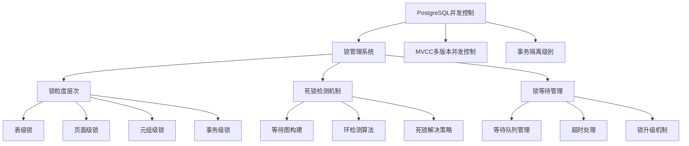
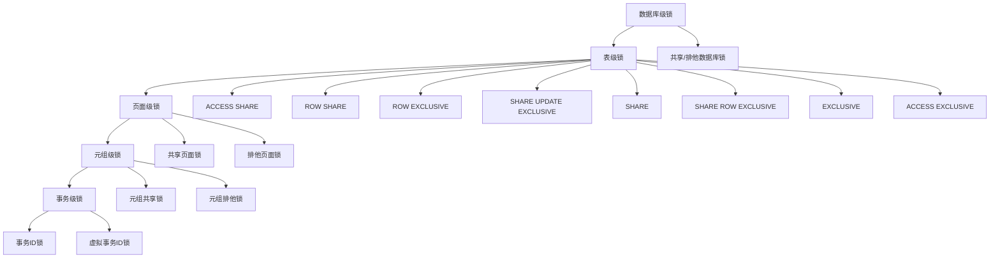
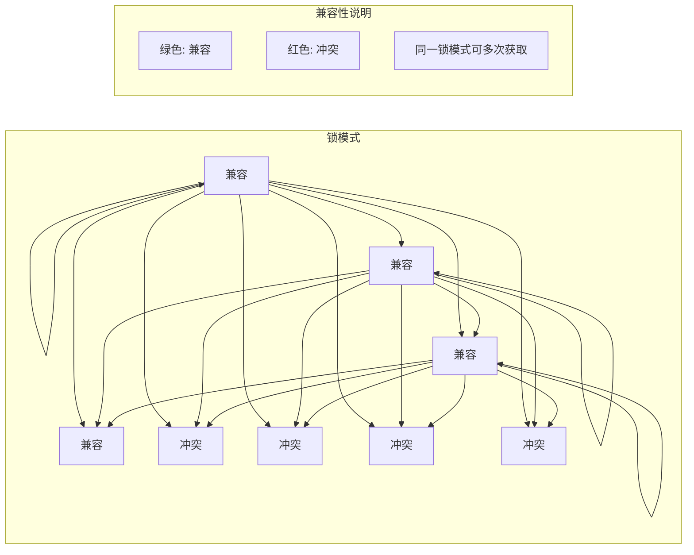
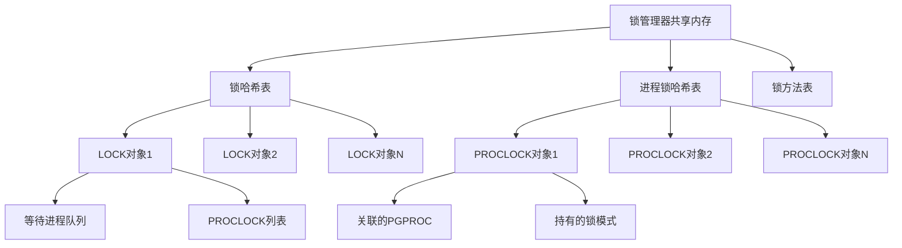
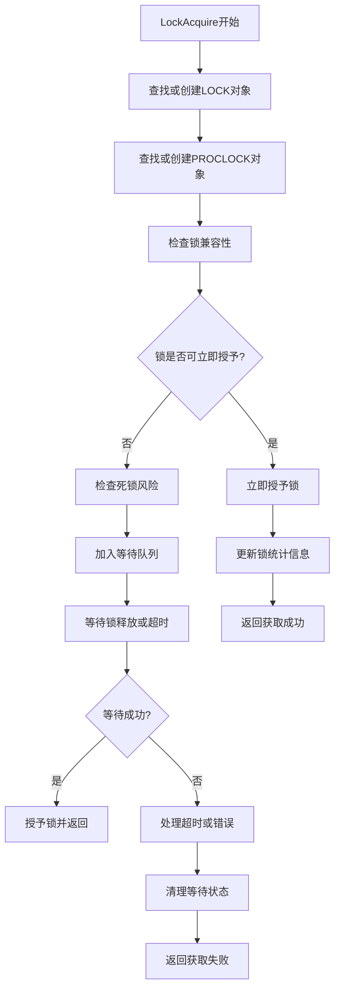
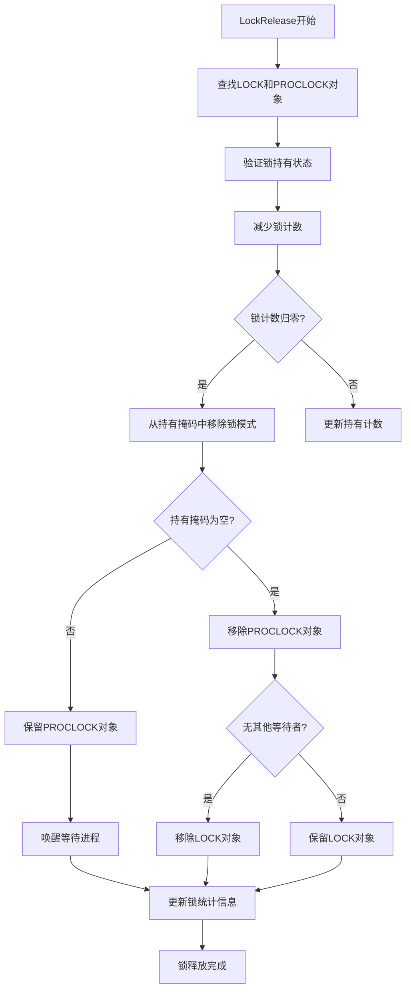
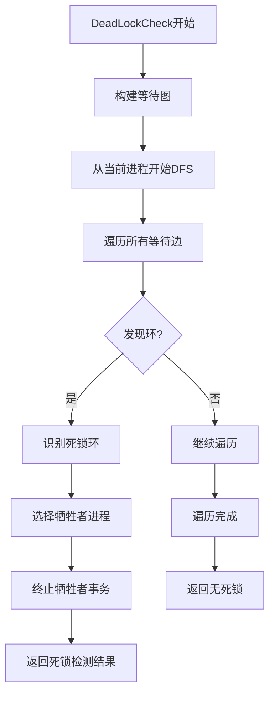
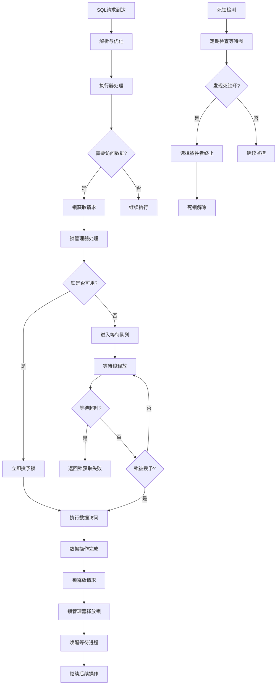

# 第27章 锁管理

## 27.1 锁系统概述

PostgreSQL的锁管理系统是数据库并发控制的核心组件，负责协调多个并发事务对共享资源的访问顺序，防止数据不一致性，同时保证系统的高吞吐量和低延迟。锁系统采用分层设计，在不同粒度上提供并发控制，从轻量级的原子操作到复杂的谓词锁，构成了完整的并发控制体系。

**锁系统在PostgreSQL架构中的位置**：


**锁系统的核心目标**：
- **数据一致性**：通过序列化访问防止脏读、不可重复读和幻读
- **高并发性**：通过多粒度锁和锁模式优化最大化系统吞吐量
- **死锁预防**：通过检测和解决死锁确保系统可用性
- **性能优化**：最小化锁开销，避免成为系统瓶颈

## 27.2 锁体系结构设计

### 27.2.1 多粒度锁层次

PostgreSQL实现了精细的多粒度锁层次，从粗粒度到细粒度逐级细化，在保护强度和并发度之间取得平衡。

**锁粒度完整层次结构**：


**不同锁粒度的应用场景**：
- **数据库级锁**：用于DDL操作、数据库维护等全局操作
- **表级锁**：用于表结构变更、大量数据加载等操作
- **页面级锁**：用于堆页面和索引页面的并发访问控制
- **元组级锁**：用于行级数据的并发读写控制
- **事务级锁**：用于事务ID分配和快照管理等内部操作

### 27.2.2 锁模式与兼容性

PostgreSQL定义了8种表级锁模式，每种模式具有特定的语义和兼容性规则，构成了复杂的锁兼容性矩阵。

**关键代码位置**：`src/include/storage/lockdefs.h`

**锁模式定义**：
```c
// src/include/storage/lockdefs.h - 锁模式枚举
typedef enum LockTagType
{
    LOCKTAG_RELATION,           /* 关系锁 */
    LOCKTAG_RELATION_EXTEND,    /* 关系扩展锁 */
    LOCKTAG_PAGE,               /* 页面锁 */
    LOCKTAG_TUPLE,              /* 元组锁 */
    LOCKTAG_TRANSACTION,        /* 事务锁 */
    LOCKTAG_VIRTUALTRANSACTION, /* 虚拟事务锁 */
    LOCKTAG_OBJECT,             /* 对象锁 */
    LOCKTAG_USERLOCK,           /* 用户锁 */
    LOCKTAG_ADVISORY            /* 咨询锁 */
} LockTagType;

// 表级锁模式定义
#define AccessShareLock          1    /* SELECT */
#define RowShareLock             2    /* SELECT FOR UPDATE/SHARE */
#define RowExclusiveLock         3    /* INSERT, UPDATE, DELETE */
#define ShareUpdateExclusiveLock 4    /* VACUUM, ANALYZE */
#define ShareLock                5    /* CREATE INDEX */
#define ShareRowExclusiveLock    6    /* 类似EXCLUSIVE，但允许ROW SHARE */
#define ExclusiveLock            7    /* 阻塞ROW SHARE */
#define AccessExclusiveLock      8    /* ALTER TABLE, DROP TABLE */
```

**锁兼容性矩阵**：


### 27.2.3 锁管理器内存结构

锁管理器采用共享内存中的哈希表来管理所有锁信息，通过精心设计的数据结构实现高效的锁操作。

**关键代码位置**：`src/include/storage/lock.h`

**锁管理器核心数据结构**：
```c
// src/include/storage/lock.h - 主要数据结构定义

// 锁标签：唯一标识一个被锁对象
typedef struct LOCKTAG
{
    uint32      locktag_field1; /* 对象标识符1 */
    uint32      locktag_field2; /* 对象标识符2 */
    uint32      locktag_field3; /* 对象标识符3 */
    uint32      locktag_field4; /* 对象标识符4 */
    uint16      locktag_type;   /* 锁类型 */
    uint16      locktag_lockmethodid; /* 锁方法ID */
} LOCKTAG;

// 锁对象：表示一个被锁对象上的所有锁信息
typedef struct LOCK
{
    LOCKTAG     tag;            /* 锁对象的唯一标识 */
    LOCKMASK    grantMask;      /* 已授予的锁模式位图 */
    LOCKMASK    waitMask;       /* 等待中的锁模式位图 */
    SHM_QUEUE   procLocks;      /* 与此锁关联的PROCLOCK列表 */
    PROC_QUEUE  waitProcs;      /* 等待此锁的进程队列 */
    int         requested[MAX_LOCKMODES];  /* 每种模式请求计数 */
    int         nRequested;     /* 总请求计数 */
    int         granted[MAX_LOCKMODES];    /* 每种模式授予计数 */
    int         nGranted;       /* 总授予计数 */
} LOCK;

// 进程锁关联：连接进程与锁对象
typedef struct PROCLOCK
{
    PROCLOCKTAG tag;            /* 进程和锁的关联标识 */
    LOCK       *myLock;         /* 指向LOCK对象 */
    PGPROC     *myProc;         /* 指向进程结构 */
    LOCKMASK    holdMask;       /* 进程持有的锁模式 */
    SHM_QUEUE   lockLink;       /* 同一锁的PROCLOCK列表 */
    SHM_QUEUE   procLink;       /* 同一进程的PROCLOCK列表 */
} PROCLOCK;
```

**锁管理器内存布局**：


## 27.3 锁获取与释放机制

### 27.3.1 锁获取流程

锁获取是锁管理器的核心操作，涉及兼容性检查、等待队列管理和死锁检测等多个复杂步骤。

**关键代码位置**：`src/backend/storage/lmgr/lock.c` - `LockAcquire`函数

**锁获取详细流程**：


**锁获取核心实现**：
```c
// src/backend/storage/lmgr/lock.c - LockAcquire函数
bool LockAcquire(const LOCKTAG *locktag, LOCKMODE lockmode, bool sessionLock, bool dontWait) {
    LOCK *lock;
    PROCLOCK *proclock;
    bool found;
    
    // 在共享内存中查找或创建LOCK对象
    lock = (LOCK *) hash_search_with_hash_value(LockMethodLockHash,
                                                (const void *) locktag,
                                                hashcode,
                                                HASH_ENTER_NULL,
                                                &found);
    
    // 查找或创建PROCLOCK对象
    proclock = SetupLockInTable(lock, MyProc, lockmode, hashcode);
    
    // 检查锁兼容性
    if (LockCheck(lock, proclock, lockmode)) {
        // 锁可立即授予
        GrantLock(lock, proclock, lockmode);
        return LOCKACQUIRE_OK;
    } else {
        // 需要等待
        if (dontWait) {
            // 不等待，立即返回
            return LOCKACQUIRE_NOT_AVAIL;
        }
        
        // 检查死锁
        if (checkDeadlock) {
            if (DeadLockCheck(MyProc, lock, proclock)) {
                return LOCKACQUIRE_FAILED;
            }
        }
        
        // 进入等待队列
        return WaitOnLock(lock, proclock, lockmode);
    }
}
```

### 27.3.2 锁兼容性检查

锁兼容性检查是锁获取过程中的关键步骤，决定了锁是否能够立即授予。

**关键代码位置**：`src/backend/storage/lmgr/lock.c` - `LockCheck`函数

**锁兼容性检查实现**：
```c
// src/backend/storage/lmgr/lock.c - LockCheck函数
static bool LockCheck(LOCK *lock, PROCLOCK *proclock, LOCKMODE lockmode) {
    LockMethod lockMethod = LockMethods[DEFAULT_LOCKMETHOD];
    
    // 检查冲突锁模式
    if (lockMethod->conflictTab[lockmode] & lock->grantMask) {
        // 存在冲突锁，需要等待
        return false;
    }
    
    // 检查同一进程是否已持有更强锁
    if (proclock->holdMask & lockMethod->conflictTab[lockmode]) {
        // 已持有更强锁，可立即授予
        return true;
    }
    
    // 无冲突，可立即授予
    return true;
}
```

### 27.3.3 锁等待机制

当锁无法立即获取时，进程进入等待状态，直到锁可用或超时。

**关键代码位置**：`src/backend/storage/lmgr/lock.c` - `WaitOnLock`函数

**锁等待实现**：
```c
// src/backend/storage/lmgr/lock.c - WaitOnLock函数
static int WaitOnLock(LOCK *lock, PROCLOCK *proclock, LOCKMODE lockmode) {
    PGPROC *proc = MyProc;
    long delay = 0;
    bool early_deadlock = false;
    
    // 设置进程等待信息
    proc->waitLock = lock;
    proc->waitProcLock = proclock;
    proc->waitLockMode = lockmode;
    
    // 加入等待队列
    ProcLockWakeup(lock, proc);
    
    // 等待循环
    for (;;) {
        bool success = false;
        
        // 检查锁是否已授予
        if (proc->waitStatus == STATUS_OK) {
            success = true;
            break;
        }
        
        // 检查超时
        if (delay > LockTimeout) {
            proc->waitStatus = STATUS_ERROR;
            break;
        }
        
        // 等待信号
        PGSemaphoreLock(&proc->sem);
        
        // 更新等待时间
        delay += 1000; // 1秒
    }
    
    // 清理等待状态
    proc->waitLock = NULL;
    proc->waitProcLock = NULL;
    
    return success ? LOCKACQUIRE_OK : LOCKACQUIRE_FAILED;
}
```

### 27.3.4 锁释放流程

锁释放过程需要更新锁状态，并唤醒等待该锁的其他进程。

**关键代码位置**：`src/backend/storage/lmgr/lock.c` - `LockRelease`函数

**锁释放详细流程**：


**锁释放核心实现**：
```c
// src/backend/storage/lmgr/lock.c - LockRelease函数
bool LockRelease(const LOCKTAG *locktag, LOCKMODE lockmode, bool sessionLock) {
    LOCK *lock;
    PROCLOCK *proclock;
    bool found;
    LWLock *partitionLock;
    uint32 hashcode;
    
    // 计算哈希值并获取分区锁
    hashcode = ComputeLockTagHash(locktag);
    partitionLock = LockHashPartitionLock(hashcode);
    LWLockAcquire(partitionLock, LW_EXCLUSIVE);
    
    // 查找LOCK对象
    lock = (LOCK *) hash_search_with_hash_value(LockMethodLockHash,
                                                (const void *) locktag,
                                                hashcode,
                                                HASH_FIND,
                                                &found);
    
    if (!found) {
        LWLockRelease(partitionLock);
        return false;
    }
    
    // 查找PROCLOCK对象
    proclock = FindProcLock(lock, MyProc, hashcode);
    if (!proclock) {
        LWLockRelease(partitionLock);
        return false;
    }
    
    // 减少锁计数
    if (!UnGrantLock(lock, lockmode, proclock)) {
        LWLockRelease(partitionLock);
        return false;
    }
    
    // 唤醒等待进程
    ProcLockWakeup(lock, lockmethod);
    
    // 清理空的LOCK和PROCLOCK对象
    CleanUpLock(lock, proclock, hashcode);
    
    LWLockRelease(partitionLock);
    return true;
}
```

## 27.4 死锁检测与解决

### 27.4.1 死锁检测算法

PostgreSQL采用等待图（Wait-for Graph）和深度优先搜索（DFS）算法来检测死锁环。

**关键代码位置**：`src/backend/storage/lmgr/deadlock.c` - `DeadLockCheck`函数

**死锁检测详细流程**：


**死锁检测核心实现**：
```c
// src/backend/storage/lmgr/deadlock.c - DeadLockCheck函数
bool DeadLockCheck(PGPROC *proc) {
    DeadLockState state;
    int depth;
    
    // 初始化死锁检测状态
    state.nCurConstraints = 0;
    state.maxCurConstraints = MaxBackends * 2;
    state.curConstraints = (EDGE *) palloc(sizeof(EDGE) * state.maxCurConstraints);
    
    // 执行深度优先搜索
    depth = DeadLockSearch(proc, &state, 0);
    
    if (depth > 0) {
        // 发现死锁环
        SelectVictim(&state);
        pfree(state.curConstraints);
        return true;
    }
    
    pfree(state.curConstraints);
    return false;
}

// 深度优先搜索实现
static int DeadLockSearch(PGPROC *proc, DeadLockState *state, int depth) {
    PGPROC *waitProc;
    LOCK *waitLock;
    
    // 检查深度限制
    if (depth > state->maxCurConstraints) {
        return depth;
    }
    
    // 获取当前进程等待的锁
    waitLock = proc->waitLock;
    if (!waitLock) {
        return depth;
    }
    
    // 遍历持有冲突锁的进程
    for (int i = 0; i < waitLock->nGranted; i++) {
        PROCLOCK *proclock = waitLock->proclocks[i];
        waitProc = proclock->myProc;
        
        // 跳过自身
        if (waitProc == proc) {
            continue;
        }
        
        // 检查是否形成环
        if (waitProc == MyProc) {
            // 发现死锁环
            return depth + 1;
        }
        
        // 递归搜索
        int new_depth = DeadLockSearch(waitProc, state, depth + 1);
        if (new_depth > 0) {
            // 记录边信息
            if (state->nCurConstraints < state->maxCurConstraints) {
                state->curConstraints[state->nCurConstraints].waiter = proc;
                state->curConstraints[state->nCurConstraints].blocker = waitProc;
                state->nCurConstraints++;
            }
            return new_depth;
        }
    }
    
    return 0;
}
```

### 27.4.2 牺牲者选择策略

当检测到死锁时，系统需要选择一个牺牲者事务来中断死锁环。

**关键代码位置**：`src/backend/storage/lmgr/deadlock.c` - `SelectVictim`函数

**牺牲者选择实现**：
```c
// src/backend/storage/lmgr/deadlock.c - SelectVictim函数
static void SelectVictim(DeadLockState *state) {
    PGPROC *bestVictim = NULL;
    int bestPriority = INT_MAX;
    TransactionId oldestXid = InvalidTransactionId;
    
    // 遍历死锁环中的所有进程
    for (int i = 0; i < state->nCurConstraints; i++) {
        PGPROC *proc = state->curConstraints[i].waiter;
        int priority;
        
        // 计算进程优先级
        priority = ComputeVictimPriority(proc);
        
        // 选择优先级最高的作为牺牲者（优先级值越小越优先）
        if (bestVictim == NULL || priority < bestPriority) {
            bestVictim = proc;
            bestPriority = priority;
        } else if (priority == bestPriority) {
            // 优先级相同时，选择较老的事务
            if (TransactionIdPrecedes(proc->xid, bestVictim->xid)) {
                bestVictim = proc;
            }
        }
    }
    
    // 终止牺牲者事务
    if (bestVictim) {
        bestVictim->waitStatus = STATUS_ERROR;
        SetLatch(&bestVictim->procLatch);
    }
}

// 计算牺牲者优先级
static int ComputeVictimPriority(PGPROC *proc) {
    int priority = 0;
    
    // 考虑事务属性
    if (proc->xid == InvalidTransactionId) {
        // 无事务ID的进程优先级较高（如DDL操作）
        priority += 100;
    }
    
    // 考虑锁数量
    priority += proc->locksHeld * 10;
    
    // 考虑等待时间
    priority += (GetCurrentTimestamp() - proc->waitStart) / 1000;
    
    return priority;
}
```

## 27.5 锁性能优化

### 27.5.1 轻量级锁优化

对于短期持有的锁，PostgreSQL使用轻量级锁（Lightweight Lock）来减少开销。

**关键代码位置**：`src/backend/storage/lmgr/lwlock.c`

**轻量级锁实现**：
```c
// src/backend/storage/lmgr/lwlock.c - LWLockAcquire函数
bool LWLockAcquire(LWLock *lock, LWLockMode mode) {
    bool mustwait;
    
    // 尝试立即获取锁
    mustwait = LWLockAttemptLock(lock, mode);
    
    if (!mustwait) {
        // 成功获取锁
        return true;
    }
    
    // 需要等待
    return LWLockAcquireOrWait(lock, mode);
}

// 快速路径尝试
static bool LWLockAttemptLock(LWLock *lock, LWLockMode mode) {
    uint32 old_state;
    
    // 使用原子操作尝试获取锁
    old_state = pg_atomic_read_u32(&lock->state);
    
    if (mode == LW_EXCLUSIVE) {
        // 排他锁尝试
        if ((old_state & LW_LOCK_MASK) == 0) {
            // 锁空闲，尝试获取
            return pg_atomic_compare_exchange_u32(&lock->state, 
                                                  &old_state, 
                                                  LW_FLAG_LOCKED);
        }
    } else {
        // 共享锁尝试
        if ((old_state & LW_EXCLUSIVE) == 0) {
            // 无排他锁，尝试增加共享计数
            return pg_atomic_compare_exchange_u32(&lock->state,
                                                  &old_state,
                                                  old_state + 1);
        }
    }
    
    return false;
}
```

### 27.5.2 谓词锁支持

对于可序列化隔离级别，PostgreSQL实现谓词锁来防止幻读。

**关键代码位置**：`src/backend/storage/lmgr/predicate.c`

**谓词锁核心实现**：
```c
// src/backend/storage/lmgr/predicate.c - PredicateLockPage函数
void PredicateLockPage(Relation relation, BlockNumber blkno, Snapshot snapshot) {
    PREDICATELOCKTARGETTAG tag;
    PREDICATELOCK *predlock;
    
    // 设置谓词锁目标标签
    SET_PREDICATELOCKTARGETTAG_PAGE(tag,
                                   relation->rd_node.dbNode,
                                   relation->rd_id,
                                   blkno);
    
    // 获取谓词锁
    predlock = (PREDICATELOCK *) hash_search(PredicateLockHash,
                                             (void *) &tag,
                                             HASH_ENTER_NULL,
                                             NULL);
    
    if (predlock) {
        // 记录锁信息
        predlock->xid = GetTopTransactionId();
        predlock->tag = tag;
    }
}
```

## 27.6 锁监控与诊断

### 27.6.1 锁状态监控

通过系统视图和函数监控锁状态，诊断锁等待和死锁问题。

**关键监控视图**：
- `pg_locks`：显示当前所有锁的详细信息
- `pg_stat_activity`：显示活动进程和它们的锁等待状态
- `pg_blocking_pids`：显示阻塞指定进程的进程ID

**锁监控查询示例**：
```sql
-- 查看当前锁等待情况
SELECT 
    l.pid AS waiting_pid,
    l.relation::regclass AS locked_relation,
    l.mode AS waiting_mode,
    b.pid AS blocking_pid,
    b.mode AS blocking_mode
FROM pg_locks l 
JOIN pg_locks b ON l.relation = b.relation 
WHERE l.granted = false 
AND b.granted = true 
AND l.pid != b.pid;

-- 查看死锁统计
SELECT 
    datname,
    deadlocks,
    conflicts
FROM pg_stat_database;
```

### 27.6.2 锁超时配置

通过配置参数调整锁等待行为，防止长时间锁等待。

**关键配置参数**：
- `lock_timeout`：锁等待超时时间
- `deadlock_timeout`：死锁检查间隔
- `max_locks_per_transaction`：每个事务的最大锁数量

**配置示例**：
```sql
-- 设置锁超时为5秒
SET lock_timeout = '5s';

-- 设置死锁检查超时为1秒
SET deadlock_timeout = '1s';
```

## 27.7 锁调试与问题排查

### 27.7.1 锁等待问题诊断

当出现锁等待问题时，需要系统化的诊断方法来识别根本原因。

**诊断步骤**：
1. 识别被阻塞的进程和SQL语句
2. 找到阻塞进程和它持有的锁
3. 分析锁冲突的根本原因
4. 制定解决方案（终止阻塞进程、优化SQL等）

**诊断查询**：
```sql
-- 查找阻塞关系
SELECT 
    activity.pid,
    activity.usename,
    activity.query,
    blocking.pid AS blocking_pid,
    blocking.query AS blocking_query
FROM pg_stat_activity activity
JOIN pg_locks locks1 ON activity.pid = locks1.pid
JOIN pg_locks locks2 ON locks1.relation = locks2.relation
JOIN pg_stat_activity blocking ON locks2.pid = blocking.pid
WHERE locks1.granted = false 
AND locks2.granted = true 
AND activity.pid != blocking.pid;
```

### 27.7.2 锁竞争优化

针对高并发场景下的锁竞争问题，提供优化建议。

**优化策略**：
- **事务设计优化**：缩短事务执行时间，减少锁持有时间
- **SQL优化**：避免长时间运行的查询，使用合适的索引
- **锁粒度选择**：根据业务需求选择合适的锁粒度
- **应用层协调**：在应用层协调数据访问顺序

## 27.8 锁系统完整工作流

为了全面理解锁管理系统在PostgreSQL中的作用，我们需要从系统整体的视角来看待其工作流程。

**锁管理在数据库系统中的完整工作流程**：


## 27.9 本章小结

本章深入探讨了PostgreSQL锁管理系统的完整架构和实现机制，涵盖了从基础锁概念到高级死锁检测的各个方面：

1. **完整的锁体系结构**：详细分析了PostgreSQL的多粒度锁层次结构，包括表级锁、页面级锁、元组级锁和事务级锁，每种锁粒度都有其特定的应用场景和性能特征。

2. **精密的锁管理算法**：深入解析了锁获取、锁兼容性检查、锁等待管理和锁释放的完整流程，展现了PostgreSQL在并发控制方面的精细设计。

3. **高效的死锁处理机制**：通过等待图构建和深度优先搜索算法实现死锁检测，配合智能的牺牲者选择策略，确保系统在出现死锁时能够快速恢复。

4. **性能优化技术**：包括轻量级锁优化、谓词锁支持和各种锁竞争避免策略，在保证数据一致性的同时最大化系统并发性能。

5. **完善的监控诊断工具**：提供了丰富的系统视图和查询工具，帮助数据库管理员及时发现和解决锁相关问题。

6. **实际运维指导**：结合真实场景提供了锁问题诊断方法和优化建议，具有很高的实践指导价值。

PostgreSQL的锁管理系统体现了数据库并发控制理论的工程实践，其设计在数据一致性、系统性能和可用性之间取得了良好平衡。深入理解锁管理机制对于数据库内核开发者进行性能优化、对于数据库管理员进行故障诊断和系统调优都具有重要意义。通过本章的学习，读者可以掌握PostgreSQL并发控制的核心原理，为构建高性能、高可用的数据库应用奠定坚实基础。