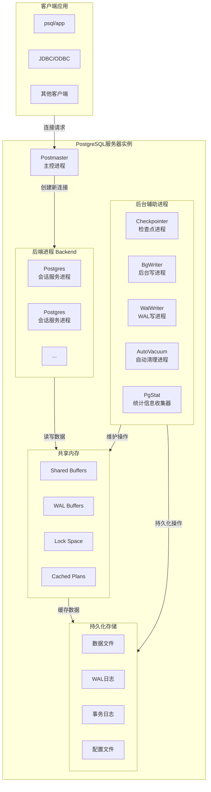

# 第二部分 架构

## 第3章 PG数据库架构

PostgreSQL 是一个功能强大的开源关系型数据库，采用经典的客户端/服务器架构和多进程模型。理解其整体架构、进程分工及代码组织，是深入学习其内核的基础。本章将基于 PostgreSQL 14.19 版本，剖析其运行机制和代码结构。

## 3.1 整体架构与运行机制

PostgreSQL 采用多进程架构，其核心设计围绕客户端请求的接收、处理与响应展开。

### 3.1.1 C/S架构与通信模式

应用层通过TCP/IP协议或UNIX Domain Socket与服务器建立连接，并使用特定的前端/后端协议进行通信。服务器端，由Postmaster主进程监听连接（默认端口5432），为每个新连接fork一个专用的Postgres后端进程进行处理。这种进程隔离模型提升了系统的稳定性。

### 3.1.2 核心架构组成

PostgreSQL 服务器运行时，可被视为由共享内存、后台进程以及数据文件组成的有机整体。其整体架构与核心组件关系如下图所示：

## 3.2 代码目录结构

PostgreSQL 的源代码结构清晰，模块化程度高。其主要代码位于 src/backend 目录下。

### PostgreSQL 14.19 核心源码目录（src/backend/下）

| **目录名** | **核心功能描述** |
| :--- | :--- |
| **access/** | **存储访问方法**：包含堆表、索引及通用索引逻辑、事务处理等。 |
| **bootstrap/** | 单用户模式引导，用于初始化数据库系统。 |
| **catalog/** | **系统目录管理**：定义和操作系统表。 |
| **commands/** | **SQL命令处理**：执行DDL及其他非计划查询的SQL命令。 |
| **executor/** | **执行器**：负责执行优化器生成的查询计划。 |
| **libpq/** | **前端/后端通信**：处理与客户端的协议通信。 |
| **nodes/** | **节点定义**：定义查询树、计划树等内部数据结构。 |
| **optimizer/** | **优化器**：进行查询重写、代价估算和计划生成。 |
| **parser/** | **解析器**：进行词法分析、语法分析和语义分析，生成解析树。 |
| **postmaster/** | **Postmaster主进程**：入口及主循环，负责连接监听和辅助进程管理。 |
| **replication/** | **流复制**：实现WAL发送与接收。 |
| **rewrite/** | **查询重写**：处理规则系统和视图重写。 |
| **storage/** | **存储管理**：包含缓冲区管理、锁管理、文件与空闲空间管理等。 |
| **tcop/** | **Postgres服务进程入口**：postgres.c包含主要命令循环，是查询处理的"交通警察"。 |
| **utils/** | **工具模块**：包含内存管理、事务管理、缓存、数据类型等工具函数。 |

## 3.3 进程架构详解

PostgreSQL 的稳定性和并发能力很大程度上得益于其多进程架构。主进程Postmaster负责协调，它为每个客户端连接创建专用的Postgres后端服务进程，并管理一系列辅助后台进程。

### 3.3.1 主进程 (Postmaster)

- **角色**：数据库实例的总控进程，是第一个启动的进程。
- **职责**：
    - 启动/关闭数据库实例。
    - 监听客户端连接请求，并为每个连接fork一个Postgres服务进程。
    - 启动、管理和监控所有后台辅助进程。
    - 在系统崩溃后进行恢复。
- **代码入口**：src/backend/postmaster/postmaster.c 中的 PostmasterMain 和 ServerLoop 函数。

### 3.3.2 后端进程 (Backend)

- **角色**：直接与客户端通信，执行其提交的查询。
- **生命周期**：随客户端连接创建，随连接断开而终止。
- **职责**：
    - 接收客户端SQL请求。
    - 调用解析器、优化器、执行器等模块处理查询。
    - 返回结果给客户端。
- **代码入口**：src/backend/tcop/postgres.c 中的 PostgresMain 函数。

### 3.3.3 后台辅助进程

这些进程由Postmaster启动，负责系统的维护和管理任务，不直接参与查询处理。

| **进程名** | **主要职责** | **关键代码位置** |
| :--- | :--- | :--- |
| **BgWriter** | 定期将共享缓冲区中的脏页写入磁盘，减轻检查点压力。 | postmaster/bgwriter.c |
| **Checkpointer** | 执行检查点，确保某个时间点前的所有脏页持久化，为崩溃恢复提供基准。 | postmaster/checkpointer.c |
| **WalWriter** | 周期性地将 WAL缓冲区 中的日志记录刷入磁盘，保证事务的持久性。 | postmaster/walwriter.c |
| **AutoVacuum** | Launcher监控数据库并自动启动Worker进程，执行VACUUM和ANALYZE。 | postmaster/autovacuum.c |
| **Stats Collector** | 收集数据库活动的统计信息，为优化器提供依据。 | postmaster/pgstat.c |
| **Logger** | 将错误日志等信息写入日志文件。 | postmaster/syslogger.c |
| **PgArch** | 在归档模式下，将WAL日志备份到指定目录，用于时间点恢复。 | pgarch.c |

## 3.4 本章小结

本章系统介绍了PostgreSQL的整体架构、代码结构与进程模型。我们了解到：
- PostgreSQL采用 C/S模式 与多进程架构。
- 核心代码在 src/backend 下模块化组织，与数据库的各个子系统清晰对应。
- Postmaster 作为主控进程，管理连接并协调 Postgres 后端进程及各类后台辅助进程工作。
- 后端进程负责查询处理，后台辅助进程负责系统维护，两者通过共享内存进行协作。

这个稳固的架构基础，为后续深入理解每一个子系统（如SQL引擎、存储、事务、内存管理等）的详细工作机制铺平了道路。在下一章，我们将深入探讨进程的启动与初始化过程。