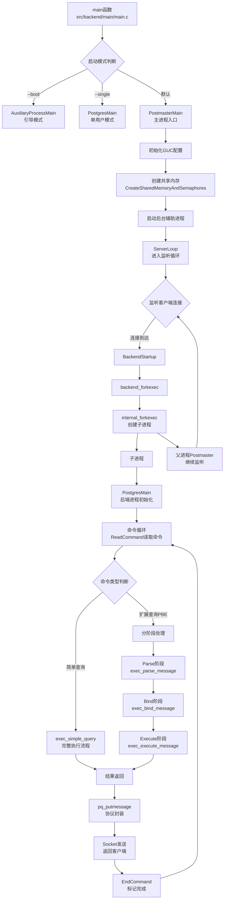

# 第4章 后端进程初始化过程

PostgreSQL采用**多进程架构**，其中**主进程（Postmaster）** 负责协调，**后端进程（Postgres）** 处理客户端请求，**后台辅助进程**（如Checkpointer、BgWriter等）执行系统维护任务。理解进程启动流程对深入学习PostgreSQL内核至关重要。

## 4.1 进程模型概述

PostgreSQL使用多进程而非多线程，主要为了**稳定性**和**隔离性**。一个进程的崩溃通常不会直接影响其他进程。其主要进程类型包括：
- **Postmaster主进程**：监听连接、管理其他进程。
- **Postgres后端进程**：处理客户端查询。
- **后台辅助进程**：执行检查点、清理等系统任务。

新进程的创建主要通过 `internal_forkexec` 函数实现，该函数封装了操作系统的进程创建调用。

## 4.2 主进程启动流程

主进程的启动始于 `main` 函数，并根据参数分支到不同的入口点。

### 4.2.1 程序入口点：main函数

**代码位置**：`src/backend/main/main.c`

`main` 函数是PostgreSQL服务器的执行入口，主要负责早期的初始化和模式分发：
1.  **初始化基础设施**：
    - 调用 `startup_hacks` 函数初始化全局自旋锁 `dummy_spinlock`。
    - 调用 `save_ps_display_args` 处理命令行参数 `argv` 和环境变量 `environ`，为后续通过`ps`命令显示进程信息做准备。
    - 调用 `MemoryContextInit` 创建并初始化顶级内存上下文 `TopMemoryContext` 和错误处理上下文 `ErrorContext`，这是PostgreSQL内存管理的基础。
2.  **进行区域设置（locale）**。
3.  **安全检查**：检查是否禁止使用root用户启动。
4.  **模式分发**：根据命令行第一个参数决定运行模式：

| **启动模式** | **入口函数** | **主要用途** |
| :--- | :--- | :--- |
| `--boot` | `AuxiliaryProcessMain` | 初始化数据库（initdb），引导模式。 |
| `--describe-config` | `GucInfoMain` | 导出服务器内部配置变量。 |
| `--single` | `PostgresMain` | 单用户模式，主要用于调试。 |
| 无（默认） | `PostmasterMain` | 正常多进程模式启动。 |

### 4.2.2 主进程入口：PostmasterMain函数

**代码位置**：`src/backend/postmaster/postmaster.c`

`PostmasterMain` 是Postmaster主进程的主入口，负责多进程环境的初始化。
1.  **基本信息获取与设置**：
    - 获取当前进程PID存入 `MyProcPid` 和 `PostmasterPid`，获取启动时间存入 `MyStartTime`。
    - 设置 `IsPostmasterEnvironment = true`，标识当前运行于多进程模式。
2.  **内存上下文初始化**：
    - 创建 `PostmasterContext` 内存上下文并切换至此，隔离Postmaster内存使用。
3.  **信号处理设置**：设置信号处理函数，处理进程间通信。
4.  **配置初始化**：
    - 调用 `InitializeGUCOptions` 初始化配置选项，加载默认值，并从环境变量加载配置。
    - 处理命令行参数，设置配置项。
    - 调用 `SelectConfigFiles` 加载 `postgresql.conf` 等配置文件。
5.  **数据目录检查与切换**：
    - 调用 `checkDataDir` 检查数据目录有效性及 `PG_VERSION` 文件。
    - 将当前工作目录切换到数据目录。
6.  **进程锁定**：调用 `CreateDataDirLockFile` 在数据目录创建 `postmaster.pid` 文件，防止同一数据目录被多次启动。
7.  **共享内存与信号量创建**：调用 `reset_shared` -> `CreateSharedMemoryAndSemaphores` 创建共享内存和信号量，供所有进程使用。此过程会计算所需信号量个数（`MaxBackends + NUM_AUXILIARY_PROCS`）并估算共享内存大小。
8.  **后台辅助进程启动**：按需启动各个后台辅助进程，例如：
    - **Logger（日志进程）**：`SysLogger_Start` (`postmaster/syslogger.c`)
    - **Checkpointer（检查点进程）**：`StartCheckpointer` (`postmaster/checkpointer.c`)
    - **BgWriter（后台写进程）**：`StartBackgroundWriter` (`postmaster/bgwriter.c`)
    - **WalWriter（WAL写进程）**：`StartWalWriter` (`postmaster/walwriter.c`)
    - **AutoVacuum Launcher（自动清理启动进程）**：`StartAutoVacLauncher` (`postmaster/autovacuum.c`)
    - **Stats Collector（统计信息收集器）**：`pgstat_start` (`postmaster/pgstat.c`)
    - **PgArch（归档进程）**：`pgarch_start` (`pgarch.c`)
9.  **预加载库处理**：调用 `process_shared_preload_libraries` 加载 `shared_preload_libraries` 配置项指定的共享库。
10. **监听循环**：调用 `ServerLoop` 进入主循环，监听客户端连接请求。

## 4.3 后端进程创建过程

当客户端连接到PostgreSQL服务器时，主进程会创建新的后端进程来处理该连接。

### 4.3.1 连接请求监听

**代码位置**：`src/backend/postmaster/postmaster.c` 中的 `ServerLoop` 函数

`ServerLoop` 是Postmaster的主循环，它使用 `select` 系统调用监听所有配置的TCP/IP和Unix域socket。当新的连接请求到达时，`select` 返回，`ServerLoop` 调用 `ConnCreate` 创建连接端口，然后调用 `BackendStartup` 处理连接启动。

### 4.3.2 后端进程创建

**代码位置**：`src/backend/postmaster/postmaster.c` 中的 `BackendStartup` 函数

`BackendStartup` 是创建后端进程的核心函数：
1.  进行必要的**身份验证**。
2.  调用 `backend_forkexec` 函数。
3.  `backend_forkexec` 最终调用 `internal_forkexec` 创建新的子进程。
4.  在子进程中，执行流程会进入 `PostgresMain` 函数。

### 4.3.3 后端进程初始化：PostgresMain函数

**代码位置**：`src/backend/tcop/postgres.c`

`PostgresMain` 是后端进程的主入口，负责后端进程的初始化和命令处理循环：
1.  **初始化内存上下文**：后端进程会创建自己的内存上下文，如 `MessageContext` 用于在查询之间持久化内存。
2.  **设置信号处理**。
3.  **初始化后端特定的GUC参数**。
4.  **设置客户端认证信息**。
5.  **初始化客户端通信库 `libpq`**。
6.  **命令循环**：进入 `for (;;)` 循环，不断处理客户端命令：
    - 调用 `ReadCommand` 从客户端读取命令。
    - 根据命令类型调用相应的处理函数：
    
    | **命令类型** | **处理方式** | **主要处理函数** |
    | :--- | :--- | :--- |
    | **简单查询** | 一次性执行完整的查询处理流程 | `exec_simple_query` |
    | **扩展查询（PBE）** | 分阶段处理：Parse/Bind/Execute | `exec_parse_message`<br>`exec_bind_message`<br>`exec_execute_message` |
    | **其他命令** | 处理事务控制、工具命令等 | 相应命令处理函数 |
    
    - **简单查询处理**：对于简单查询（如 `SELECT * FROM table`），调用 `exec_simple_query` 函数，该函数会依次调用解析器、分析器、优化器和执行器来完成查询处理。
    
    - **扩展查询（PBE）处理**：对于预备语句（Prepared Statements），采用Parse/Bind/Execute三个阶段：
      - **Parse阶段**：解析SQL语句，生成解析树和查询树，创建预备语句。
        ```c
        /* 代码位置: src/backend/tcop/postgres.c */
        static void
        exec_parse_message(const char *query_string, ...)
        {
            /* 解析查询 */
            raw_parsetree_list = pg_parse_query(query_string);
            /* 分析和重写 */
            querytree_list = pg_analyze_and_rewrite(...);
            /* 创建预备语句 */
            CreateCachedPlan(querytree_list, ...);
        }
        ```
      - **Bind阶段**：为预备语句绑定参数值，创建Portal（执行上下文）。
        ```c
        /* 代码位置: src/backend/tcop/postgres.c */
        static void
        exec_bind_message(...)
        {
            /* 获取缓存的预备语句 */
            cachedplan = GetCachedPlan(portal->stmt, ...);
            /* 创建Portal用于执行 */
            PortalDefineQuery(portal, ...);
        }
        ```
      - **Execute阶段**：执行已绑定的Portal，返回结果。
        ```c
        /* 代码位置: src/backend/tcop/postgres.c */
        static void
        exec_execute_message(...)
        {
            /* 执行Portal */
            PortalRun(portal, count, is_top_level, true, receiver, receiver, completionTag);
            /* 返回结果 */
            EndCommand(completionTag, dest);
        }
        ```
    
    - **结果返回流程**：
      1. 执行器通过 `PrintTup` 等输出函数生成结果元组。
      2. 调用 `pq_putmessage` 函数（`src/backend/libpq/pqformat.c`）将数据封装成前端/后端协议消息。
      3. 通过Socket连接将结果发送回客户端。
      4. 最后调用 `EndCommand` 发送命令完成标记。
7.  **资源清理**：查询完成后，清理相关资源，准备处理下一个命令。

## 4.4 关键数据结构与函数

- **`Port` 结构体**：在 `src/include/libpq/libpq-be.h` 中定义，包含客户端连接的所有信息。
- **`Backend` 结构体**：在 `src/include/postmaster/postmaster.h` 中定义，代表一个后端进程。
- **`internal_forkexec` 函数**：在 `src/backend/postmaster/fork_process.c` 中定义，是创建新进程的底层接口。
- **`InitProcess` 函数**：在 `src/backend/storage/ipc/ipc.c` 中定义，负责初始化进程共享状态。
- **`PreparedStatement` 结构体**：在 `src/include/tcop/dest.h` 中定义，表示预备语句。
- **`Portal` 结构体**：在 `src/include/utils/portal.h` 中定义，表示查询执行上下文。

## 4.5 进程启动与查询处理流程图

以下是PostgreSQL进程启动及查询处理的完整流程，展示了从主进程启动到后端处理各种查询类型的关键步骤：



## 4.6 本章小结

本章详细解析了PostgreSQL的**多进程模型**和**进程启动流程**，特别深入探讨了后端进程如何处理不同类型的查询。我们了解到：

1.  PostgreSQL使用经典的多进程架构，通过进程隔离提高系统稳定性。
2.  主进程（Postmaster）启动时经历复杂的初始化过程，包括内存上下文创建、配置加载、共享内存分配和后台进程启动。
3.  当客户端连接时，Postmaster通过 `fork()` 创建新的后端进程，后端进程通过 `PostgresMain` 函数初始化并进入命令处理循环。
4.  后端进程支持两种主要查询处理模式：
    - **简单查询**：一次性完成解析、分析、优化和执行。
    - **扩展查询（PBE）**：分Parse/Bind/Execute三个阶段处理，支持预备语句和参数化查询。
5.  查询结果通过前端/后端协议封装，经由Socket连接返回客户端。

这个多进程架构和灵活的查询处理机制是PostgreSQL稳定运行和高效处理请求的基石。在下一章中，我们将探讨PostgreSQL中的信号机制及其在进程间通信中的作用。