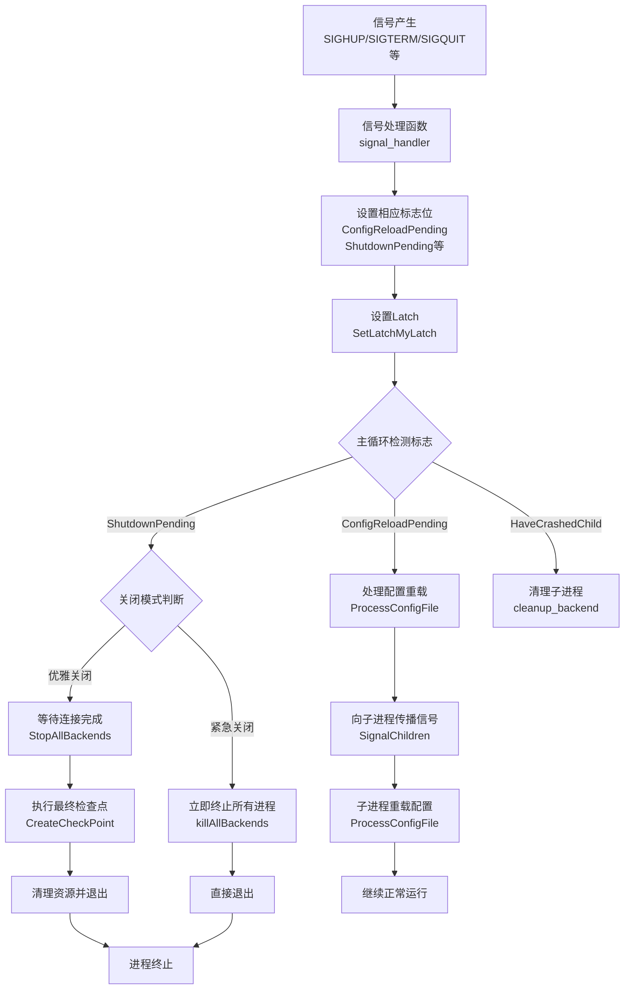

# 第5章 信号机制

PostgreSQL 作为一个多进程数据库系统，信号机制在进程间通信、进程控制和系统管理中扮演着至关重要的角色。本章将深入探讨PostgreSQL中信号的使用方式、处理机制以及在实际应用中的具体实现。

## 5.1 信号机制概述

### 5.1.1 信号在PostgreSQL中的作用

信号在PostgreSQL中主要用于以下几个方面：
- **进程间通信**：主进程与子进程之间的状态同步
- **进程控制**：优雅关闭、紧急终止等
- **系统管理**：配置重载、统计信息收集等
- **错误处理**：处理各种异常情况

### 5.1.2 PostgreSQL中的信号分类

| **信号类型** | **主要用途** | **触发方式** | **处理方式** |
| :--- | :--- | :--- | :--- |
| **进程控制信号** | SIGTERM, SIGINT, SIGQUIT | `pg_ctl stop`, `kill -TERM`, Ctrl+C | 优雅关闭或紧急终止 |
| **配置重载信号** | SIGHUP | `pg_ctl reload`, `kill -HUP` | 重新加载配置文件 |
| **子进程状态信号** | SIGCHLD | 子进程终止时内核自动发送 | 处理子进程终止 |
| **用户定义信号** | SIGUSR1, SIGUSR2 | 内部进程通信 | 进程间同步和通信 |
| **错误信号** | SIGSEGV, SIGBUS | 内存访问错误等硬件异常 | 处理严重错误 |

## 5.2 信号处理机制

### 5.2.1 信号处理机制的底层逻辑

在Unix-like系统中，信号是异步事件的通知机制。当信号发生时，操作系统会中断进程的正常执行流程，转而执行信号处理函数。这种中断特性要求信号处理函数必须遵循特定的安全规则。

**信号处理的关键特性**：
- **异步执行**：信号处理函数可能在任意时间点被调用
- **执行上下文**：信号处理函数在中断上下文中执行，栈环境不确定
- **可重入要求**：必须使用可重入函数，避免死锁和竞态条件

### 5.2.2 信号处理函数注册

PostgreSQL使用自定义的信号处理函数来替代系统默认行为，主要通过 `pqsignal` 函数进行注册。

**代码位置**：`src/backend/libpq/pqsignal.c`

```c
/* 
 * pqsignal - 设置信号处理函数，兼容不同Unix变体
 * 返回之前注册的信号处理函数
 */
pqsigfunc
pqsignal(int signo, pqsigfunc func)
{
    struct sigaction act;
    struct sigaction oact;
    
    act.sa_handler = func;
    sigemptyset(&act.sa_mask);
    act.sa_flags = 0;
    
    /* 设置SA_RESTART标志，使系统调用在信号处理后自动重启 */
    if (signo != SIGALRM)
        act.sa_flags |= SA_RESTART;
    
#ifdef SA_NOCLDSTOP
    if (signo == SIGCHLD)
        act.sa_flags |= SA_NOCLDSTOP;
#endif
    
    if (sigaction(signo, &act, &oact) < 0)
        return SIG_ERR;
    
    return oact.sa_handler;
}
```

### 5.2.3 信号处理函数中允许的操作

由于信号处理函数的特殊执行环境，PostgreSQL严格限制在信号处理函数中能够执行的操作：

**允许的操作**：
1. **设置volatile标志变量**：这是最常用的方式
2. **调用有限的异步信号安全函数**：
   - `write()`：用于日志记录
   - `kill()`：向其他进程发送信号
   - `sigprocmask()`：修改信号屏蔽字
   - `_exit()`：立即终止进程
3. **操作信号量**：简单的原子操作

**禁止的操作**：
1. **调用malloc/free**：可能破坏堆状态
2. **调用标准I/O函数**：如printf，可能使用不可重入锁
3. **调用任何可能获取锁的函数**：可能导致死锁

### 5.2.4 主进程信号处理设置

**代码位置**：`src/backend/postmaster/postmaster.c` 中的 `PostmasterMain` 函数

主进程在初始化过程中设置关键信号的处理函数：

```c
static void
PostmasterMain(int argc, char *argv[])
{
    /* ... 其他初始化代码 ... */
    
    /* 设置信号处理函数 */
    pqsignal(SIGHUP, SIGHUP_handler);        /* 配置重载 */
    pqsignal(SIGINT, SIGINT_handler);        /* 快速关闭 */
    pqsignal(SIGTERM, SIGTERM_handler);      /* 优雅关闭 */
    pqsignal(SIGQUIT, SIGQUIT_handler);      /* 紧急关闭 */
    pqsignal(SIGALRM, SIGALRM_handler);      /* 超时处理 */
    pqsignal(SIGPIPE, SIG_IGN);              /* 忽略管道断开 */
    pqsignal(SIGUSR1, SIGUSR1_handler);      /* 子进程状态变化 */
    pqsignal(SIGUSR2, SIGUSR2_handler);      /* 子进程状态变化 */
    pqsignal(SIGCHLD, SIGCHLD_handler);      /* 子进程终止 */
    
    /* 阻塞所有信号，然后在适当的时候解除阻塞 */
    PG_SETMASK(&BlockSig);
    
    /* ... 主循环 ... */
}
```

### 5.2.5 后端进程信号处理设置

**代码位置**：`src/backend/tcop/postgres.c` 中的 `PostgresMain` 函数

后端进程设置自己的信号处理函数：

```c
void
PostgresMain(int argc, char *argv[], const char *dbname, const char *username)
{
    /* ... 其他初始化代码 ... */
    
    /* 设置后端进程特定的信号处理 */
    pqsignal(SIGHUP, PostgresSigHupHandler);     /* 配置重载 */
    pqsignal(SIGINT, StatementCancelHandler);    /* 查询取消 */
    pqsignal(SIGTERM, die);                      /* 进程终止 */
    pqsignal(SIGQUIT, quickdie);                 /* 紧急终止 */
    pqsignal(SIGALRM, handle_sig_alarm);         /* 语句超时 */
    pqsignal(SIGPIPE, SIG_IGN);                  /* 忽略管道断开 */
    pqsignal(SIGUSR1, procsignal_sigusr1_handler); /* 进程间通信 */
    pqsignal(SIGUSR2, SIG_IGN);                  /* 暂时忽略 */
    pqsignal(SIGFPE, FloatExceptionHandler);     /* 浮点异常 */
    
    /* ... 命令循环 ... */
}
```

## 5.3 关键信号处理详解

### 5.3.1 配置重载信号 (SIGHUP)

**触发方式**：
- 执行 `pg_ctl reload`
- 向postmaster进程发送 `kill -HUP <pid>`
- 在某些系统中修改配置文件后自动触发

当管理员修改配置文件后，向Postmaster发送SIGHUP信号触发配置重载。

**代码位置**：`src/backend/postmaster/postmaster.c`

```c
static void
SIGHUP_handler(SIGNAL_ARGS)
{
    int         save_errno = errno;
    
    /* 设置重载标志，在主循环中处理 */
    ConfigReloadPending = true;
    
    /* 设置latch，唤醒可能阻塞的主循环 */
    SetLatch(MyLatch);
    
    errno = save_errno;
}
```

在主循环中处理配置重载：

```c
static void
process_postmaster_switch(void)
{
    if (ConfigReloadPending)
    {
        ConfigReloadPending = false;
        ProcessConfigFile(PGC_SIGHUP);  /* 重新读取配置文件 */
        
        /* 向所有子进程发送SIGHUP，让它们也重载配置 */
        SignalChildren(SIGHUP);
        /* 向所有后台辅助进程发送SIGHUP */
        SignalBackgroundWorkers(SIGHUP);
    }
}
```

**配置重载机制详解**：

配置重载通过 `ProcessConfigFile` 函数实现：

**代码位置**：`src/backend/utils/misc/guc.c`

```c
void
ProcessConfigFile(GucContext context)
{
    /* 重新解析postgresql.conf文件 */
    if (!ParseConfigFile(config_file, false, context, &head, &tail))
    {
        /* 解析失败，记录日志但继续运行 */
        ereport(LOG,
                (errmsg("configuration file \"%s\" contains errors", 
                        config_file)));
        return;
    }
    
    /* 应用新的配置设置 */
    for (item = head; item != NULL; item = item->next)
    {
        /* 对每个配置项调用set_config_option */
        set_config_option(item->name, item->value, 
                         context, PGC_S_FILE, GUC_ACTION_SET, true, 0, false);
    }
    
    /* 清理临时内存 */
    FreeConfigVariables(head);
}
```

配置重载的特点：
- **无需重启**：大多数配置变更可以立即生效
- **部分限制**：某些参数（如共享内存大小）需要重启才能生效
- **事务安全**：配置变更不会影响正在执行的事务

### 5.3.2 优雅关闭信号 (SIGTERM)

**触发方式**：
- 执行 `pg_ctl stop -m fast`
- 向postmaster进程发送 `kill -TERM <pid>`

SIGTERM信号触发数据库的优雅关闭流程。

**代码位置**：`src/backend/postmaster/postmaster.c`

```c
static void
SIGTERM_handler(SIGNAL_ARGS)
{
    int         save_errno = errno;
    
    /* 设置优雅关闭标志 */
    ShutdownPending = true;
    
    /* 设置紧急模式为false，表示优雅关闭 */
    FatalError = false;
    
    SetLatch(MyLatch);
    errno = save_errno;
}
```

优雅关闭的处理流程：
1. 停止接受新的客户端连接
2. 等待所有现有连接完成当前事务
3. 关闭所有客户端连接
4. 等待所有子进程退出
5. 执行最终的检查点
6. 关闭数据库系统

### 5.3.3 紧急关闭信号 (SIGQUIT)

**触发方式**：
- 执行 `pg_ctl stop -m immediate`
- 向postmaster进程发送 `kill -QUIT <pid>`

SIGQUIT信号触发数据库的紧急关闭流程。

```c
static void
SIGQUIT_handler(SIGNAL_ARGS)
{
    int         save_errno = errno;
    
    /* 设置紧急关闭标志 */
    ShutdownPending = true;
    FatalError = true;  /* 紧急模式 */
    
    SetLatch(MyLatch);
    errno = save_errno;
}
```

### 5.3.4 子进程状态信号 (SIGCHLD)

**触发方式**：
- 当任何子进程终止、停止或继续时，由内核自动发送

当子进程终止时，Postmaster通过SIGCHLD信号进行清理。

```c
static void
SIGCHLD_handler(SIGNAL_ARGS)
{
    int         save_errno = errno;
    
    /* 设置子进程状态变化标志 */
    HaveCrashedChild = true;
    
    SetLatch(MyLatch);
    errno = save_errno;
}
```

子进程清理处理：

```c
static void
cleanup_backend(pid_t pid, int exitstatus)
{
    /* 从进程列表中移除 */
    (void) BackendListRemove(pid);
    
    /* 如果是异常退出，可能需要重新启动某些后台进程 */
    if (!EXIT_STATUS_0(exitstatus))
    {
        /* 处理崩溃的后台进程 */
        HandleChildCrash(pid, exitstatus);
    }
}
```

### 5.3.5 查询取消信号 (SIGINT)

**触发方式**：
- 在psql中按Ctrl+C
- 向后端进程发送 `kill -INT <pid>`

在后端进程中，SIGINT信号用于取消当前正在执行的查询。

**代码位置**：`src/backend/tcop/postgres.c`

```c
void
StatementCancelHandler(SIGNAL_ARGS)
{
    int         save_errno = errno;
    
    /* 设置查询取消标志 */
    InterruptPending = true;
    QueryCancelPending = true;
    
    SetLatch(MyLatch);
    errno = save_errno;
}
```

## 5.4 信号安全与异常处理

### 5.4.1 信号安全概念

**信号安全**指的是在信号处理函数中或信号可能随时中断的上下文中，代码能够正确执行而不导致数据损坏、死锁或其他未定义行为的能力。

**信号安全的核心要求**：
1. **可重入性**：函数必须能够在被信号中断后再次被调用而不会产生冲突
2. **无锁操作**：避免使用非原子锁操作，防止死锁
3. **有限的系统调用**：只使用异步信号安全的系统调用
4. **简单的数据操作**：避免复杂的数据结构操作

### 5.4.2 PG_TRY/PG_CATCH 机制

PostgreSQL使用 `PG_TRY` / `PG_CATCH` / `PG_END_TRY` 宏来实现异常处理，这些宏基于 `setjmp` / `longjmp` 机制。

**代码位置**：`src/include/utils/elog.h`

```c
#define PG_TRY()  \
    do { \
        sigjmp_buf *save_exception_stack = PG_exception_stack; \
        ErrorContextCallback *save_context_stack = error_context_stack; \
        sigjmp_buf local_sigjmp_buf; \
        if (sigsetjmp(local_sigjmp_buf, 0) == 0) \
        { \
            PG_exception_stack = &local_sigjmp_buf

#define PG_CATCH()  \
        } \
        else \
        { \
            PG_exception_stack = save_exception_stack; \
            error_context_stack = save_context_stack

#define PG_END_TRY()  \
        } \
        PG_exception_stack = save_exception_stack; \
        error_context_stack = save_context_stack; \
    } while (0)
```

**PG_TRY/PG_CATCH 的工作原理**：

1. **设置跳转点**：`sigsetjmp` 保存当前执行上下文
2. **正常执行**：在 `PG_TRY` 块中执行可能出错的代码
3. **错误跳转**：发生错误时，`errstart` 调用 `siglongjmp` 跳回 `PG_CATCH` 块
4. **异常处理**：在 `PG_CATCH` 块中进行清理和恢复

**示例使用**：

```c
void
SomeCriticalOperation(void)
{
    /* 在关键操作期间阻塞中断 */
    HOLD_INTERRUPTS();
    
    PG_TRY();
    {
        /* 执行可能失败的关键操作 */
        PerformCriticalOperation();
        
        /* 如果成功，在这里恢复中断 */
        RESUME_INTERRUPTS();
    }
    PG_CATCH();
    {
        /* 发生错误，确保中断被恢复 */
        RESUME_INTERRUPTS();
        
        /* 清理资源 */
        CleanupAfterFailure();
        
        /* 重新抛出错误 */
        PG_RE_THROW();
    }
    PG_END_TRY();
}
```

### 5.4.3 信号屏蔽设置

PostgreSQL在关键代码段使用信号屏蔽来防止竞态条件。

**代码位置**：`src/include/storage/s_lock.h`

```c
/* 定义信号屏蔽集 */
extern sigset_t UnBlockSig,
            BlockSig,
            StartupBlockSig;

/* 初始化信号屏蔽集 */
void
InitSignalMask(void)
{
    sigemptyset(&UnBlockSig);
    sigemptyset(&BlockSig);
    sigemptyset(&StartupBlockSig);
    
    /* 将需要阻塞的信号添加到BlockSig */
    sigaddset(&BlockSig, SIGHUP);
    sigaddset(&BlockSig, SIGINT);
    sigaddset(&BlockSig, SIGTERM);
    sigaddset(&BlockSig, SIGQUIT);
    sigaddset(&BlockSig, SIGALRM);
    sigaddset(&BlockSig, SIGUSR1);
    sigaddset(&BlockSig, SIGUSR2);
    sigaddset(&BlockSig, SIGCHLD);
    sigaddset(&BlockSig, SIGFPE);
    
    /* 复制到StartupBlockSig */
    sigfillset(&StartupBlockSig);
}
```

### 5.4.4 中断控制宏

PostgreSQL提供了一组宏来控制信号中断：

**代码位置**：`src/include/storage/sinval.h`

```c
/* 阻塞中断 */
#define HOLD_INTERRUPTS()  \
    do { \
        Assert(InterruptHoldoffCount >= 0); \
        InterruptHoldoffCount++; \
    } while (0)

/* 恢复中断 */
#define RESUME_INTERRUPTS()  \
    do { \
        Assert(InterruptHoldoffCount > 0); \
        if (--InterruptHoldoffCount == 0 && InterruptPending) \
            ProcessInterrupts(); \
    } while (0)

/* 检查中断 */
#define CHECK_FOR_INTERRUPTS()  \
    do { \
        if (InterruptPending && InterruptHoldoffCount == 0) \
            ProcessInterrupts(); \
    } while (0)
```

## 5.5 信号处理流程图

以下是PostgreSQL信号处理的完整流程，展示了从信号产生到最终处理的各个阶段：



## 5.6 本章小结

本章详细解析了PostgreSQL中的信号机制，包括：

1.  **信号的作用和分类**：信号在进程控制、配置管理、错误处理等方面发挥关键作用。
2.  **信号处理机制的底层逻辑**：信号处理函数在异步中断上下文中执行，必须遵循严格的安全规则。
3.  **信号安全概念**：确保代码在信号中断情况下仍能正确执行，避免数据竞争和死锁。
4.  **PG_TRY/PG_CATCH机制**：基于 `setjmp`/`longjmp` 的异常处理机制，结合信号屏蔽确保关键操作的原子性。
5.  **关键信号处理**：
    - **SIGHUP**：配置重载，通过标志位机制在主循环中处理
    - **SIGTERM**：优雅关闭，等待所有连接完成后再退出
    - **SIGQUIT**：紧急关闭，立即终止所有进程
    - **SIGCHLD**：子进程状态监控和清理
    - **SIGINT**：查询取消，中断当前执行语句
6.  **配置重载机制**：动态重新加载配置文件，无需重启服务。
7.  **信号安全编程实践**：在信号处理函数中只执行有限的安全操作，通过标志位和latch机制将复杂处理延迟到主循环。

信号机制是PostgreSQL多进程架构的神经中枢，确保了各个进程能够协调工作，及时响应外部事件，并在异常情况下保持系统稳定性。在下一章中，我们将开始深入探讨SQL引擎，首先从解析器的语法解析开始。