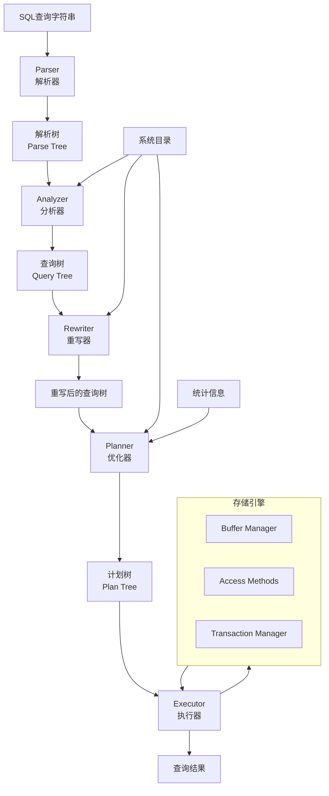

# 第三部分 SQL引擎

## 第6章 SQL引擎架构概述

SQL引擎是PostgreSQL的核心组件，负责将用户输入的SQL语句转换为可执行的查询计划并返回结果。本章将从整体架构角度介绍PostgreSQL SQL引擎的组成、执行流程和关键数据结构，为后续深入各个模块打下基础。

## 6.1 SQL引擎在PostgreSQL中的位置

SQL引擎位于PostgreSQL架构的中间层，承上启下：
- **上层**：接收来自客户端的SQL请求（通过libpq协议）
- **下层**：调用存储引擎访问数据，通过事务管理器保证ACID特性
- **核心作用**：将声明式的SQL语言转换为过程式的执行计划

SQL引擎处理的主要SQL语句类型包括：
- **数据查询语言（DQL）**：SELECT语句
- **数据操纵语言（DML）**：INSERT、UPDATE、DELETE语句
- **数据定义语言（DDL）**：CREATE、ALTER、DROP等语句
- **数据控制语言（DCL）**：GRANT、REVOKE等语句

## 6.2 SQL引擎整体架构

PostgreSQL的SQL引擎采用经典的**火山模型（Volcano Model）**，也称为迭代器模型，其整体架构和各组件关系如下图所示：



### 6.2.1 组件职责说明

| **组件** | **主要职责** | **输入** | **输出** | **关键代码目录** |
| :--- | :--- | :--- | :--- | :--- |
| **解析器（Parser）** | 语法分析、词法分析 | SQL字符串 | 解析树（Parse Tree） | `src/backend/parser/` |
| **分析器（Analyzer）** | 语义分析、对象解析 | 解析树 | 查询树（Query Tree） | `src/backend/parser/` |
| **重写器（Rewriter）** | 规则应用、视图展开 | 查询树 | 重写后的查询树 | `src/backend/rewrite/` |
| **优化器（Planner）** | 查询优化、计划生成 | 查询树 | 计划树（Plan Tree） | `src/backend/optimizer/` |
| **执行器（Executor）** | 计划执行、结果返回 | 计划树 | 查询结果 | `src/backend/executor/` |

## 6.3 查询执行流程概述

### 6.3.1 简单查询执行流程

对于简单查询（如 `SELECT * FROM table WHERE id = 1`），执行流程相对直接：

**代码入口**：`src/backend/tcop/postgres.c` 中的 `exec_simple_query` 函数

```c
static void
exec_simple_query(const char *query_string)
{
    /* 1. 解析阶段 */
    raw_parsetree_list = pg_parse_query(query_string);
    
    /* 2. 分析和重写阶段 */
    for (parsetree_item = raw_parsetree_list; ... )
    {
        querytree_list = pg_analyze_and_rewrite(parsetree, ...);
        
        /* 3. 优化阶段 */
        plantree_list = pg_plan_queries(querytree_list, ...);
        
        /* 4. 执行阶段 */
        for (plantree_item = plantree_list; ... )
        {
            Portal portal = CreatePortal("...", true, true);
            PortalDefineQuery(portal, NULL, query_string, ...);
            PortalStart(portal, NULL, 0, InvalidSnapshot);
            PortalRun(portal, FETCH_ALL, true, true, ...);
            PortalDrop(portal, false);
        }
    }
}
```

### 6.3.2 扩展查询执行流程

对于预备语句（Prepared Statements），采用Parse/Bind/Execute三个阶段：

```c
/* Parse阶段 */
static void
exec_parse_message(const char *query_string, ...)
{
    List *raw_parsetree_list = pg_parse_query(query_string);
    List *querytree_list = pg_analyze_and_rewrite(...);
    /* 创建预备语句并缓存 */
}

/* Bind阶段 */
static void
exec_bind_message(...)
{
    /* 获取缓存的预备语句 */
    /* 创建Portal用于执行 */
    PortalStart(portal, NULL, 0, InvalidSnapshot);
}

/* Execute阶段 */
static void
exec_execute_message(...)
{
    /* 执行Portal */
    PortalRun(portal, count, is_top_level, ...);
}
```

## 6.4 关键数据结构

### 6.4.1 解析树（Parse Tree）

解析树直接反映SQL语句的语法结构，由各种Node类型组成。

**代码位置**：`src/include/nodes/parsenodes.h`

**主要节点类型**：
- `SelectStmt`：SELECT语句
- `InsertStmt`：INSERT语句  
- `UpdateStmt`：UPDATE语句
- `DeleteStmt`：DELETE语句
- `A_Expr`：表达式节点

**示例**：`SELECT * FROM table WHERE id = 1` 的解析树结构
```c
typedef struct SelectStmt
{
    NodeTag     type;
    List       *targetList;      /* 目标列列表（*） */
    List       *fromClause;      /* FROM子句（table） */
    Node       *whereClause;     /* WHERE条件（id = 1） */
    /* ... 其他字段 ... */
} SelectStmt;
```

### 6.4.2 查询树（Query Tree）

查询树是经过语义分析后的中间表示，更接近关系代数。

**主要结构**：`Query` 结构体

```c
typedef struct Query
{
    NodeTag        type;
    CmdType        commandType;    /* SELECT、INSERT、UPDATE、DELETE */
    uint64        queryId;        /* 查询标识符 */
    bool          canSetTag;      /* 是否设置命令标签 */
    Node         *utilityStmt;    /* 工具语句（如EXPLAIN） */
    int           resultRelation; /* 结果关系索引 */
    List         *rtable;         /* 范围表（Range Table） */
    FromExpr     *jointree;       /* 连接树 */
    List         *targetList;     /* 目标列表 */
    List         *groupClause;    /* GROUP BY子句 */
    /* ... 更多字段 ... */
} Query;
```

### 6.4.3 计划树（Plan Tree）

计划树描述查询的具体执行方式，由各种Plan节点组成。

**代码位置**：`src/include/nodes/plannodes.h`

**主要计划节点类型**：
- `SeqScan`：顺序扫描
- `IndexScan`：索引扫描
- `NestLoop`：嵌套循环连接
- `HashJoin`：哈希连接
- `Sort`：排序
- `Agg`：聚合

**计划树层次结构示例**：
```
    Aggregate
       |
     Sort
       |
   Hash Join
   /      \
SeqScan  SeqScan
```

### 6.4.4 执行状态树（PlanState Tree）

执行器在执行时构建的状态树，与计划树一一对应。

**代码位置**：`src/include/nodes/execnodes.h`

```c
typedef struct PlanState
{
    NodeTag    type;
    Plan      *plan;              /* 对应的Plan节点 */
    List      *targetlist;        /* 目标列表 */
    TupleTableSlot *ps_ResultTupleSlot; /* 结果元组槽 */
    /* ... 状态信息 ... */
} PlanState;
```

## 6.5 代码概览与模块划分

### 6.5.1 解析器模块（Parser）

**代码位置**：`src/backend/parser/`

| **文件** | **主要功能** |
| :--- | :--- |
| `scan.l` | 词法分析器（Flex） |
| `gram.y` | 语法分析器（Bison） |
| `parse_node.c` | 解析树节点创建 |
| `analyze.c` | 语义分析 |
| `parse_agg.c` | 聚合处理 |
| `parse_expr.c` | 表达式解析 |

### 6.5.2 重写器模块（Rewriter）

**代码位置**：`src/backend/rewrite/`

| **文件** | **主要功能** |
| :--- | :--- |
| `rewriteHandler.c` | 重写主入口 |
| `rewriteManip.c` | 查询树操作 |
| `rewriteRemove.c` | 规则删除处理 |
| `rewriteDefine.c` | 规则定义 |

### 6.5.3 优化器模块（Planner）

**代码位置**：`src/backend/optimizer/`

| **子目录** | **主要功能** |
| :--- | :--- |
| `path/` | 路径生成 |
| `plan/` | 计划生成 |
| `prep/` | 预处理 |
| `util/` | 工具函数 |

### 6.5.4 执行器模块（Executor）

**代码位置**：`src/backend/executor/`

| **文件** | **主要功能** |
| :--- | :--- |
| `execMain.c` | 执行器主循环 |
| `execScan.c` | 扫描处理 |
| `execQual.c` | 表达式求值 |
| `nodeAgg.c` | 聚合节点 |
| `nodeHashjoin.c` | 哈希连接节点 |

## 6.6 本章小结

本章从宏观角度介绍了PostgreSQL SQL引擎的整体架构：

1. **模块化设计**：SQL引擎由解析器、分析器、重写器、优化器、执行器五个核心模块组成，各司其职。
2. **数据流转换**：查询经过`SQL文本 → 解析树 → 查询树 → 计划树 → 结果`的转换过程。
3. **关键数据结构**：理解`SelectStmt`、`Query`、`Plan`、`PlanState`等核心数据结构是深入SQL引擎的基础。
4. **代码组织**：各模块代码在`src/backend/`下清晰分离，便于理解和维护。
5. **执行模式**：支持简单查询的一次性执行和扩展查询的分阶段执行。

SQL引擎的这种分层架构和清晰的数据流为PostgreSQL提供了强大的查询处理能力，同时也为后续的优化和扩展奠定了良好基础。在接下来的章节中，我们将深入探讨每个模块的具体实现细节。