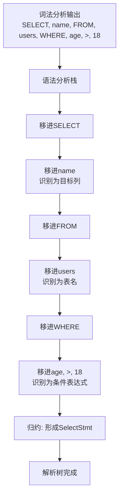

# 第7章 解析器——语法解析

解析器是SQL引擎的入口，负责将SQL文本转换为内部数据结构。本章将深入探讨PostgreSQL解析器的实现机制，包括词法分析、语法分析以及相关的核心数据结构。

## 7.1 解析器概述

### 7.1.1 解析器的作用和地位

解析器作为SQL处理流程的第一个阶段，承担着以下关键职责：
- **语法验证**：检查SQL语句是否符合PostgreSQL的语法规则
- **结构解析**：将线性的SQL文本转换为层次化的树状结构
- **初步转换**：将外部SQL表示转换为内部数据结构表示

**代码位置**：`src/backend/parser/`

### 7.1.2 解析器工作流程

解析器的工作可以分为两个主要阶段：
1. **词法分析**：将SQL字符串拆分为有意义的词法单元（Token）
2. **语法分析**：根据语法规则将词法单元组织成解析树

## 7.2 词法分析器（Lexer）

### 7.2.1 词法分析器基础

PostgreSQL使用Flex工具生成词法分析器，其定义文件为`scan.l`。

**代码位置**：`src/backend/parser/scan.l`

词法分析器的主要任务：
- 识别关键字（SELECT、FROM、WHERE等）
- 识别标识符（表名、列名等）
- 识别常量（数字、字符串等）
- 识别操作符（+、-、=、>等）
- 忽略注释和空白字符

### 7.2.2 核心词法规则

```lex
%%
/* 关键字识别 */
"SELECT"            { return SELECT; }
"FROM"              { return FROM; }
"WHERE"             { return WHERE; }
"INSERT"            { return INSERT; }
"UPDATE"            { return UPDATE; }
"DELETE"            { return DELETE; }

/* 标识符 */
[a-zA-Z_][a-zA-Z_0-9]*  { 
    yylval.str = pstrdup(yytext);
    return IDENT;
}

/* 字符串常量 */
'([^'\\]|\\.)*'     {
    yylval.str = pstrdup(yytext);
    return SCONST;
}

/* 数字常量 */
[0-9]+              {
    yylval.ival = atoi(yytext);
    return ICONST;
}

/* 操作符 */
"+"                 { return '+' }
"-"                 { return '-' }
"="                 { return '=' }
">"                 { return '>' }
"<"                 { return '<' }

/* 空白字符 */
[ \t\n\r]           { /* 忽略 */ }

/* 注释 */
"/*"([^*]|"*"[^/])*"*/" { /* 忽略 */ }
"--".*              { /* 忽略单行注释 */ }
%%
```

### 7.2.3 词法分析器状态管理

PostgreSQL词法分析器支持状态切换，以处理不同的语法上下文：

```lex
/* 定义状态 */
%x xb, xc, xd, xh, xq, xdolq, xui, xus

/* 字符串字面量处理 */
<INITIAL>\" {
    yyextra->state_before = YYSTATE;
    BEGIN(xq);
    startlit();
}

<xq>\" {
    BEGIN(yyextra->state_before);
    return SCONST;
}

<xq><<EOF>> {
    yyerror("unterminated quoted string");
}
```

## 7.3 语法分析器（Parser）

### 7.3.1 语法分析器基础

PostgreSQL使用Bison工具生成语法分析器，其定义文件为`gram.y`。

**代码位置**：`src/backend/parser/gram.y`

语法分析器基于LALR(1)语法，主要职责：
- 定义SQL语言的语法规则
- 构建解析树（Parse Tree）
- 处理语法错误和恢复

### 7.3.2 语法规则定义

```yacc
%%
/* SELECT语句语法规则 */
SelectStmt:
    select_clause
    {
        $$ = $1;
    }
    ;

select_clause:
    SELECT opt_distinct target_list
    into_clause from_clause where_clause
    group_clause having_clause window_clause
    {
        SelectStmt *n = makeNode(SelectStmt);
        n->targetList = $3;
        n->fromClause = $5;
        n->whereClause = $6;
        n->groupClause = $7;
        n->havingClause = $8;
        n->windowClause = $9;
        $$ = (Node *)n;
    }
    ;

/* 目标列处理 */
target_list:
    target_el
    {
        $$ = list_make1($1);
    }
    | target_list ',' target_el
    {
        $$ = lappend($1, $3);
    }
    ;

target_el:
    col_label
    {
        $$ = $1;
    }
    | '*'
    {
        $$ = makeNode(ResTarget);
        $$->name = NULL;
        $$->indirection = NIL;
        $$->val = (Node *)makeNode(ColumnRef);
        ((ColumnRef *)$$->val)->fields = list_make1(makeNode(A_Star));
        $$->location = @1;
    }
    ;
%%
```

### 7.3.3 移进和归约过程

语法分析的核心是移进-归约算法，以下是一个具体的分析过程示例：

**示例SQL**：`SELECT name FROM users WHERE age > 18`



具体的移进-归约步骤：

1. **移进** `SELECT` → 期待目标列
2. **移进** `name` → 归约为`target_el`
3. **移进** `FROM` → 期待表名
4. **移进** `users` → 归约为`from_clause`
5. **移进** `WHERE` → 期待条件表达式
6. **移进** `age`, `>`, `18` → 归约为`A_Expr`
7. **归约** 所有部分形成完整的`SelectStmt`

### 7.3.4 优先级和结合性处理

在`gram.y`中通过优先级声明来解决歧义：

```yacc
/* 操作符优先级定义 */
%left '+' '-'
%left '*' '/' '%'
%left '^'
%right '='
%nonassoc '<' '>' '=' '<' '=' '>' '=' /* 比较操作符 */
%nonassoc BETWEEN IN LIKE ILIKE SIMILAR
%nonassoc NOT
%right '=' /* 赋值操作符 */
```

## 7.4 核心数据结构

### 7.4.1 节点系统（Node System）

PostgreSQL使用统一的节点系统来表示所有解析树节点：

**代码位置**：`src/include/nodes/nodes.h`

```c
/* 节点标签枚举，标识节点类型 */
typedef enum NodeTag
{
    T_Invalid = 0,
    T_SelectStmt,
    T_InsertStmt,
    T_UpdateStmt,
    T_DeleteStmt,
    T_A_Expr,
    T_ColumnRef,
    /* ... 更多节点类型 */
} NodeTag;

/* 所有节点的基础结构 */
typedef struct Node
{
    NodeTag     type;
} Node;
```

### 7.4.2 主要解析节点类型

#### SelectStmt 结构

**代码位置**：`src/include/nodes/parsenodes.h`

```c
typedef struct SelectStmt
{
    NodeTag     type;
    
    /* 目标列列表 */
    List       *targetList;
    
    /* 数据源 */
    List       *fromClause;
    
    /* 条件 */
    Node       *whereClause;
    
    /* 分组 */
    List       *groupClause;
    Node       *havingClause;
    
    /* 窗口函数 */
    List       *windowClause;
    
    /* 其他属性 */
    List       *sortClause;
    Node       *limitOffset;
    Node       *limitCount;
    List       *lockingClause;
    
    /* 集合操作 */
    SetOperation op;
    bool        all;
    struct SelectStmt *larg;
    struct SelectStmt *rarg;
} SelectStmt;
```

#### A_Expr 结构（表达式节点）

```c
typedef struct A_Expr
{
    NodeTag     type;
    A_Expr_Kind kind;
    List       *name;           /* 操作符名称 */
    Node       *lexpr;          /* 左表达式 */
    Node       *rexpr;          /* 右表达式 */
    int         location;       /* 在源字符串中的位置 */
} A_Expr;
```

#### ColumnRef 结构（列引用）

```c
typedef struct ColumnRef
{
    NodeTag     type;
    List       *fields;         /* 字段名列表 */
    int         location;       /* 在源字符串中的位置 */
} ColumnRef;
```

## 7.5 解析器入口函数

### 7.5.1 主要入口函数

**代码位置**：`src/backend/parser/parser.c`

```c
/*
 * pg_parse_query - 解析SQL字符串的主入口函数
 * 输入: query_string - SQL字符串
 * 输出: 解析树列表（每个SQL语句对应一个解析树）
 */
List *
pg_parse_query(const char *query_string)
{
    List       *raw_parsetree_list;
    
    /* 初始化解析状态 */
    parser_init();
    
    /* 设置扫描器输入 */
    scanner_init(query_string);
    
    /* 执行语法分析 */
    raw_parsetree_list = raw_parser(query_string);
    
    /* 清理扫描器状态 */
    scanner_finish();
    
    return raw_parsetree_list;
}

/*
 * raw_parser - 原始解析器，调用Bison生成的语法分析器
 */
List *
raw_parser(const char *str)
{
    yyextra_type yyextra;
    int         yyresult;
    
    /* 初始化解析器状态 */
    memset(&yyextra, 0, sizeof(yyextra));
    yyextra.parsetree = NIL;
    
    /* 设置Flex/Bison使用的全局变量 */
    yyscanner = scanner_init(str, &yyextra);
    
    /* 调用Bison生成的语法分析器 */
    yyresult = yyparse(yyscanner);
    
    if (yyresult != 0) /* 非0表示解析错误 */
        yyextra.parsetree = NIL;
    
    scanner_finish(yyscanner);
    
    return yyextra.parsetree;
}
```

### 7.5.2 解析器状态管理

**代码位置**：`src/backend/parser/scansup.c`

```c
/* 解析器全局状态 */
typedef struct base_yy_extra_type
{
    /*
     * 扫描器/解析器状态。
     * 在解析多个查询时，需要保存和恢复这些状态。
     */
    core_yyscan_t yyscanner;
    List       *parsetree;      /* 解析结果 */
    
    /* 用于错误恢复和位置跟踪 */
    const char *scanbuf;
    int         scanbuflen;
} base_yy_extra_type;
```

## 7.6 错误处理和恢复

### 7.6.1 语法错误处理

当遇到语法错误时，解析器会尝试恢复并继续解析：

```c
/* 错误处理函数 */
void
yyerror(YYLTYPE *loc, core_yyscan_t yyscanner, const char *msg)
{
    base_yy_extra_type *yyextra = pg_yyget_extra(yyscanner);
    
    /* 报告错误位置 */
    ereport(ERROR,
            (errcode(ERRCODE_SYNTAX_ERROR),
             errmsg("%s", msg),
             parser_errposition(loc)));
}

/* 错误恢复机制 */
void
parser_init(void)
{
    /* 初始化错误恢复状态 */
    error_counter = 0;
    max_errors = 100; /* 最大错误数限制 */
}
```

### 7.6.2 错误位置报告

```c
/* 计算错误在源字符串中的位置 */
int
parser_errposition(YYLTYPE location)
{
    if (location < 0)
        return -1;
    
    return location;
}
```

## 7.7 解析器扩展机制

### 7.7.1 自定义语法扩展

PostgreSQL支持通过扩展模块添加新的语法：

```c
/* 在扩展模块中注册新的语法规则 */
void
register_grammar_extension(GrammarExtension *ext)
{
    /* 将扩展语法合并到主语法中 */
    merge_grammar_rules(ext->rules);
}
```

### 7.7.2 预备语句解析

对于预备语句，解析器需要特殊处理参数占位符：

```c
/* 处理参数占位符（$1, $2, ...） */
ParamRef *
makeParamRef(int number, int location)
{
    ParamRef    *p = makeNode(ParamRef);
    
    p->number = number;
    p->location = location;
    
    return p;
}
```

## 7.8 本章小结

本章深入探讨了PostgreSQL解析器的实现机制：

1. **词法分析**：基于Flex的词法分析器将SQL字符串拆分为词法单元，处理关键字、标识符、常量等。

2. **语法分析**：基于Bison的语法分析器使用LALR(1)语法，通过移进-归约算法构建解析树。

3. **核心数据结构**：统一的节点系统（Node）和具体的语句节点（如SelectStmt、A_Expr等）构成了解析树的基础。

4. **优先级处理**：通过操作符优先级和结合性声明解决语法歧义。

5. **错误处理**：完善的错误检测、报告和恢复机制，保证解析器的健壮性。

6. **扩展性**：支持通过扩展模块添加新的语法规则。

解析器作为SQL处理流程的起点，其输出的解析树为后续的语义分析、查询重写和优化奠定了基础。在下一章中，我们将探讨分析器如何对解析树进行语义分析和转换。