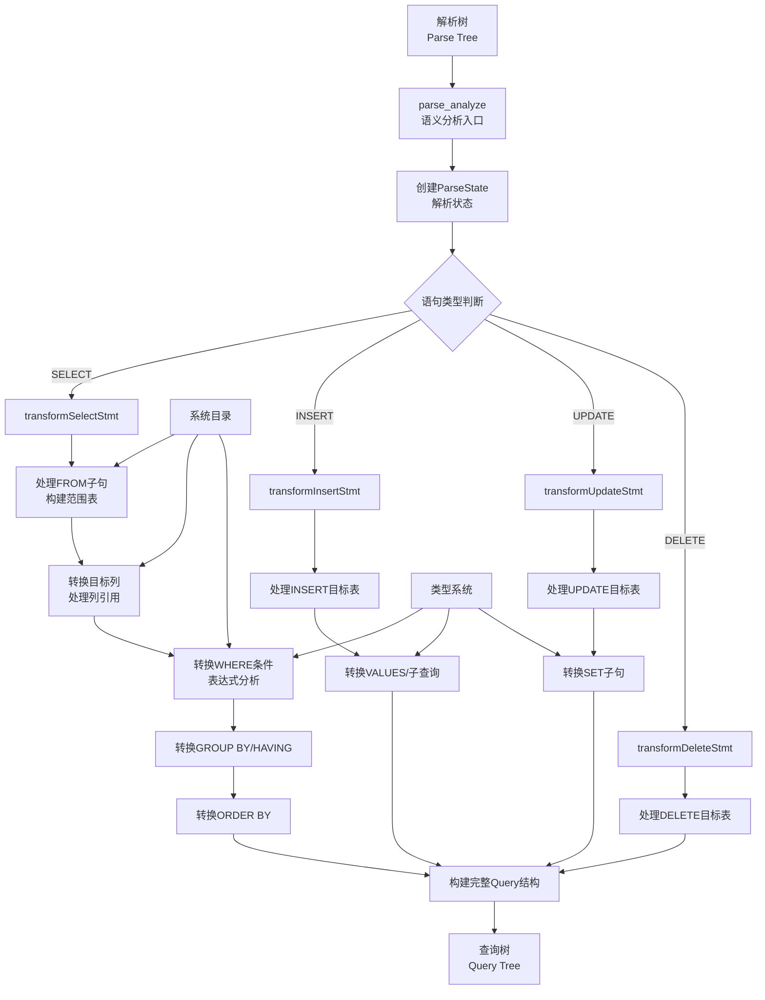

# 第8章 解析器——语义分析

语义分析是解析过程的第二阶段，负责将语法分析生成的解析树转换为查询树，并进行深入的语义验证。本章将详细探讨PostgreSQL语义分析的实现机制、核心算法和关键数据结构。

## 8.1 语义分析概述

### 8.1.1 语义分析的作用

语义分析在解析过程中承担着承上启下的关键作用：

- **语义验证**：检查SQL语句的语义正确性
- **对象解析**：将标识符解析为数据库对象（表、列、函数等）
- **类型检查**：验证表达式和操作的类型兼容性
- **查询树生成**：将解析树转换为更适合优化的查询树

### 8.1.2 语义分析与语法分析的区别

| **方面** | **语法分析** | **语义分析** |
| :--- | :--- | :--- |
| **关注点** | 语句结构是否正确 | 语句含义是否正确 |
| **输入** | SQL文本字符串 | 解析树（Parse Tree） |
| **输出** | 解析树 | 查询树（Query Tree） |
| **错误类型** | 语法错误 | 语义错误（对象不存在、类型不匹配等） |

## 8.2 语义分析入口函数

### 8.2.1 主要入口函数

**代码位置**：`src/backend/parser/analyze.c`

```c
/*
 * parse_analyze - 语义分析的主入口函数
 * 输入: 
 *   - parsetree: 解析树
 *   - sourceText: 原始SQL文本（用于错误报告）
 *   - paramTypes: 参数类型列表（用于预备语句）
 *   - numParams: 参数数量
 * 输出: 查询树（Query）
 */
Query *
parse_analyze(RawStmt *parsetree,
              const char *sourceText,
              Oid *paramTypes,
              int numParams)
{
    ParseState *pstate;
    Query      *query;
    
    /* 创建解析状态 */
    pstate = make_parsestate(NULL);
    pstate->p_sourcetext = sourceText;
    
    /* 设置参数类型信息 */
    if (numParams > 0)
        parse_fixed_parameters(pstate, paramTypes, numParams);
    
    /* 根据节点类型分发给相应的转换函数 */
    switch (nodeTag(parsetree))
    {
        case T_SelectStmt:
            query = transformSelectStmt(pstate, (SelectStmt *) parsetree);
            break;
        case T_InsertStmt:
            query = transformInsertStmt(pstate, (InsertStmt *) parsetree);
            break;
        case T_UpdateStmt:
            query = transformUpdateStmt(pstate, (UpdateStmt *) parsetree);
            break;
        case T_DeleteStmt:
            query = transformDeleteStmt(pstate, (DeleteStmt *) parsetree);
            break;
        default:
            elog(ERROR, "unrecognized node type: %d",
                 (int) nodeTag(parsetree));
            query = NULL;    /* keep compiler quiet */
            break;
    }
    
    /* 后处理：填充剩余字段 */
    query->querySource = QSRC_ORIGINAL;
    query->canSetTag = true;
    
    /* 释放解析状态 */
    free_parsestate(pstate);
    
    return query;
}
```

### 8.2.2 解析状态（ParseState）管理

**代码位置**：`src/include/parser/parse_node.h`

```c
typedef struct ParseState
{
    struct ParseState *parentParseState;  /* 父解析状态（用于子查询） */
    
    /* 范围表管理 */
    List       *p_rtable;        /* 范围表条目列表 */
    List       *p_joinlist;      /* 连接项列表 */
    List       *p_rels;          /* 当前可用的关系 */
    
    /* 命名空间管理 */
    List       *p_namespace;     /* 当前可见的表 */
    
    /* 上下文信息 */
    const char *p_sourcetext;    /* 原始SQL文本 */
    int         p_queryId;       /* 查询标识符 */
    
    /* 参数处理 */
    Oid        *p_paramtypes;    /* 参数类型数组 */
    int         p_numparams;     /* 参数数量 */
    
    /* 其他状态 */
    bool        p_hasAggs;       /* 是否包含聚合函数 */
    bool        p_hasWindowFuncs; /* 是否包含窗口函数 */
    bool        p_hasSubLinks;   /* 是否包含子链接 */
    
} ParseState;
```

## 8.3 对象解析与范围表管理

### 8.3.1 范围表（Range Table）构建

范围表记录了查询中所有可访问的表、视图、子查询等数据源。

**代码位置**：`src/backend/parser/parse_relation.c`

```c
/*
 * transformFromClause - 处理FROM子句，构建范围表
 */
void
transformFromClause(ParseState *pstate, List *fromClause)
{
    ListCell   *l;
    
    foreach(l, fromClause)
    {
        Node       *n = (Node *) lfirst(l);
        RangeTblEntry *rte;
        
        /* 根据节点类型创建相应的范围表条目 */
        switch (nodeTag(n))
        {
            case T_RangeVar:
                rte = transformTableEntry(pstate, (RangeVar *) n);
                break;
            case T_RangeSubselect:
                rte = transformRangeSubselect(pstate, (RangeSubselect *) n);
                break;
            case T_RangeFunction:
                rte = transformRangeFunction(pstate, (RangeFunction *) n);
                break;
            case T_JoinExpr:
                rte = transformJoinExpr(pstate, (JoinExpr *) n);
                break;
            default:
                elog(ERROR, "unrecognized node type in FROM clause: %d",
                     (int) nodeTag(n));
                rte = NULL;    /* keep compiler quiet */
                break;
        }
        
        /* 将范围表条目添加到解析状态中 */
        pstate->p_rtable = lappend(pstate->p_rtable, rte);
    }
}
```

### 8.3.2 表引用解析

**代码位置**：`src/backend/parser/parse_relation.c`

```c
/*
 * transformTableEntry - 处理表引用，创建范围表条目
 */
RangeTblEntry *
transformTableEntry(ParseState *pstate, RangeVar *r)
{
    RangeTblEntry *rte = makeNode(RangeTblEntry);
    Oid         relid;
    RelOptInfo *rel;
    
    /* 查找表OID */
    relid = RangeVarGetRelid(r, NoLock, false);
    
    /* 填充范围表条目 */
    rte->rtekind = RTE_RELATION;
    rte->relid = relid;
    rte->relkind = get_rel_relkind(relid);
    rte->alias = r->alias;
    rte->eref = makeAlias(r->relname, NIL);
    
    /* 权限检查 */
    rte->requiredPerms = ACL_SELECT;
    rte->checkAsUser = GetUserId();
    
    return rte;
}
```

### 8.3.3 列引用解析

**代码位置**：`src/backend/parser/parse_relation.c`

```c
/*
 * transformColumnRef - 解析列引用
 */
Node *
transformColumnRef(ParseState *pstate, ColumnRef *cref)
{
    List       *fields = cref->fields;
    int         nnames = list_length(fields);
    char       *colname;
    int         levelsup;
    int         location = cref->location;
    
    /* 解析列引用 */
    if (nnames == 1)
    {
        /* 简单列名：column */
        colname = strVal(linitial(fields));
        return transformSingleColumnRef(pstate, colname, location);
    }
    else if (nnames == 2)
    {
        /* 限定列名：table.column */
        char       *relname = strVal(linitial(fields));
        colname = strVal(lsecond(fields));
        return transformQualifiedColumnRef(pstate, relname, colname, location);
    }
    else
    {
        /* 完全限定名：schema.table.column */
        char       *schemaname = strVal(linitial(fields));
        char       *relname = strVal(lsecond(fields));
        colname = strVal(lthird(fields));
        return transformFullyQualifiedColumnRef(pstate, schemaname, relname, 
                                               colname, location);
    }
}
```

## 8.4 表达式语义分析

### 8.4.1 表达式转换框架

**代码位置**：`src/backend/parser/parse_expr.c`

```c
/*
 * transformExpr - 表达式转换主函数
 */
Node *
transformExpr(ParseState *pstate, Node *expr, ParseExprKind exprKind)
{
    Node       *result;
    
    if (expr == NULL)
        return NULL;
    
    /* 根据表达式类型分发给相应的转换函数 */
    switch (nodeTag(expr))
    {
        case T_ColumnRef:
            result = transformColumnRef(pstate, (ColumnRef *) expr);
            break;
        case T_A_Expr:
            result = transformAExpr(pstate, (A_Expr *) expr);
            break;
        case T_FuncCall:
            result = transformFuncCall(pstate, (FuncCall *) expr);
            break;
        case T_TypeCast:
            result = transformTypeCast(pstate, (TypeCast *) expr);
            break;
        case T_ParamRef:
            result = transformParamRef(pstate, (ParamRef *) expr);
            break;
        case T_SubLink:
            result = transformSubLink(pstate, (SubLink *) expr);
            break;
        default:
            /* 其他类型的表达式不需要转换 */
            result = expr;
            break;
    }
    
    return result;
}
```

### 8.4.2 函数调用解析

**代码位置**：`src/backend/parser/parse_func.c`

```c
/*
 * transformFuncCall - 处理函数调用
 */
Node *
transformFuncCall(ParseState *pstate, FuncCall *fcall)
{
    List       *args = NIL;
    ListCell   *l;
    Oid         funcid;
    Oid         rettype;
    bool        retset;
    
    /* 转换函数参数 */
    foreach(l, fcall->args)
    {
        Node       *arg = (Node *) lfirst(l);
        Node       *newarg;
        
        newarg = transformExpr(pstate, arg, EXPR_KIND_FUNCTION_ARG);
        args = lappend(args, newarg);
    }
    
    /* 函数名解析 */
    funcid = LookupFuncName(fcall->funcname, list_length(args), 
                           NIL, false);
    
    /* 获取函数返回类型信息 */
    rettype = get_func_rettype(funcid);
    retset = get_func_retset(funcid);
    
    /* 构建FuncExpr节点 */
    FuncExpr   *fexpr = makeNode(FuncExpr);
    fexpr->funcid = funcid;
    fexpr->funcresulttype = rettype;
    fexpr->funcretset = retset;
    fexpr->args = args;
    fexpr->location = fcall->location;
    
    return (Node *) fexpr;
}
```

### 8.4.3 类型转换处理

**代码位置**：`src/backend/parser/parse_type.c`

```c
/*
 * transformTypeCast - 处理类型转换
 */
Node *
transformTypeCast(ParseState *pstate, TypeCast *tc)
{
    Node       *arg;
    Oid         inputType;
    Oid         targetType;
    
    /* 转换参数表达式 */
    arg = transformExpr(pstate, tc->arg, EXPR_KIND_CAST);
    
    /* 解析目标类型 */
    targetType = typenameTypeId(pstate, tc->typeName);
    
    /* 获取输入表达式类型 */
    inputType = exprType(arg);
    
    /* 检查类型转换是否合法 */
    if (!IsBinaryCoercible(inputType, targetType))
    {
        /* 查找类型转换函数 */
        Oid         castfunc;
        CoercionPathType cpt;
        
        cpt = find_coercion_pathway(targetType, inputType, 
                                   COERCION_EXPLICIT, &castfunc);
        
        if (cpt == COERCION_PATH_NONE)
            ereport(ERROR,
                    (errcode(ERRCODE_CANNOT_COERCE),
                     errmsg("cannot cast type %s to %s",
                            format_type_be(inputType),
                            format_type_be(targetType)),
                     parser_errposition(pstate, tc->location)));
    }
    
    /* 构建类型转换节点 */
    return coerce_to_target_type(pstate, arg, inputType, 
                                targetType, -1, 
                                COERCION_EXPLICIT, 
                                COERCE_EXPLICIT_CAST, 
                                -1);
}
```

## 8.5 查询类型特定的转换

### 8.5.1 SELECT语句转换

**代码位置**：`src/backend/parser/parse_target.c`

```c
/*
 * transformSelectStmt - 转换SELECT语句
 */
Query *
transformSelectStmt(ParseState *pstate, SelectStmt *stmt)
{
    Query      *qry = makeNode(Query);
    List       *targetList;
    ListCell   *l;
    
    qry->commandType = CMD_SELECT;
    
    /* 处理WITH子句（CTE） */
    if (stmt->withClause)
        transformWithClause(pstate, stmt->withClause);
    
    /* 构建范围表 */
    transformFromClause(pstate, stmt->fromClause);
    
    /* 转换目标列 */
    targetList = NIL;
    foreach(l, stmt->targetList)
    {
        ResTarget  *res = (ResTarget *) lfirst(l);
        Node       *expr;
        
        expr = transformExpr(pstate, res->val, EXPR_KIND_SELECT_TARGET);
        
        /* 处理列别名 */
        TargetEntry *tle = makeTargetEntry(expr, 
                                          (AttrNumber) (targetList ? 
                                                       list_length(targetList) + 1 : 1),
                                          res->name,
                                          false);
        targetList = lappend(targetList, tle);
    }
    qry->targetList = targetList;
    
    /* 转换WHERE子句 */
    if (stmt->whereClause)
        qry->jointree = makeFromExpr(pstate->p_joinlist,
                                    transformWhereClause(pstate, 
                                                       stmt->whereClause,
                                                       EXPR_KIND_WHERE));
    
    /* 转换GROUP BY子句 */
    if (stmt->groupClause)
        qry->groupClause = transformGroupClause(pstate, stmt->groupClause,
                                               qry->targetList,
                                               EXPR_KIND_GROUP_BY);
    
    /* 转换HAVING子句 */
    if (stmt->havingClause)
        qry->havingQual = transformWhereClause(pstate, stmt->havingClause,
                                              EXPR_KIND_HAVING);
    
    /* 转换ORDER BY子句 */
    if (stmt->sortClause)
        qry->sortClause = transformSortClause(pstate, stmt->sortClause,
                                             qry->targetList,
                                             EXPR_KIND_ORDER_BY);
    
    return qry;
}
```

### 8.5.2 聚合函数处理

**代码位置**：`src/backend/parser/parse_agg.c`

```c
/*
 * check_agglevels_and_constraints - 检查聚合函数的合法性
 */
void
check_agglevels_and_constraints(ParseState *pstate, Node *expr)
{
    /* 检查聚合函数是否出现在正确的位置 */
    if (pstate->p_hasAggs)
    {
        if (contain_aggs_of_level(expr, 0))
        {
            if (pstate->p_is_union)
                ereport(ERROR,
                        (errcode(ERRCODE_GROUPING_ERROR),
                         errmsg("aggregate functions are not allowed in UNION"),
                         parser_errposition(pstate, exprLocation(expr))));
        }
    }
    
    /* 检查窗口函数 */
    if (pstate->p_hasWindowFuncs)
    {
        if (contain_windowfuncs(expr))
        {
            /* 窗口函数的特定检查 */
            check_windowfuncs(pstate, expr);
        }
    }
}
```

## 8.6 类型系统和类型检查

### 8.6.1 类型解析

**代码位置**：`src/backend/parser/parse_type.c`

```c
/*
 * typenameTypeId - 解析类型名称，返回类型OID
 */
Oid
typenameTypeId(ParseState *pstate, const TypeName *typeName)
{
    Oid         typeOid;
    int32       typmod;
    
    /* 查找类型OID */
    typeOid = LookupTypeNameOid(NULL, (TypeName *) typeName, &typmod);
    
    if (!OidIsValid(typeOid))
        ereport(ERROR,
                (errcode(ERRCODE_UNDEFINED_OBJECT),
                 errmsg("type \"%s\" does not exist",
                        TypeNameToString(typeName)),
                 parser_errposition(pstate, typeName->location)));
    
    return typeOid;
}
```

### 8.6.2 类型兼容性检查

**代码位置**：`src/backend/parser/parse_coerce.c`

```c
/*
 * coerce_type - 类型强制转换
 */
Node *
coerce_type(ParseState *pstate, Node *node, Oid inputTypeId,
            Oid targetTypeId, int32 targetTypeMod,
            CoercionContext ccontext, CoercionForm cformat,
            int location)
{
    Node       *result;
    
    /* 如果类型相同，不需要转换 */
    if (inputTypeId == targetTypeId)
        return node;
    
    /* 检查二进制兼容性 */
    if (IsBinaryCoercible(inputTypeId, targetTypeId))
    {
        /* 构建RelabelType节点 */
        RelabelType *r = makeNode(RelabelType);
        r->arg = (Expr *) node;
        r->resulttype = targetTypeId;
        r->resulttypmod = targetTypeMod;
        r->relabelformat = cformat;
        r->location = location;
        result = (Node *) r;
    }
    else
    {
        /* 需要函数调用进行类型转换 */
        result = coerce_type_typmod(pstate, node, inputTypeId,
                                   targetTypeId, targetTypeMod,
                                   ccontext, cformat, location);
    }
    
    return result;
}
```

## 8.7 错误处理和恢复

### 8.7.1 语义错误处理

**代码位置**：`src/backend/parser/parse_relation.c`

```c
/*
 * errorMissingColumn - 处理列不存在的错误
 */
static void
errorMissingColumn(ParseState *pstate,
                   const char *relname, const char *colname, int location)
{
    if (relname)
        ereport(ERROR,
                (errcode(ERRCODE_UNDEFINED_COLUMN),
                 errmsg("column \"%s\" of relation \"%s\" does not exist",
                        colname, relname),
                 parser_errposition(pstate, location)));
    else
        ereport(ERROR,
                (errcode(ERRCODE_UNDEFINED_COLUMN),
                 errmsg("column \"%s\" does not exist", colname),
                 parser_errposition(pstate, location)));
}
```

### 8.7.2 歧义解析

```c
/*
 * colnameToVar - 将列名解析为变量，处理可能的歧义
 */
Node *
colnameToVar(ParseState *pstate, const char *colname, bool localonly,
             int location)
{
    ParseNamespaceItem *nsitem;
    List       *vars = NIL;
    ListCell   *l;
    
    /* 在命名空间中查找匹配的列 */
    foreach(l, pstate->p_namespace)
    {
        nsitem = (ParseNamespaceItem *) lfirst(l);
        
        /* 在特定关系中查找列 */
        Node       *var = scanNSItemForColumn(pstate, nsitem, 
                                             colname, localonly, 
                                             location);
        if (var != NULL)
            vars = lappend(vars, var);
    }
    
    /* 处理查找结果 */
    if (vars == NIL)
    {
        /* 列不存在 */
        errorMissingColumn(pstate, NULL, colname, location);
    }
    else if (list_length(vars) > 1)
    {
        /* 列名歧义 */
        ereport(ERROR,
                (errcode(ERRCODE_AMBIGUOUS_COLUMN),
                 errmsg("column reference \"%s\" is ambiguous",
                        colname),
                 parser_errposition(pstate, location)));
    }
    
    return (Node *) linitial(vars);
}
```

## 8.8 语义分析流程图

以下展示了SQL语句从解析树到查询树的完整语义分析过程：



## 8.9 本章小结

本章详细探讨了PostgreSQL语义分析器的实现机制：

1. **语义分析框架**：通过`parse_analyze`入口函数，将解析树转换为查询树，进行全面的语义验证。

2. **对象解析**：深入解析表引用、列引用、函数调用等数据库对象，验证其存在性和可访问性。

3. **范围表管理**：构建和维护查询中所有数据源的范围表，为后续的查询优化提供基础。

4. **表达式分析**：处理各种表达式类型，包括类型检查、类型转换和函数解析。

5. **查询特定转换**：针对SELECT、INSERT、UPDATE、DELETE等不同语句类型，进行专门的语义分析和转换。

6. **类型系统**：完善的类型检查和类型转换机制，确保表达式和操作的类型兼容性。

7. **错误处理**：详细的错误检测和报告机制，提供准确的错误定位和诊断信息。

语义分析器作为SQL编译过程的关键环节，不仅验证了SQL语句的语义正确性，还为后续的查询重写和优化准备了结构良好的查询树。在下一章中，我们将探讨查询重写器如何进一步处理和优化查询树。