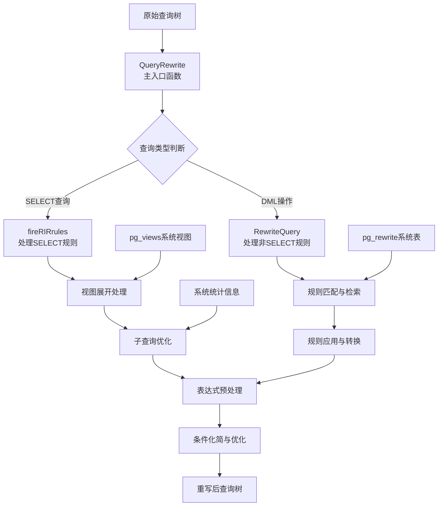
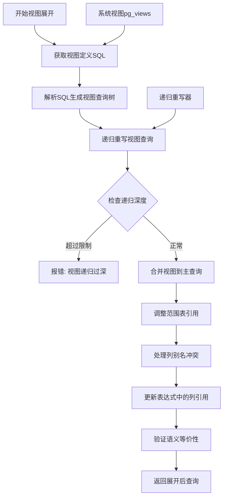
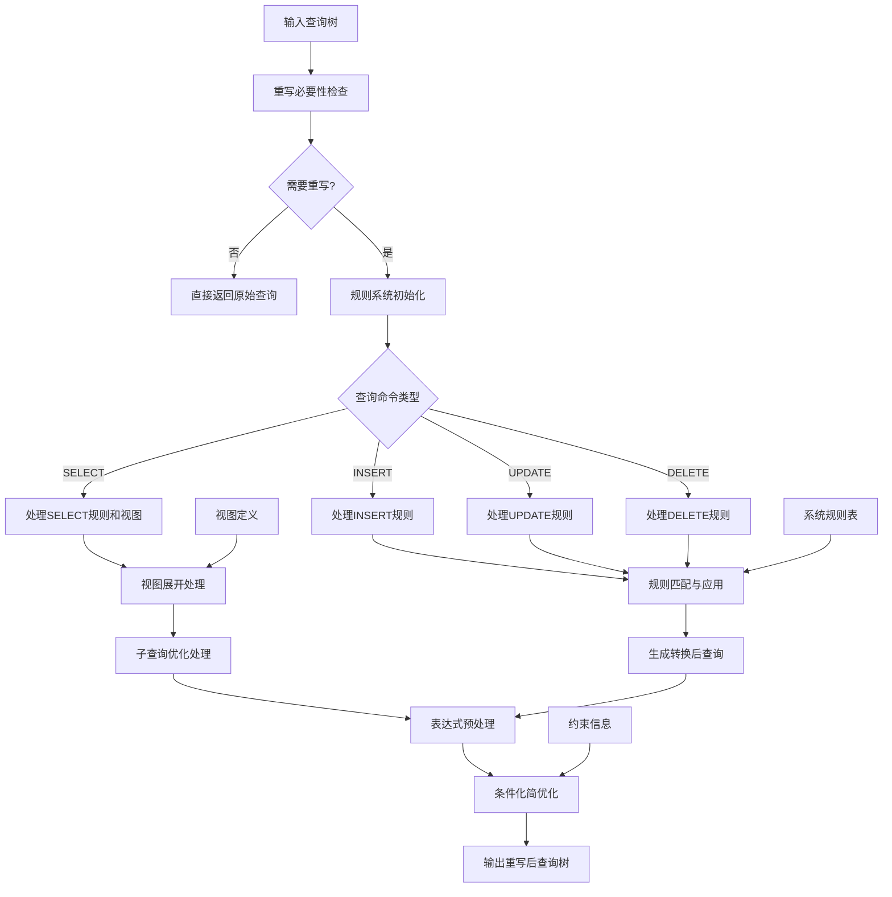

# 第9章 优化器——查询重写

## 9.1 查询重写概述

查询重写是PostgreSQL查询处理流程中的关键阶段，位于语法分析和语义分析之后，基于成本的优化之前。这个阶段的主要目标是通过基于规则的转换，将用户提交的查询转换为语义等价但执行效率更高的形式。

**重写器的核心作用与价值**：

- **视图透明性**：将视图引用展开为基表查询，实现逻辑数据独立性。用户可以在不修改应用程序的情况下调整底层数据模型。
- **规则自动化**：根据预定义的规则自动改写查询逻辑，支持复杂的业务规则和审计需求。
- **子查询优化**：将复杂的子查询转换为连接操作，避免重复执行和性能瓶颈。
- **常量优化**：在编译时计算常量表达式，减少运行时计算开销。
- **语义优化**：利用数据库约束信息简化查询条件，提前过滤不可能满足的条件。

查询重写与后续基于成本的优化形成互补关系：重写器关注语义等价的确定性转换，基于数据库的规则和约束进行优化；而优化器在多种物理执行策略中进行成本权衡，选择最优的执行计划。

## 9.2 查询重写架构

PostgreSQL的重写器采用高度模块化的架构，各组件通过清晰的接口协同工作。整个重写过程在内存中的查询树结构上进行，不涉及磁盘IO操作，确保了高效的处理速度。

整体架构如下：



**架构组件详细说明**：

- **QueryRewrite**：重写器的主入口，负责协调整个重写流程，根据查询类型分发到不同的处理模块。
- **fireRIRrules**：专门处理SELECT查询的重写，重点是视图展开和简单的规则应用。
- **RewriteQuery**：处理DML操作（INSERT/UPDATE/DELETE）的重写，主要应用INSTEAD规则和ALSO规则。
- 表达式预处理和条件化简是所有查询类型共享的后期处理阶段。

**关键代码位置**：
- 重写器主入口：`src/backend/rewrite/rewriteHandler.c` 中的 `QueryRewrite` 函数
- 规则处理：`src/backend/rewrite/rewriteHandler.c`
- 视图展开：`src/backend/rewrite/rewriteHandler.c` 中的 `fireRIRrules` 函数

## 9.3 规则系统

### 9.3.1 规则系统原理与机制

PostgreSQL的规则系统是一个强大的元编程工具，允许数据库管理员定义查询的自动转换规则。规则存储在pg_rewrite系统表中，当查询匹配特定模式时，查询优化器会自动应用这些规则。

**规则类型与语义**：

- **INSTEAD规则**：完全替换原始查询操作。例如，可以将对视图的INSERT操作重写为对基表的INSERT操作。
- **ALSO规则**：在原始操作基础上执行额外操作。例如，可以在INSERT操作的同时向审计表插入记录。

**规则应用场景**：

- 视图的实现基础：视图本质上是通过INSTEAD规则实现的
- 自动审计日志：通过ALSO规则自动记录数据变更
- 数据分区路由：将操作路由到具体的分区表
- 复杂的业务逻辑封装：如自动计算衍生字段

**规则匹配流程**：

```c
// 伪代码：规则匹配和应用流程
List* apply_rules(Query* original_query) {
    List* rule_list = NIL;
    List* result_queries = NIL;
    
    // 1. 根据查询类型和目标表查找匹配的规则
    rule_list = find_matching_rules(original_query->commandType, 
                                   original_query->resultRelation);
    
    // 2. 对每个匹配的规则进行处理
    foreach(rule in rule_list) {
        Query* new_query = NIL;
        
        // 3. 检查规则条件是否满足
        if (!check_rule_condition(rule, original_query))
            continue;
            
        // 4. 根据规则类型应用转换
        if (rule->is_instead) {
            // INSTEAD规则：替换原始操作
            new_query = apply_instead_rule(original_query, rule);
        } else {
            // ALSO规则：在原始操作基础上添加额外操作
            new_query = apply_also_rule(original_query, rule);
        }
        
        if (new_query != NIL) {
            result_queries = lappend(result_queries, new_query);
        }
    }
    
    // 5. 如果没有规则产生新查询，返回原始查询
    if (result_queries == NIL) {
        return list_make1(original_query);
    }
    
    return result_queries;
}
```

**关键数据结构**：

```c
// 规则数据结构（简化）
typedef struct RewriteRule {
    Oid         rule_id;        // 规则ID
    char*       rule_name;      // 规则名称
    CmdType     event_type;     // 触发事件类型
    Oid         relation_oid;   // 应用规则的关系OID
    bool        is_instead;     // INSTEAD规则标志
    Node*       condition;      // 规则应用条件
    List*       actions;        // 规则动作列表
} RewriteRule;
```

**关键代码位置**：
- 规则匹配：`src/backend/rewrite/rewriteHandler.c` 中的 `matchLocks` 函数
- 规则应用：`src/backend/rewrite/rewriteHandler.c` 中的 `applyRewriteRule` 函数

## 9.4 视图展开

### 9.4.1 视图展开机制

视图展开是重写器中最常见且重要的操作之一。当查询引用视图时，重写器需要将视图替换为其定义中的基表查询，这个过程涉及复杂的语义保持和引用调整。

**视图展开的详细流程**：

1. **视图定义获取**：从`pg_views`系统视图中检索视图的SQL定义文本
2. **查询解析**：将视图定义文本重新解析为查询树结构
3. **递归重写**：对视图查询本身进行递归重写，处理可能的嵌套视图
4. **查询合并**：将重写后的视图查询合并到主查询中
5. **引用调整**：调整列引用、表别名和表达式以确保语义正确

**视图展开的算法流程**：



**关键技术挑战与解决方案**：

- **列别名冲突**：通过重命名机制避免视图列别名与外部查询的冲突
- **范围表管理**：维护正确的范围表索引，确保列引用解析正确
- **嵌套视图处理**：通过递归调用处理多层嵌套的视图结构
- **语义保持**：确保展开前后的查询在语义上完全等价

**视图展开的核心实现**：

```c
// 伪代码：视图展开核心逻辑
Query* expand_view(RangeTblEntry* view_rte, Query* original_query) {
    // 1. 获取视图定义
    char* view_definition = get_view_definition(view_rte->relid);
    
    // 2. 解析视图定义
    Query* view_query = parse_view_definition(view_definition);
    
    // 3. 检查递归视图（防止无限递归）
    if (is_recursive_view(view_rte->relid, original_query)) {
        ereport(ERROR, ("递归视图不支持"));
    }
    
    // 4. 递归重写视图查询
    view_query = QueryRewrite(view_query);
    
    // 5. 合并视图查询到主查询
    Query* merged_query = merge_view_query(original_query, view_query, view_rte);
    
    // 6. 调整所有列引用
    adjust_column_references(merged_query);
    
    return merged_query;
}
```

**关键代码位置**：
- 视图展开：`src/backend/rewrite/rewriteHandler.c` 中的 `expand_view` 函数
- 范围表替换：`src/backend/rewrite/rewriteHandler.c` 中的 `SubstituteRangeTable` 函数

## 9.5 子查询优化

### 9.5.1 子查询提升技术

子查询提升是将WHERE子句或FROM子句中的子查询转换为连接操作的重要优化技术。这种转换可以消除重复执行，利用索引扫描，并给优化器更多连接顺序选择。

**可提升的子查询类型及转换目标**：

- **EXISTS子查询** → 半连接（Semi Join）：只关心内表是否存在匹配行
- **IN子查询** → 内连接或半连接：根据是否需要内表数据决定
- **标量子查询** → 外连接：确保总是返回单行单列
- **ANY/ALL子查询** → 适当的连接形式加聚合

**子查询提升的条件分析**：

```c
// 伪代码：子查询提升条件检查
bool can_pull_up_subquery(Query* subquery, Query* parent_query) {
    // 1. 检查子查询是否包含禁止元素
    if (has_aggregates(subquery) ||
        has_window_functions(subquery) ||
        has_grouping(subquery) ||
        has_volatile_functions(subquery) ||
        has_recursive_cte(subquery)) {
        return false;
    }
    
    // 2. 检查子查询与外部查询的关联条件
    if (!has_suitable_join_condition(subquery, parent_query)) {
        return false;
    }
    
    // 3. 检查子查询的复杂度
    if (is_too_complex(subquery)) {
        return false;
    }
    
    return true;
}
```

**子查询提升的详细流程**：

1. **可行性分析**：检查子查询结构是否满足提升条件
2. **关联条件提取**：识别子查询与外部查询的关联条件
3. **查询树重构**：将子查询从嵌套结构中提取出来
4. **连接构建**：构建等价的连接表达式
5. **引用调整**：调整所有受影响的列引用和表达式
6. **语义验证**：确保转换前后的查询语义等价

**EXISTS子查询转换示例**：

```sql
-- 转换前
SELECT * FROM orders o 
WHERE EXISTS (SELECT 1 FROM customers c 
              WHERE c.id = o.customer_id AND c.status = 'active');

-- 转换后（半连接）
SELECT o.* FROM orders o 
SEMI JOIN customers c ON c.id = o.customer_id 
WHERE c.status = 'active';
```

**关键代码位置**：
- 子查询提升：`src/backend/optimizer/prep/prepjointree.c` 中的 `pull_up_subqueries` 函数
- 子链接转换：`src/backend/optimizer/plan/subselect.c` 中的 `convert_EXISTS_sublink_to_join` 函数

## 9.6 表达式预处理

### 9.6.1 常量表达式优化

表达式预处理阶段对查询中的各种表达式进行深度分析和优化，主要包括常量折叠和表达式规范化。这些优化在查询编译阶段完成，可以显著减少运行时开销。

**常量折叠优化类型**：

- **算术表达式**：`(1 + 2) * 3` → `9`，`2.5 + 3.7` → `6.2`
- **逻辑表达式**：`true AND false` → `false`，`NOT(NOT true)` → `true`
- **字符串操作**：`'Hello ' || 'World'` → `'Hello World'`
- **函数调用**：`lower('ABC')` → `'abc'`，`length('test')` → `4`
- **类型转换**：`1.5::int` → `2`，`'123'::integer` → `123`

**常量折叠算法**：

```c
// 伪代码：常量表达式求值
Node* eval_const_expressions(Node* expr) {
    if (expr == NULL) return NULL;
    
    switch (nodeTag(expr)) {
        case T_Const:
            // 已经是常量，直接返回
            return expr;
            
        case T_FuncExpr:
            // 函数表达式：如果所有参数都是常量，尝试预计算
            if (all_args_are_constants(expr)) {
                Const* result = precompute_function(expr);
                if (result != NULL) {
                    return (Node*)result;
                }
            }
            break;
            
        case T_OpExpr:
            // 操作符表达式：常量折叠
            if (all_args_are_constants(expr)) {
                Const* result = precompute_operator(expr);
                if (result != NULL) {
                    return (Node*)result;
                }
            }
            break;
            
        case T_BoolExpr:
            // 布尔表达式：短路求值和简化
            return simplify_boolean_expression(expr);
    }
    
    // 递归处理子表达式
    return expression_tree_mutator(expr, eval_const_expressions);
}
```

**表达式规范化**：

表达式规范化将复杂的表达式转换为标准形式，便于后续优化和比较：

- **布尔表达式转换为合取范式（CNF）**：`(A OR B) AND C` 保持形式，但重新组织为规范形式
- **消除冗余条件**：`A AND A` → `A`，`A OR A` → `A`
- **统一操作符表示**：将不同写法的相同操作符统一为标准形式
- **消除公共子表达式**：识别和合并重复的表达式计算

**优化收益分析**：

- **性能提升**：编译时计算避免运行时开销，特别是对于复杂数学计算和字符串操作
- **优化机会**：简化的表达式为后续优化创造更多机会
- **计划稳定性**：规范化的表达式减少计划抖动

**关键代码位置**：
- 常量表达式求值：`src/backend/optimizer/util/clauses.c` 中的 `eval_const_expressions` 函数
- 表达式规范化：`src/backend/optimizer/util/clauses.c` 中的 `canonicalize_qual` 函数

## 9.7 条件化简与语义优化

### 9.7.1 基于布尔代数的优化

利用布尔代数规则简化条件表达式，消除冗余计算，提高查询执行效率。这些优化基于数学定律，确保转换前后的逻辑等价性。

**常用化简规则与示例**：

```c
// 伪代码：布尔表达式简化
Node* simplify_boolean_expression(Node* expr) {
    if (!is_boolean_expression(expr)) {
        return expr;
    }
    
    switch (nodeTag(expr)) {
        case T_BoolExpr:
            BoolExpr* bexpr = (BoolExpr*)expr;
            switch (bexpr->boolop) {
                case AND_EXPR:
                    return simplify_and_expression(bexpr);
                case OR_EXPR:
                    return simplify_or_expression(bexpr);
                case NOT_EXPR:
                    return simplify_not_expression(bexpr);
            }
            break;
    }
    
    return expr;
}

// AND表达式简化规则
Node* simplify_and_expression(BoolExpr* and_expr) {
    List* args = and_expr->args;
    List* new_args = NIL;
    
    foreach(arg, args) {
        Node* simplified_arg = simplify_boolean_expression(arg);
        
        // 应用简化规则
        if (is_const_true(simplified_arg)) {
            // A AND true → A，跳过true
            continue;
        } else if (is_const_false(simplified_arg)) {
            // A AND false → false，整个表达式为false
            return make_bool_const(false);
        } else if (!list_member(new_args, simplified_arg)) {
            // 消除重复：A AND A → A
            new_args = lappend(new_args, simplified_arg);
        }
    }
    
    // 构建简化后的表达式
    if (new_args == NIL) {
        return make_bool_const(true);  // 空AND为true
    } else if (list_length(new_args) == 1) {
        return (Node*)linitial(new_args);  // 单参数直接返回
    } else {
        return (Node*)make_andclause(new_args);
    }
}
```

**化简规则分类**：

1. **幂等律**：`A AND A` → `A`，`A OR A` → `A`
2. **同一律**：`A AND true` → `A`，`A OR false` → `A`
3. **零律**：`A AND false` → `false`，`A OR true` → `true`
4. **吸收律**：`A AND (A OR B)` → `A`，`A OR (A AND B)` → `A`
5. **分配律**：`A AND (B OR C)` → `(A AND B) OR (A AND C)`
6. **德摩根定律**：`NOT(A AND B)` → `NOT A OR NOT B`

### 9.7.2 基于数据库约束的优化

利用数据库中的约束信息进行深度优化，这些优化基于数据语义，可以显著减少需要处理的数据量。

**约束类型与优化机会**：

- **唯一性约束**：消除冗余的连接操作，当连接条件包含唯一键时可以简化连接类型
- **外键约束**：优化主外键连接的选择率和成本估算，利用引用完整性进行优化
- **CHECK约束**：在查询执行前过滤不可能满足的条件，提前减少数据量
- **NOT NULL约束**：简化空值检查逻辑，消除不必要的IS NULL检查

**基于约束的优化示例**：

```sql
-- 假设表users有CHECK约束：age >= 0
-- 原始查询
SELECT * FROM users WHERE age >= 0 AND age < 18;

-- 优化后（移除冗余条件）
SELECT * FROM users WHERE age < 18;
```

**约束优化实现**：

```c
// 伪代码：基于约束的条件简化
Node* simplify_using_constraints(PlannerInfo* root, Node* qual) {
    if (qual == NULL) return NULL;
    
    // 获取表约束信息
    List* table_constraints = get_table_constraints(root);
    
    // 应用约束简化
    foreach(constraint, table_constraints) {
        if (constraint_implies_qual(constraint, qual)) {
            // 约束蕴含条件，整个条件为true
            return make_bool_const(true);
        } else if (contradicts_constraint(constraint, qual)) {
            // 条件与约束矛盾，整个条件为false
            return make_bool_const(false);
        } else if (can_simplify_using_constraint(constraint, qual)) {
            // 可以使用约束简化条件
            qual = apply_constraint_simplification(constraint, qual);
        }
    }
    
    return qual;
}
```

**关键代码位置**：
- 条件化简：`src/backend/optimizer/util/clauses.c` 中的 `simplify_boolexpr` 函数
- 约束信息获取：`src/backend/utils/cache/lsyscache.c` 中的相关函数

## 9.8 查询重写执行流程

查询重写的完整执行流程涉及多个组件的协同工作，整个过程在内存中操作查询树结构。下图展示了详细的处理过程：



**流程关键阶段详细说明**：

1. **重写必要性检查**：
   - 分析查询树结构，检查是否存在视图引用
   - 查询系统目录，检查目标表是否有定义规则
   - 如果不需要重写，快速返回原始查询

2. **规则分类处理**：
   - SELECT查询：主要处理视图展开和简单的SELECT规则
   - DML操作：主要应用INSTEAD规则和ALSO规则

3. **视图展开**：
   - 递归处理嵌套视图结构
   - 维护范围表和列引用的正确性
   - 确保展开前后的语义等价

4. **规则应用**：
   - 匹配查询与规则的条件
   - 根据规则类型（INSTEAD/ALSO）执行相应转换
   - 可能生成多个替代查询

5. **子查询优化**：
   - 分析子查询结构，确定可提升性
   - 将相关子查询转换为连接操作
   - 调整查询树结构

6. **表达式优化**：
   - 常量折叠：编译时计算常量表达式
   - 表达式规范化：转换为标准形式
   - 消除冗余计算

7. **条件化简**：
   - 基于布尔代数简化逻辑表达式
   - 利用数据库约束进行语义优化
   - 提前过滤不可能满足的条件

**重写器主入口实现**：

```c
// 伪代码：QueryRewrite主函数
List* QueryRewrite(Query* parsetree) {
    List* result_queries = NIL;
    
    // 1. 检查重写必要性
    if (!QueryRewriteIsNeeded(parsetree)) {
        return list_make1(parsetree);
    }
    
    // 2. 根据查询类型分发处理
    if (parsetree->commandType != CMD_SELECT) {
        // DML操作：应用非SELECT规则
        result_queries = RewriteQuery(parsetree, NIL);
    } else {
        // SELECT查询：初始化为原始查询
        result_queries = list_make1(parsetree);
    }
    
    // 3. 对SELECT查询应用RIR规则（主要是视图展开）
    List* final_queries = NIL;
    foreach(query, result_queries) {
        if (query->commandType == CMD_SELECT) {
            query = fireRIRrules(query, NIL);
        }
        final_queries = lappend(final_queries, query);
    }
    
    return final_queries;
}
```

## 9.9 本章小结

PostgreSQL的查询重写器是一个功能强大且高度灵活的组件，通过基于规则的转换显著提升了查询性能和表达能力。其主要技术特点和价值包括：

1. **规则驱动的智能转换**：通过可扩展的规则系统支持复杂的查询转换逻辑，实现了声明式的查询优化。

2. **完整的视图透明性**：实现了真正的逻辑数据独立性，用户可以在不修改应用程序的情况下灵活调整底层数据模型。

3. **深度的子查询优化**：通过提升技术将复杂的嵌套查询转换为高效的连接操作，解决了传统数据库中的性能瓶颈问题。

4. **编译时性能优化**：在查询编译阶段完成常量计算和表达式简化，将计算开销从运行时转移到编译时。

5. **语义感知的高级优化**：充分利用数据库约束信息进行深度优化，基于数据语义而非单纯语法进行转换。

6. **模块化的架构设计**：清晰的组件边界和接口设计使得系统易于维护和扩展，支持新的优化规则和转换技术。

查询重写器为后续的基于成本优化准备了结构良好、语义清晰的查询树，是整个查询优化管道中不可或缺的重要环节。其优化效果在复杂查询、视图密集的应用场景中尤为显著，为PostgreSQL的高性能查询处理奠定了坚实基础。